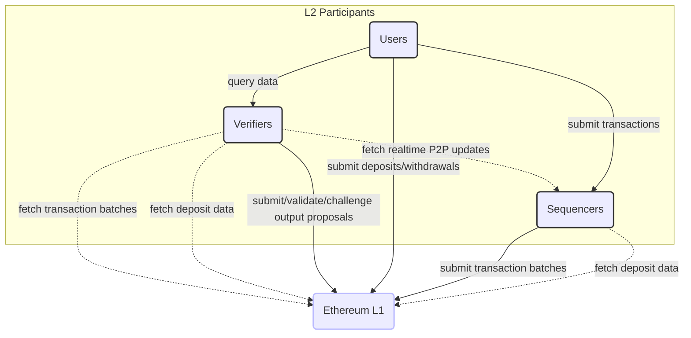
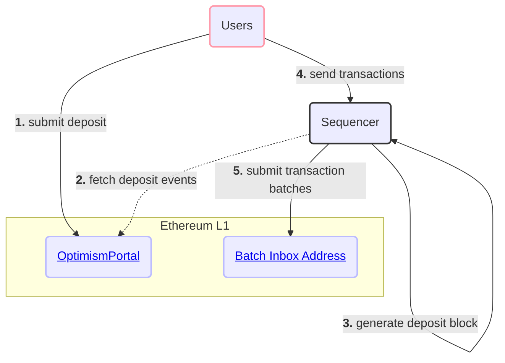
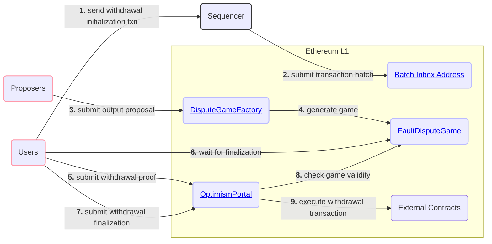

# Background

<!-- START doctoc generated TOC please keep comment here to allow auto update -->
<!-- DON'T EDIT THIS SECTION, INSTEAD RE-RUN doctoc TO UPDATE -->
**Table of Contents**

- [Overview](#overview)
- [Foundations](#foundations)
  - [Ethereum Scalability](#ethereum-scalability)
  - [Optimistic Rollups](#optimistic-rollups)
  - [EVM Equivalence](#evm-equivalence)
- [Protocol Guarantees](#protocol-guarantees)
  - [Liveness](#liveness)
  - [Validity](#validity)
  - [Availability](#availability)
- [Network Participants](#network-participants)
  - [Users](#users)
  - [Sequencers](#sequencers)
  - [Verifiers](#verifiers)
- [Key Interaction Diagrams](#key-interaction-diagrams)
  - [Depositing and Sending Transactions](#depositing-and-sending-transactions)
  - [Withdrawing](#withdrawing)
- [Next Steps](#next-steps)

<!-- END doctoc generated TOC please keep comment here to allow auto update -->

## Overview

The OP Stack is a decentralized software stack maintained by the OP Stack that forms the backbone of blockchains like
[OP Mainnet](https://explorer.optimism.io/) and [Base](https://base.org). The OP Stack provides the infrastructure for
operating EVM equivalent rollup blockchains designed to scale Ethereum while remaining maximally compatible with
existing Ethereum infrastructure. This document provides an overview of the protocol to provide context for the rest of
the specification.

## Foundations

### Ethereum Scalability

Scaling Ethereum means increasing the number of useful transactions the Ethereum network can process. Ethereum's
limited resources, specifically bandwidth, computation, and storage, constrain the number of transactions which can be
processed on the network. Of the three resources, computation and storage are currently the most significant
bottlenecks. These bottlenecks limit the supply of transactions, leading to extremely high fees. Scaling ethereum and
reducing fees can be achieved by better utilizing bandwidth, computation and storage.

### Optimistic Rollups

An [Optimistic Rollup](https://vitalik.eth.limo/general/2021/01/05/rollup.html) is a layer 2 scalability construction which
increases the computation & storage capacity of Ethereum while aiming to minimize sacrifices to scalability or
decentralization. In a nutshell, an Optimistic Rollup utilizes Ethereum (or some other data availability layer) to host
transaction data. Layer 2 nodes then execute a state transition function over this data. Users can propose the result of
this off-chain execution to a smart contract on L1. A "fault proving" process can then demonstrate that a user's proposal
is (or is not) valid.

### EVM Equivalence

[EVM Equivalence](https://medium.com/ethereum-optimism/introducing-evm-equivalence-5c2021deb306) is complete compliance
with the state transition function described in the Ethereum yellow paper, the formal definition of the protocol. By
conforming to the Ethereum standard across EVM equivalent rollups, smart contract developers can write once and deploy
anywhere.

## Protocol Guarantees

We strive to preserve three critical properties: liveness, validity, and availability.
A protocol that can maintain these properties can, effectively, scale Ethereum without sacrificing security.

### Liveness

Liveness is defined as the ability for any party to be able to extend the rollup chain by including a transaction within
a bounded amount of time. It should not be possible for an actor to block the inclusion of any given transaction for more
than this bounded time period. This bounded time period should also be acceptable such that inclusion is not just
theoretically possible but practically useful.

### Validity

Validity is defined as the ability for any party to execute the rollup state transition function, subject to certain lower
bound expectations for available computing and bandwidth resources. Validity is also extended to refer to the ability for
a smart contract on Ethereum to be able to validate this state transition function economically.

### Availability

Availability is defined as the ability for any party to retrieve the inputs that are necessary to execute the rollup state
transition function correctly. Availability is essentially an element of validity and is required to be able to guarantee
validity in general. Similar to validity, availability is subject to lower bound resource requirements.

## Network Participants

Generally speaking, there are three primary actors that interact with an OP Stack chain: users, sequencers, and verifiers.

### Users

Users are the general class of network participants who:

- Submit transactions through a Sequencer or by interacting with contracts on Ethereum.
- Query transaction data from interfaces operated by verifiers.

### Sequencers

Sequencers fill the role of the block producer on an OP Stack chain. Chains may have a single Sequencer or may choose to
utilize some consensus protocol that coordinates multiple Sequencers. The OP Stack currently officially only supports a
single active Sequencer at any given time. In general, specifications may use the term "the Sequencer" as a stand-in for
either a single Sequencer or a consensus protocol of multiple Sequencers.

The Sequencer:

- Accepts transactions directly from Users.
- Observes "deposit" transactions generated on Ethereum.
- Consolidates both transaction streams into ordered L2 blocks.
- Submits information to L1 that is sufficient to fully reproduce those L2 blocks.
- Provides real-time access to pending L2 blocks that have not yet been confirmed on L1.

The Sequencer serves an important role for the operation of an L2 chain but is not a trusted actor. The Sequencer is generally
responsible for improving the user experience by ordering transactions much more quickly and cheaply than would currently
be possible if users were to submit all transactions directly to L1.

### Verifiers

Verifiers download and execute the L2 state transition function independently of the Sequencer. Verifiers help to maintain
the integrity of the network and serve blockchain data to Users.

Verifiers generally:

- Download rollup data from L1 and the Sequencer.
- Use rollup data to execute the L2 state transition function.
- Serve rollup data and computed L2 state information to Users.

Verifiers can also act as Proposers and/or Challengers who:

- Submit assertions about the state of the L2 to a smart contract on L1.
- Validate assertions made by other participants.
- Dispute invalid assertions made by other participants.

## Key Interaction Diagrams

### Depositing and Sending Transactions

Users will often begin their L2 journey by depositing ETH from L1.
Once they have ETH to pay fees, they'll start sending transactions on L2.
The following diagram demonstrates this interaction and all key OP Stack components which are or should be utilized:

### Withdrawing

Users may also want to withdraw ETH or ERC20 tokens from an OP Stack chain back to Ethereum. Withdrawals are initiated
as standard transactions on L2 but are then completed using transactions on L2. Withdrawals must reference a valid
`FaultDisputeGame` contract that proposes the state of the L2 at a given point in time.

## Next Steps

Check out the sidebar to the left to find any specification you might want to read, or click one of the links embedded
in one of the above diagrams to learn about particular components that have been mentioned.
