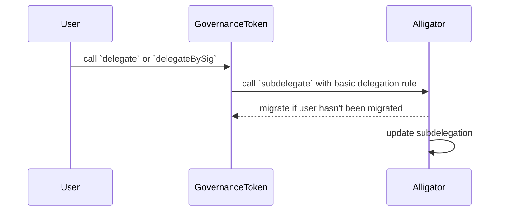
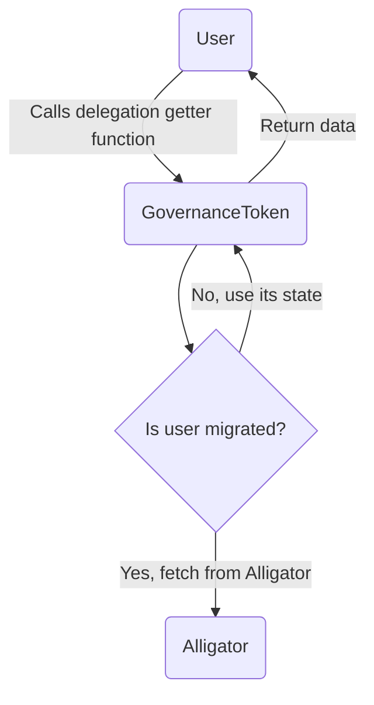

# Alligator

<!-- START doctoc generated TOC please keep comment here to allow auto update -->
<!-- DON'T EDIT THIS SECTION, INSTEAD RE-RUN doctoc TO UPDATE -->
**Table of Contents**

- [Overview](#overview)
- [Interface](#interface)
  - [Core Functions](#core-functions)
    - [`subdelegate`](#subdelegate)
    - [`subdelegateFromToken`](#subdelegatefromtoken)
    - [`subdelegateBatched`](#subdelegatebatched)
    - [`afterTokenTransfer`](#aftertokentransfer)
    - [`migrateAccount`](#migrateaccount)
  - [Getters](#getters)
    - [`checkpoints`](#checkpoints)
    - [`numCheckpoints`](#numcheckpoints)
    - [`getVotes`](#getvotes)
    - [`getPastVotes`](#getpastvotes)
    - [`getPastTotalSupply`](#getpasttotalsupply)
    - [`subdelegations`](#subdelegations)
  - [Events](#events)
    - [`Subdelegation`](#subdelegation)
    - [`Subdelegations`](#subdelegations)
    - [`DelegateVotesChanged`](#delegatevoteschanged)
- [Storage](#storage)
- [Types](#types)
  - [`SubdelegationRule`](#subdelegationrule)
  - [`AllowanceType`](#allowancetype)
- [Backwards Compatibility](#backwards-compatibility)
- [User Flow](#user-flow)
  - [Partial delegations](#partial-delegations)
  - [Constrained delegations](#constrained-delegations)
  - [Redelegations](#redelegations)
  - [Differences](#differences)
- [Security Considerations](#security-considerations)
  - [Dependence on Alligator](#dependence-on-alligator)
  - [Connection with GovernanceToken](#connection-with-governancetoken)
- [Future Considerations](#future-considerations)
  - [Cross Chain Delegations](#cross-chain-delegations)

<!-- END doctoc generated TOC please keep comment here to allow auto update -->

## Overview

| Constant | Value                                        |
|----------|----------------------------------------------|
| Address  | `0x4200000000000000000000000000000000000043` |

The `Alligator` contract implements subdelegations for the [`GovernanceToken`](gov-token.md). Subdelegations enable
advanced delegation use cases, such as partial, time-constrained & block-based delegations, and relative & fixed allowances.

The `Alligator` contract migrates the delegation state from the `GovernanceToken` to itself
through a hook-based approach. Specifically, the `GovernanceToken` calls the `Alligator` contract's
`afterTokenTransfer` function after a token transfer. This enables the `Alligator` contract to consume the hook and update
its delegation and checkpoint mappings accordingly. If either address involved in the transfer (`_from_` or `_to`) has not
been migrated to the `Alligator` contract, the contract copies the address' checkpoint data from the
`GovernanceToken` to its own state.

## Interface

### Core Functions

#### `subdelegate`

Allows subdelegation of token voting power to another address (delegatee) with a specified subdelegation rule. This function
is intended to be called by users that require advanced delegation of the `GovernanceToken`.

```solidity
function subdelegate(address _delegatee, SubdelegationRule _rule) external
```

This function MUST check if the `msg.sender` or `_delegatee` addresses have been migrated by checking the `migrated` mapping
from its [storage](#storage). If either address has not been migrated, the `Alligator` MUST copy the delegation
and checkpoint data from the token contract to its own state. After copying the data, the `Alligator` MUST update
the `migrated` mapping to reflect that the address has been migrated.

Before updating the subdelegation, the `subdelegate` function MUST check the validity of the subdelegation rule. Specifically,
the function MUST check that the `allowance` field of the rule does not exceed the total voting power of the delegator if the
`allowanceType` is `Absolute`.

When updating the subdelegation, the `subdelegate` function MUST override any previous subdelegation of the `msg.sender`
to the `_delegatee`. Afterwards, this function MUST emit a `Subdelegation` event with the given function parameters.

#### `subdelegateFromToken`

Allows delegation of token voting power from an address (delegator) to another address (delegatee) using a subdelegation
rule that performs 100% delegation, mimicking the behavior of the `ERC20Votes`'s `delegate` function for backwards
compatibility. This function MUST only be callable by the `GovernanceToken` contract as part of its `delegate` and
`delegateBySig` functions.

```solidity
function subdelegateFromToken(address _delegator, address _delegatee) external
```

This function MUST check if the `_delegator` or `_delegatee` addresses have been migrated by checking the `migrated` mapping
from its [storage](#storage). If either address has not been migrated, the `Alligator` MUST copy the delegation
and checkpoint data from the token contract to its own state. After copying the data, the `Alligator` MUST update
the `migrated` mapping to reflect that the address has been migrated.

When updating the subdelegation, the `subdelegateFromToken` function MUST override any previous subdelegation of the
`_delegator` to the `_delegatee`. Afterwards, this function MUST emit a `Subdelegation` event with the given function
parameters.

#### `subdelegateBatched`

Allows batch subdelegation of token voting power to multiple addresses with specified subdelegation rules. This
function is intended to be called by users.

```solidity
function subdelegateBatched(address[] calldata _delegatees, SubdelegationRules[] calldata _rules) external
```

This function MUST check if the `msg.sender` has been migrated by checking the `migrated` mapping from its [storage](#storage).
If it has not been migrated, the `Alligator` MUST copy the delegation and checkpoint data from the token contract
to its own state. After copying the data, the `Alligator` MUST update the `migrated` mapping to reflect that the address
has been migrated.

This function MUST check that the length of `_delegatees` and `_rules` are equal. If the lengths are not equal, it MUST
revert with an error.

The `subdelegateBatched` function MUST iterate over each pair of `_delegatees` address and `_rules` subdelegation rule.
At every iteration, the function MUST check the validity of the subdelegation rule, and migrate the delegatee address
if it has not been migrated. The function MUST then update the subdelegation. Specifically for validation,
the function MUST check that the `allowance` field of the rule does not exceed the total voting power of the delegator if the
`allowanceType` is `Absolute`.

Afterwards, the `subdelegateBatched` function MUST emit a `Subdelegation` event with the given function parameters.

#### `afterTokenTransfer`

Updates the voting power of two addresses (`_from` and `_to`) after a token transfer. This function MUST only be callable
by the `GovernanceToken` contract.

```solidity
function afterTokenTransfer(address _from, address _to, uint256 _amount) external
```

The `Alligator` MUST check if the `_from` or `_to` addresses have been migrated by checking the `migrated` mapping
from its [storage](#storage). If either address has not been migrated, the `Alligator` MUST copy the delegation
and checkpoint data from the token contract to its own state. After copying the data, the `Alligator` MUST update
the `migrated` mapping to reflect that the address has been migrated.

The `afterTokenTransfer` function MUST update the voting power of the `_from` and `_to` addresses with the same logic
of the `GovernanceToken`.

#### `migrateAccounts`

Migrates the delegation state of given accounts from the `GovernanceToken` to the `Alligator` contract. This function
MUST iterate over the list of `_accounts` addresses and only migrate the account if it has not been migrated yet.

```solidity
function migrateAccounts(address[] calldata _accounts) external
```

### Getters

For backwards compatibility, the `Alligator` MUST implement all public getter functions of the
`GovernanceToken` related to delegation and voting power. These functions MUST be used by the
`GovernanceToken` when an account has been been migrated to the `Alligator` contract. Otherwise,
the `GovernanceToken` MUST use its own state. Similarly, all of the `Alligator` getter functions
MUST use the `GovernanceToken` state if the account has not been migrated.

#### `checkpoints`

Retrieves the checkpoints for a given user address.

```solidity
function checkpoints(address _account) external view returns (ERC20Votes.Checkpoint[] memory)
```

#### `numCheckpoints`

Retrieves the number checkpoints for a given user address.

```solidity
function numCheckpoints(address _account) external view returns (uint32)
```

#### `getVotes`

Retrieves the voting power of a given user address.

```solidity
function getVotes(address _account) external view returns (uint256)
```

#### `getPastVotes`

Retrieves the voting power of a given user address at a block.

```solidity
function getPastVotes(address _account, uint256 _blockNumber) external view returns (uint256)
```

#### `getPastTotalSupply`

Retrieves the total supply of the `GovernanceToken` at a given block.

```solidity
function getPastTotalSupply(uint256 _blockNumber) external view returns (uint256)
```

#### `subdelegations`

Retrieves the subdelegations for a given user and delegatee.

```solidity
function subdelegations(address _account, address _delegatee) external view returns (SubdelegationRules memory)
```

### Events

#### `Subdelegation`

MUST trigger when an account subdelegates voting power to another address (delegatee).

```solidity
event Subdelegation(address indexed account, address indexed delegatee, SubdelegationRules rule, uint256 previousVotingPower, uint256 newVotingPower)
```

#### `Subdelegations`

MUST trigger when an account subdelegates voting power to multiple addresses (delegatees).

```solidity
event Subdelegations(address indexed account, address[] delegatee, SubdelegationRules[] rules, uint256 previousVotingPower, uint256 newVotingPower)
```

#### `DelegateVotesChanged`

MUST trigger every time the voting power of a user changes, including when a token transfer occurs or a subdelegation
is updated.

```solidity
event DelegateVotesChanged(address indexed delegate, uint256 previousBalance, uint256 newBalance)
```

## Storage

The `Alligator` contract MUST be able to store subdelegation rules and checkpoints. These storage variables MUST be
defined as in the `GovernanceToken` and use the same types:

```solidity
// Addresses that had their delegation state migrated from the `GovernanceToken` to the `Alligator`.
mapping(address => bool) public migrated;

// Subdelegation rules for an account and delegatee.
mapping(address => mapping(address => SubdelegationRules)) internal _subdelegations;

// Checkpoints of voting power for an account.
mapping(address => ERC20Votes.Checkpoint[]) internal _checkpoints;

// Total supply checkpoints of the GovernanceToken.
ERC20Votes.Checkpoint[] internal _totalSupplyCheckpoints;
```

## Types

The `Alligator` contract MUST define the following types:

### `SubdelegationRule`

Subdelegation rules define the parameters and constraints for delegated voting power, encapsulated in the following
struct:

```solidity
struct SubdelegationRule {
    uint256 maxRedelegations;
    uint256 notValidBefore;
    uint256 notValidAfter;
    AllowanceType allowanceType;
    uint256 allowance;
}
```

| Name                     | Type            | Description                                                             |
|--------------------------|-----------------|-------------------------------------------------------------------------|
| `maxRedelegations`       | `uint256`       | Maximum number of times the delegated votes can be redelegated.         |
| `notValidBefore`         | `uint256`       | Timestamp after which the delegation is valid.                          |
| `notValidAfter`          | `uint256`       | Timestamp before which the delegation is valid.                         |
| `allowanceType`          | `AllowanceType` | Type of allowance (e.g., absolute or relative).                         |
| `allowance`              | `uint256`       | Amount of votes delegated, denominated in the token's decimals.         |

### `AllowanceType`

Subdelegations can have different types of allowances, represented with:

```solidity
enum AllowanceType {
  Absolute,
  Relative
}
```

| Name        | Number | Description                                                                                 |
|-------------|--------|---------------------------------------------------------------------------------------------|
| `Absolute`  | `0`    | The amount of votes delegated is fixed.                                                     |
| `Relative`  | `1`    | The amount of votes delegated is relative to the total amount of votes the delegator has.   |

## Backwards Compatibility

The `Alligator` contract ensures backwards compatibility by allowing the migration of delegation state from the
token contract.

## User Flow

The following sections highlight the use cases that MUST be supported by subdelegations, and the difference for basic
delegations made from the `GovernanceToken` contract.

### Partial delegations

Users MUST be able to perform partial delegations of their voting power to another address. Additionally, the `Alligator`'s
subdelegation rules MUST allow users to perform subdelegations for relative and absolute amounts of voting power. Absolute
amounts MUST be denominated in the token's decimals, whereas relative amounts MUST be denominated in percentages.

### Constrained delegations

Users MUST be able to perform time & block constrained delegations. The subdelegation rules MUST include optional
`notValidBefore` and `notValidAfter` fields to allow users to specify the time range in which a delegation is valid, both
denominated as timestamps.

### Redelegations

Users MUST be able to redelegate their voting power to another address. If a user delegates their voting power to another
address, this second address can further delegate the voting power to a third address. The first delegator MUST be able to
limit the number of redelegations that can be performed for their delegated voting power by setting the `maxRedelegations`
field in the subdelegation rule.

### Differences

The main difference for delegations made from the `GovernanceToken` contract is basic delegations are encapsulated as
subdelegations and forwarded to the `Alligator` contract. Basic delegation can be achieved with a subdelegation rule
such as:

```solidity
SubdelegationRules({
  maxRedelegations: 0,
  blocksBeforeVoteCloses: 0,
  notValidBefore: 0,
  notValidAfter: 0,
  allowanceType: AllowanceType.Relative,
  allowance: 10e4 // 100%
})
```

The following diagram shows the sequence of a basic delegation performed from the `GovernanceToken` contract.



Once a user has been migrated to the `Alligator`, the `GovernanceToken` MUST always use the `Alligator`'s delegation
state. The following diagram shows the control flow for this case.



## Security Considerations

### Dependence on Alligator

As the `GovernanceToken` depends on the `Alligator` contract, the `Alligator` contract MUST be implemented so that it
minimizes the risk of unexpected reverts during the transfer hook call. If the `Alligator` contract reverts,
`GovernanceToken` transfers will be blocked. Additionally, the `GovernanceToken` MUST always use the `Alligator`'s
delegation state if a user has been migrated.

### Connection with GovernanceToken

Similarly, the `Alligator` MUST always be in sync with the `GovernanceToken` contract via token transfers. If the
`Alligator` contract is not in sync with the `GovernanceToken` contract, the voting power of users MAY be incorrect or
outdated.

## Future Considerations

### Cross Chain Delegations

To make the `GovernanceToken` interoperable, the `Alligator` contract should be extended to support cross-chain subdelegations
using the interoperability protocol. Specifically, the `Alligator`'s hook entrypoint (`afterTokenTransfer`) should be modified
to emit a message to another `Alligator` contract on a different chain. This message should include the token transfer information
(`_from`, `_to`, `_amount`).
