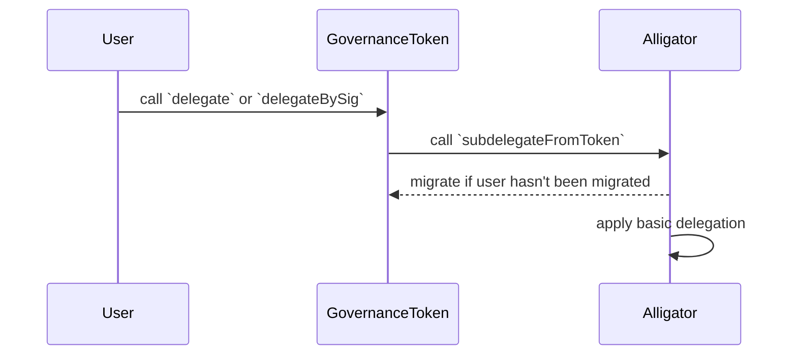
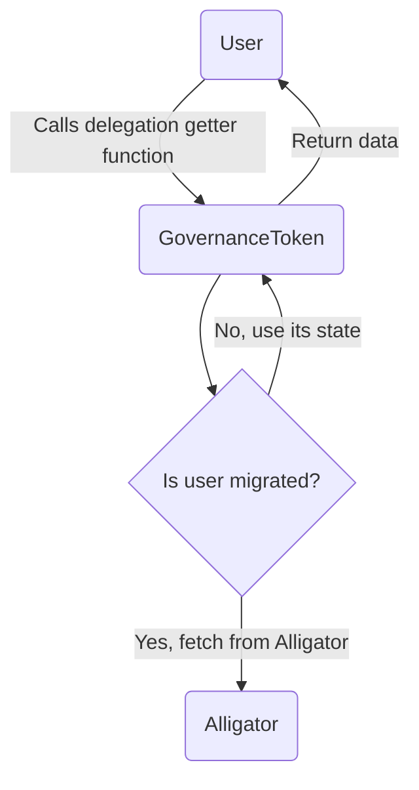

# Alligator

<!-- START doctoc generated TOC please keep comment here to allow auto update -->
<!-- DON'T EDIT THIS SECTION, INSTEAD RE-RUN doctoc TO UPDATE -->
**Table of Contents**

- [Overview](#overview)
- [Interface](#interface)
  - [Core Functions](#core-functions)
    - [`subdelegate`](#subdelegate)
    - [`subdelegateFromToken`](#subdelegatefromtoken)
    - [`subdelegateBatched`](#subdelegatebatched)
    - [`afterTokenTransfer`](#aftertokentransfer)
    - [`migrateAccounts`](#migrateaccounts)
    - [`_delegate`](#_delegate)
  - [Getters](#getters)
    - [`checkpoints`](#checkpoints)
    - [`numCheckpoints`](#numcheckpoints)
    - [`delegates`](#delegates)
    - [`getVotes`](#getvotes)
    - [`getPastVotes`](#getpastvotes)
    - [`getPastTotalSupply`](#getpasttotalsupply)
    - [`migrated`](#migrated)
  - [Events](#events)
    - [`DelegationCreated`](#delegationcreated)
    - [`DelegationsCreated`](#delegationscreated)
    - [`DelegateVotesChanged`](#delegatevoteschanged)
- [Storage](#storage)
- [Types](#types)
  - [`Delegation`](#delegation)
  - [`AllowanceType`](#allowancetype)
  - [`DelegationAdjustment`](#delegationadjustment)
  - [`Op`](#op)
- [Backwards Compatibility](#backwards-compatibility)
- [Migration](#migration)
- [User Flow](#user-flow)
  - [Partial Delegations](#partial-delegations)
  - [Absolute & Relative Delegations](#absolute--relative-delegations)
  - [Differences](#differences)
- [Delegation Validation](#delegation-validation)
- [Security Considerations](#security-considerations)
  - [Dependence on Alligator](#dependence-on-alligator)
  - [Connection with GovernanceToken](#connection-with-governancetoken)
- [Future Considerations](#future-considerations)
  - [Cross Chain Delegations](#cross-chain-delegations)

<!-- END doctoc generated TOC please keep comment here to allow auto update -->

## Overview

| Constant | Value                                        |
|----------|----------------------------------------------|
| Address  | `0x4200000000000000000000000000000000000043` |

The `Alligator` contract implements advanced delegation for the [`GovernanceToken`](gov-token.md). Advance delegation allows
for partial and relative delegations of voting power.

The `Alligator` contract migrates the delegation state from the `GovernanceToken` to itself
through a hook-based approach. Specifically, the `GovernanceToken` calls the `Alligator` contract's
`afterTokenTransfer` function after a token transfer. This enables the `Alligator` contract to consume the hook and update
its delegation and checkpoint mappings accordingly. If either address involved in the transfer (`_from_` or `_to`) has not
been migrated to the `Alligator` contract, the contract copies the address' checkpoint data from the
`GovernanceToken` to its own state.

## Interface

### Core Functions

#### `subdelegate`

Delegates voting power to another address (delegatee) with the given delegation parameters. This function
is intended to be called by users that require advanced delegation of the `GovernanceToken`.

```solidity
function subdelegate(Delegation calldata _delegation) external
```

This function MUST enforce the migration logic, as specified in the [Migration](#migration) section, for `msg.sender`
and the `_delegatee` address in the delegation. Afterwards, the function MUST call the [`_delegate`](#_delegate) with
the `msg.sender` and `_newDelegations` parameters.

At the end, the `subdelegate` function MUST emit a `DelegationCreated` event with the given function parameters.

#### `subdelegateFromToken`

Delegates 100% of the token voting power of an address (delegator) to another address (delegatee), mimicking the behavior
of the `ERC20Votes`'s `delegate` function for backwards compatibility. This function MUST only be callable by the
`GovernanceToken` contract as part of its `delegate` and `delegateBySig` functions.

```solidity
function subdelegateFromToken(address _delegator, address _delegatee) external
```

This function MUST enforce the migration logic, as specified in the [Migration](#migration) section, for the `_delegator`
and `_delegatee` addresses. Afterwards, the function MUST call the [`_delegate`](#_delegate) with the `_delegator` and
basic delegation parameters.

At the end, the `subdelegateFromToken` function MUST emit a `DelegationCreated` event with the given function parameters.

#### `subdelegateBatched`

Delegates voting power to multiple addresses (delegatees) using the delegation array. This function is intended to be
called by users.

```solidity
function subdelegateBatched(Delegation[] calldata _delegations) external
```

This function MUST enforce the migration logic, as specified in the [Migration](#migration) section, for `msg.sender`
and every delegatee address in the `_delegations` array. Afterwards, the function MUST call the [`_delegate`](#_delegate)
with the `msg.sender` and `_delegations` parameters.

At the end, the `subdelegateBatched` function MUST emit a `DelegationsCreated` event with the given function parameters.

#### `afterTokenTransfer`

Updates the voting power of two addresses (`_from` and `_to`) after a token transfer. This function MUST only be callable
by the `GovernanceToken` contract.

```solidity
function afterTokenTransfer(address _from, address _to, uint256 _amount) external
```

This function MUST enforce the migration logic, as specified in the [Migration](#migration) section, for the `_from`
and `_to` addresses.

<!-- TODO: call `_moveVotingPower` -->

#### `migrateAccounts`

Migrates the delegation state of the given accounts from the `GovernanceToken` to the `Alligator` contract. This
function MUST iterate over the list of `_accounts` addresses and apply the logic specified in the
[Migration](#migration) section.

```solidity
function migrateAccounts(address[] calldata _accounts) external
```

#### `_delegate`

Delegates voting power from the `_delegator` to the specified delegates in `_newDelegations`. This function MUST
override any existing delegations of `_delegator`.

```solidity
function _delegate(address _delegator, Delegation[] memory _newDelegations) internal virtual
```

The `_delegate` function MUST first check that the length of `_newDelegations` does not exceed `MAX_SUBDELEGATIONS`.
Then, it MUST calculate the voting power of all active delegations of the `_delegator`, and calculate the voting
power adjustements for the new delegatee set using `_newDelegations`. Afterwards, the function MUST update
the voting power of the current and new set of delegatees.

The function MUST then sort the new delegatee set in descending order, and store the delegations as part of the
`_delegations` mapping. While sorting, the function MUST check for the validity of the delegations, as specified
in the [Delegation Validation](#delegation-validation) section. Aditionally, the function MUST emit a
`DelegateVotesChanged` event for each change in delegatee voting power.

### Getters

For backwards compatibility, the `Alligator` MUST implement all public getter functions of the
`GovernanceToken` related to delegation and voting power. These functions MUST be used by the
`GovernanceToken` when an account has been been migrated to the `Alligator` contract. Otherwise,
the `GovernanceToken` MUST use its own state. Similarly, all of the `Alligator` getter functions
MUST use the `GovernanceToken` state if the account has not been migrated.

#### `checkpoints`

Retrieves the checkpoints for a given user address.

```solidity
function checkpoints(address _account) external view returns (ERC20Votes.Checkpoint[] memory)
```

#### `numCheckpoints`

Retrieves the number checkpoints for a given user address.

```solidity
function numCheckpoints(address _account) external view returns (uint32)
```

#### `delegates`

Retrieves the delegations of a given user address, sorted in descending order by voting power. 
This function is intended to be used by the `GovernanceToken` contract to maximize for backwards compatibility.

```solidity
function delegates(address _account) external view returns (Delegation[] memory)
```

#### `getVotes`

Retrieves the voting power of a given user address.

```solidity
function getVotes(address _account) external view returns (uint256)
```

#### `getPastVotes`

Retrieves the voting power of a given user address at a block.

```solidity
function getPastVotes(address _account, uint256 _blockNumber) external view returns (uint256)
```

#### `getPastTotalSupply`

Retrieves the total supply of the `GovernanceToken` at a given block.

```solidity
function getPastTotalSupply(uint256 _blockNumber) external view returns (uint256)
```

#### `migrated`

Returns the migration status of an account — `True` if the account has been migrated, `False` otherwise.

```solidity
function migrated(address _account) public view returns (bool)
```

### Events

#### `DelegationCreated`

MUST trigger when an account delegates voting power to another address (delegatee).

```solidity
event DelegationCreated(address indexed account, Delegation delegation);
```

#### `DelegationsCreated`

MUST trigger when an account delegates voting power to multiple addresses (delegatees).

```solidity
event DelegationsCreated(address indexed account, Delegation[] delegations);
```

#### `DelegateVotesChanged`

MUST trigger every time the voting power of a user changes, including when a token transfer occurs or when a
delegation is created.

```solidity
event DelegateVotesChanged(address indexed delegatee, uint256 previousBalance, uint256 newBalance)
```

## Storage

The `Alligator` contract MUST be able to store delegations and checkpoints. These storage variables MUST be
defined as in the `GovernanceToken` and use the same types:

```solidity
// The maximum number of delegations allowed.
uint256 public constant MAX_SUBDELEGATIONS = 100;

// The denominator used for relative delegations.
uint96 public constant DENOMINATOR = 10_000;

// Addresses that had their delegation state migrated from the `GovernanceToken` to the `Alligator`.
mapping(address => bool) public migrated;

// Voting power delegations of an account.
mapping(address => Delegation[]) internal _delegations;

// Checkpoints of voting power for an account.
mapping(address => ERC20Votes.Checkpoint[]) internal _checkpoints;

// Total supply checkpoints of the GovernanceToken.
ERC20Votes.Checkpoint[] internal _totalSupplyCheckpoints;
```

## Types

The `Alligator` contract MUST define the following types:

### `Delegation`

`Delegation` defines the parameters for voting power delegations, encapsulated in the following struct:

```solidity
struct Delegation {
  AllowanceType allowanceType;
  address delegatee;
  uint256 amount;
}
```

| Name                     | Type            | Description                                                             |
|--------------------------|-----------------|-------------------------------------------------------------------------|
| `allowanceType`          | `AllowanceType` | Type of allowance (e.g., absolute or relative).                         |
| `delegatee`              | `address`       | The address of the delegatee receveing the voting power.                |
| `amount`                 | `uint256`       | Amount of votes delegated, denomination depending on `allowanceType`.   |

### `AllowanceType`

Delegations can either be absolute or relative, represented by the following:

```solidity
enum AllowanceType {
  Absolute,
  Relative
}
```

| Name        | Number | Description                                                                                 |
|-------------|--------|---------------------------------------------------------------------------------------------|
| `Absolute`  | `0`    | The amount of votes delegated is fixed and denominated in the `GovernanceToken`'s decimals  |
| `Relative`  | `1`    | The amount of votes delegated is relative and denominated in percentages.                   |

### `DelegationAdjustment`

`DelegationAdjustment` act as temporary storage when adjusting the delegation state of an account. This struct is defined as:

```solidity
struct DelegationAdjustment {
  address delegatee;
  uint208 amount;
}
```

| Name        | Type      | Description                                                    |
|-------------|-----------|----------------------------------------------------------------|
| `delegatee` | `address` | The address for the delegation adjustment.                     |
| `amount`    | `uint208` | The amount of voting power to add or remove.                   |

### `Op`

`Op` indicate the type of operation to perform when adjusting the delegation state of an account. This enum is defined as:

```solidity
enum Op {
  ADD,
  SUBTRACT
}
```

| Name        | Numbe  | Description                                                    |
|-------------|--------|----------------------------------------------------------------|
| `ADD`       | `0`    | Add the amount of voting power when adjusting.                 |
| `SUBSTRACT` | `1`    | Substract the amount of voting power when adjusting.           |

## Backwards Compatibility

The `Alligator` contract ensures backwards compatibility by allowing the migration of delegation state from the
`GovernanceToken`.

## Migration

All write functions in the `Alligator` MUST check if the users interacting with it have been migrated by checking the
`migrated` mapping from its [storage](#storage). If a user has not been migrated, the `Alligator` MUST copy the delegation
and checkpoint data from the token contract to its own state. After copying the data, the `Alligator` MUST update the
`migrated` mapping to reflect that the address has been migrated.

## User Flow

The following sections highlight the use cases that MUST be supported by the `Alligator`, and the difference for basic
delegations made from the `GovernanceToken` contract.

### Partial Delegations

Users MUST be able to perform partial delegations of their voting power to another address. This must be supported for
both absolute and relative amounts.

### Absolute & Relative Delegations

Users MUST be able to delegate their voting power to another address with an absolute or relative amount.

### Differences

The main difference for delegations made from the `GovernanceToken` contract is that basic delegations are encapsulated in
a [`Delegation`](#delegation) struct and forwarded to the `Alligator` contract. Basic delegation can be achieved with a
`Delegation` such as:

```solidity
Delegation({
  delegatee: ...,
  allowanceType: AllowanceType.Relative,
  allowance: 10e4 // 100%
})
```

The following diagram shows the sequence of a basic delegation performed from the `GovernanceToken` contract.



Once a user has been migrated to the `Alligator`, the `GovernanceToken` MUST always use the `Alligator`'s delegation
state. The following diagram shows the control flow for this case.



## Delegation Validation

When applying a new delegation set as part of the [`_delegate`](#_delegate) function, the `Alligator` MUST check that:

- The length of the `_newDelegations` array DOES NOT exceed `MAX_SUBDELEGATIONS`.
- The sum of `amount` in relative delegations DOES NOT exceed the `DENOMINATOR`, and each `amount` is greater than 0.
- The sum of `amount` in absolute delegations DOES NOT exceed the total voting power of the `_delegator`.
- The new delegatee set is sorted in descending order by voting power.

If any of the above conditions are not met, the `_delegate` function MUST revert with a specific error message.

## Security Considerations

### Dependence on Alligator

As the `GovernanceToken` depends on the `Alligator` contract, the `Alligator` contract MUST be implemented so that it
minimizes the risk of unexpected reverts during the transfer hook call. If the `Alligator` contract reverts,
`GovernanceToken` transfers will be blocked. Additionally, the `GovernanceToken` MUST always use the `Alligator`'s
delegation state if a user has been migrated.

### Connection with GovernanceToken

Similarly, the `Alligator` MUST always be in sync with the `GovernanceToken` contract via token transfers. If the
`Alligator` contract is not in sync with the `GovernanceToken` contract, the voting power of users MAY be incorrect or
outdated.

## Future Considerations

### Cross Chain Delegations

To make the `GovernanceToken` interoperable, the `Alligator` contract should be extended to support cross-chain subdelegations
using the interoperability protocol. Specifically, the `Alligator`'s hook entrypoint (`afterTokenTransfer`) should be modified
to emit a message to another `Alligator` contract on a different chain. This message should include the token transfer information
(`_from`, `_to`, `_amount`).
