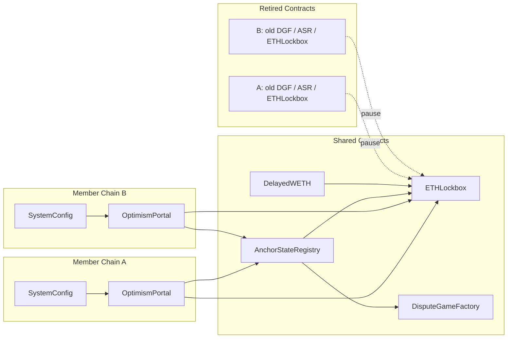

# OPContractsManagerMigrator

<!-- START doctoc generated TOC please keep comment here to allow auto update -->
<!-- DON'T EDIT THIS SECTION, INSTEAD RE-RUN doctoc TO UPDATE -->
**Table of Contents**

- [Overview](#overview)
  - [Relationship to the OPContractsManager specification](#relationship-to-the-opcontractsmanager-specification)
- [Definitions](#definitions)
  - [Migration](#migration)
  - [Interop Set](#interop-set)
  - [Member Chain](#member-chain)
  - [Shared Contracts](#shared-contracts)
  - [Retired Contracts](#retired-contracts)
  - [Pause Identifier](#pause-identifier)
  - [Starting Anchor State](#starting-anchor-state)
  - [Cleared Game Types](#cleared-game-types)
  - [Migration Validation](#migration-validation)
- [Assumptions](#assumptions)
  - [aMIG-001: Member Chains already run this release](#amig-001-member-chains-already-run-this-release)
    - [Mitigations](#mitigations)
  - [aMIG-002: Every Member Chain already has an ETHLockbox](#amig-002-every-member-chain-already-has-an-ethlockbox)
    - [Mitigations](#mitigations-1)
  - [aMIG-003: A single trusted ProxyAdmin owner governs the whole set](#amig-003-a-single-trusted-proxyadmin-owner-governs-the-whole-set)
    - [Mitigations](#mitigations-2)
  - [aMIG-004: The Starting Anchor State is correct](#amig-004-the-starting-anchor-state-is-correct)
    - [Mitigations](#mitigations-3)
  - [aMIG-005: The input describes the complete set](#amig-005-the-input-describes-the-complete-set)
    - [Mitigations](#mitigations-4)
  - [aMIG-006: Retired dispute games resolve](#amig-006-retired-dispute-games-resolve)
    - [Mitigations](#mitigations-5)
- [Invariants](#invariants)
  - [iMIG-001: Migration happens at most once per chain](#imig-001-migration-happens-at-most-once-per-chain)
    - [Impact](#impact)
  - [iMIG-002: ETH is conserved across migration](#imig-002-eth-is-conserved-across-migration)
    - [Impact](#impact-1)
  - [iMIG-003: Member Chains have distinct, non-zero chain IDs](#imig-003-member-chains-have-distinct-non-zero-chain-ids)
    - [Impact](#impact-2)
  - [iMIG-004: Migration is atomic and complete](#imig-004-migration-is-atomic-and-complete)
    - [Impact](#impact-3)
  - [iMIG-005: A single Pause Identifier governs the set](#imig-005-a-single-pause-identifier-governs-the-set)
    - [Impact](#impact-4)
  - [iMIG-006: Retired contracts remain coherent with the set](#imig-006-retired-contracts-remain-coherent-with-the-set)
    - [Impact](#impact-5)
  - [iMIG-007: No legacy dispute game configuration survives](#imig-007-no-legacy-dispute-game-configuration-survives)
    - [Impact](#impact-6)
  - [iMIG-008: Shared Contracts depend only on set-scoped contracts](#imig-008-shared-contracts-depend-only-on-set-scoped-contracts)
    - [Impact](#impact-7)
  - [iMIG-009: The set has one governance scope](#imig-009-the-set-has-one-governance-scope)
    - [Impact](#impact-8)
  - [iMIG-010: Per-chain configuration is otherwise preserved](#imig-010-per-chain-configuration-is-otherwise-preserved)
    - [Impact](#impact-9)
  - [iMIG-011: The Starting Anchor State is well formed](#imig-011-the-starting-anchor-state-is-well-formed)
    - [Impact](#impact-10)
  - [iMIG-012: Registered dispute games are playable](#imig-012-registered-dispute-games-are-playable)
    - [Impact](#impact-11)
  - [iMIG-013: Custom gas token chains are not migrated](#imig-013-custom-gas-token-chains-are-not-migrated)
    - [Impact](#impact-12)

<!-- END doctoc generated TOC please keep comment here to allow auto update -->

## Overview

OPContractsManagerMigrator is the OPCM component that merges a group of independent OP Stack chains
into a single [Interop Set](#interop-set). [Migration](#migration) happens once per chain and cannot
be reversed.

It provides two capabilities:

- **Interop Set Migration**: deploying the [Shared Contracts](#shared-contracts) for a new Interop
  Set, moving every [Member Chain](#member-chain) onto them, pooling every member's ETH into the
  set's single `ETHLockbox`, and registering the super-root dispute games that will defend the set.
  Like the system upgrade capability, it is designed to be invoked by delegatecall from the
  ProxyAdmin owner, as it holds no authority itself.
- **Migration Validation**: proving, after the fact, that the resulting configuration is the one
  that was intended. This capability is provided by OPContractsManagerMigrationValidator and is
  specified alongside migration here, because it exists only to check migration's output and shares
  every definition with it.

Both components are stateless and neither is versioned independently of OPCM. They act entirely
with the authority of the caller.

### Relationship to the OPContractsManager specification

Interop Set Migration is subject to the invariants of the [OPCM specification](./opcm.md), with
three deliberate exceptions. Each is a considered trade, not an oversight:

- **It must not be available while a Member Chain is paused**, in contrast to
  [i01-011](./opcm.md#i01-011-upgrade-availability-while-paused). Migration changes each member's
  [Pause Identifier](#pause-identifier), so running it under an active pause would silently discard
  that pause. See [iMIG-005](#imig-005-a-single-pause-identifier-governs-the-set).
- **Its Shared Contract addresses are not deterministic**, in contrast to
  [i01-009](./opcm.md#i01-009-time-independence). An Interop Set has no chain ID of its own, and the
  chain ID only ever serves as a salt input, so migration substitutes a value derived from the block
  it executes in. Two attempts at the same migration therefore produce different addresses, and
  operators cannot predict them.
- **It accepts a variable-length list of super-root dispute game configurations**, rather than one
  configuration per valid game type in a fixed order as system deployment and system upgrade
  require. An Interop Set is defended by super-root games only, so the fixed shape does not apply.

## Definitions

### Migration

The one-time operation that turns a group of independent chains into an [Interop Set](#interop-set).
It is one-way. Nothing in these contracts returns a member to standalone operation, so undoing a
migration would require a contract upgrade.

### Interop Set

The group of OP Stack chains that share one `ETHLockbox`, one `DisputeGameFactory` and one
`AnchorStateRegistry`, and whose state is proven together as a single
[Super Root](../../../interop/superroot.md). Every member keeps its own `SystemConfig` and
`OptimismPortal`. The [OptimismPortal Interop specification](../../../interop/optimism-portal.md)
calls this the op-governed dependency set. It is the L1 contract counterpart of the
[dependency set](../../../interop/dependency-set.md), which is a consensus-layer concept. The two
are expected to describe the same group of chains. Nothing in these contracts enforces that.

### Member Chain

A chain in an [Interop Set](#interop-set). Membership is permanent: nothing in these contracts
removes a chain from a set.

### Shared Contracts

The contracts an [Interop Set](#interop-set) holds in common: its `ETHLockbox`, its
`DisputeGameFactory`, its `AnchorStateRegistry` and its `DelayedWETH`. Migration deploys the first
three and adopts one member's existing `DelayedWETH` as the set's, so that each member's
`SystemConfig` and the set's dispute games agree on which `DelayedWETH` holds bonds.

### Retired Contracts

The per-chain `DisputeGameFactory`, `ETHLockbox`, `AnchorStateRegistry` and `DelayedWETH` that a
[Member Chain](#member-chain) used before migration. They remain deployed and reachable, because
dispute games created before migration continue to resolve against them and their bonds must remain
claimable.

The following diagram shows a two-chain set after migration. Note that the Retired Contracts
resolve pause through the set's shared `ETHLockbox` rather than through their own, which is what
keeps a game created before the migration subject to the same pause as the rest of the set:

### Pause Identifier

The address that a chain's pause state is keyed against in `SuperchainConfig`. Before joining an
[Interop Set](#interop-set) a chain is identified by its own `ETHLockbox`. Afterwards every member
is identified by the set's shared `ETHLockbox`, so one scoped pause covers the whole set. See the
[Pause Identifier rules](../../../protocol/stage-1.md#pause-identifier) for the permitted values.

### Starting Anchor State

The [Super Root](../../../interop/superroot.md) and sequence number that the set's shared
`AnchorStateRegistry` is initialized with, serving the same role as the
[Starting Anchor State](../../../fault-proof/stage-one/anchor-state-registry.md#starting-anchor-state)
of a single-chain registry. It is computed off-chain from the state of every Member Chain.

### Cleared Game Types

The set of dispute game types that migration removes from the `DisputeGameFactory` of every
[Retired Contracts](#retired-contracts) entry. It is deliberately broader than the game types
an OPCM release considers valid, because a retired factory may still hold a game type that has
since been withdrawn from service.

### Migration Validation

The set of checks performed after migration, comparing the on-chain result against the operator's stated
migration intent. Validation reports every discrepancy or anomaly it finds rather than reverting
at the first, so that a single dry run surfaces the complete list of problems.

## Assumptions

### aMIG-001: Member Chains already run this release

Every [Member Chain](#member-chain) already runs the [Contract
Release](./opcm.md#contract-release) that the migrating OPCM represents.

System upgrades accept a chain one major version behind. Migration accepts only a chain already on
this release, whether through this OPCM or through a replacement OPCM for the same release.

#### Mitigations

- The permitted-sequence check is applied to every chain in the input before any state is mutated
- Refusing the next-major case makes it not possible to reach a new release through the migration
OPCM path
- Migration preserves each member's record of its last-used OPCM instead of marking the migration
  as an upgrade, so the chain's upgrade history stays accurate

### aMIG-002: Every Member Chain already has an ETHLockbox

Every [Member Chain](#member-chain) has an `ETHLockbox` installed and its lockbox feature enabled
before migration begins.

This is a precondition of the release rather than something migration establishes. Migration reads
each member's pause state, which is resolved through that member's lockbox, so a member without one
cannot be read at all.

#### Mitigations

- The system upgrade capability installs and enables an `ETHLockbox` for every chain on this
  release, so any chain eligible under [aMIG-001](#amig-001-member-chains-already-run-this-release) satisfies this
- A member without a lockbox causes migration to revert

### aMIG-003: A single trusted ProxyAdmin owner governs the whole set

All [Member Chains](#member-chain) are administered by the same ProxyAdmin owner, which is trusted
and operating within governance constraints, and migration executes with that owner's authority.

Members may have distinct `ProxyAdmin` contracts. Only the owner must be common, because it is the
owner rather than the contract that migration and every subsequent upgrade acts as.

#### Mitigations

- Migration only succeeds when `delegatecall`ed
- The common owner is checked across every chain in the input before any state is mutated

### aMIG-004: The Starting Anchor State is correct

The [Starting Anchor State](#starting-anchor-state) supplied to migration is a truthful Super Root
of every [Member Chain](#member-chain) at the stated sequence number.

Migration cannot check a Super Root against L2 state on-chain. It rejects only roots which carry a
zero anchor hash or sequence numbers that leave no room for a new one, so a wrong but plausible
anchor is installed exactly as supplied.

#### Mitigations

- Migration rejects an empty anchor and one that leaves no room for a successor proposal, so the
  obvious placeholder values cannot be installed by accident
- Validation compares the installed anchor against the operator's stated intent

### aMIG-005: The input describes the complete set

The chains supplied to migration are exactly the chains joining the set. All of them are joining,
and none is already in a set.

Migration supports only the case of independent chains merging into one new set. Adding a chain to
an existing set, splitting a set, or migrating part of a set is not supported.

#### Mitigations

- Any chain already in a set is refused, so an existing set cannot be migrated again or extended
- A mixed input containing one or more already-migrated chains is rejected

### aMIG-006: Retired dispute games resolve

Dispute games created before migration resolve on their own against their
[Retired Contracts](#retired-contracts), and their bonds are reclaimed afterwards.

Migration does not resolve, cancel or settle games that are in progress.

#### Mitigations

- Retired factories keep the games they created, and migration removes only the ability to create
  new ones
- Retired registries and `DelayedWETH` contracts keep resolving pause and guardian through the
  set's shared `ETHLockbox`, so a retired game is neither stranded nor exempt from a pause
- Bond withdrawals already pending in a retired `DelayedWETH` survive migration

## Invariants

### iMIG-001: Migration happens at most once per chain

A chain that is already a [Member Chain](#member-chain) of an [Interop Set](#interop-set) must never
be migrated again, and an attempt that includes even one such chain must fail in its entirety.

#### Impact

**Severity: Critical**

Re-migrating a set is destructive to every chain in it. A second migration deploys a fresh
`ETHLockbox` and drains the set's existing one into it. It also clears the game implementations from
the set's shared `DisputeGameFactory`. The result is a set with no playable dispute games and no
withdrawable ETH, for every member at once.

### iMIG-002: ETH is conserved across migration

Every ETH balance held by a [Member Chain](#member-chain)'s `OptimismPortal` or by its retired
`ETHLockbox` must end up in the set's shared `ETHLockbox`. Afterwards each member's `OptimismPortal`
and each retired `ETHLockbox` must hold no ETH, and the shared `ETHLockbox` must hold the sum of
what they held before.

#### Impact

**Severity: Critical**

The portal no longer draws on a retired contract, so it no longer backs anything, and withdrawals
against it can never be paid. ETH counted twice would let more be withdrawn from the set than was ever deposited into it.

### iMIG-003: Member Chains have distinct, non-zero chain IDs

No two [Member Chains](#member-chain) may report the same L2 chain ID, and no member may report a
chain ID of zero.

#### Impact

**Severity: Critical**

An Interop Set's proofs key each member's output root by its chain ID. Two members sharing an ID
would let a single withdrawal be finalized through both members' portals, paying it twice out of the
shared liquidity pool.

### iMIG-004: Migration is atomic and complete

Migration either fully succeeds for every [Member Chain](#member-chain) or fully reverts with no
state changes, within a single transaction that fits in an Ethereum block.

#### Impact

**Severity: Critical**

If violated, the set could be left partially migrated. Some portals would point at the shared
contracts while the rest still pointed at their own. Liquidity would sit partly in the shared
`ETHLockbox` and partly in the retired ones. No single proof would cover every member. A withdrawal
could then be blocked or paid twice, depending on which side of the split it was proven against.

### iMIG-005: A single Pause Identifier governs the set

After migration, every [Member Chain](#member-chain) must resolve its pause state and its guardian
through the set's shared `ETHLockbox`, so that one scoped pause covers the whole set.

To reach that state safely, migration must refuse to run while any member is paused under its
existing [Pause Identifier](#pause-identifier), and must leave no pause active against any retired
identity.

#### Impact

**Severity: Critical**

Changing a chain's Pause Identifier while a pause is active drops that pause: the guardian's
intervention silently stops applying, and withdrawals resume in the middle of the incident that
prompted it. In the other direction, a pause left active against a retired identity is a pause
nobody can see and nobody can lift through the set's controls.

### iMIG-006: Retired contracts remain coherent with the set

Each [Member Chain](#member-chain)'s retired `AnchorStateRegistry` and retired `DelayedWETH` must
resolve pause, guardian and `SuperchainConfig` through the set's shared `ETHLockbox`, while keeping
their own anchor state and respected game type unchanged.

#### Impact

**Severity: High**

If violated, a member's retired `AnchorStateRegistry` and `DelayedWETH` would keep asking their old
lockbox whether the set is paused. Only the shared `ETHLockbox` answers that question for the set,
because a lockbox reports the pause keyed to its own address. The guardian could halt the set and
these two contracts would still read "not paused".

The games that read them were created before migration, and have no other route to the set's pause
state. A game caught resolving incorrectly could not be stopped, and its bonds would be paid out of
a set the guardian had already halted. A pause keyed to the retired lockbox would do the reverse,
freezing those games while the rest of the set carried on.

Reinitializing their anchor state rather than preserving it would invalidate the same games.

Pause is the only one of the three references that can diverge today, because every lockbox in a set
holds the same `SuperchainConfig` and so reports the same guardian. The guardian and
`SuperchainConfig` clauses keep the invariant sound if that ever stops being true.

### iMIG-007: No legacy dispute game configuration survives

No game type may be left with an implementation, or with any configuration of its own such as an
initialization bond, on any [Retired Contracts](#retired-contracts) `DisputeGameFactory`. The
[Cleared Game Types](#cleared-game-types) must therefore cover every game type a chain on this
release could have registered, including those the release has since withdrawn from service. The
set's shared `DisputeGameFactory` must carry only the super-root game types that migration was
asked to register.

Migration and validation must agree on which game types those are. Neither may work from its own
list.

#### Impact

**Severity: High**

A game type left registered on a retired factory lets anyone create a new game there, against a
registry the portal no longer respects. Bonds staked on such a game are staked on a game that can
never settle a withdrawal, and a stale initialization bond prices it wrong. If the two sides
disagree about the list, validation passes while a game type is still live, which is precisely the
failure this invariant exists to catch.

### iMIG-008: Shared Contracts depend only on set-scoped contracts

No [Shared Contract](#shared-contracts) may hold a reference to a contract belonging to a single
[Member Chain](#member-chain). Every dependency of a Shared Contract must itself be scoped to the
whole set.

#### Impact

**Severity: High**

A Shared Contract pointing at one member's per-chain contract makes that member the governance root
of the set: the whole set's pause state and guardian resolve through one member's configuration,
with nothing keeping that member aligned afterwards. It also breaks upgrade idempotency, because
upgrading any other member would aim the set's governance reference at itself instead, and makes it
impossible to state a validation predicate that holds for more than one member at a time.

### iMIG-009: The set has one governance scope

All [Member Chains](#member-chain) must share one ProxyAdmin owner and one `SuperchainConfig`, and
the set's shared `DisputeGameFactory` must be owned by that ProxyAdmin owner.

#### Impact

**Severity: High**

Members under different owners or different `SuperchainConfig` contracts cannot be paused, upgraded
or guarded as a unit, which is the premise the shared contracts are built on. A shared factory owned
by anyone else would let that party set the dispute game implementations for every member.

### iMIG-010: Per-chain configuration is otherwise preserved

Migration must not change any [Member Chain](#member-chain) configuration beyond what joining the
set requires: adopting the set's [Shared Contracts](#shared-contracts), enabling the features the
set depends on, and moving the portal onto the shared `ETHLockbox` and registry. Every other
configuration value must survive migration unchanged.

#### Impact

**Severity: Critical**

Migration touches every member's most privileged contracts. Silently changing an owner would
transfer control of the chain. Silently changing a batcher hash or a gas limit would break it. In
either case the damage looks like the migration working as intended rather than like a bug.

### iMIG-011: The Starting Anchor State is well formed

The [Starting Anchor State](#starting-anchor-state) must not be empty and must leave room for a
successor proposal. The set's starting respected game type must be a super-root game type, and must
be one of the game types migration registers on the shared factory.

#### Impact

**Severity: High**

An empty or out-of-range anchor leaves the shared registry in a state no game can build on, halting
proposals for every member. A respected game type with no implementation registered is unplayable,
so no proposal can be made or defended and withdrawals stop for the whole set.

### iMIG-012: Registered dispute games are playable

Every dispute game configuration migration installs must be one it can actually install and one that
can be played: a super-root game type with a registered implementation, enabled, with an
initialization bond consistent with whether that game type charges bonds, and with a non-zero
absolute prestate where the game type requires one.

A configuration that passes validation must not then fail installation.

#### Impact

**Severity: High**

An unplayable game blocks proposals, and therefore withdrawals, for every member of the set. A
game type that passes the configuration checks and then fails installation turns a caller mistake
into a failure halfway through the operation, which is a far worse diagnostic than an upfront
rejection.

### iMIG-013: Custom gas token chains are not migrated

A [Member Chain](#member-chain) must not use a custom gas token. Migration must reject a chain whose
`SystemConfig` has the custom gas token feature enabled before any state is mutated.

#### Impact

**Severity: Critical**

A custom gas token chain's native asset is not ETH. Joining a set enables the interop feature on the
member, which activates the [interop ETH predeploys](../../../interop/eth-bridging.md) on its L2. A
cross-chain ETH transfer burns the sending chain's native asset and mints ETH on the receiving
chain. That ETH is withdrawable from the set's single shared `ETHLockbox`, so every unit such a
member sends draws on ETH it never deposited.
