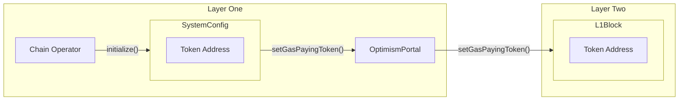
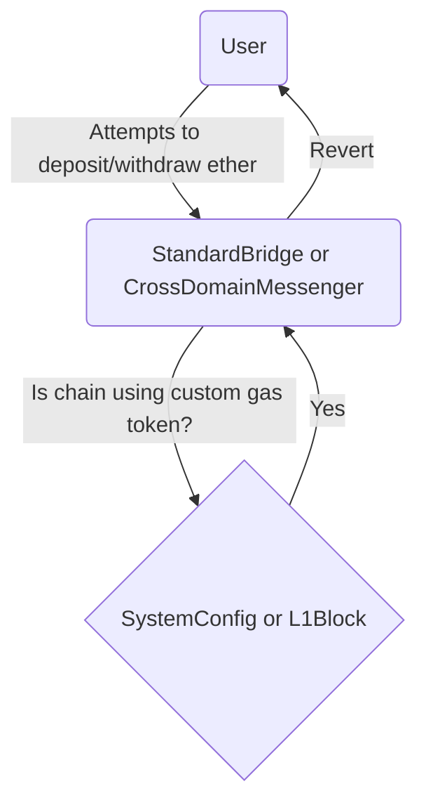

# Custom Gas Token

<!-- START doctoc generated TOC please keep comment here to allow auto update -->
<!-- DON'T EDIT THIS SECTION, INSTEAD RE-RUN doctoc TO UPDATE -->
**Table of Contents**

- [Overview](#overview)
- [Constants](#constants)
- [Properties of a Gas Paying Token](#properties-of-a-gas-paying-token)
  - [Automated Validation](#automated-validation)
- [Configuring the Gas Paying Token](#configuring-the-gas-paying-token)
- [Contract Modifications](#contract-modifications)
  - [IGasToken Interface](#igastoken-interface)
  - [Gas Token Aware](#gas-token-aware)
  - [OptimismPortal](#optimismportal)
    - [`depositERC20Transaction`](#depositerc20transaction)
      - [Function Arguments](#function-arguments)
    - [`depositTransaction`](#deposittransaction)
    - [`setGasPayingToken`](#setgaspayingtoken)
  - [StandardBridge](#standardbridge)
  - [CrossDomainMessenger](#crossdomainmessenger)
  - [SystemConfig](#systemconfig)
    - [initialize](#initialize)
  - [L1Block](#l1block)
  - [WETH9](#weth9)
- [User Flow](#user-flow)
  - [When ETH is the Native Asset](#when-eth-is-the-native-asset)
  - [When an ERC20 Token is the Native Asset](#when-an-erc20-token-is-the-native-asset)
  - [Differences](#differences)
- [Upgrade](#upgrade)
  - [L1Block Deployment](#l1block-deployment)
  - [L2CrossDomainMessenger Deployment](#l2crossdomainmessenger-deployment)
  - [L2StandardBridge Deployment](#l2standardbridge-deployment)
  - [L1Block Proxy Update](#l1block-proxy-update)
  - [L2CrossDomainMessenger Proxy Update](#l2crossdomainmessenger-proxy-update)
  - [L2StandardBridge Proxy Update](#l2standardbridge-proxy-update)
- [Selection of `ETHER_TOKEN_ADDRESS`](#selection-of-ether_token_address)
- [Standard Config](#standard-config)
- [Fees](#fees)
- [Security Considerations](#security-considerations)
  - [OptimismPortal Token Allowance](#optimismportal-token-allowance)
  - [Interoperability Support](#interoperability-support)
  - [Wrapped Ether](#wrapped-ether)

<!-- END doctoc generated TOC please keep comment here to allow auto update -->

## Overview

Custom gas token is also known as "custom L2 native asset". It allows for an L1-native ERC20 token to collateralize
and act as the gas token on L2. The native asset is used to buy gas which is used to pay for resources on the network
and is represented by EVM opcodes such as `CALLVALUE` (`msg.value`).

Both the L1 and L2 smart contract systems MUST be able to introspect on the address of the gas paying token to
ensure the security of the system. The source of truth for the configuration of the address of the token is
in the L1 `SystemConfig` smart contract.

The terms "custom gas token", "gas paying token", "native asset" and "gas paying asset" can all be used interchangeably.
Note, Ether is not a **custom** gas token, but may be used to pay gas. More on this in
[Configuring the Gas Paying Token](#configuring-the-gas-paying-token).

## Constants

| Constant          | Value                           | Description |
| ----------------- | ------------------------------- | ----------- |
| `ETHER_TOKEN_ADDRESS` |  `address(0xEeeeeEeeeEeEeeEeEeEeeEEEeeeeEeeeeeeeEEeE)` | Represents ether for gas paying asset |
| `DEPOSITOR_ACCOUNT` | `address(0xDeaDDEaDDeAdDeAdDEAdDEaddeAddEAdDEAd0001)` | Account with auth permissions on `L1Block` contract |
| `GAS_PAYING_TOKEN_SLOT` | `bytes32(uint256(keccak256("opstack.gaspayingtoken")) - 1)` | Storage slot that contains the address and decimals of the gas paying token |
| `GAS_PAYING_TOKEN_NAME_SLOT` | `bytes32(uint256(keccak256("opstack.gaspayingtokenname")) - 1)` | Storage slot that contains the ERC20 `name()` of the gas paying token |
| `GAS_PAYING_TOKEN_SYMBOL_SLOT` | `bytes32(uint256(keccak256("opstack.gaspayingtokensymbol")) - 1)` | Storage slot that contains the ERC20 `symbol()` of the gas paying token |

## Properties of a Gas Paying Token

The gas paying token MUST satisfy the standard [ERC20](https://eips.ethereum.org/EIPS/eip-20) interface
and implementation. It MUST be an L1 contract.

The gas paying token MUST NOT:

- Have a fee on transfer
- Have rebasing logic
- Have call hooks on transfer
- Have other than 18 decimals
- Have out of band methods for modifying balance or allowance
- Have a `name()` that is more than 32 bytes long
- Have a `symbol()` this is more than 32 bytes long
- Be a [double entrypoint token](https://stermi.xyz/blog/ethernaut-challenge-24-solution-double-entry-point)

It MUST be enforced on chain that the token has exactly 18 decimals to guarantee no losses of precision when
depositing a token that has a different number of decimals. It MUST be enforced on chain that the
token's `name` and `symbol` are less than 32 bytes to guarantee they can each fit into a single storage
slot.

It MAY be possible to support ERC20 tokens with varying amounts of decimals in the future.

### Automated Validation

Ideally it is possible to have automated validation of custom gas paying tokens to know that the token satisfies the
above properties. Due to the nature of the EVM, it may not always be possible to do so. [ERC-165][erc165]
isn't always used by ERC20 tokens and isn't guaranteed to tell the truth. [USDT][usdt]
does not correctly implement the ERC20 spec. It may be possible to use execution traces to observe the
properties of the ERC20 tokens but some degree of social consensus will be required for determining
the validity of an ERC20 token.

[erc165]: https://eips.ethereum.org/EIPS/eip-165
[usdt]: https://forum.openzeppelin.com/t/usdt-locked-in-a-contract-that-has-a-withdraw-token-function/32154/2

## Configuring the Gas Paying Token

The gas paying token is set within the L1 `SystemConfig` smart contract. This allows for easy access to the
information required to know if an OP Stack chain is configured to use a custom gas paying token. The gas paying
token is set during initialization and cannot be modified by the `SystemConfig` bytecode. Since the `SystemConfig`
is proxied, it is always possible to modify the storage slot that holds the gas paying token address directly
during an upgrade. It is assumed that the chain operator will not modify the gas paying token address unless they
specifically decide to do so and appropriately handle the consequences of the action.

The gas paying token address is network specific configuration, therefore it MUST be set in storage and not
as an immutable. This ensures that the same contract bytecode can be used by multiple OP Stack chains.

If the address in the `GAS_PAYING_TOKEN_SLOT` slot for `SystemConfig` is `address(0)`, the system is configured to
use `ether` as the gas paying token, and the getter for the token returns `ETHER_TOKEN_ADDRESS`. If the address in
the `GAS_PAYING_TOKEN_SLOT` slot for `SystemConfig` is not `address(0)`, the system is configured to use a custom
gas paying token, and the getter returns the address in the slot.



## Contract Modifications

### IGasToken Interface

This interface encapsulates the shared interface.

```solidity
interface IGasToken {
    /// @notice Getter for the ERC20 token address that is used to pay for gas and its decimals.
    function gasPayingToken() external view returns (address, uint8);
    /// @notice Returns the gas token name.
    function gasPayingTokenName() external view returns (string memory);
    /// @notice Returns the gas token symbol.
    function gasPayingTokenSymbol() external view returns (string memory);
    /// @notice Returns true if the network uses a custom gas token.
    function isCustomGasToken() external view returns (bool);
}
```

If a custom gas token is not used, then `gasPayingToken()` should return `(ETHER_TOKEN_ADDRESS, 18)`,
`gasPayingTokenName` should return `Ether` and `gasPayingTokenSymbol` should return `ETH`.

This interface applies to the following contracts:

- `L1Block`
- `SystemConfig`

### Gas Token Aware

The following contracts are aware internally if the chain is using a custom gas token
but do not expose anything as part of their ABI that indicates awareness.

- `L1StandardBridge`
- `L2StandardBridge`
- `L1CrossDomainMessenger`
- `L2CrossDomainMessenger`
- `OptimismPortal`

### OptimismPortal

The `OptimismPortal` is updated with a new interface specifically for depositing custom tokens.

#### `depositERC20Transaction`

The `depositERC20Transaction` function is useful for sending custom gas tokens to L2. It is broken out into its
own interface to maintain backwards compatibility with chains that use `ether`, to help simplify the implementation
and make it explicit for callers that are trying to deposit an ERC20 native asset.

```solidity
function depositERC20Transaction(
    address _to,
    uint256 _mint,
    uint256 _value,
    uint64 _gasLimit,
    bool _isCreation,
    bytes memory _data
) public;
```

This function MUST revert when `ether` is the L2's native asset. It MUST not be `payable`, meaning that it will
revert when `ether` is sent with a `CALL` to it. It uses a `transferFrom` flow, so users MUST first `approve()`
the `OptimismPortal` before they can deposit tokens.

##### Function Arguments

The following table describes the arguments to `depositERC20Transaction`

| Name | Type | Description |
|---------|---------|---------|
| `_to` | `address` | The target of the deposit transaction |
| `_mint` | `uint256` | The amount of token to deposit |
| `_value` | `uint256` | The value of the deposit transaction, used to transfer native asset that is already on L2 from L1 |
| `_gasLimit` | `uint64` | The gas limit of the deposit transaction |
| `_isCreation` | `bool` | Signifies the `_data` should be used with `CREATE` |
| `_data` | `bytes` | The calldata of the deposit transaction |

#### `depositTransaction`

This function is the hot code path for all usage of the `L1StandardBridge` and `L1CrossDomainMessenger`, so it MUST
be as backwards compatible as possible. It MUST revert for chains using custom gas token when `ether` is sent with
the `CALL`. This prevents `ether` from being stuck in the `OptimismPortal`, since it cannot be used to mint native
asset on L2.

#### `setGasPayingToken`

This function MUST only be callable by the `SystemConfig`. When called, it creates a special deposit transaction
from the `DEPOSITOR_ACCOUNT` that calls the `L1Block.setGasPayingToken` function. The ERC20 `name` and `symbol`
are passed as `bytes32` to prevent the usage of dynamically sized `string` arguments.

```solidity
function setGasPayingToken(address _token, uint8 _decimals, bytes32 _name, bytes32 _symbol) external;
```

### StandardBridge

The `StandardBridge` contracts on both L1 and L2 MUST be aware of the custom gas token. The `ether` specific ABI on the
`StandardBridge` is disabled when custom gas token is enabled.

The following methods MUST revert when custom gas token is being used:

- `bridgeETH(uint32,bytes)`
- `bridgeETHTo(address,uint32,bytes)`
- `receive()`
- `finalizeBridgeETH(address, address, uint256, bytes)`

The following legacy methods in `L1StandardBridge` MUST revert when custom gas token is being used:

- `depositETH(uint32,bytes)`
- `depositETHTo(address,uint32,bytes)`
- `finalizeETHWithdrawal(address,address,uint256,bytes)`

The following legacy methods in `L2StandardBridge` MUST always revert when custom gas token is being used:

- `withdraw(address,uint256,uint32,bytes)`
- `withdrawTo(address,address,uint256,uint32,bytes)`
- `finalizeDeposit(address,address,address,address,uint256,bytes)`

These methods are deprecated and subject to be removed in the future.

### CrossDomainMessenger

The `CrossDomainMessenger` contracts on both L1 and L2 MUST NOT be able to facilitate the transfer of native asset
on custom gas token chains due to their tight coupling with `ether` and the `OptimismPortal` and `L2ToL1MessagePasser`
contracts.

It is possible to support this in the future with a redesign of the `CrossDomainMessenger` contract.
It would need to have conditional logic based on being a custom gas token chain and facilitate transfer
of the ERC20 token to the end user on the other side. It adds a layer of extra state modifying calls
so it may not be worth adding.

The following methods MUST revert when `CALLVALUE` is non zero:

- `sendMessage(address,bytes,uint32)`

It should be impossible to call `relayMessage` when `CALLVALUE` is non zero, as it is enforced by `sendMessage`.

The `CrossDomainMessenger` also has the API for _getting_ the custom gas token, namely `gasPayingToken()`, which outputs
a tuple of the address and decimals of the custom gas token.

- The `L1CrossDomainMessenger` fetches this tuple from the `SystemConfig` contract.
- The `L2CrossDomainMessenger` fetches this tuple from the `L1Block` contract.

### SystemConfig

The `SystemConfig` is the source of truth for the address of the custom gas token. It does on chain validation,
stores information about the token and well as passes the information to L2.

#### initialize

The `SystemConfig` is modified to allow the address of the custom gas paying token to be set during the call
to `initialize`. Using a custom gas token is indicated by passing an address other than `ETHER_TOKEN_ADDRESS`
or `address(0)`. If `address(0)` is used for initialization, it MUST be mapped into `ETHER_TOKEN_ADDRESS`
before being forwarded to the rest of the system. When a custom gas token is set, the number of decimals
on the token MUST be exactly 18, the name of the token MUST be less than or equal to 32 bytes and the
symbol MUST be less than or equal to 32 bytes. If the token passes all of these checks,
`OptimismPortal.setGasPayingToken` is called. The implementation of `initialize` MUST not allow the chain
operator to change the address of the custom gas token if it is already set.

### L1Block

The `L1Block` contract is upgraded with a permissioned function `setGasPayingToken` that is used to set
information about the gas paying token. The `DEPOSITOR_ACCOUNT` MUST be the only account that can call the
setter function. This setter is differentiated from the `setL1BlockValues` functions because the gas paying
token is not meant to be dynamic config whereas the arguments to `setL1BlockValues` are generally dynamic in nature.

Any L2 contract that wants to learn the address of the gas paying token can call the getter on the
`L1Block` contract.

```solidity
function setGasPayingToken(address _token, uint8 _decimals, byte32 _name, bytes32 _symbol) external;
```

### WETH9

The `WETH9` predeploy is updated so that it calls out to the `L1Block` contract to retrieve the `name` and `symbol`.
This allows for front ends to more easily trust the token contract. It should prepend `Wrapped` to the `name`
and `W` to the `symbol`.

## User Flow

The user flow for custom gas token chains is slightly different than for chains that use `ether`
to pay for gas. The following tables highlight the methods that can be used for depositing and
withdrawing the native asset. Not every interface is included.

The `StandardBridge` and `CrossDomainMessenger` are symmetric in their APIs between L1 and L2
meaning that "sending to the other domain" indicates it can be used for both deposits and withdrawals.

### When ETH is the Native Asset

| Scenario | Method | Prerequisites |
|----------|--------|---------------|
| Native Asset Send to Other Domain | `L1StandardBridge.bridgeETH(uint32,bytes) payable` | None |
| Native Asset and/or Message Send to Other Domain | `L1CrossDomainMessenger.sendMessage(address,bytes,uint32) payable` | None |
| Native Asset Deposit | `OptimismPortal.depositTransaction(address,uint256,uint64,bool,bytes) payable` | None |
| ERC20 Send to Other Domain | `L1StandardBridge.bridgeERC20(address,address,uint256,uint32,bytes)` | Approve `L1StandardBridge` for ERC20 |
| Native Asset Withdrawal | `L2ToL1MessagePasser.initiateWithdrawal(address,uint256,bytes) payable` | None |

There are multiple APIs for users to deposit or withdraw `ether`. Depending on the usecase, different APIs should be
preferred. For a simple send of just `ether` with no calldata, the `OptimismPortal` or `L2ToL1MessagePasser` should
be used directly. If sending with calldata and replayability on failed calls is desired, the `CrossDomainMessenger`
should be used. Using the `StandardBridge` is the most expensive and has no real benefit for end users.

### When an ERC20 Token is the Native Asset

| Scenario | Method | Prerequisites |
|----------|--------|---------------|
| Native Asset Deposit | `OptimismPortal.depositERC20Transaction(address,uint256,uint256,uint64,bool,bytes)` | Approve `OptimismPortal` for ERC20 |
| ERC20 Send to Other Domain | `L1StandardBridge.bridgeERC20(address,address,uint256,uint32,bytes)` | Approve `L1StandardBridge` for ERC20 |
| Native Asset Withdrawal | `L2ToL1MessagePasser.initiateWithdrawal(address,uint256,bytes) payable` | None |

Users should deposit native asset by calling `depositERC20Transaction` on the `OptimismPortal` contract.
Users must first `approve` the address of the `OptimismPortal` so that the `OptimismPortal` can use
`transferFrom` to take ownership of the ERC20 asset.

Users should withdraw value by calling the `L2ToL1MessagePasser` directly.

The following diagram shows the control flow for when a user attempts to send `ether` through
the `StandardBridge`, either on L1 or L2.



### Differences

The main difference is that the `StandardBridge` and `CrossDomainMessenger` cannot be used to send the native asset
to the other domain when an ERC20 token is the native asset. The `StandardBridge` can still be used for bridging
arbitrary ERC20 tokens and the `CrossDomainMessenger` can still be used for arbitrary message passing.

## Upgrade

The custom gas token upgrade is not yet defined to be part of a particular network upgrade, but it will be scheduled
as part of a future hardfork. On the network upgrade block, a set of deposit transaction based upgrade transactions
are deterministically generated by the derivation pipeline in the following order:

- L1 Attributes Transaction calling `setL1BlockValuesEcotone`
- User deposits from L1
- Network Upgrade Transactions
  - L1Block deployment
  - L2CrossDomainMessenger deployment
  - L2StandardBridge deployment
  - Update L1Block Proxy ERC-1967 Implementation Slot
  - Update L2CrossDomainMessenger Proxy ERC-1967 Implementation Slot
  - Update L2StandardBridge Proxy ERC-1967 Implementation Slot

The deployment transactions MUST have a `from` value that has no code and has no known
private key. This is to guarantee it cannot be frontrun and have its nonce modified.
If this was possible, then an attacker would be able to modify the address that the
implementation is deployed to because it is based on `CREATE` and not `CREATE2`.
This would then cause the proxy implementation set transactions to set an incorrect
implementation address, resulting in a bricked contract. The calldata is not generated
dynamically to enable deterministic upgrade transactions across all networks.

The proxy upgrade transactions are from `address(0)` because the `Proxy` implementation
considers `address(0)` to be an admin. Going straight to the `Proxy` guarantees that
the upgrade will work because there is no guarantee that the `Proxy` is owned by the
`ProxyAdmin` and going through the `ProxyAdmin` would require stealing the identity
of its owner, which may be different on every chain. That would require adding L2
RPC access to the derivation pipeline and make the upgrade transactions non deterministic.

### L1Block Deployment

- `from`: `0x4210000000000000000000000000000000000002`
- `to`: `null`
- `mint`: `0`
- `value`: `0`
- `gasLimit`: TODO
- `data`: TODO
- `sourceHash`: TODO

### L2CrossDomainMessenger Deployment

- `from`: `0x4210000000000000000000000000000000000003`
- `to`: `null`
- `mint`: `0`
- `value`: `0`
- `gasLimit`: `375,000`
- `data`: TODO
- `sourceHash`: TODO

### L2StandardBridge Deployment

- `from`: `0x4210000000000000000000000000000000000004`
- `to`: `null`
- `mint`: `0`
- `value`: `0`
- `gasLimit`: `375,000`
- `data`: TODO
- `sourceHash`: TODO

### L1Block Proxy Update

- `from`: `0x0000000000000000000000000000000000000000`
- `to`: `0x4200000000000000000000000000000000000015`
- `mint`: `0`
- `value`: `0`
- `gasLimit`: `50,000`
- `data`: TODO
- `sourceHash`: TODO

### L2CrossDomainMessenger Proxy Update

- `from`: `0x0000000000000000000000000000000000000000`
- `to`: `0x4200000000000000000000000000000000000007`
- `mint`: `0`
- `value`: `0`
- `gasLimit`: `50,000`
- `data`: TODO
- `sourceHash`: TODO

### L2StandardBridge Proxy Update

- `from`: `0x0000000000000000000000000000000000000000`
- `to`: `0x4200000000000000000000000000000000000010`
- `mint`: `0`
- `value`: `0`
- `gasLimit`: `50,000`
- `data`: TODO
- `sourceHash`: TODO

## Selection of `ETHER_TOKEN_ADDRESS`

It was decided to use `address(0xEeeeeEeeeEeEeeEeEeEeeEEEeeeeEeeeeeeeEEeE)` to represent `ether` to push
ecosystem standardization efforts around using this address to represent `ether` in [DeFi protocols][eip-7528]
or [APIs][execution-api-pr].

[eip-7528]: https://eips.ethereum.org/EIPS/eip-7528
[execution-api-pr]: https://github.com/ethereum/execution-apis/pull/484

## Standard Config

There is currently no strong definition of what it means to be part of the standard config when using
the OP Stack with custom gas token enabled. This will be defined in the future.

## Fees

The OP Stack natively charges fees in terms of ether due to the fee formula taking into account the basefee and
blobbasefee. When a custom gas token is used, fees are paid in the custom gas token but the conversion rate to ether
is not taken into account as part of the protocol. It is assumed that the fees will be configured by the chain
operator such that the revenue earned in custom gas token can be swapped into ether to pay for posting the data to L1.

## Security Considerations

### OptimismPortal Token Allowance

The `OptimismPortal` makes calls on behalf of users. It is therefore unsafe to be able to call the address of
the custom gas token itself from the `OptimismPortal` because it would be a simple way to `approve` an attacker's
balance and steal the entire ERC20 token balance of the `OptimismPortal`.

### Interoperability Support

Interop is supported between chains even if they use different custom gas tokens. The token address and the number of
decimals are legible on chain. In the future we may add the ability to poke a chain such that it emits an event that
includes the custom gas token address and its number of decimals to easily be able to introspect on the native asset
of another chain.

### Wrapped Ether

The `WETH9` predeploy at `0x4200000000000000000000000000000000000006` represents wrapped native asset and
not wrapped `ether`. Portable and fungible `ether` across different domains is left for a future project.
