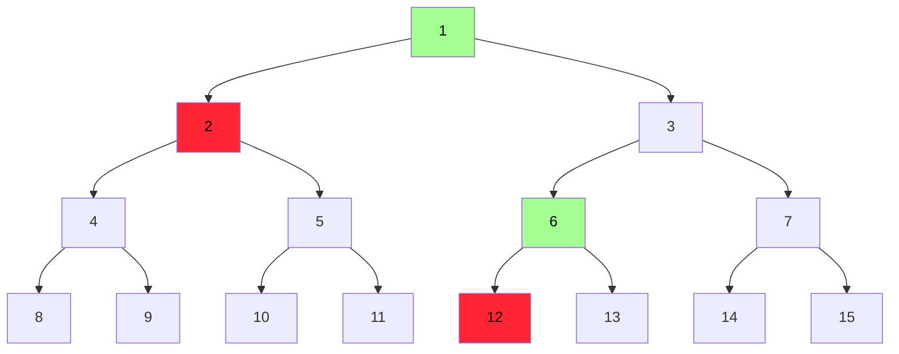
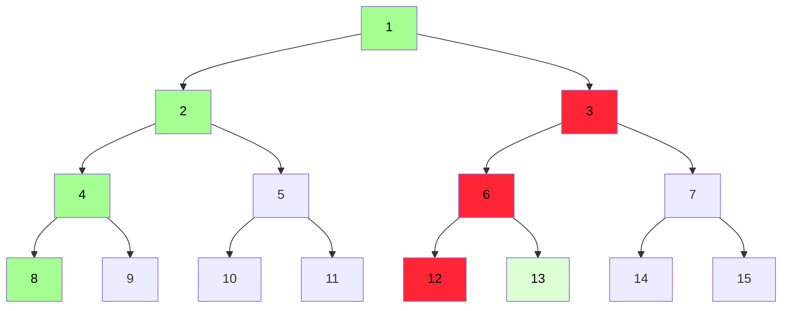
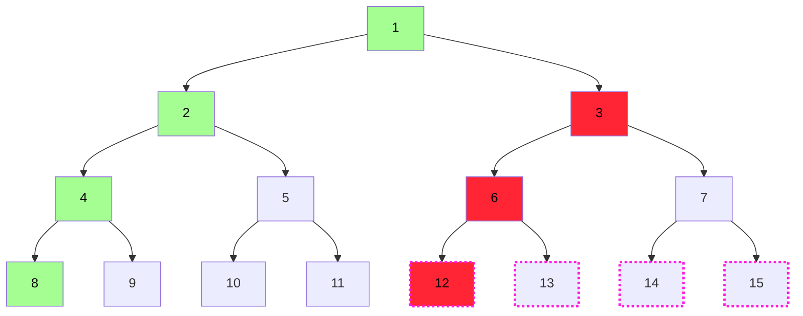
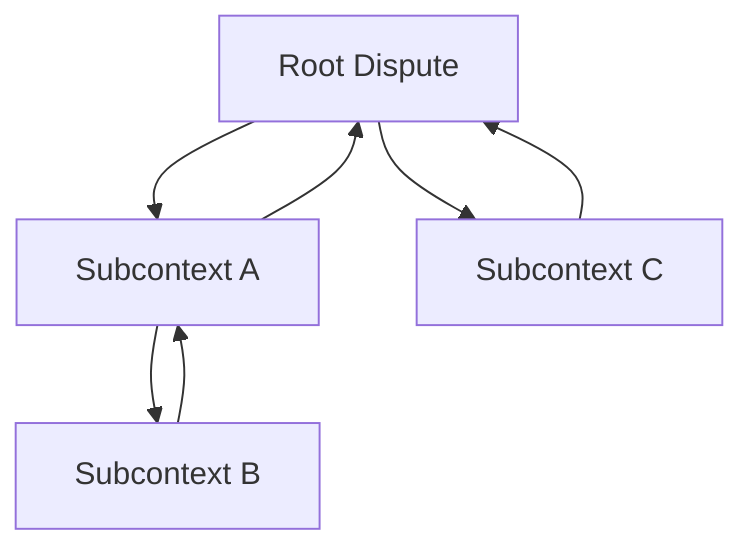

# Dispute Game V2

<!-- START doctoc generated TOC please keep comment here to allow auto update -->
<!-- DON'T EDIT THIS SECTION, INSTEAD RE-RUN doctoc TO UPDATE -->
**Table of Contents**

- [Overview](#overview)
- [Definitions](#definitions)
- [Branch Claims & Honest Advantage](#branch-claims--honest-advantage)
  - [(Old Style) Single-statement Claims](#old-style-single-statement-claims)
  - [Branch Claims](#branch-claims)
  - [Simplified Interaction Set](#simplified-interaction-set)
    - [`CHALLENGE` Move Type](#challenge-move-type)
    - [`ENTER_SUBCONTEXT` Move Type](#enter_subcontext-move-type)
  - [Branch Claim Resolution](#branch-claim-resolution)
  - [Branch Claim Incentives](#branch-claim-incentives)
    - [Branch Identity](#branch-identity)
    - [Bond Calculation](#bond-calculation)
    - [Honest Actor Advantage](#honest-actor-advantage)
- [Bisection Game](#bisection-game)
  - [`ISubContext`](#isubcontext)
  - [`BisectionGame`](#bisectiongame)
  - [Aggregate Dispute Game](#aggregate-dispute-game)
    - [Output Bisection (Top Layer)](#output-bisection-top-layer)
    - [`FaultBisectionGame`](#faultbisectiongame)
    - [`ZKVerifier`](#zkverifier)
- [Security Considerations](#security-considerations)
  - [Challenger DoS](#challenger-dos)
- [Credits](#credits)

<!-- END doctoc generated TOC please keep comment here to allow auto update -->

## Overview

> 🚧 This is a working document, and is not yet fully featured. Expect iteration and changes to this document.

> 💡 This specification builds on top of the [`FaultDisputeGame`](../../fault-proof/stage-one/fault-dispute-game.md)
> specification. It is advised to familiarize yourself with the FDG spec before reading this.

The Dispute Game V2 is a new version of the dispute game protocol that allows for chaining several
[subcontexts](#isubcontext) together in order to enable multi-proofs. In addition, it features advancements
in the incentive system, mitigating the effects of the ["proof of whale"][pow] issue in the current design.

The goal of this design is to simplify and improve upon the previous implementation by:

1. Removing the self-aware nature of the `FaultDisputeGame` design.
   1. Removing the concept of a "split depth" in an individual bisection context.
2. Creating a proper API for nesting various bisection games for forwards compatibility with features such
   as [interop](../../interop/overview.md).
3. Establish a robust incentive mechanism, where the act of challenging state claims is cheaper than initially
   proposing it.

This document is split up into two major sections:

- [Branch Claims & Honest Advantage](#branch-claims--honest-advantage) - A new model for claims and incentives.
- [Bisection Game Protocol](#bisection-game) - A new bisection game design.

## Definitions

| Name                   | Description                                                                                                 |
| ---------------------- | ----------------------------------------------------------------------------------------------------------- |
| Position               | Generalized Index ($2^d + i$). [Specification](../../fault-proof/stage-one/fault-dispute-game.md#position). |
| `TREE_DEPTH`           | The depth of the binary tree, 0-indexed.                                                                    |
| `REMAINING_TREE_DEPTH` | `TREE_DEPTH - POSITION_DEPTH + 1`                                                                           |
| `WORD_SIZE`            | 32 bytes                                                                                                    |

## Branch Claims & Honest Advantage

The incentive system in the old game required step-by-step bonding, which scaled exponentially as the depth of the
claim increased, as described in the [legacy bond spec](../../fault-proof/stage-one/bond-incentives.md). This makes the
`FaultDisputeGame` vulnerable to the ["proof of whale"][pow] issue, in that a well-funded attacker with more liquid
ETH than the network of honest challengers are able to finalize invalid state claims.

To mitigate this, the new dispute game replaces the old claim type with _branch claims_. Rather than posting single
claims, we accelerate bisection by offering an opinion of every left child down to the leaves.

### (Old Style) Single-statement Claims

In the old protocol, claims represented a single abstract hash at every depth within the tree, representing their
opinion of the leaves at their ["trace index"](../../fault-proof/stage-one/fault-dispute-game.md#position). In order
to reach a point of disagreement, `TREE_DEPTH` interactions must have been made. A dispute comprised of single
challenge-response interactions like so:



This creates a difficult situation for several reasons:

1. The number of interactions for the honest and dishonest participants is the same, or off-by-one, depending on
   `TREE_DEPTH`.
1. The bonds scale exponentially by depth, as anyone can jump in at any point, with each claim being atomic.
1. More than one response is possible at most points throughout the bisection (`attack` + `defend`).

### Branch Claims

When posting branch claims, the claimant posts the entirety of their opinions from their current position all the way
down to the left-most leaf claim in their current sub tree. Each claim is exactly
`WORD_SIZE * REMAINING_TREE_DEPTH` bytes in length, committing to the right-most leaf node of every sub-tree along its
path.

For example, let's perform the same bisection as in the [single-statement claims](#single-statement-claims) section,
but this time with branch claims:


To reach the same point of disagreement, we only needed two interactions rather than four. We also now only have two
move types. We trade `ATTACK`, `DEFEND`, and `STEP` for `CHALLENGE` & `ENTER_SUBCONTEXT`.

### Simplified Interaction Set

With [branch claims](#branch-claims), the move rules within the game adjust to only allowing two move types for
participants within bisection: `CHALLENGE` + `ENTER_SUBCONTEXT`.

#### `CHALLENGE` Move Type

At any point within the branch claim being countered, except for the last node in the branch claim, the challenger
may offer an alternative version of the right-child subtree. This entails posting the entire left-most branch of their
view of the right sub-tree of the claim being countered.

```solidity
/// @notice Challenges a node within a branch claim.
/// @param `challengedBranchId`        - The ID of the branch node being challenged.
/// @param `challengedBranchNodeIndex` - The index of the node within the challenged
///                                      branch node that is being challenged.
///                                      Must be < `challengedBranchId`'s length - 1.
/// @param `branchClaim`               - The alternative view of the right subtree
///                                      of `challengedBranchNodeIndex` within the
///                                      `challengedBranchId` branch claim.
function challenge(
    uint256 challengedBranchId,
    uint256 challengedBranchNodeIndex,
    bytes32[] branchClaim
) external payable;
```

#### `ENTER_SUBCONTEXT` Move Type

If the final claim in another branch claim is to be countered, it implies that a leaf is being countered. In this case,
the `ENTER_SUBCONTEXT` move type is the only available option.

The `subcontext` is an abstract handler for the pre and post-state claims bisected to. It receives the pre-state claim
as well as the post-state claim. Critically, the subcontext can be anything, so long as it implements the
[`ISubcontext`](#isubcontext) interface. As described in the [`BisectionGame`](#bisection-game) section, subcontexts
are registered within the bisection game itself.

Due to the nice properties of branch claims, we are also able to eliminate the complex search and depth-relationship
when determining pre and post state claims at the leaf level:

- The claim being countered is _always_ the post-state.
- The pre-state, or the leaf directly to the left, _always_ has been revealed by the _opponent_, and the creator of
  the disputed leaf _always_ has signaled agreement with it by challenging a higher claim in the branch.

```solidity
/// @notice Enter a subcontext with a disputed node and an agreed upon node.
/// @param `subcontextType`     - The type of subcontext to enter.
/// @param `challengedBranchId` - The ID of the branch node being challenged. The
///                               disputed node entered into the subcontext will
///                               always the the leaf within the branch.
function enterSubcontext(
  SubcontextType subcontextType,
  uint256 challengedBranchId
) external payable;
```

### Branch Claim Resolution

Branch claim resolution inherits the same rules as
[subgame resolution](../../fault-proof/stage-one/fault-dispute-game.md#resolution), with a few semantic tweaks to
allow for the new claim structure.

The branch claim, encompassing all nodes within it, is a subgame root. Child subgames within it may now post an
alternative version of the sub-tree that any of the nodes in the branch commits to. In current terms, the "left-most"
child is now "most deep" child. As such, branch claim subgames are resolved depth-first, short circuiting at the first
valid child.

In the case of the branch claim subgames, if there is a subcontext attached to the leaf node, the subcontext determines
their validity. The subcontext resolving blocks the resolution of the subgame that it is attached to, as described in
the [Bisection Game](#bisection-game) section.

### Branch Claim Incentives

#### Branch Identity

For the first branch claim posted by any actor, all participation in sub-games spawned off of the branch by the actor
who created the branch are unbonded. That is, branch claims have identity. Other actors may join the "team" of the
creator of the branch claim, but will require posting a bond of their own if they do not own the branch they are
supporting. For example, let's look at a game where a second honest actor continues bisection:



In this case, the <span style="color: #DBFFD3">light green</span> player supports the
<span style="color: #A5FE91">dark green</span> player's branch, and continues their work by creating a new branch
claim off of the <span style="color: #FF2535">red</span> player's. In this game, the branch claims rooted at
positions `1`, `3`, and `13` are all bonded.

If the <span style="color: #A5FE91">dark green</span> player made the branch claim rooted at `13` first, they would
not have had to post a new bond. If tree was deeper, and the <span style="color: #A5FE91">dark green</span> player
supported the <span style="color: #DBFFD3">light green</span> player's branch claim rooted at position `13`, they
would be able to re-use their bond for the branch claim rooted at position `1`.

#### Bond Calculation

With branch claims, the cost of the bond now scales with the _length of the branch_, rather than the
_depth of the claim_. That is, branch claims made higher up in the tree cost more to make.

The calculation of the bond is left to the implementor. It _must_ be a pure function of the definition $B(l)$, where
$l$ is the length of the branch.

This change introduces a very nice property, which is that the cost of challenging a branch claim is _always_ cheaper
than creating it, by at least a factor of one scalar unit.

While this is great for a situation when we are dealing with dishonest proposals, this does create a world in
which the cost of challenging honest proposals is cheaper than creating them. However, in the event of a dishonest
root claim, it guarantees that the cost to prevent dishonest proposals from going through is less than that of what
the malicious actor puts on the table.

#### Honest Actor Advantage

Because of the properties of the branch claims as well as trace extension behavior in the `op-challenger`, this
worst case scenario of "agreement until the last instruction" can be mitigated in the case of challenging a dishonest
claim in defense of your own. This advantage is also asymmetric - **the malicious actor cannot take advantage of it**,
as they rely on winning the game via out-spending their opponent and waiting for their clock to run out.

Take the following example:



Here, assuming trace extension is active in `[12,16)`, the honest actor may short-circuit this dispute immediately,
without performing further bisection by entering the verifier subcontext with `11` -> `12`. The dishonest actor, on the
other hand, cannot use the verifier subcontext to win the game, and they are also incentivized to make the honest actor
expend the most money. Thus, malicious actors seeking to DoS honest proposals do not benefit from this fast-track
process.

## Bisection Game

The `Bisection Game` protocol is a revisit on the ideas around the initial `FaultDisputeGame` that were never
implemented. The main goal of this change is to create an abstraction for a layered `IDisputeGame` over ordered data,
with each layer being unaware of others.

### `ISubContext`

The subcontext interface describes a handler to the internal dispute created in a parent dispute. For all layers other
than the top-level `IDisputeGame`, `ISubContext` shall be implemented. Critically, `ISubContext` does not describe
a standalone dispute game, and therefore holds a separate interface.

At a high-level, subcontexts are a dependency for the resolution of the parent context. Subcontexts can be nested upon
one another. Subcontexts may either be atomically entered and exited or have latency.



An interface for this construct may look something like:

```solidity
interface ISubContext {
    /// @notice Context status enum
    /// @custom:variant `VALID`       - The context is valid.
    /// @custom:variant `INVALID`     - The context is invalid.
    /// @custom:variant `IN_PROGRESS` - The context has not resolved.
    enum ContextStatus {
        VALID,
        INVALID,
        IN_PROGRESS
    }

    /// @notice Emitted when the subcontext is resolved.
    /// @param status The status of the subcontext after resolution.
    event Resolved(ContextStatus indexed status);

    /// @notice Create and enter the subcontext. To be called by the parent context.
    /// @param `_opaqueData` - The opaque data passed to the subcontext.
    /// @param `opaqueData_` - The opaque return data passed back to the
    function enter(bytes calldata _opaqueData)
        external
        payable
        returns (bytes memory opaqueData_);

    /// @notice Returns the current status of the subcontext.
    function status() external view returns (ContextStatus status_);

    /// @notice Returns the timestamp that the SubContext contract was created at.
    /// @return createdAt_ The timestamp that the SubContext contract was created at.
    function createdAt() external view returns (Timestamp createdAt_);

    /// @notice Returns the timestamp that the SubContext contract was resolved at.
    /// @return resolvedAt_ The timestamp that the SubContext contract was resolved at.
    function resolvedAt() external view returns (Timestamp resolvedAt_);

    /// @notice If all necessary information has been gathered, this function should mark the context
    ///         status as either `CHALLENGER_WINS` or `DEFENDER_WINS` and return the status of
    ///         the resolved context.
    /// @dev May only be called if the `status` is `IN_PROGRESS`.
    /// @return status_ The status of the context after resolution.
    function resolve() external returns (ContextStatus status_);
}
```

### `BisectionGame`

The bisection game is an abstract contract that facilitates [branch claims](#branch-claims) bisection, chess clocks,
bond collection, and finally resolution + bond distribution. For subcontext entry, this portion is left up to the
implementor of the abstract contract. A `BisectionGame` is _not_ an `IDisputeGame`, and only implements the core
logic for the aforementioned functionality. Implementers can, however, choose to implement `IDisputeGame` or
`ISubContext` on top of the `BisectionGame` abstract contract.

The bisection game itself is only over one tree. [Subcontexts](#isubcontext) enable recursive bisection over
nested trees without the need for the bisection game to be aware of the separate layers.

A skeleton for this construct may look something like:

```solidity
abstract contract BisectionGame {
    // ...

    mapping(SubcontextType => ISubContext) public subContexts;

    /// @notice Challenges a node within a branch claim.
    /// @param `challengedBranchId`        - The ID of the branch node being challenged.
    /// @param `challengedBranchNodeIndex` - The index of the node within the challenged
    ///                                      branch node that is being challenged.
    ///                                      Must be < `challengedBranchId`'s length - 1.
    /// @param `branchClaim`               - The alternative view of the right subtree
    ///                                      of `challengedBranchNodeIndex` within the
    ///                                      `challengedBranchId` branch claim.
    function challenge(
        uint256 challengedBranchId,
        uint256 challengedBranchNodeIndex,
        bytes32[] branchClaim
    ) external payable {
        // ...
    }

    /// @notice Enter a subcontext with a disputed node and an agreed upon node.
    /// @param `subcontextType`     - The type of subcontext to enter.
    /// @param `challengedBranchId` - The ID of the branch node being challenged. The
    ///                               disputed node entered into the subcontext will
    ///                               always the the leaf within the branch.
    function enterSubcontext(
      SubcontextType subcontextType,
      uint256 challengedBranchId
    ) external payable;

    /// @notice Attempts to resolve a subgame.
    /// @param `branchId` - The ID of the branch node subgame being resolved.
    function resolveSubgame(uint256 branchId) external {
        // ...
    }

    /// @notice Claims all available credit for the given recipient.
    /// @param `recipient` - The recipient to claim credit for.
    function claimCredit(address recipient) external {
        // ...
    }
}
```

### Aggregate Dispute Game

The Aggregate Dispute Game is a new high-level `IDisputeGame` that implements the `BisectionGame` abstract contract.
At a high level, the purpose of the aggregate game is to allow for re-use of an output bisection component, spawning
various [subcontexts](#isubcontext) to validate the claims made on a single block state transition.

The structure of this game, now that it will use the `BisectionGame` primitive, is such that we can add additional
layers as time goes on, such as during the [interop hardfork](../../interop/overview.md).

#### Output Bisection (Top Layer)

The first layer inside of the Aggregate Dispute Game is the "output bisection" component. This will be the
highest-level dispute, implementing `IDisputeGame` and created by the `DisputeGameFactory`.

In this `BisectionGame` implementation, the `enterSubcontext` function shall be implemented with several available
"verifier subcontexts" (i.e., `FaultBisectionGame`, `ZKVerifier`, etc.)

#### `FaultBisectionGame`

The `FaultBisectionGame` is a second-level subcontext, enabling further bisection over a fault proof program instruction
trace between two blocks. In this `BisectionGame` implementation, the `enterSubcontext` function simply passes the
arguments to the FPVM contract's `step` function to determine validity at the leaf level.

#### `ZKVerifier`

The `ZKVerifier` is a second-level subcontext, enabling atomic verification of a validity proof for the single-block
state transition.

## Security Considerations

### Challenger DoS

Because of the low-cost to challenge a valid game and require a verification subcontext to be entered, the challenger
is opened up to DoS attack. However, assuming the cost of proving off-chain outweighs the best-case bond, the system
is still economically sound.

## Credits

- Daejun Park, Matt Gleason, and Mofi Taiwo for the initial ideas of branch claims.

[pow]: https://ethresear.ch/t/fraud-proofs-are-broken/19234

<style>
  .mermaid {
    text-align: center;
  }
</style>
