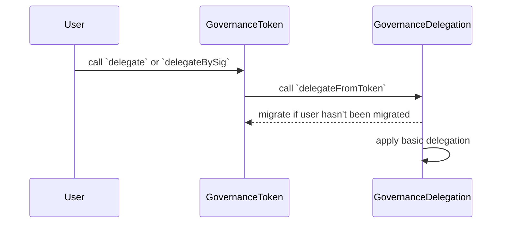

# GovernanceDelegation

<!-- START doctoc generated TOC please keep comment here to allow auto update -->
<!-- DON'T EDIT THIS SECTION, INSTEAD RE-RUN doctoc TO UPDATE -->
**Table of Contents**

- [Overview](#overview)
- [Constants](#constants)
- [Interface](#interface)
  - [Core Functions](#core-functions)
    - [`delegate`](#delegate)
    - [`delegateFromToken`](#delegatefromtoken)
    - [`delegateBatched`](#delegatebatched)
    - [`afterTokenTransfer`](#aftertokentransfer)
    - [`migrateAccounts`](#migrateaccounts)
    - [`_delegate`](#_delegate)
  - [Getters](#getters)
    - [`checkpoints`](#checkpoints)
    - [`numCheckpoints`](#numcheckpoints)
    - [`delegates`](#delegates)
    - [`getVotes`](#getvotes)
    - [`getPastVotes`](#getpastvotes)
    - [`getPastTotalSupply`](#getpasttotalsupply)
    - [`delegations`](#delegations)
  - [Events](#events)
    - [`DelegationCreated`](#delegationcreated)
    - [`DelegateVotesChanged`](#delegatevoteschanged)
- [Storage](#storage)
- [Types](#types)
  - [`Delegation`](#delegation)
  - [`AllowanceType`](#allowancetype)
- [Migration](#migration)
- [Backwards Compatibility](#backwards-compatibility)
- [User Flow](#user-flow)
  - [Partial Delegations](#partial-delegations)
  - [Absolute & Relative Delegations](#absolute--relative-delegations)
  - [Differences](#differences)
- [Delegation Validation](#delegation-validation)
- [Security Considerations](#security-considerations)
  - [Dependence on GovernanceDelegation](#dependence-on-governancedelegation)
  - [Connection with GovernanceToken](#connection-with-governancetoken)

<!-- END doctoc generated TOC please keep comment here to allow auto update -->

## Overview

The `GovernanceDelegation` contract implements advanced delegation for the [`GovernanceToken`](../governance/gov-token.md).
Advanced delegation allows for partial delegations of voting power using absolute or relative amounts. Absolute
delegations are fixed and denominated in the `GovernanceToken`'s decimals, while relative delegations are denominated
in basis points.

By using transfer hooks in the `GovernanceToken`, the `GovernanceDelegation` contract can update the delegation
state and checkpoints after token transfers. This mechanism ensures that any delegations are correctly applied
and that the voting power of users is accurately reflected as token balances change.

## Constants

| Constant          | Value                           | Description |
| ----------------- | ------------------------------- | ----------- |
| Address |  `0x4200000000000000000000000000000000000043` | Predeploy address of `GovernanceDelegation` |
| `MAX_DELEGATIONS` | `20` | The maximum number of delegations allowed based on gas estimates of the worst-case scenario of an unoptimized version of the `_delegate` function |
| `DENOMINATOR` | `10_000` | The denominator used for relative delegations |

## Interface

### Core Functions

#### `delegate`

Delegates voting power to another address (delegatee) with the given delegation parameters. This function
is intended to be called by users that require advanced delegation of the `GovernanceToken`, and overwrites
any existing delegations of the delegator.

```solidity
function delegate(Delegation _delegation) external
```

This function MUST enforce the migration logic, as specified in the [Migration](#migration) section, for `msg.sender`
and the `_delegatee` address in the delegation. Afterwards, the function MUST call the [`_delegate`](#_delegate) function
with the `msg.sender` and `_newDelegations` parameters.

At the end, the `delegate` function MUST emit a `DelegationCreated` event with the given function parameters.

#### `delegateFromToken`

Delegates 100% of the token voting power of an address (delegator) to another address (delegatee), mimicking the behavior
of the `ERC20Votes`'s `delegate` function for backwards compatibility. This function MUST be callable only by the
`GovernanceToken` contract as part of its `delegate` and `delegateBySig` functions, and overwrites
any existing delegations of the delegator.

```solidity
function delegateFromToken(address _delegator, address _delegatee) external
```

This function MUST enforce the migration logic, as specified in the [Migration](#migration) section, for the `_delegator`
and `_delegatee` addresses. Afterwards, the function MUST call the [`_delegate`](#_delegate) function with the `_delegator`
and basic delegation parameters.

At the end, the `delegateFromToken` function MUST emit a `DelegationCreated` event with the given function parameters.

#### `delegateBatched`

Delegates voting power to multiple addresses (delegatees) using the delegation array. This function is intended to be
called by users, and overwrites any existing delegations of the delegator.

```solidity
function delegateBatched(Delegation[] calldata _delegations) external
```

This function MUST enforce the migration logic, as specified in the [Migration](#migration) section, for `msg.sender`
and every delegatee address in the `_delegations` array. Afterwards, the function MUST call the [`_delegate`](#_delegate)
function with the `msg.sender` and `_delegations` parameters.

At the end, the `delegateBatched` function MUST emit a `DelegationCreated` event with the given function parameters.

#### `afterTokenTransfer`

Updates the voting power of two addresses (`_from` and `_to`) after a token transfer. This function MUST only be callable
by the `GovernanceToken` contract.

```solidity
function afterTokenTransfer(address _from, address _to, uint256 _amount) external
```

This function MUST enforce the migration logic, as specified in the [Migration](#migration) section, for the `_from`
and `_to` addresses.

If the token transfer is due to a mint or burn operation, the function MUST update the total supply checkpoints with
the new total supply (subtracting `_amount` for a burn operation and adding `_amount` for a mint operation). Afterwards,
the function MUST calculate and update the voting power of the delegations of `_from` and `_to`. This step MUST apply
the voting power adjustments to the checkpoints of the `_from`, `_to`, and delegatee addresses.

#### `migrateAccounts`

Migrates the delegation state of the given accounts from the `GovernanceToken` to the `GovernanceDelegation` contract. This
function MUST iterate over the list of `_accounts` addresses and apply the logic specified in the
[Migration](#migration) section.

```solidity
function migrateAccounts(address[] calldata _accounts) external
```

#### `_delegate`

Delegates voting power from the `_delegator` to the specified delegates in `_newDelegations`. This function MUST
override any existing delegations of `_delegator`.

```solidity
function _delegate(address _delegator, Delegation[] memory _newDelegations) internal virtual
```

The `_delegate` function MUST first check that the length of `_newDelegations` does not exceed `MAX_DELEGATIONS`.
Then, it MUST calculate the voting power of all active delegations of the `_delegator`, and calculate the voting
power adjustments for the new delegatee set using `_newDelegations`. Afterwards, the function MUST update
the voting power of the current and new set of delegatees.

The function MUST then sort the new delegatee set in descending order, and store the delegations as part of the
`_delegations` mapping. While sorting, the function MUST check for the validity of the delegations, as specified
in the [Delegation Validation](#delegation-validation) section. Additionally, the function MUST emit a
`DelegateVotesChanged` event for each change in delegatee voting power.

### Getters

For backwards compatibility, the `GovernanceDelegation` contract MUST implement all public getter functions of the
`GovernanceToken` related to delegation and voting power.

#### `checkpoints`

Retrieves the checkpoints for a given user address.

```solidity
function checkpoints(address _account) external view returns (ERC20Votes.Checkpoint[] memory)
```

#### `numCheckpoints`

Retrieves the number checkpoints for a given user address.

```solidity
function numCheckpoints(address _account) external view returns (uint32)
```

#### `delegates`

Retrieves the delegation of a given user address with the highest voting power.

```solidity
function delegates(address _account) external view returns (address)
```

#### `getVotes`

Retrieves the voting power of a given user address.

```solidity
function getVotes(address _account) external view returns (uint256)
```

#### `getPastVotes`

Retrieves the voting power of a given user address at a block.

```solidity
function getPastVotes(address _account, uint256 _blockNumber) external view returns (uint256)
```

#### `getPastTotalSupply`

Retrieves the total supply of the `GovernanceToken` at a given block.

```solidity
function getPastTotalSupply(uint256 _blockNumber) external view returns (uint256)
```

#### `delegations`

Retrieves the delegations of a given user address sorted in descending order by voting power.

```solidity
function delegations(address _account) public view returns (Delegation[] memory)
```

### Events

#### `DelegationCreated`

MUST trigger when an account delegates voting power to one or more addresses (delegatees).

```solidity
event DelegationCreated(address indexed account, Delegation[] delegations);
```

#### `DelegateVotesChanged`

MUST trigger every time the voting power of a user changes, including when a token transfer occurs or when a
delegation is created.

```solidity
event DelegateVotesChanged(address indexed delegatee, uint256 previousBalance, uint256 newBalance)
```

## Storage

The `GovernanceDelegation` contract MUST be able to store delegations and checkpoints. These storage variables MUST be
defined as in the `GovernanceToken` and use the same types:

```solidity
// Voting power delegations of an account.
mapping(address => Delegation[]) public delegations;

// Checkpoints of voting power for an account.
mapping(address => ERC20Votes.Checkpoint[]) internal _checkpoints;

// Total supply checkpoints of the GovernanceToken.
ERC20Votes.Checkpoint[] internal _totalSupplyCheckpoints;
```

## Types

The `GovernanceDelegation` contract MUST define the following types:

### `Delegation`

`Delegation` defines the parameters for voting power delegations, encapsulated in the following struct:

```solidity
struct Delegation {
  AllowanceType allowanceType;
  address delegatee;
  uint256 amount;
}
```

| Name                     | Type            | Description                                                             |
|--------------------------|-----------------|-------------------------------------------------------------------------|
| `allowanceType`          | `AllowanceType` | Type of allowance (e.g., absolute or relative).                         |
| `delegatee`              | `address`       | The address of the delegatee receiving the voting power.                |
| `amount`                 | `uint256`       | Amount of votes delegated, denomination depending on `allowanceType`.   |

### `AllowanceType`

Delegations can either be absolute or relative, represented by the following:

```solidity
enum AllowanceType {
  Absolute,
  Relative
}
```

| Name        | Number | Description                                                                                 |
|-------------|--------|---------------------------------------------------------------------------------------------|
| `Absolute`  | `0`    | The amount of votes delegated is fixed and denominated in the `GovernanceToken`'s decimals  |
| `Relative`  | `1`    | The amount of votes delegated is relative and denominated in percentages.                   |

## Migration

Functions that create or update delegations MUST check that the delegator and new delegatees have been migrated from
the `GovernanceToken`. If a user has not been migrated, the `GovernanceDelegation` MUST copy the delegation and
checkpoint data from the token contract to its own state. After copying the data, the `GovernanceDelegation` MUST clear
its state in the `GovernanceToken` contract.

The `GovernanceDelegation` MUST enforce the following invariants for the migration logic:

1. A user MUST NOT have an active delegation in both `GovernanceToken` and `GovernanceDelegation` at the same time.
A delegation to address(0) is not considered an active delegation.
2. The sum of the voting power of all advance delegations of a user MUST NOT exceed the total voting power of the user.
3. The sum of the voting power a user receives from delegations in the `GovernanceDelegation` and the `GovernanceToken`
MUST NOT be double counted.

## Backwards Compatibility

The `GovernanceDelegation` contract ensures backwards compatibility by allowing the migration of delegation state from the
`GovernanceToken`, and implementing the same type of getter functions. External contracts that need to consume voting power
data, like the `Governor`, will have to query the legacy state in the `GovernanceToken` if a user has not been migrated,
or the up-to-date state in the `GovernanceDelegation` if the user has been migrated.

## User Flow

The following sections highlight the use cases that MUST be supported by the `GovernanceDelegation`, and the difference
for basic delegations made from the `GovernanceToken` contract.

### Partial Delegations

Users MUST be able to perform partial delegations of their voting power to another address. This must be supported for
both absolute and relative amounts.

### Absolute & Relative Delegations

Users MUST be able to delegate their voting power to another address with an absolute or relative amount.

### Differences

The main difference for delegations made from the `GovernanceToken` contract is that basic delegations are encapsulated in
a [`Delegation`](#delegation) struct and forwarded to the `GovernanceDelegation` contract. Basic delegation can be achieved
with a `Delegation` such as:

```solidity
Delegation({
  delegatee: ...,
  allowanceType: AllowanceType.Relative,
  allowance: 10e4 // 100%
})
```

The following diagram shows the sequence of a basic delegation performed from the `GovernanceToken` contract.



## Delegation Validation

When applying a new delegation set as part of the [`_delegate`](#_delegate) function, the `GovernanceDelegation` MUST check
that:

- The length of the `_newDelegations` array DOES NOT exceed `MAX_DELEGATIONS`.
- The sum of `amount` in relative delegations DOES NOT exceed the `DENOMINATOR`, and each `amount` is greater than 0.
- The sum of `amount` in absolute delegations DOES NOT exceed the total voting power of the `_delegator`.
- The new delegatee set is sorted in descending order by voting power.
- If a delegation set includes both absolute and relative delegations, the relative delegations MUST be applied first and
  the absolute delegations second with the remaining voting power. Therefore, the remaining voting power MUST be greater
  than or equal than the sum of the absolute delegations.

If any of the above conditions are not met, the `_delegate` function MUST revert with a specific error message.

## Security Considerations

### Dependence on GovernanceDelegation

As the `GovernanceToken` depends on the `GovernanceDelegation` contract, the `GovernanceDelegation` contract MUST be implemented
so that it minimizes the risk of unexpected reverts during the transfer hook call. If the `GovernanceDelegation` contract
reverts, `GovernanceToken` transfers will be blocked.

### Connection with GovernanceToken

Similarly, the `GovernanceDelegation` MUST always process token transfers from the `GovernanceToken` contract correctly to
stay in sync with token balances. If the `GovernanceDelegation` contract is not in sync with the `GovernanceToken` contract,
the voting power of users MAY be incorrect or outdated.
