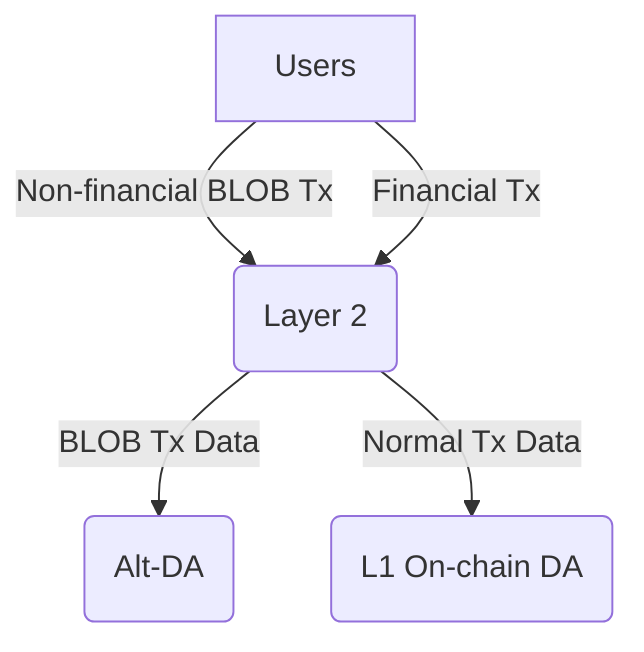

# L2 BLOB Transaction

<!-- START doctoc generated TOC please keep comment here to allow auto update -->
<!-- DON'T EDIT THIS SECTION, INSTEAD RE-RUN doctoc TO UPDATE -->
**Table of Contents**

- [Overview](#overview)

<!-- END doctoc generated TOC please keep comment here to allow auto update -->

## Overview

The Ethereum Cancun upgrade has significantly reduced Layer 2 data uploading costs by introducing BLOB transaction to Layer 1. This innovation has also enabled a variety of applications based on the BLOBs due to their low cost, such as [blob.fm](https://blob.fm/), [Ethstorage](https://ethstorage.io), and [Ethscriptions](https://ethscriptions.com/). However, while the data upload costs are now lower, the execution costs remain high compared to Layer 2. This presents challenges for state proposals on Layer 2 and for non-financial applications that rely on BLOBs, which still face relatively high costs.

The goal of this specification is to add BLOB transaction support to the OP Stack. This would allow Layer 3 solutions, which settle on Layer 2, to have an enshrined data availability (DA) layer that they can use directly, without needing to integrate third-party DA providers or deal with the security risks associated with DA bridges. Additionally, the applications mentioned above could migrate to Layer 2 with minimal costs.

Furthermore, this spec proposes adding an option to use [Alt-DA]((https://github.com/ethereum-optimism/specs/blob/main/specs/experimental/alt-da.md)) (or off-chain DA) to support BLOB transactions, while still allowing Layer 1 DA (or on-chain DA) for calldata. This would result in three possible configurations for a Layer 2:

1.	Both the calldata and BLOBs use on-chain DA.
2.	Both the calldata and BLOBs use Alt-DA.
3.	Calldata uses Layer 1 on-chain DA, while BLOBs use Alt-DA.

The third option, referred to as a “hybrid Layer 2”, combines the best features of different DA solutions. This allows users and applications to choose between on-chain and off-chain data availability for different types of transactions within the same network. Specifically, users can upload and store non-financial data at a very low cost using off-chain DA, while still conducting critical financial transactions using on-chain DA. In some cases, these two types of transactions may even occur within the same application. For example, users might use a platform like Twitter primarily for social networking, while also sending payments to other users.

The following diagram illustrates the transaction data flow for a hybrid Layer 2:

## Data Uploading

## BLOB Gas Cost

## Derivation

## Fault Proof

## Safety and Finality