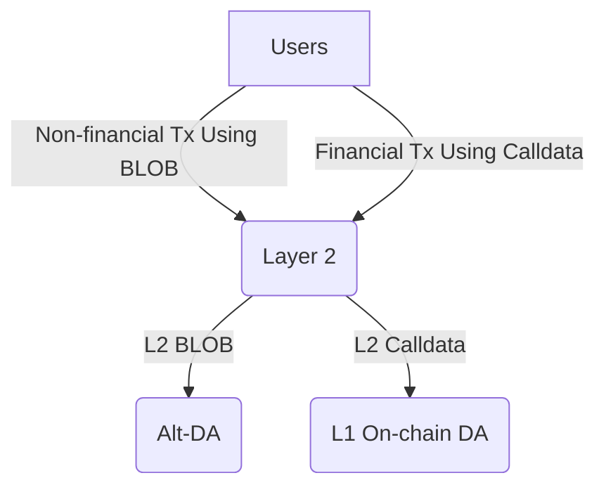

# L2 BLOB Transaction

<!-- START doctoc generated TOC please keep comment here to allow auto update -->
<!-- DON'T EDIT THIS SECTION, INSTEAD RE-RUN doctoc TO UPDATE -->
**Table of Contents**

- [Overview](#overview)
- [Enable BLOB Transacion in EL](#enable-blob-transacion-in-el)
- [Uploading BLOB to Alt-DA](#uploading-blob-to-alt-da)
- [DataAavaliblityChallenage Contract](#dataaavaliblitychallenage-contract)
- [BLOB Gas Cost](#blob-gas-cost)
- [Derivation](#derivation)
- [Fault Proof](#fault-proof)
  - [`l2-blob <commitment>`](#l2-blob-commitment)
  - [`l1-challenge-status <commitment> <blocknumber>`](#l1-challenge-status-commitment-blocknumber)

<!-- END doctoc generated TOC please keep comment here to allow auto update -->

## Overview

The Ethereum Cancun upgrade has significantly reduced Layer 2 data uploading costs by introducing BLOB transaction to Layer 1. This innovation has also enabled a variety of applications based on the BLOBs due to their low cost, such as [blob.fm](https://blob.fm/), [Ethstorage](https://ethstorage.io), and [Ethscriptions](https://ethscriptions.com/). However, while the data upload costs are now lower, the execution costs remain high compared to Layer 2. This presents challenges for state proposals on Layer 2 and for non-financial applications that rely on BLOBs, which still face relatively high costs.

The goal of this specification is to add BLOB transaction support to the OP Stack. This would allow Layer 3 solutions, which settle on Layer 2, to have an enshrined data availability (DA) layer that they can use directly, without needing to integrate third-party DA providers or deal with the security risks associated with DA bridges. Additionally, the applications mentioned above could migrate to Layer 2 with minimal costs.

Furthermore, this spec proposes adding an option to use [Alt-DA]((https://github.com/ethereum-optimism/specs/blob/main/specs/experimental/alt-da.md)) (or off-chain DA) to support BLOB transactions, while still allowing Layer 1 DA (or on-chain DA) for calldata. This would result in three possible configurations for a Layer 2:

1.	Both the calldata and BLOBs use on-chain DA.
2.	Both the calldata and BLOBs use Alt-DA.
3.	Calldata uses Layer 1 on-chain DA, while BLOBs use Alt-DA.

The third option, referred to as a “hybrid Layer 2”, combines the best features of different DA solutions. This allows users and applications to choose between on-chain and off-chain data availability for different types of transactions within the same network. Specifically, users can upload and store non-financial data at a very low cost using off-chain DA, while still conducting critical financial transactions using on-chain DA. In some cases, these two types of transactions may even occur within the same application. For example, users might use a platform like Twitter primarily for social networking, while also sending payments to other users.

The following diagram illustrates the transaction data flow for a hybrid Layer 2:


## Enable BLOB Transacion in EL
The interface and implematation should keep the same as the corresponding Layer 1 EL so that the application can be migrated seamlessly. Please note that while BLOBs are gossiping in the L1 P2P network, for an enshined BLOB DA support, the BLOBs should be sent to the sequencer directly on the layer2.

## Uploading BLOB to Alt-DA
The sequencer have the responsbility of uploading the BLOBs to a DA layer. When the CL (op-node) receives payload from EL through engine API, they should open the envelope to see if there are any `BlobsBundle` and upload them to Alt-DA. Only make sure the BLOBs are uploaded successfully, the sequencer can upload the block data to the on-chain DA. As the same as the Alt-DA, the sequecenr may want to response to any data avalibity challenage afterwards.

## DataAavaliblityChallenage Contract
Any third party including the full nodes which are actively derivating the L1 data may found they can't request the data correpsonding the data hash included in the BLOB transaction, they can initilize a data challendage, the whole workflow should most likely be the same as Alt-DA [here](https://github.com/ethstorage/specs/blob/l2-blob/specs/experimental/alt-da.md#data-availability-challenge-contract).

Note that since the data hash included in the BLOB transaction is [VersionedHash](https://github.com/ethereum/EIPs/blob/master/EIPS/eip-4844.md#helpers) instead of Keccak256 hash, we need to use it as the commitment when doing BLOB uploading/downloading and challenaging/resoling. So we need to add an CommitmentType in the DataAvailabilityChallenge contract:

```solidity
enum CommitmentType {
    Keccak256,
    VersionedHash
}
```
And also add a new resolve function in the contract:

```solidity
function resolve(
    uint256 challengedBlockNumber,
    bytes calldata challengedCommitment,
)
```
This new resolve function SHOULD use Layer 1 BLOB transaction to upload the BLOB and then use EIP-4844 blobhash() opcode to obtained the `versionedhash` of the BLOB.

## BLOB Gas Cost
According to EIP-4844 spec, the BLOBs must be kept for at least [MIN_EPOCHS_FOR_BLOB_SIDECARS_REQUESTS](https://github.com/ethereum/consensus-specs/blob/4de1d156c78b555421b72d6067c73b614ab55584/configs/mainnet.yaml#L148) epochs, which is around 18 days. We can then calcuate the Cap of disk requirement will be `BLOB_SIZE * MAX_BLOB_PER_BLOCK / BLOCK_TIME * MIN_EPOCHS_FOR_BLOB_SIDECARS_REQUESTS * SECONDS_PER_EPOCH`, assume the `MAX_BLOB_PER_BLOCK = 6` and `BLOCK_TIME = 2`, the CAP will be around 618 GB.

To serve the data challenage purpose, we can even lower disk requirement. According to the Alt-DA [spec](https://github.com/ethereum-optimism/specs/blob/main/specs/experimental/alt-da.md#data-availability-challenge-contract), we only need to keep the data avaliable in `challengeWindow + resolveWindow`. Suppose both of them are 3600 seconds (Redstone mainnet [config](https://etherscan.io/address/0x97a2da87d3439b172e6dd027220e01c9cb565b80#readProxyContract)), the disk reqirement will be around 2.8 GB.

Since those disk requirement are affordable for an commodity computer, the cost of stroing those data are costant and miniual comparing to the L1 data uploading cost, we can cover the cost by adjust the L1 attribute `blobBaseFeeScalar` value.

## Derivation
The most derivation and re-org logic should be the same as Alt-DA, except that when the op-node download a batch, they need to track the challenage and resolve status for the BLOB hashes included in the batch. If there are some BLOBs being chanllegged and failed to be resolved, the op-node SHOULD throw an `ResetError` to trigger an re-org, and then the op-node will return to an older finilized block to derive the block again, when op-node derive the block include the expired BLOB hash, it will delete the corresponding transaction that contains this hash in the block, and pass the rest of block data into EL.

## Fault Proof
The derivation pipeline is integrated with fault proofs by adding additional hint types to the
preimage oracle in order to query the input data from the DA provider as well as onchain challenge status.

### `l2-blob <commitment>`

The input data stored on the DA storage for the given `<commitment>`.

### `l1-challenge-status <commitment> <blocknumber>`

The status of the challenge for the given `<commitment>` at the given `<blocknumber>` on the L1
DataAvailabilityChallenge contract.