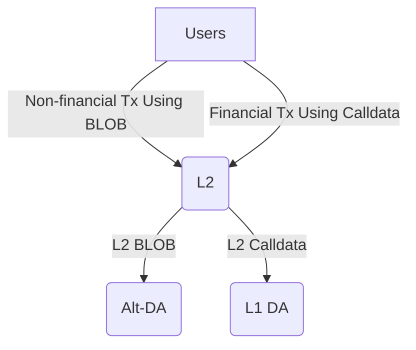

# L2 BLOB Transaction

<!-- START doctoc generated TOC please keep comment here to allow auto update -->
<!-- DON'T EDIT THIS SECTION, INSTEAD RE-RUN doctoc TO UPDATE -->
**Table of Contents**

- [Overview](#overview)
- [Enabling BLOB Transactions in L2 EL](#enabling-blob-transactions-in-l2-el)
- [Uploading BLOB to Alt-DA](#uploading-blob-to-alt-da)
- [Data Availability Challenge](#data-availability-challenge)
- [Storage Requirement and BLOB Gas Cost](#storage-requirement-and-blob-gas-cost)
- [Derivation](#derivation)
- [Fault Proof](#fault-proof)
  - [`l2-blob <commitment>`](#l2-blob-commitment)
  - [`l1-l2blob-challenge-status <commitment> <blocknumber>`](#l1-l2blob-challenge-status-commitment-blocknumber)

<!-- END doctoc generated TOC please keep comment here to allow auto update -->

## Overview

The Ethereum Cancun upgrade has significantly reduced Layer 2 (L2) data uploading costs by introducing BLOB
transactions to Layer 1 (L1). This innovation has also enabled a variety of additional applications based on
the BLOBs due to their low cost, such as [blob.fm](https://blob.fm/), [EthStorage](https://ethstorage.io), and
[Ethscriptions](https://ethscriptions.com/). However, while the data upload costs have decreased, the execution
costs on L1 remain high compared to L2, leading to high costs for L2 state proposals and non-financial applications
that rely on BLOBs.

The goal of this specification is to **support L2 BLOB transactions in the OP Stack**. This would allow L3 solutions,
which settle on L2, to have an enshrined 4844-compatiable DA layer that they can use directly, without needing to
integrate third-party DA providers or deal with the security risks associated with DA bridges. Additionally, the
applications mentioned above could migrate to L2 with minimal costs.

Furthermore, this spec proposes adding an option to use
[Alt-DA](https://github.com/ethereum-optimism/specs/blob/main/specs/experimental/alt-da.md) to upload L2 BLOBs, while
still allowing the use of L1 DA to upload L2 calldata. This would result in three possible DA configurations
for an L2:

1. Both the calldata and BLOBs in L2 use L1 DA.
2. Both the calldata and BLOBs in L2 use Alt-DA.
3. L2 calldata uses L1 DA, while L2 BLOBs use Alt-DA.

The third option, referred to as a “hybrid DA L2”, combines the best features of different DA solutions. This allows
users and applications of an L2 to choose between L1 DA and alt-DA for different types of transaction data within the
same network, without the need to maintain multiple L2s. Specifically, users can upload and store non-financial data
at a very low cost using L2 BLOBs and Alt-DA, while still conducting critical financial data using L2 calldata and
L1 DA. In some cases, these two types of data may even occur within the same transaction. Here are a few potential
scenarios:

- While the Optimism mainnet continues to use L1 DA for uploading calldata, multiple app-specific or game-focused
L3s settled on it can directly use the enshrined 4844-compatible L2 DA layer, benefiting from easy integration, robust
security, and lower costs.
- Users might use a platform like Decentralized Twitter primarily for social networking (non-financial), while
also sending payments (financial) to other users within the same application.

The following diagram illustrates the transaction data flow for a hybrid DA L2:



## Enabling BLOB Transactions in L2 EL

The interface and implementation of L2 EL should remain consistent with L1 EL to ensure seamless migration of
applications. Note that while BLOBs are gossiped within the L1 P2P network, for enshrined BLOB DA support in L2, the
BLOBs should be sent directly to the L2 sequencer.

## Uploading BLOB to Alt-DA

For the hybrid DA L2 case, the sequencer is responsible for uploading BLOBs to the Alt-DA layer. When the
CL (op-node) receives the payload from EL via the engine API, it should inspect the envelope for any `BlobsBundle`
and upload them to the Alt-DA. Only after ensuring successful BLOB uploads can the sequencer upload the block data
to the L1 DA. Similarly, the sequencer may need to respond to any data availability challenges afterward.

## Data Availability Challenge

Any third party, including full nodes deriving L2 data, might find they cannot access the BLOB corresponding to
the hash included in the BLOB transaction. In this case, they can initiate a data availability challenge. The
workflow will largely follow the Alt-DA process outlined
[here](https://github.com/ethstorage/specs/blob/l2-blob/specs/experimental/alt-da.md#data-availability-challenge-contract).

We will reuse the [DataAvailabilityChallenge][1] contract with minimal modification. First, since the BLOB hash in the BLOB
transaction is a
[VersionedHash](https://github.com/ethereum/EIPs/blob/master/EIPS/eip-4844.md#helpers)
instead of a Keccak256 hash, we need to use the version hash as the commitment for BLOB uploading/downloading and
during challenge resolution. Therefore, we will add a CommitmentType to the DataAvailabilityChallenge contract:

```solidity
enum CommitmentType {
    Keccak256,
    Generic,
    VersionedHash
}
```

Additionally, a new challenge and resolve function should be added to the contract:

```solidity
function challengeL2BLOB(
    uint256 challengedOriginBlockNumber, 
    bytes calldata challengedCommitment
) external payable

function resolveL2BLOB(
    uint256 challengedOriginBlockNumber, 
    bytes calldata challengedCommitment,
)
```

This new resolve function should use a L1 BLOB transaction to upload the BLOB, then employ the EIP-4844 `blobhash()`
opcode to obtain the `versionedhash` of the BLOB.

Note that the parameter `challengedOriginBlockNumber` in both the new challenge and resolve functions refers to the
original L1 block number corresponding to the L2 block containing the BLOB being challenged. This change also requires
that the `challenge_window` must be larger than the `sequence_window` to prevent cases where the challenge window has
already passed by the time the sequencer submits the batch on L1

[1]: https://github.com/ethereum-optimism/optimism/blob/develop/packages/contracts-bedrock/src/L1/DataAvailabilityChallenge.sol

## Storage Requirement and BLOB Gas Cost

According to the EIP-4844 specification, BLOBs must be kept for at least
[MIN_EPOCHS_FOR_BLOB_SIDECARS_REQUESTS][2]
epochs, which is around 18 days. The storage upper limit can be calculated using the formula:
`BLOB_SIZE * MAX_BLOB_PER_BLOCK / BLOCK_TIME * MIN_EPOCHS_FOR_BLOB_SIDECARS_REQUESTS * SECONDS_PER_EPOCH`.
Assuming `MAX_BLOB_PER_BLOCK = 6` and `BLOCK_TIME = 2`, the upper limit is approximately 618 GB.

To serve data challenge purposes, we can reduce disk requirements even further. According to the Alt-DA
[specification][3], data only needs to be available for `l2blobChallengeWindow + l2blobResolveWindow`.
If `l2blobChallengeWindow` is 43200 seconds and `l2blobResolveWindow` is 3600 seconds, the disk requirement
will be around 17 GB.

These storage requirements are manageable for a commodity computer, and the cost of storing the data is minimal
compared to L1 data upload costs. This cost can be covered by adjusting the L1 `blobBaseFeeScalar` value.

[2]: https://github.com/ethereum/consensus-specs/blob/4de1d156c78b555421b72d6067c73b614ab55584/configs/mainnet.yaml#L148
[3]: https://github.com/ethereum-optimism/specs/blob/main/specs/experimental/alt-da.md#data-availability-challenge-contract

## Derivation

Most of the derivation and reorg logic remains consistent with Alt-DA. However, instead of invalidating the entire
batch of the challenged origin, only the transaction containing the BLOB that is challenged and fails to be resolved
will be deleted. The basic workflow is as follows:

1. When the op-node derives a batch from the `BatchQueue`, it collects all the BLOB commitments included in the batch.
2. It tracks the challenge and resolution status for the collected BLOB hashes. If some BLOBs are challenged and fail
to be resolved, the op-node should trigger a `ResetError` to initiate a reorg.
3. If a reorg is triggered, the op-node will revert to an older block and rederive the chain. Upon encountering a
block containing the expired BLOB hash, it will remove the corresponding transaction and pass the remaining block
data to the EL.

## Fault Proof

The derivation pipeline integrates with fault proofs by adding additional hint types to the preimage oracle to query
input data from the DA provider and the on-chain challenge status.

### `l2-blob <commitment>`

Retrieves BLOB data stored on the DA provider for the given `<commitment>`.

### `l1-l2blob-challenge-status <commitment> <blocknumber>`

Retrieves the challenge status for the given `<commitment>` at the specified `<blocknumber>` on the L1
DataAvailabilityChallenge contract.
