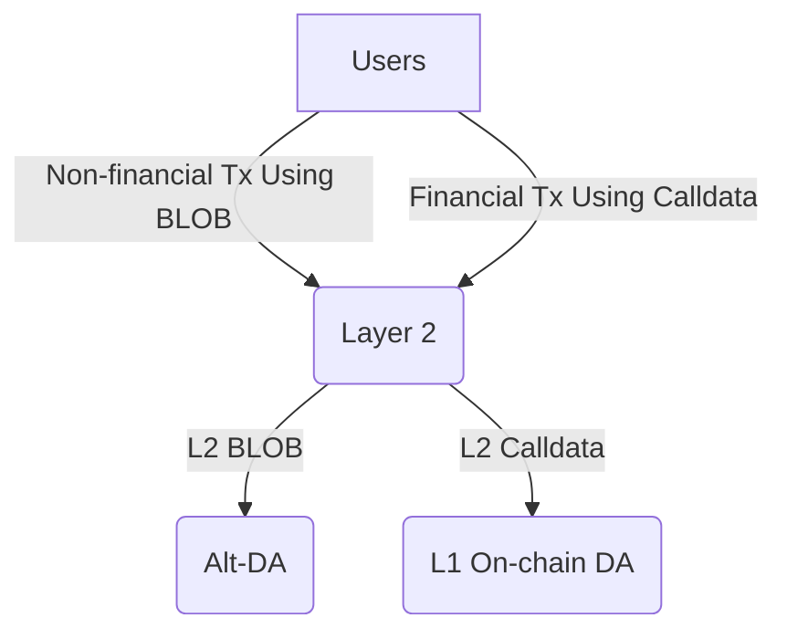

# L2 BLOB Transaction

<!-- START doctoc generated TOC please keep comment here to allow auto update -->
<!-- DON'T EDIT THIS SECTION, INSTEAD RE-RUN doctoc TO UPDATE -->
**Table of Contents**

- [Overview](#overview)
- [Enable BLOB Transacion in EL](#enable-blob-transacion-in-el)
- [Uploading BLOB to Alt-DA](#uploading-blob-to-alt-da)
- [DataAavaliblityChallenage Contract](#dataaavaliblitychallenage-contract)
- [BLOB Gas Cost](#blob-gas-cost)
- [Derivation](#derivation)
- [Fault Proof](#fault-proof)
  - [`l2-blob <commitment>`](#l2-blob-commitment)
  - [`l1-challenge-status <commitment> <blocknumber>`](#l1-challenge-status-commitment-blocknumber)

<!-- END doctoc generated TOC please keep comment here to allow auto update -->

## Overview

The Ethereum Cancun upgrade has significantly reduced Layer 2 data uploading costs by introducing BLOB transaction to Layer 1. This innovation has also enabled a variety of applications based on the BLOBs due to their low cost, such as [blob.fm](https://blob.fm/), [Ethstorage](https://ethstorage.io), and [Ethscriptions](https://ethscriptions.com/). However, while the data upload costs are now lower, the execution costs remain high compared to Layer 2. This presents challenges for state proposals on Layer 2 and for non-financial applications that rely on BLOBs, which still face relatively high costs.

The goal of this specification is to support L2 BLOB transaction in the OP Stack. This would allow Layer 3 solutions, which settle on Layer 2, to have an enshrined 4844-compatiable DA layer that they can use directly, without needing to integrate third-party DA providers or deal with the security risks associated with DA bridges. Additionally, the applications mentioned above could migrate to Layer 2 with minimal costs.

Furthermore, this spec proposes adding an option to use [Alt-DA]((https://github.com/ethereum-optimism/specs/blob/main/specs/experimental/alt-da.md)) to support L2 BLOB transactions, while still allowing L1 DA (or on-chain DA) for calldata. This would result in three possible configurations for a L2:

1.	Both the calldata and BLOBs in L2 use on-chain DA.
2.	Both the calldata and BLOBs in L2 use Alt-DA.
3.	L2 Calldata uses L1 on-chain DA, while L2 BLOBs use Alt-DA.

The third option, referred to as a “hybrid DA Layer 2”, combines the best features of different DA solutions. This allows users and applications to choose between on-chain and alt DA for different types of transactions within the same network. Specifically, users can upload and store non-financial data at a very low cost using Alt-DA, while still conducting critical financial transactions using on-chain DA. In some cases, these two types of transactions may even occur within the same application. For example, users might use a platform like Twitter primarily for social networking, while also sending payments to other users.

The following diagram illustrates the transaction data flow for a hybrid Layer 2:


## Enabling BLOB Transactions in EL
The interface and implementation should remain consistent with Layer 1 EL to ensure seamless migration of applications. Note that while BLOBs are gossiped within the L1 P2P network, for enshrined BLOB DA support in Layer 2, the BLOBs should be sent directly to the Layer 2 sequencer.

## Uploading BLOB to Alt-DA
The sequencer is responsible for uploading BLOBs to a DA layer. When the CL (op-node) receives the payload from EL via the engine API, it should inspect the envelope for any `BlobsBundle` and upload them to Alt-DA. Only after ensuring successful BLOB uploads can the sequencer upload the block data to the on-chain DA. Similarly, the sequencer may need to respond to any data availability challenges afterward.

## DataAavaliblityChallenage Contract
Any third party, including full nodes deriving L1 data, might find they cannot access the data corresponding to the hash included in the BLOB transaction. In this case, they can initiate a data availability challenge. The workflow will largely follow the Alt-DA process outlined [here](https://github.com/ethstorage/specs/blob/l2-blob/specs/experimental/alt-da.md#data-availability-challenge-contract).

Since the data hash in the BLOB transaction is a [VersionedHash](https://github.com/ethereum/EIPs/blob/master/EIPS/eip-4844.md#helpers) instead of a Keccak256 hash, we need to use this as the commitment for BLOB uploading/downloading and during challenge resolution. Therefore, we need to add a CommitmentType to the DataAvailabilityChallenge contract:

```solidity
enum CommitmentType {
    Keccak256,
    VersionedHash
}
```
Additionally, a new resolve function should be added to the contract:

```solidity
function resolve(
    uint256 challengedBlockNumber,
    bytes calldata challengedCommitment,
)
```
This new resolve function should use a Layer 1 BLOB transaction to upload the BLOB, then employ the EIP-4844 blobhash() opcode to obtain the `versionedhash` of the BLOB.

## BLOB Gas Cost
According to the EIP-4844 specification, BLOBs must be kept for at least [MIN_EPOCHS_FOR_BLOB_SIDECARS_REQUESTS](https://github.com/ethereum/consensus-specs/blob/4de1d156c78b555421b72d6067c73b614ab55584/configs/mainnet.yaml#L148) epochs, which is around 18 days. The storage upper limit can be calculated using the formula: `BLOB_SIZE * MAX_BLOB_PER_BLOCK / BLOCK_TIME * MIN_EPOCHS_FOR_BLOB_SIDECARS_REQUESTS * SECONDS_PER_EPOCH`. Assuming `MAX_BLOB_PER_BLOCK = 6` and `BLOCK_TIME = 2`, the upper limit is approximately 618 GB.

To serve data challenge purposes, we can reduce disk requirements even further. According to the Alt-DA [specification](https://github.com/ethereum-optimism/specs/blob/main/specs/experimental/alt-da.md#data-availability-challenge-contract), data only needs to be available for `challengeWindow + resolveWindow`. If both are 3600 seconds (as in the Redstone mainnet [configuration](https://etherscan.io/address/0x97a2da87d3439b172e6dd027220e01c9cb565b80#readProxyContract)), the disk requirement will be around 2.8 GB.

These storage requirements are manageable for a commodity computer, and the cost of storing the data is minimal compared to L1 data upload costs. This cost can be covered by adjusting the L1 `blobBaseFeeScalar` value.

## Derivation
Most of the derivation and reorg logic remains consistent with Alt-DA. However, instead of invalidating the entire batch, only the transaction containing the BLOB that is challenged and fails to be resolved will be deleted. The basic workflow is as follows:

1. When the op-node derives a batch from the `BatchQueue`, it collects all the BLOB commitments included in the batch.
2. It tracks the challenge and resolution status for the collected BLOB hashes. If some BLOBs are challenged and fail to be resolved, the op-node should trigger a `ResetError` to initiate a reorg.
3. If a reorg is triggered, the op-node will revert to an older block and rederive the chain. Upon encountering a block containing the expired BLOB hash, it will remove the corresponding transaction and pass the remaining block data to the EL.

## Fault Proof
The derivation pipeline integrates with fault proofs by adding additional hint types to the preimage oracle to query input data from the DA provider and the on-chain challenge status.

### `l2-blob <commitment>`

Retrieves BLOB data stored on the DA provider for the given `<commitment>`.

### `l1-challenge-status <commitment> <blocknumber>`

Retrieves the challenge status for the given `<commitment>` at the specified `<blocknumber>` on the L1 DataAvailabilityChallenge contract.