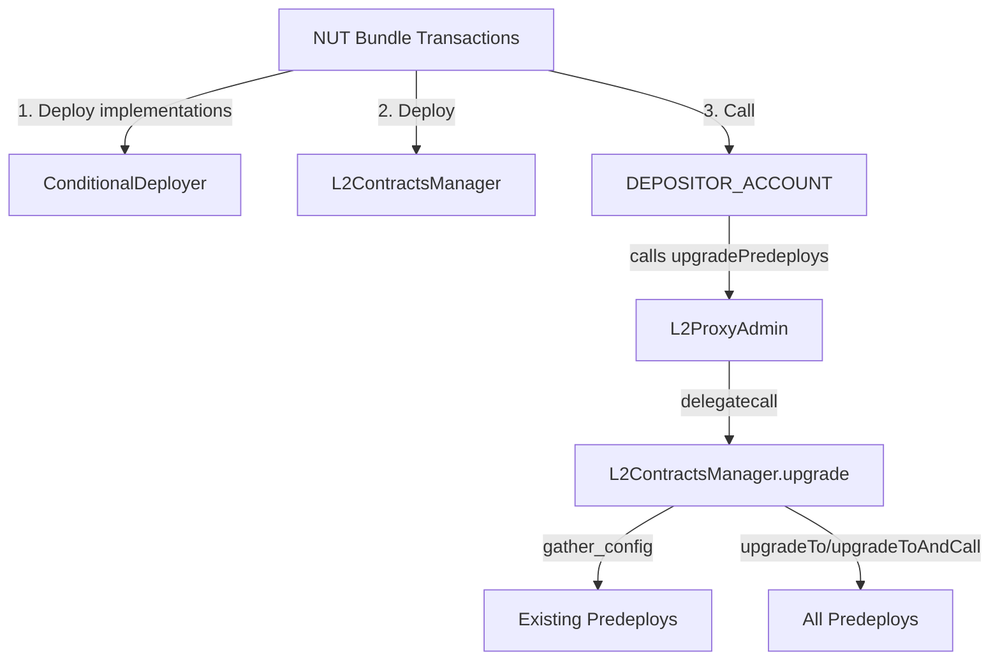

# L2ContractsManager

<!-- START doctoc generated TOC please keep comment here to allow auto update -->
<!-- DON'T EDIT THIS SECTION, INSTEAD RE-RUN doctoc TO UPDATE -->

- [Summary](#summary)
- [Upgrade Flow](#upgrade-flow)
- [Definitions](#definitions)
  - [NUT Bundle](#nut-bundle)
  - [Hard Fork Activation Block](#hard-fork-activation-block)
  - [Predeploys Config](#predeploys-config)
- [Assumptions](#assumptions)
  - [A-01: Addresses for implementations are properly calculated](#a-01-addresses-for-implementations-are-properly-calculated)
  - [A-02: Execution of the `upgrade` function is performed in `L2ProxyAdmin's` context](#a-02-execution-of-the-upgrade-function-is-performed-in-l2proxyadmins-context)
  - [A-03: Sufficient gas is available for the upgrade process](#a-03-sufficient-gas-is-available-for-the-upgrade-process)
  - [A-04: All predeploys use ERC1967 proxy pattern](#a-04-all-predeploys-use-erc1967-proxy-pattern)
- [Invariants](#invariants)
- [Functions](#functions)
  - [`upgrade`](#upgrade)
    - [Behavior](#behavior)
- [Security Considerations](#security-considerations)

<!-- END doctoc generated TOC please keep comment here to allow auto update -->

## Summary

A contract responsible for orchestrating the upgrade of all the supported predeploys for a given hard fork. Contains the logic necessary to perform the upgrades and any additional work they might need for the correct setup. The base upgrade logic lives in an abstract contract that MUST be inherited. Given that each hard fork may require different upgrade logic or different configuration handling, a new `L2ContractsManager` is deployed for each hard fork. The manager is deployed as part of the NUT bundle for the target hard fork, ensuring that the upgrade logic is versioned and tied to what the specific hard fork requires.

The `upgrade()` function is the only function in the public interface of the manager. The manager itself is not a privileged contract and the process relies on the `L2ProxyAdmin` properly calling the `upgrade()` function via a `delegatecall`.

Implementation addresses for predeploys are determined by the deterministic deployment process using the `ConditionalDeployer` contract. These implementations are deployed in the NUT bundle before the `L2ContractsManager` is invoked. If a contract’s bytecode is unchanged, its implementation address will be unchanged, ensuring deterministic behavior across upgrades.

This contract supports dev feature flags and MUST upgrade predeploys to the correct implementation based on the enabled feature flags when executed in alphanets or testing environments.

## Upgrade Flow



1. Implementation contracts are deployed via the `ConditionalDeployer` contract using the NUT bundle, ensuring deterministic addresses.
2. The `L2ContractsManager` is deployed using the NUT bundle.
3. The `DEPOSITOR_ACCOUNT` calls `L2ProxyAdmin.upgradePredeploys(_l2ContractsManager)` during the hard fork activation block.
4. `L2ProxyAdmin` performs a `delegatecall` to `L2ContractsManager.upgrade()`.
5. `L2ContractsManager.upgrade()` gathers network-specific configuration from existing predeploys.
6. `L2ContractsManager.upgrade()` upgrades all supported predeploys using either `upgradeTo()` or `upgradeToAndCall()` as appropriate, using the deterministically deployed implementation addresses.

## Definitions

### NUT Bundle

A collection of Network Upgrade Transactions stored in JSON format and executed in a specific order. The bundle includes transactions for deploying implementation contracts via `ConditionalDeployer`, deploying the `L2ContractsManager` for the target hard fork, and calling `L2ProxyAdmin.upgradePredeploys()`. The bundle is client-agnostic and can be consumed by any implementation:

```json
{
  "version": "",
  "createdAt": 0,
  "transactions": [
    // Example of a contract deployment transaction
    {
      "data": "0x608060405234801561001057600080fd5b50610b...",
      "gas": 375000,
      "mint": 0,
      "sourceHash": "0x877a6077205782ea15a6dc8699fa5ebcec5e0f4389f09cb8eda09488231346f8",
      "to": "0x0000000000000000000000000000000000000000",
      "value": 0
    },
    // Example of a function execution transaction
    {
      "data": "0x7c36f37e000000000000000000000000bb2cfb2907d198451a12e58a6afee0339f3bbd33",
      "from": "0xDeaDDEaDDeAdDeAdDEAdDEaddeAddEAdDEAd0001",
      "gas": 18446744073709551615,
      "mint": 0,
      "sourceHash": "0x0d638f060aea832124ac02c40cddc81f6d4800b51451ac9ba34a92d14f1426d2",
      "to": "0x4200000000000000000000000000000000000018",
      "value": 0,
      "contractMethod": {
        "inputs": [
          {
            "internalType": "address",
            "name": "_target",
            "type": "address"
          }
        ],
        "name": "upgradePredeploys",
        "payable": true
      },
      "contractInputsValues": {
        "_target": "0xbb2cfb2907d198451a12e58a6afee0339f3bbd33"
      }
    }
  ]
}
```

### Hard Fork Activation Block

The specific L2 block at which a hard fork becomes active. At this block, the NUT bundle transactions are executed, including the deployment of new implementations and the upgrade of all predeploys.

### Predeploys Config

Network-specific configuration values gathered from existing predeploys before **performing upgrades**. This includes values such as L1 cross-domain messenger addresses, bridge configurations, and other network-specific parameters that must be preserved during upgrades.

## Assumptions

### A-01: Addresses for implementations are properly calculated

The contract assumes that all implementation addresses point to valid, properly deployed contracts with the expected interface.

### A-02: Execution of the `upgrade` function is performed in `L2ProxyAdmin's` context

The contract assumes it has sufficient permissions to perform upgrades on the predeploys; therefore, it assumes the `upgrade` function is being called by the `L2ProxyAdmin` via `delegatecall`.

### A-03: Sufficient gas is available for the upgrade process

The contract assumes that sufficient gas is available for the entire upgrade process, including configuration gathering and all predeploy upgrades. The system provides additional upgrade gas beyond the normal `systemTxMaxGas` limit to ensure upgrades can complete successfully.

### A-04: All predeploys use ERC1967 proxy pattern

The contract assumes that all predeploys being upgraded use the ERC1967 proxy pattern and support the `upgradeTo()` and `upgradeToAndCall()` methods.

## Invariants

TBD

## Functions

### `upgrade`

This function is responsible for orchestrating the upgrades of all the supported predeploys for the target hard fork. The manager has no special privileges and relies on the `L2ProxyAdmin` calling `upgrade()` via a `delegatecall`.

```solidity
function upgrade() external;
```

#### Behavior

- MUST always succeed when called via `delegatecall` by `L2ProxyAdmin`.
- MUST gather all network-specific configuration values from existing predeploys before performing upgrades by calling `_gatherPredeploysConfig()`. These values are read from the current predeploy implementations and used to initialize or configure the upgraded implementations.
- MUST upgrade ALL predeploys that are supported by the target hard fork, including:
  - Predeploys with unchanged implementations (they will be upgraded to the same implementation address).
  - Predeploys with feature-flagged implementations when executed in alphanets or testing environments.
- For each predeploy being upgraded:
  - MUST call `Proxy.upgradeToAndCall()` if the contract has initializer arguments that need to be set, passing the gathered configuration values.
  - MUST call `Proxy.upgradeTo()` if the contract does not have initializer arguments.
- MUST use the implementation addresses that were deterministically deployed via the `ConditionalDeployer` contract in the NUT bundle.

## Security Considerations
