# OP Stack Manager

[`op-contracts/v1.4.0`]: https://github.com/ethereum-optimism/optimism/releases/tag/op-contracts%2Fv1.4.0
[Optimism Monorepo releases]: https://github.com/ethereum-optimism/optimism/releases
[contract releases]: https://github.com/ethereum-optimism/optimism/blob/main/packages/contracts-bedrock/VERSIONING.md
[standard configuration]: ../protocol/configurability.md
[superchain registry]: https://github.com/ethereum-optimism/superchain-registry
[ethereum-lists/chains]: https://github.com/ethereum-lists/chains
[Batch Inbox]: ../protocol/configurability.md#consensus-parameters

The OP Stack Manager is a contract that deploys the L1 contracts for an OP Stack chain in a single
transaction. It provides a minimal set of user-configurable parameters to ensure that the resulting
chain meets the [standard configuration] requirements.

The version deployed is always a governance-approved contract release. The set
of governance approved [contract releases] can be found on the
[Optimism Monorepo releases] page, and is the set of releases named
`op-contracts/vX.Y.Z`.

<!-- START doctoc generated TOC please keep comment here to allow auto update -->
<!-- DON'T EDIT THIS SECTION, INSTEAD RE-RUN doctoc TO UPDATE -->
**Table of Contents**

- [Overview](#overview)
- [Deployment](#deployment)
- [Interface](#interface)
  - [`Proxy.sol`](#proxysol)
  - [`deploy`](#deploy)
  - [Getter Methods](#getter-methods)
- [Implementation](#implementation)
  - [Batch Inbox Address](#batch-inbox-address)
  - [Contract Deployments](#contract-deployments)
- [Security Considerations](#security-considerations)
  - [Chain ID Source of Truth](#chain-id-source-of-truth)
  - [Chain ID Frontrunning](#chain-id-frontrunning)
  - [Chain ID Value](#chain-id-value)
  - [Proxy Admin Owner](#proxy-admin-owner)
  - [Upgradeability (ABI Changes)](#upgradeability-abi-changes)

<!-- END doctoc generated TOC please keep comment here to allow auto update -->

## Overview

The OP Stack Manager is deployed as part of a wider deployment system. The diagram below outlines the how the OP Stack Manager fits into this deployment system. You can see how it's deployed and then later used to deploy L1 contracts for an OP Stack chain.

```mermaid
flowchart TB

   %% Input and Output blocks for DeploySuperchain
   subgraph DeploySuperchainInput[Deploy Superchain Input]
      POA[Proxy Admin Owner Safe]
      Paused[Paused]
      RequiredProtocolVersion[Required Protocol Version]
      RecommendedProtocolVersion[Recommended Protocol Version]
      subgraph Roles
         ProxyAdminOwner[Proxy Admin Owner]
         ProtocolVersionsOwner[Protocol Versions Owner]
         Guardian[Guardian]
      end
   end

   subgraph DeploySuperchain[DeploySuperchain.s.sol]
      DeploySuperchainTextNode["Deploys core contracts for Superchain abstraction"]
   end

   subgraph DeploySuperchainOutput[Deploy Superchain Output]
      SuperchainConfigProxy[Superchain Config Proxy]
      SuperchainConfig[Superchain Config Implementation]
      ProtocolVersionsProxy[Protocol Versions Proxy]
      ProtocolVersions[Protocol Versions Implementation]
      ProxyAdmin[Proxy Admin]
   end

   %% Input and Output blocks for DeployImplementations
   subgraph DeployImplementationsInput[Deploy Implementations Input]
      Salt[Salt]
      WithdrawalDelaySeconds[Withdrawal Delay Seconds]
      MinProposalSizeBytes[Minimum Proposal Size - Bytes]
      ChallengePeriodSeconds[Challenge Period Seconds]
      ProofMaturityDelaySeconds[Proof Maturity Delay Seconds]
      DisputeGameFinalityDelaySeconds[Dispute Game Finality Delay Seconds]
      Release[Release]
      SuperchainConfigProxyDII[Superchain Config Proxy]
      ProtocolVersionsProxyDII[Protocol Versions Proxy]
   end

   subgraph DeployImplementations[DeployImplementations.s.sol]
      DeployImplementationsTextNode["Deploys implementation contracts and OPStackManager per chain"]
      DeployImplementationsBluePrintsTextNode["Deploys Blueprints used in OPStackManager"]
      DeployImplementationsOPStackManagerDeployTextNode["Deploys and initializes OPStackManager (proxied)"]
   end

   subgraph DeployImplementationsOutput[Deploy Implementations Output]
      L1CrossDomainMessenger[L1 Cross-Domain Messenger]
      OptimismPortal[Optimism Portal]
      SystemConfig[System Config]
      OptimismMintableERC20Factory[Mintable ERC20 Factory]
      L1ERC721Bridge[L1 ERC721 Bridge]
      DelayedWETH[Delayed WETH]
      L1StandardBridge[L1 Standard Bridge]
      DisputeGameFactory[Dispute Game Factory]
      OpStackManagerProxy[OpStackManager Proxy]
      PreImageOracle[Pre-Image Oracle - Singleton]
      MIPS[MIPS Singleton]
   end

   %% Blueprints subgraph
   subgraph Blueprints[Blueprints]
      AddressManager[Address Manager]
      Proxy[Proxy]
      ProxyAdmin[Proxy Admin]
      L1ChugSplashProxy[L1 ChugSplash Proxy]
      ResolvedDelegateProxy[Resolved Delegate Proxy]
   end

   %% OPStackManager subgraph
   subgraph OPStackManager[OPStackManager]
      OPStackManagerDeployTextNode["Deploys and initializes OPStackManager (via OPStackManager contract)"]
      OPStackManagerInvokeTextNode["DeployOPChain.s.sol invokes OPStackManager deploy function"]
   end

   %% Input and Output blocks for DeployOPChain
   subgraph DeployOPChainInput[Deploy OPChain Input]
      subgraph DeployOPChainRoles[Roles]
         OPChainProxyAdminOwner[OP Chain Proxy Admin Owner]
         SystemConfigOwner[System Config Owner]
         Batcher[Batcher]
         UnsafeBlockSigner[Unsafe Block Signer]
         Proposer[Proposer]
         Challenger[Challenger]
      end
      BaseFeeScalar[Base Fee Scalar]
      BlobBaseFeeScalar[Blob Base Fee Scalar]
      L2ChainId[L2 Chain ID]
      OPStackManagerDOI[OPStackManager]
   end

   subgraph DeployOPChain[DeployOPChain.s.sol]
      DeployOPChainTextNode["Invokes deploy function on OPStackManager"]
   end

   subgraph DeployOPChainOutput[Deploy OPChain Output]
      ProxyAdminDOO[Proxy Admin]
      AddressManagerDOO[Address Manager]
      L1ERC721BridgeProxyDOO[L1 ERC721 Bridge Proxy]
      SystemConfigProxyDOO[System Config Proxy]
      FaultDisputeGame[Fault Dispute Game]
      OptimismMintableERC20FactoryProxyDOO[Mintable ERC20 Factory Proxy]
      L1StandardBridgeProxyDOO[L1 Standard Bridge Proxy]
      L1CrossDomainMessengerProxyDOO[L1 Cross-Domain Messenger Proxy]
      OptimismPortalProxyDOO[Optimism Portal Proxy]
      PermissionedDisputeGameDOO[Permissioned Dispute Game]
      DelayedWETHProxyPermDOO[Delayed WETH Proxy - permissioned]
      DelayedWETHProxyPermlessDOO[Delayed WETH Proxy - permissionless]
      AnchorStateRegistryProxyDOO[Anchor State Registry Proxy]
      AnchorStateRegistryDOO[Anchor State Registry - Impl]
      DisputeGameFactoryProxyDOO[Dispute Game Factory Proxy]
      DisputeGameFactoryDOO[Dispute Game Factory - Impl]
   end
   AnchorStateRegistryProxyDOO-->|proxies|AnchorStateRegistryDOO
   DisputeGameFactoryProxyDOO-->|proxies|DisputeGameFactoryDOO

   %% Input roles for OPStackManager
   subgraph OPStackManagerInput[OPStackManager Input]
      subgraph OPStackManagerRoles[Roles]
         OPChainProxyAdminOwnerOPSM[OP Chain Proxy Admin Owner]
         SystemConfigOwnerOPSM[System Config Owner]
         BatcherOPSM[Batcher]
         UnsafeBlockSignerOPSM[Unsafe Block Signer]
         ProposerOPSM[Proposer]
         ChallengerOPSM[Challenger]
      end
      BaseFeeScalarOPSM[Base Fee Scalar]
      BlobBaseFeeScalarOPSM[Blob Base Fee Scalar]
      L2ChainIdOPSM[L2 Chain ID]
   end

   %% Flow connections with steps
   DeploySuperchainInput-->|Step 1|DeploySuperchain
   DeploySuperchain-->|Step 2|DeploySuperchainOutput
   ProtocolVersionsProxy-->|proxies|ProtocolVersions
   SuperchainConfigProxy-->|proxies|SuperchainConfig
   ProtocolVersionsProxy-->ProtocolVersionsProxyDII
   SuperchainConfigProxy-->SuperchainConfigProxyDII
   DeployImplementationsInput-->|Step 3|DeployImplementations
   DeployImplementations-->|Step 4: Deploys|Blueprints
   DeployImplementations-->|Step 5: Deploys|OPStackManager
   DeployImplementations-->|Step 6|DeployImplementationsOutput
   Blueprints-->|input for OPStackManager|OPStackManager
   ProtocolVersionsProxyDII-->|input for OPStackManager|OPStackManager
   SuperchainConfigProxyDII-->|input for OPStackManager|OPStackManager
   L1CrossDomainMessenger-->|input for OPStackManager|OPStackManager
   OptimismPortal-->|input for OPStackManager|OPStackManager
   SystemConfig-->|input for OPStackManager|OPStackManager
   OptimismMintableERC20Factory-->|input for OPStackManager|OPStackManager
   L1ERC721Bridge-->|input for OPStackManager|OPStackManager
   L1StandardBridge-->|input for OPStackManager|OPStackManager
   DeployOPChainInput-->|Step 7|DeployOPChain
   DeployOPChain-->|Step 8: invokes deploy|OPStackManagerInput
   OPStackManagerInput-->|Step 8: invokes deploy|OPStackManager
   DeployOPChain-->|Step 9|DeployOPChainOutput

   %% Outer box transparency for better contrast
   classDef outer fill:#ffffff44
   class DeploySuperchainInput,DeploySuperchain,DeploySuperchainOutput,DeployImplementationsInput,DeployImplementations,DeployImplementationsOutput,DeployOPChainInput,OPStackManager,DeployOPChain,OPStackManagerInput,DeployOPChainOutput outer
```




## Deployment

The OP Stack Manager is a proxied contract deployed at `0xTODO`. It can be deployed as follows:

TODO.

## Interface

Version 1.0.0 of the OP Stack Manager deploys the [`op-contracts/v1.4.0`]
contracts release.

### `Proxy.sol`

The OP Stack Manager is a proxied contract using the standard `Proxy.sol` contract that lives in
the Optimism monorepo. Therefore the OP Stack Manager will have the same interface as the
`Proxy.sol`, in addition to other methods defined in this specification.

The privileged methods of the OP Stack Manager will be held by the L1 ProxyAdmin owner, as
specified by the [standard configuration].

### `deploy`

The `deploy` method is the only non-view method in the contract. It is used to
deploy the full set of L1 contracts required to setup a new OP Stack chain that
complies with the [standard configuration]. It has the following interface:

```solidity
struct Roles {
  address proxyAdminOwner;
  address systemConfigOwner;
  address batcher;
  address unsafeBlockSigner;
  address proposer;
  address challenger;
}

function deploy(
  uint256 l2ChainId,
  uint32 basefeeScalar,
  uint32 blobBasefeeScalar,
  Roles roles
) external returns (SystemConfig)
```

The `l2ChainId` has the following restrictions:

- It must not be equal to 0.
- It must not be equal to the chain ID of the chain the OP Stack Manager is
deployed on.
- It must not be equal to a chain ID that is already present in the
[ethereum-lists/chains] repository. This is not enforced onchain, but may matter
for future versions of OP Stack Manager that handle upgrades.

On success, the following event is emitted:

```solidity
event Deployed(uint256 indexed l2ChainId, SystemConfig indexed systemConfig);
```

This method reverts on failure. This occurs when:

- The input `l2ChainId` does not comply with the restrictions above.
- The resulting configuration is not compliant with the [standard configuration].

### Getter Methods

The following interface defines the available getter methods:

```solidity
/// @notice The logic address and initializer selector for an implementation contract.
struct Implementation {
  address logic; // Address containing the deployed logic contract.
  bytes4 initializer; // Function selector for the initializer.
}

/// @notice Returns the latest approved release of the OP Stack contracts.
/// @notice Release strings follow semver and are named with the
/// format `op-contracts/vX.Y.Z`.
function latestRelease() external view returns (string memory);

/// @notice Maps a release version to a contract name to its implementation data.
function implementation(
  string memory release,
  string memory contractName
) external view returns (Implementation memory);

/// @notice Maps an L2 Chain ID to the SystemConfig address for that chain.
/// @notice All contracts for a chain can be found from its SystemConfig.
function systemConfig(uint256 chainId) external view returns (SystemConfig);
```

## Implementation

### Batch Inbox Address

The chain's [Batch Inbox] address is computed at deploy time using the recommend approach defined
in the [standard configuration]. This improves UX by removing an input, and ensures uniqueness of
the batch inbox addresses.

### Contract Deployments

All contracts deployed by the OP Stack Manager are deployed with CREATE2, with a
salt equal to either:

- The L2 chain ID, or
- `keccak256(bytes.concat(bytes32(uint256(l2ChainId)), contractName))`.

The former is used when only a single instance of a given contract is deployed for a chain.
The latter is used when deploying multiple instances of a given contract for a chain,
which is the case of all `Proxy` contracts. For these, the `contractName`
is the name of the implementation contract that will be used with the proxy.

This provides the following benefits:

- Contract addresses for a chain can be derived as a function of chain ID without any RPC calls.
- Chain ID uniqueness is enforced for free, as a deploy using the same chain ID
will result in attempting to deploy to the same address, which is prohibited by
the EVM.
  - This property is contingent on the proxy and `AddressManager` code not
  changing when OP Stack Manager is upgraded. Both of these are not planned to
  change.
  - The OP Stack Manager is not responsible for enforcing chain ID uniqueness, so it is acceptable
  if this property is not preserved in future versions of the OP Stack Manager.

## Security Considerations

### Chain ID Source of Truth

One of the implicit restrictions on chain ID is that `deploy` can only be called
once per chain ID, because contract addresses are a function of chain ID. However,
future versions of OP Stack Manager may:

- Change the Proxy code used, which would allow a duplicate chain ID to be deployed
if there is only the implicit check.
- Manage upgrades, which will require "registering" existing pre-OP Stack Manager
chains in the OP Stack Manager. Registration will be a privileged action, and the [superchain registry] will be
used as the source of truth for registrations.

This means, for example, if deploying a chain with a chain ID of 10—which is OP
Mainnet's chain ID—deployment will execute successfully, but the entry in OP
Stack Manager may be overwritten in a future upgrade. Therefore, chain ID
uniqueness is not enforced by the OP Stack Manager, and it is strongly
recommended to only use chain IDs that are not already present in the
[ethereum-lists/chains] repository.

### Chain ID Frontrunning

Contract addresses for a chain are a function of chain ID, which implies you
can counterfactually compute and use those chain addresses before the chain is
deployed. However, this property should not be relied upon—new chain deployments
are permissionless, so you cannot guarantee usage of a given chain ID, as deploy
transactions can be frontrun.

### Chain ID Value

While not specific to OP Stack Manager, when choosing a chain ID is important
to consider that not all chain IDs are well supported by tools. For example,
MetaMask [only supports](https://gist.github.com/rekmarks/a47bd5f2525936c4b8eee31a16345553)
chain IDs up to `4503599627370476`, well below the max allowable 256-bit value.

OP Stack Manager does not consider factors such as these. The EVM supports
256-bit chain IDs, so OP Stack Manager sticks with the full 256-bit range to
maximize compatibility.

### Proxy Admin Owner

The proxy admin owner is a very powerful role, as it allows upgrading protocol
contracts. When choosing the initial proxy admin owner, a Safe is recommended
to ensure admin privileges are sufficiently secured.

### Upgradeability (ABI Changes)

This contract is upgradeable, and breaking changes are expected, as upgrades
are required to update the contracts release that is deployed. This is because
the required inputs to the `deploy` method may change as new contract releases
are supported. Therefore, if calling this contract from another contract, be
sure to account for future breaking changes to the ABI.
