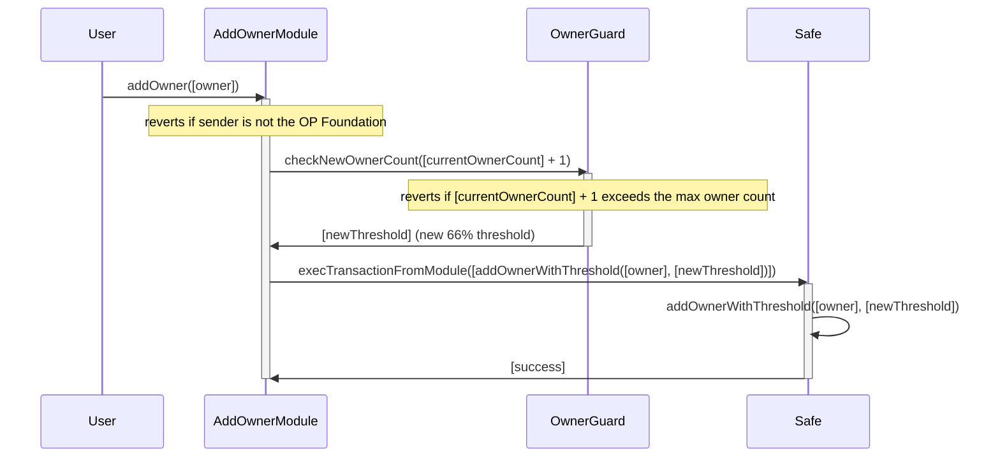
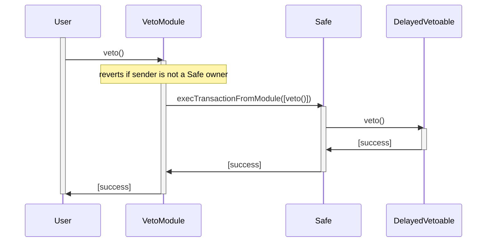
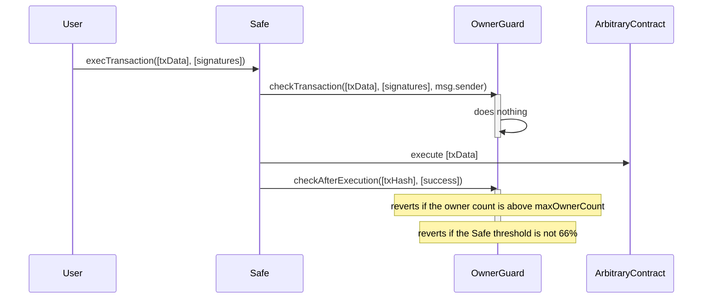

# Security Council VetoerSet

The Security Council employs a specially extended Safe multisig contract to provide additional features and security guarantees.

This document describes the "VetoerSet" feature, which allows any member of this set to perform a veto across the entire Superchain. This feature is implemented via two new Safe [modules](https://docs.safe.global/advanced/smart-account-modules), namely `AddOwnerModule` and `VetoModule`, and one new Safe [guard](https://docs.safe.global/advanced/smart-account-guards), `OwnerGuard`.

**Table of Contents**

- [Context](#context)
- [Implementation](#implementation)
    - [Veto module](#veto-module)
    - [Add owner module](#add-owner-module)
    - [Owner guard](#owner-guard)
    - [Adding owner call flow](#adding-owner-call-flow)
    - [Performing a veto call flow](#performing-a-veto-call-flow)
    - [Owner guard hooks call flow](#owner-guard-hooks-call-flow)
- [Contracts interdependencies](#contracts-interdependencies)

## Context

The Security Council's veto mechanism is intended to allow any member of the VetoerSet to perform a veto across the entire Superchain.

This veto mechanism is intended only to be used in abnormal cirumstances, such as a malicious chain upgrade, that would negatively impact or hurt a chain.

## Implementation

The veto mechanism relies on two Safe modules (`AddOwnerModule` and `VetoModule`) and one Safe guard (`OwnerGuard`) described thereafter.

### Veto module

The term "VetoerSet" is an abstract concept not explicitly present in the code. Any owner of the Safe Account is a potential "vetoer", so the "VetoerSet" is essentially just the list of owners of the Safe Account.

This module implements the core (and simple) logic of allowing any member of the VetoerSet (i.e., any owner of the Safe Account) to call the `veto()` method on the registered `DelayedVetoable` contract on behalf of the Safe Account and without requiring a signature quorum.

This module has the following minimal interface:

```solidity
interface VetoModule {
    /// @notice Passthrough for any owner to execute a veto on the `DelayedVetoable` contract.
    /// @dev Revert if not called by an owner of the Safe Account.
    function veto() external returns (bool);
}
```

### Add owner module

Although new owners can already be added by directly calling `addOwnerWithThreshold()` on the Safe Account, it requires a signature quorum.

The `AddOwnerModule` allows the OP Foundation (immutable set at deployment in `admin`) to add new owners without having to provide a signature quorum.

This module has the following minimal interface:

```solidity
interface VetoModule {
    /// @notice Add a new owner address.
    /// @dev Revert if not called by the whitelisted `admin` address.
    /// @param addr The owner address to add.
    function addOwner(address addr) external;
}
```

### Owner guard

The `OwnerGuard` contract adds two additional requirements (invariants) to the Safe Account, which must hold true in any circumstance:
1. The Safe Account cannot have more owners than the configured `maxOwnerCount`.
2. The Safe Account `threshold` (minimum number of signatures necessary to perform an arbitrary action on behalf of the Safe Account) must always be exactly equal to 66% of the current number of owners.

This guard has the following minimal interface:

```solidity
interface VetoModule {
    /// @notice Inherited hook from `BaseGuard` that is run right before the transaction is executed
    ///         by the Safe Account when `execTransaction` is called.
    function checkTransaction(
        address,
        uint256,
        bytes memory,
        Enum.Operation,
        uint256,
        uint256,
        uint256,
        address,
        address payable,
        bytes memory,
        address
    )
        external;

    /// @notice Inherited hook from `BaseGuard` that is run right after the transaction has been executed
    ///         by the Safe Account when `execTransaction` is called.
    function checkAfterExecution(bytes32, bool) external view;

    /// @notice Update the maximum number of owners.
    /// @dev Reverts if not called by the Safe Account.
    /// @param newMaxOwnerCount The new possible `maxOwnerCount` of owners.
    function updateMaxOwnerCount(uint8 newMaxOwnerCount) external;

    /// @notice Checks if the given `newOwnerCount` of owners is allowed and returns the corresponding 66% threshold.
    /// @dev Reverts if `newOwnerCount` is above `maxOwnerCount`.
    /// @param newOwnerCount The owners count to check.
    /// @return threshold The corresponding 66% threshold for `newOwnerCount` owners.
    function checkNewOwnerCount(uint256 newOwnerCount) public view returns (uint256 threshold);
}
```

Note that the `checkTransaction()` and `checkAfterExecution()` hooks are called [before](https://github.com/safe-global/safe-smart-account/blob/main/contracts/Safe.sol#L137-L156) and [after](https://github.com/safe-global/safe-smart-account/blob/main/contracts/Safe.sol#L179-L183) executing transactions on the Safe Account.

The current implementation keeps `checkTransaction()` empty and enforces both conditions described earlier in the `checkAfterExecution()` post hook.

`updateMaxOwnerCount()` allows a signature quorum to update the `maxOwnerCount` limit while always ensuring it stays above or equal to the current number of owners of the Safe Account.

### Adding owner call flow

The following diagram illustrates the flow for adding a single owner using the `AddOwnerModule`'s `addOwner()` method:



### Performing a veto call flow

The following diagram illustrates the flow for performing a veto using the `VetoModule`'s `veto()` method:



### Owner guard hooks call flow

The following diagram illustrates how the `OwnerGuard`'s hooks, specifically the `checkAfterExecution()`, ensure that both invariants (enumerated in the [Owner Guard](#owner-guard) section), hold true in any circumstance:



## Contracts Interdependencies

Both `AddOwnerModule` and `VetoModule` do not depend on each other and can be added, removed, or updated separately.
The `OwnerGuard` has no dependency on either of the modules and can also be managed independently.

However, the `AddOwnerModule` does have a dependency on the `OwnerGuard`. It requires that:
1. It has been registered on the Safe Account.
2. It exposes a `checkNewOwnerCount()` public method.
If either of the above conditions is not fulfilled, calling the `AddOwnerModule`'s `addOwner()` method will revert.