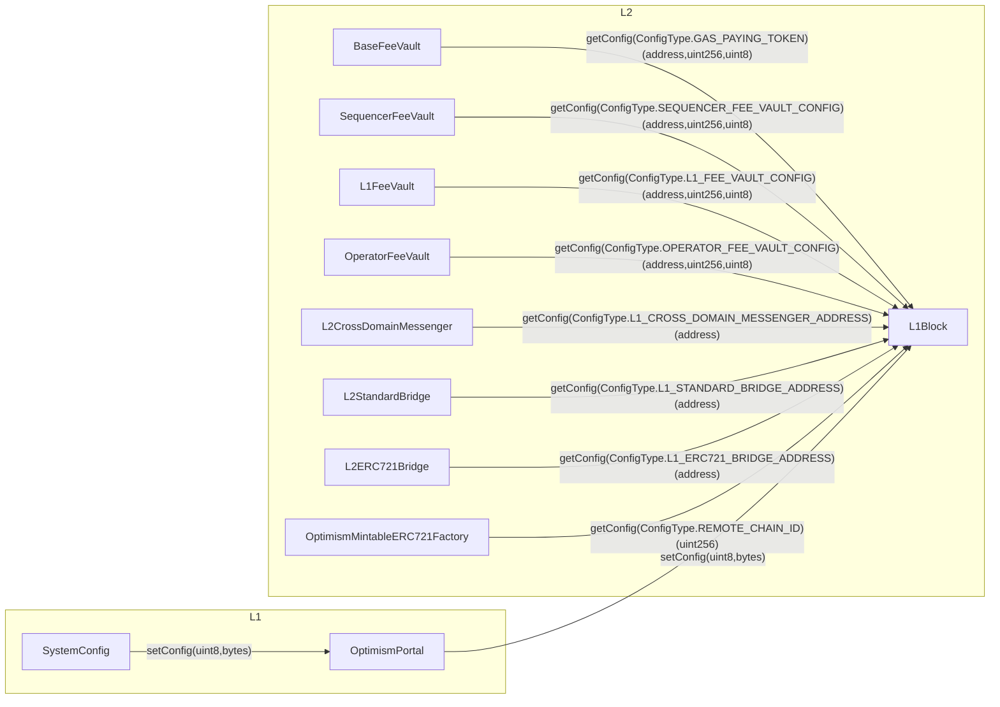

# Standard L2 Genesis

<!-- START doctoc generated TOC please keep comment here to allow auto update -->
<!-- DON'T EDIT THIS SECTION, INSTEAD RE-RUN doctoc TO UPDATE -->
**Table of Contents**

- [Overview](#overview)
- [Constants](#constants)
  - [`ConfigType`](#configtype)
- [`SystemConfig`](#systemconfig)
  - [`ConfigUpdate`](#configupdate)
  - [Initialization](#initialization)
  - [Interface](#interface)
    - [Fee Vault Config](#fee-vault-config)
      - [`setFeeVaultConfig`](#setfeevaultconfig)
    - [Fee Admin](#fee-admin)
      - [`feeAdmin`](#feeadmin)
  - [Invariants](#invariants)
- [`OptimismPortal`](#optimismportal)
  - [Interface](#interface-1)
    - [`setConfig`](#setconfig)
    - [`upgrade`](#upgrade)
  - [Invariants](#invariants-1)
- [SuperchainConfig](#superchainconfig)
  - [Constants](#constants-1)
  - [Interface](#interface-2)
  - [Initialization](#initialization-1)
- [Predeploys](#predeploys)
  - [L1Block values](#l1block-values)
  - [L1Block slots](#l1block-slots)
- [Predeploys](#predeploys-1)
  - [ProxyAdmin](#proxyadmin)
    - [Rationale](#rationale)
  - [L1Block](#l1block)
    - [Storage](#storage)
    - [Interface](#interface-3)
      - [`setXfork`](#setxfork)
      - [`setConfig`](#setconfig-1)
      - [`getConfig`](#getconfig)
  - [FeeVault](#feevault)
    - [Interface](#interface-4)
      - [`config`](#config)
  - [L2CrossDomainMessenger](#l2crossdomainmessenger)
  - [L2ERC721Bridge](#l2erc721bridge)
  - [L2StandardBridge](#l2standardbridge)
  - [OptimismMintableERC721Factory](#optimismmintableerc721factory)
  - [OptimismMintableERC20Factory](#optimismmintableerc20factory)
- [Security Considerations](#security-considerations)
  - [GovernanceToken](#governancetoken)

<!-- END doctoc generated TOC please keep comment here to allow auto update -->

## Overview

The `SystemConfig` and `OptimismPortal` are updated with a new flow for chain
configurability.

## Constants

### `ConfigType`

The `ConfigType` enum represents configuration that can be modified.

| Name                                | Value      | Description                                           |
| ----------------------------------- | ---------- | ----------------------------------------------------- |
| `GAS_PAYING_TOKEN`                  | `uint8(0)` | Modifies the gas paying token for the chain           |
| `BASE_FEE_VAULT_CONFIG`             | `uint8(1)` | Sets the Fee Vault Config for the `BaseFeeVault`      |
| `L1_FEE_VAULT_CONFIG`               | `uint8(2)` | Sets the Fee Vault Config for the `L1FeeVault`        |
| `SEQUENCER_FEE_VAULT_CONFIG`        | `uint8(3)` | Sets the Fee Vault Config for the `SequencerFeeVault` |
| `OPERATOR_FEE_VAULT_CONFIG`         | `uint8(4)` | Sets the Fee Vault Config for the `OperatorFeeVault`  |
| `L1_CROSS_DOMAIN_MESSENGER_ADDRESS` | `uint8(5)` | Sets the `L1CrossDomainMessenger` address             |
| `L1_ERC_721_BRIDGE_ADDRESS`         | `uint8(6)` | Sets the `L1ERC721Bridge` address                     |
| `L1_STANDARD_BRIDGE_ADDRESS`        | `uint8(7)` | Sets the `L1StandardBridge` address                   |
| `REMOTE_CHAIN_ID`                   | `uint8(8)` | Sets the chain id of the base chain                   |

## `SystemConfig`

### `ConfigUpdate`

The following `ConfigUpdate` event is defined where the `CONFIG_VERSION` is `uint256(0)`:

| Name                  | Value      | Definition                                                                        | Usage                                                                |
| --------------------- | ---------- | --------------------------------------------------------------------------------- | -------------------------------------------------------------------- |
| `BATCHER`             | `uint8(0)` | `abi.encode(address)`                                                             | Modifies the account that is authorized to progress the safe chain   |
| `FEE_SCALARS`         | `uint8(1)` | `(uint256(0x01) << 248) \| (uint256(_blobbasefeeScalar) << 32) \| _basefeeScalar` | Modifies the fee scalars                                             |
| `GAS_LIMIT`           | `uint8(2)` | `abi.encode(uint64 _gasLimit)`                                                    | Modifies the L2 gas limit                                            |
| `UNSAFE_BLOCK_SIGNER` | `uint8(3)` | `abi.encode(address)`                                                             | Modifies the account that is authorized to progress the unsafe chain |
| `EIP_1559_PARAMS`     | `uint8(4)` | `uint256(uint64(uint32(_denominator))) << 32 \| uint64(uint32(_elasticity))`      | Modifies the EIP-1559 denominator and elasticity                     |
| `OPERATOR_FEE_PARAMS` | `uint8(5)` | `uint256(_operatorFeeScalar) << 64 \| _operatorFeeConstant`                       | Modifies the operator fee scalar and constant                        |

### Initialization

The following actions should happen during the initialization of the `SystemConfig`:

- `emit ConfigUpdate.BATCHER`
- `emit ConfigUpdate.FEE_SCALARS`
- `emit ConfigUpdate.GAS_LIMIT`
- `emit ConfigUpdate.UNSAFE_BLOCK_SIGNER`
- `emit ConfigUpdate.EIP_1559_PARAMS`

These actions MAY only be triggered if there is a diff to the value.

### Interface

#### Fee Vault Config

For each `FeeVault`, there is a setter for its config. The arguments to the setter include
the `RECIPIENT`, the `MIN_WITHDRAWAL_AMOUNT` and the `WithdrawalNetwork`.
This function should be `public` and only callable by the fee admin.

Each function calls `OptimismPortal.setConfig(ConfigType,bytes)` with its corresponding `ConfigType`.

##### `setFeeVaultConfig`

The `setFeeVaultConfig` MUST revert if the `ConfigType` doesn't correspond to a fee vault config type.

```solidity
function setFeeVaultConfig(ConfigType,address,uint256,WithdrawalNetwork)
```

#### Fee Admin

A new role is introduced to call the vault config setters. This role is updated at the `initialize` function.
The fee admin role and can only be changed by an upgrade of the `SystemConfig`.

##### `feeAdmin`

```solidity
function feeAdmin() returns (address)
```

### Invariants

- Only the fee admin MUST be able to update a fee vault config

- Updating a fee vault config MUST emit a system deposit tx through the `OptimismPortal`

- Only the fee admin MUST be able to update the fee vault admin

## `OptimismPortal`

The `OptimismPortal` is updated to emit a special system `TransactionDeposited` event.

### Interface

#### `setConfig`

The `setConfig` function MUST only be callable by the `SystemConfig`. This ensures that the `SystemConfig`
is the single source of truth for chain operator ownership.

```solidity
function setConfig(ConfigType,bytes)
```

This function emits a `TransactionDeposited` event.

```solidity
event TransactionDeposited(address indexed from, address indexed to, uint256 indexed version, bytes opaqueData);
```

The following fields are included:

- `from` is the `DEPOSITOR_ACCOUNT`
- `to` is `Predeploys.L1Block`
- `version` is `uint256(0)`
- `opaqueData` is the tightly packed transaction data where `mint` is `0`, `value` is `0`, the `gasLimit`
  is `200_000`, `isCreation` is `false` and the `data` is `abi.encodeCall(L1Block.setConfig, (_type, _value))`

#### `upgrade`

The `upgrade` function MUST only be callable by the `UPGRADER` role as defined
in the [`SuperchainConfig`](#superchainconfig).

```solidity
function upgrade(uint32 _gasLimit, bytes memory _data) external
```

This function emits a `TransactionDeposited` event.
The deposit transaction is always targetted to `L2_PROXY_ADMIN`.

```solidity
event TransactionDeposited(address indexed from, address indexed to, uint256 indexed version, bytes opaqueData);
```

The following fields are included:

- `from` is the `DEPOSITOR_ACCOUNT`
- `to` is `Predeploys.L2_PROXY_ADMIN`
- `version` is `uint256(0)`
- `opaqueData` is the tightly packed transaction data where `mint` is `0`, `value` is `0`, the `gasLimit`
  is `200_000`, `isCreation` is `false` and the `data` is the data passed into `upgrade`.

### Invariants

- Only the `SystemConfig` MUST be able to call `setConfig`

- Only the `UPGRADER` role MUST be able to call `upgrade`

- `setConfig` and `upgrade` MUST emit a system deposit tx through `TransactionDeposited` event

## SuperchainConfig

The `SuperchainConfig` contract is updated with a new role that has the ability
to issue deposit transactions from the identity of the `DEPOSITOR_ACCOUNT`
that call the L2 `ProxyAdmin`.

### Constants

| Name            | Value                                                          | Definition                                |
| --------------- | -------------------------------------------------------------- | ----------------------------------------- |
| `UPGRADER_SLOT` | `bytes32(uint256(keccak256("superchainConfig.upgrader")) - 1)` | Account that can call the L2 `ProxyAdmin` |

### Interface

```solidity
function upgrader() public view returns (address)
```

### Initialization

The `upgrader` can only be set during initialization.

## Predeploys

This upgrade enables a deterministic L2 genesis state by moving all network
specific configuration out of the initial L2 genesis state. All network specific
configuration is sourced from deposit transactions during the initialization
of the `SystemConfig`.

### L1Block values

| Name                    | Value                    | Definition                                                                                                         |
| ----------------------- | ------------------------ | ------------------------------------------------------------------------------------------------------------------ |
| `ConfigType`            | `uint8`                  | An enum representing the type of config being set                                                                  |
| `WithdrawalNetwork`     | `uint8(0)` or `uint8(1)` | `0` means withdraw to L1, `1` means withdraw to L2                                                                 |
| `RECIPIENT`             | `address`                | The account that will receive funds sent out of the `FeeVault`                                                     |
| `MIN_WITHDRAWAL_AMOUNT` | `uint256`                | The minimum amount of native asset held in the `FeeVault` before withdrawal is authorized                          |
| `FEE_VAULT_CONFIG`      | `bytes32`                | `bytes32((WithdrawalNetwork << 248) \|\| uint256(uint88(MIN_WITHDRAWAL_AMOUNT)) << 160 \|\| uint256(uint160(RECIPIENT)))` |

### L1Block slots

| Name                                | Value                                                                      | Definition                                         |
| ----------------------------------- | -------------------------------------------------------------------------- | -------------------------------------------------- |
| `BASE_FEE_VAULT_CONFIG`             | `bytes32(uint256(keccak256("opstack.basefeevaultconfig")) - 1)`            | The Fee Vault Config for the `BaseFeeVault`        |
| `L1_FEE_VAULT_CONFIG`               | `bytes32(uint256(keccak256("opstack.l1feevaultconfig")) - 1)`              | The Fee Vault Config for the `L1FeeVault`          |
| `SEQUENCER_FEE_VAULT_CONFIG`        | `bytes32(uint256(keccak256("opstack.sequencerfeevaultconfig")) - 1)`       | The Fee Vault Config for the `SequencerFeeVault`   |
| `OPERATOR_FEE_VAULT_CONFIG`         | `bytes32(uint256(keccak256("opstack.operatorfeevaultconfig")) - 1)`        | The Fee Vault Config for the `OperatorFeeVault`    |
| `L1_CROSS_DOMAIN_MESSENGER_ADDRESS` | `bytes32(uint256(keccak256("opstack.l1crossdomainmessengeraddress")) - 1)` | `abi.encode(address(L1CrossDomainMessengerProxy))` |
| `L1_ERC_721_BRIDGE_ADDRESS`         | `bytes32(uint256(keccak256("opstack.l1erc721bridgeaddress")) - 1)`         | `abi.encode(address(L1ERC721BridgeProxy))`         |
| `L1_STANDARD_BRIDGE_ADDRESS`        | `bytes32(uint256(keccak256("opstack.l1standardbridgeaddress")) - 1)`       | `abi.encode(address(L1StandardBridgeProxy))`       |
| `REMOTE_CHAIN_ID`                   | `bytes32(uint256(keccak256("opstack.remotechainid")) - 1)`                 | Chain ID of the remote chain                       |

## Predeploys

All network specific configuration is moved to a single contract, the `L1Block` predeploy.
All predeploys make calls to the `L1Block` contract to fetch network specific configuration
rather than reading it from local state.



### ProxyAdmin

The `ProxyAdmin` is updated to have its `owner` be the `DEPOSITOR_ACCOUNT`.
This means that it can be deterministically called by network upgrade transactions
or by special deposit transactions emitted by the `OptimismPortal` that assume
the identity of the `DEPOSITOR_ACCOUNT`.

#### Rationale

It is much easier to manage the overall roles of the full system under this model.
The owner of the `ProxyAdmin` can upgrade any of the predeploys, meaning it can
write storage slots that correspond to withdrawals. This ensures that only the
system or a chain governor can issue upgrades to the predeploys.

### L1Block

#### Storage

The following storage slots are defined:

- `BASE_FEE_VAULT_CONFIG`
- `L1_FEE_VAULT_CONFIG`
- `SEQUENCER_FEE_VAULT_CONFIG`
- `OPERATOR_FEE_VAULT_CONFIG`
- `L1_CROSS_DOMAIN_MESSENGER_ADDRESS`
- `L1_ERC_721_BRIDGE_ADDRESS`
- `L1_STANDARD_BRIDGE_ADDRESS`
- `REMOTE_CHAIN_ID`

Each slot MUST have a defined `ConfigType` that authorizes the setting of the storage slot
via a deposit transaction from the `DEPOSITOR_ACCOUNT`.

#### Interface

##### `setXfork`

This function is meant to be called once on the activation block of the Xfork network upgrade.
It MUST only be callable by the `DEPOSITOR_ACCOUNT` once. When it is called, it MUST call
each getter for the network specific config and set the returndata into storage.

##### `setConfig`

This function MUST only be callable by the `DEPOSITOR_ACCOUNT`. It modifies the storage directly
of the `L1Block` contract. It MUST handle all defined `ConfigType`s. To ensure a simple ABI, the
`bytes` value MUST be abi decoded based on the `ConfigType`.

```solidity
function setConfig(ConfigType,bytes)
```

Note that `ConfigType` is an enum which is an alias for a `uint8`.

##### `getConfig`

This function is called by each contract with the appropriate `ConfigType` to fetch
the network specific configuration. Using this pattern reduces the ABI of the `L1Block`
contract by removing the need for special getters for each piece of config.

```solidity
function getConfig(ConfigType)(bytes)
```

The caller needs to ABI decode the data into the desired type.

### FeeVault

The following changes apply to each of the `BaseFeeVault`, the `L1FeeVault`, the `SequencerFeeVault` and the `OperatorFeeVault`.

#### Interface

The following functions are updated to read from the `L1Block` contract:

- `recipient()(address)`
- `withdrawalNetwork()(WithdrawalNetwork)`
- `minWithdrawalAmount()(uint256)`
- `withdraw()`

| Name                | Call                                                       |
| ------------------- | ---------------------------------------------------------- |
| `BaseFeeVault`      | `L1Block.getConfig(ConfigType.BASE_FEE_VAULT_CONFIG)`      |
| `SequencerFeeVault` | `L1Block.getConfig(ConfigType.SEQUENCER_FEE_VAULT_CONFIG)` |
| `L1FeeVault`        | `L1Block.getConfig(ConfigType.L1_FEE_VAULT_CONFIG)`        |
| `OperatorFeeVault`  | `L1Block.getConfig(ConfigType.OPERATOR_FEE_VAULT_CONFIG)`  |

##### `config`

A new function is added to fetch the full Fee Vault Config.

```solidity
function config()(address,uint256,WithdrawalNetwork)
```

### L2CrossDomainMessenger

To make this contract not initializable, the universal `CrossDomainMessenger` contract is updated to no longer be initializable.
However, the L1 version continues to be.

The `otherMessenger()(address)` function is updated to read from the `L1Block` contract
by calling `L1Block.getConfig(ConfigType.L1_CROSS_DOMAIN_MESSENGER_ADDRESS)`.

### L2ERC721Bridge

To make this contract not initializable, the universal `ERC721Bridge` contract is updated to no longer be initializable.
However, the L1 version continues to be.

The `messenger()` function is updated to return `Predeploys.L2_CROSS_DOMAIN_MESSENGER`.

The following functions are updated to read from the `L1Block` contract by calling `L1Block.getConfig(ConfigType.L1_ERC721_BRIDGE_ADDRESS)`:

- `otherBridge()(address)`
- `OTHER_BRIDGE()(address)`

### L2StandardBridge

To make this contract not initializable, the universal `StandardBridge` contract is updated to no longer be initializable.
However, the L1 version continues to be.

The `messenger()` function is updated to return `Predeploys.L2_CROSS_DOMAIN_MESSENGER`.

The following functions are updated to read from the `L1Block` contract by calling `L1Block.getConfig(ConfigType.L1_STANDARD_BRIDGE_ADDRESS)`:

- `otherBridge()(address)`
- `OTHER_BRIDGE()(address)`

### OptimismMintableERC721Factory

This contract is updated to remove its constructor.

The chain id is no longer read from storage but instead is read from the `L1Block` contract by calling
`L1Block.getConfig(ConfigType.REMOTE_CHAIN_ID)`

The bridge is no longer set in the constructor but instead it uses the `Predeploys.L2_ERC721_BRIDGE`

### OptimismMintableERC20Factory

The universal contract is updated to be abstract and no longer initializable.
Two new contracts are derived from it: `L1OptimismMintableERC20Factory` and `L2OptimismMintableERC20Factory`

In L2, the bridge is no longer set in the constructor but instead it uses the `Predeploys.L2_STANDARD_BRIDGE`

The L1 version continues to be initializable.

## Security Considerations

### GovernanceToken

The predeploy defined by `GovernanceToken` should be an empty account until it is defined by
a future hardfork.
