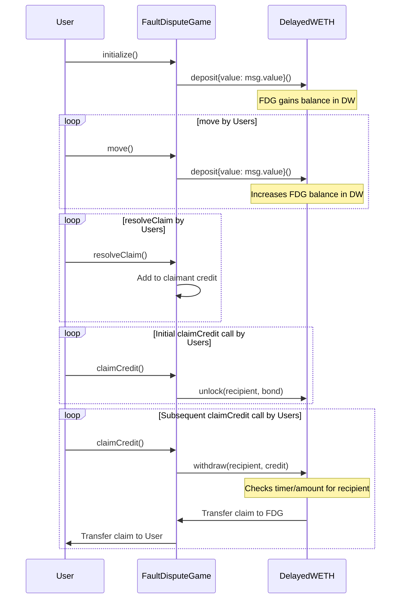

# Bond Incentives

<!-- START doctoc generated TOC please keep comment here to allow auto update -->
<!-- DON'T EDIT THIS SECTION, INSTEAD RE-RUN doctoc TO UPDATE -->
**Table of Contents**

- [Overview](#overview)
- [Moves](#moves)
- [Subgame Resolution](#subgame-resolution)
  - [Leftmost Claim Incentives](#leftmost-claim-incentives)
- [Fault Proof Mainnet Incentives](#fault-proof-mainnet-incentives)
  - [Authenticated Roles](#authenticated-roles)
  - [Base Fee Assumption](#base-fee-assumption)
  - [Bond Scaling](#bond-scaling)
  - [Required Bond Formula](#required-bond-formula)
  - [Other Incentives](#other-incentives)
- [Game Finalization](#game-finalization)
  - [Bond Distribution Mode](#bond-distribution-mode)
    - [Normal Mode](#normal-mode)
    - [Refund Mode](#refund-mode)
  - [Game Closure](#game-closure)
  - [Claiming Credit](#claiming-credit)
  - [DelayedWETH](#delayedweth)
    - [Sub-Account Model](#sub-account-model)
    - [Delay Period](#delay-period)
    - [Integration](#integration)

<!-- END doctoc generated TOC please keep comment here to allow auto update -->

## Overview

Bonds is an add-on to the core [Fault Dispute Game](fault-dispute-game.md). The core game mechanics are
designed to ensure honesty as the best response to winning subgames. By introducing financial incentives,
Bonds makes it worthwhile for honest challengers to participate.
Without the bond reward incentive, the FDG will be too costly for honest players to participate in given the
cost of verifying and making claims.

Implementations may allow the FDG to directly receive bonds, or delegate this responsibility to another entity.
Regardless, there must be a way for the FDG to query and distribute bonds linked to a claim.

Bonds are integrated into the FDG in two areas:

- Moves
- Subgame Resolution

## Moves

Moves must be adequately bonded to be added to the FDG. This document does not specify a
scheme for determining the minimum bond requirement. FDG implementations should define a function
computing the minimum bond requirement with the following signature:

```solidity
function getRequiredBond(Position _movePosition) public pure returns (uint256 requiredBond_)
```

As such, attacking or defending requires a check for the `getRequiredBond()` amount against the bond
attached to the move. To incentivize participation, the minimum bond should cover the cost of a possible
counter to the move being added. Thus, the minimum bond depends only on the position of the move that's added.

## Subgame Resolution

If a subgame root resolves incorrectly, then its bond is distributed to the **leftmost claimant** that countered
it. This creates an incentive to identify the earliest point of disagreement in an execution trace.
The subgame root claimant gets back its bond iff it resolves correctly.

At maximum game depths, where a claimant counters a bonded claim via `step`, the bond is instead distributed
to the account that successfully called `step`.

### Leftmost Claim Incentives

There exists defensive positions that cannot be countered, even if they hold invalid claims. These positions
are located on the same level as honest claims, but situated to its right (i.e. its gindex > honest claim's).

An honest challenger can always successfully dispute any sibling claims not positioned to the right of an honest claim.
The leftmost payoff rule encourages such disputes, ensuring only one claim is leftmost at correct depths.
This claim will be the honest one, and thus bond rewards will be directed exclusively to honest claims.

## Fault Proof Mainnet Incentives

This section describes the specific bond incentives to be used for the Fault Proof Mainnet launch of the OP Stack fault
proof system.

### Authenticated Roles

| Name         | Description                                                                                           |
| ------------ | ----------------------------------------------------------------------------------------------------- |
| Guardian     | Role responsible for blacklisting dispute game contracts and changing the respected dispute game type |
| System Owner | Role that owns the `ProxyAdmin` contract that in turn owns most `Proxy` contracts within the OP Stack |

### Base Fee Assumption

FPM bonds are to assume a fixed 200 Gwei base fee.
Future iterations of the fault proof may include a dynamic base fee calculation.
For the moment, we suppose that the `Guardian` address may account for increased average base fees by updating the
`OptimismPortal` contract to a new respected game type with a higher assumed base fee.

### Bond Scaling

FPM bonds are priced in the amount of gas that they are intended to cover.
Bonds start at the very first depth of the game at a baseline of `400_000` gas.
The `400_000` value is chosen as a deterrence amount that is approximately double the cost to respond at the top level.
Bonds scale up to a value of `300_000_000` gas, a value chosen to cover approximately double the cost of a max-size
Large Preimage Proposal.

We use a multiplicative scaling mechanism to guarantee that the ratio between bonds remains constant.
We determine the multiplier based on the proposed `MAX_DEPTH` of 73.
We can use the formula `x = (300_000_000 / 400_000) ** (1 / 73)` to determine that `x = 1.09493`.
At each depth `N`, the amount of gas charged is therefore `400_000 * (1.09493 ** N)`

Below is a diagram demonstrating this curve for a max depth of 73.


### Required Bond Formula

Applying the [Base Fee Assumption](#base-fee-assumption) and [Bond Scaling](#bond-scaling) specifications, we have a
`getRequiredBond` function:

```python
def get_required_bond(position):
    assumed_gas_price = 200 gwei
    base_gas_charged = 400_000
    gas_charged = 400_000 * (1.09493 ** position.depth)
    return gas_charged * assumed_gas_price
```

### Other Incentives

There are other costs associated with participating in the game, including operating a challenger agent and the
opportunity cost of locking up capital in the dispute game. While we do not explicitly create incentives to cover
these costs, we assume that the current bond rewards, based on this specification, are enough as a whole to cover
all other costs of participation.

## Game Finalization

After the game is resolved, claimants must wait for the [AnchorStateRegistry's
`isGameFinalized()`](anchor-state-registry.md#isgamefinalized) to return `true` before they can claim their bonds. This
implies a wait period of at least the `disputeGameFinalityDelaySeconds` variable from the `OptimismPortal` contract.
After the game is finalized, bonds can be distributed.

### Bond Distribution Mode

The FDG will in most cases distribute bonds to the winners of the game after it is resolved and finalized, but in
special cases will refund the bonds to the original depositor.

#### Normal Mode

In normal mode, the FDG will distribute bonds to the winners of the game after it is resolved and finalized.

#### Refund Mode

In refund mode, the FDG will refund the bonds to the original depositor.

### Game Closure

The `FaultDisputeGame` contract can be closed after finalization via the `closeGame()` function.

`closeGame` must do the following:

1. Verify the game is resolved and finalized according to the Anchor State Registry
2. Attempt to set this game as the new anchor game.
3. Determine the bond distribution mode based on whether the [AnchorStateRegistry's
   `isGameProper()`](anchor-state-registry.md#isgameproper) returns `true`.
4. Emit a `GameClosed` event with the chosen distribution mode.

### Claiming Credit

There is a 2-step process to claim credit. First, `claimCredit(address claimant)` should be called to unlock the credit
from the [DelayedWETH](#delayedweth) contract. After DelayedWETH's [delay period](#delay-period) has passed,
`claimCredit` should be called again to withdraw the credit.

The `claimCredit(address claimant)` function must do the following:

- Call `closeGame()` to determine the distribution mode if not already closed.
  - In NORMAL mode: Distribute credit from the standard `normalModeCredit` mapping.
  - In REFUND mode: Distribute credit from the `refundModeCredit` mapping.
- If the claimant has not yet unlocked their credit, unlock it by calling `DelayedWETH.unlock(claimant, credit)`.
  - Claimant must not be able to unlock this credit again.
- If the claimant has already unlocked their credit, call `DelayedWETH.withdraw(claimant, credit)` (implying a
  [delay period](#delay-period)) to withdraw the credit, and set claimant's `credit` balances to 0.

### DelayedWETH

`DelayedWETH` is designed to hold the bonded ETH for each
[Fault Dispute Game](fault-dispute-game.md).
`DelayedWETH` is an extended version of the standard `WETH` contract that introduces a delayed unwrap mechanism that
allows an owner address to function as a backstop in the case that a Fault Dispute Game would
incorrectly distribute bonds.

`DelayedWETH` is modified from `WETH` as follows:

- `DelayedWETH` is an upgradeable proxy contract.
- `DelayedWETH` has an `owner()` address. We typically expect this to be set to the `System Owner` address.
- `DelayedWETH` has a `delay()` function that returns a period of time that withdrawals will be delayed.
- `DelayedWETH` has an `unlock(guy,wad)` function that modifies a mapping called `withdrawals` keyed as
  `withdrawals[msg.sender][guy] => WithdrawalRequest` where `WithdrawalRequest` is
  `struct Withdrawal Request { uint256 amount, uint256 timestamp }`. When `unlock` is called, the timestamp for
  `withdrawals[msg.sender][guy]` is set to the current timestamp and the amount is increased by the given amount.
- `DelayedWETH` modifies the `WETH.withdraw` function such that an address _must_ provide a "sub-account" to withdraw
  from. The function signature becomes `withdraw(guy,wad)`. The function retrieves `withdrawals[msg.sender][guy]` and
  checks that the current `block.timestamp` is greater than the timestamp on the withdrawal request plus the `delay()`
  seconds and reverts if not. It also confirms that the amount being withdrawn is less than the amount in the withdrawal
  request. Before completing the withdrawal, it reduces the amount contained within the withdrawal request. The original
  `withdraw(wad)` function becomes an alias for `withdraw(msg.sender, wad)`.
  `withdraw(guy,wad)` will not be callable when `SuperchainConfig.paused()` is `true`.
- `DelayedWETH` has a `hold(guy,wad)` function that allows the `owner()` address to, for any holder, give itself an
  allowance and immediately `transferFrom` that allowance amount to itself.
- `DelayedWETH` has a `hold(guy)` function that allows the `owner()` address to, for any holder, give itself a full
  allowance of the holder's balance and immediately `transferFrom` that amount to itself.
- `DelayedWETH` has a `recover()` function that allows the `owner()` address to recover any amount of ETH from the
  contract.

#### Sub-Account Model

This specification requires that withdrawal requests specify "sub-accounts" that these requests correspond to. This
takes the form of requiring that `unlock` and `withdraw` both take an `address guy` parameter as input. By requiring
this extra input, withdrawals are separated between accounts and it is always possible to see how much WETH a specific
end-user of the `FaultDisputeGame` can withdraw at any given time. It is therefore possible for the `DelayedWETH`
contract to account for all bug cases within the `FaultDisputeGame` as long as the `FaultDisputeGame` always passes the
correct address into `withdraw`.

#### Delay Period

We propose a delay period of 7 days for most OP Stack chains. 7 days provides sufficient time for the `owner()` of the
`DelayedWETH` contract to act even if that owner is a large multisig that requires action from many different members
over multiple timezones.

#### Integration

`DelayedWETH` is expected to be integrated into the Fault Dispute Game as follows:

- When `FaultDisputeGame.initialize` is triggered, `DelayedWETH.deposit{value: msg.value}()` is called.
- When `FaultDisputeGame.move` is triggered, `DelayedWETH.deposit{value: msg.value}()` is called.
- When `FaultDisputeGame.resolveClaim` is triggered, the game will add to the claimant's internal credit balance.
- When `FaultDisputeGame.claimCredit` is triggered, `DelayedWETH.withdraw(recipient, credit)` is called.


