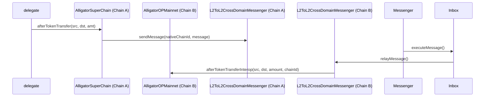

# Overview

The goal of this specification is to allow interoperability between the base and superchains for that use the [`Alligator`](alligator.md) predeploy. This allows the support of the
subdelegation flow with for the [`GovernanceToken`](gov-token.md) by making a few changes to the existing interface for cross-chain message passing as it pertains to the checkpoint state. 

## Interface

### Core Functions

```solidity
function afterTokenTransfer(
    address src,
    address dst,
    uint256 amount
) external
```

In addition to performing it's standard functionality this method will now use the `L2ToL2CrossDomainMessenger` to send a message to a new method on the `Alligator` contract, `afterTokenTransferInterop`. It will ensure prior to doing so that the `chainId` is not OP Mainnet i.e. 10(0xa). Moreover, it will still handle a check that both address have been migrated using
the new storage field and update the voting power of the delegate.

```solidity
function afterTokenTransferInterop(
    address src,
    address dst,
    uint256 amount
) external
```

The new function that will be added to the `Alligator` contract will process the interop messages being sent by the `afterTokenTransfer` method. The only address that can call
this method is the `L2ToL2CrossChainMessenger`. Furthermore, it will check that the sender of this message is in fact another OP token with the same address, which is assumed since the
goverance token is a predeploy. Given that messages are received from other tokens that exist on the superchain, an additional check needs to be performed that ensures we are on OP
mainnet by checking the `chainId` before updating the checkpoints for the delegate voting power.

## Diagram



## Implementation

```solidity
function afterTokenTransfer(
    address src,
    address dst,
    uint256 amount
) external {
    if (src != dst && amount > 0) {
	      if (src != address(0)) {
            (uint256 oldWeight, uint256 newWeight) = _writeCheckpoint(_checkpoints[src], _subtract, amount);
            emit DelegateVotesChanged(src, oldWeight, newWeight);
        }

        if (dst != address(0)) {
            (uint256 oldWeight, uint256 newWeight) = _writeCheckpoint(_checkpoints[dst], _add, amount);
            emit DelegateVotesChanged(dst, oldWeight, newWeight);
        }

        uint256 nativeChainId;
        assembly {
             nativeChainId := chainid()
        }

        if (nativeChainId != uint256(10)) {
            L2ToL2CrossDomainMessenger.sendMessage({
                _destination: nativeChainId,
                _target: address(this),
                _message: abi.encodeCall(this.afterTokenTransferInterop, (src, dst, amount))
            });
        }
    }
}

function afterTokenTransferInterop(
    address src,
    address dst,
    uint256 amount
) external {
    require(msg.sender == address(L2ToL2CrossChainMessenger));
    require(L2ToL2CrossChainMessenger.crossDomainMessageSender() == address(this));

    uint256 nativeChainId;
    assembly {
         nativeChainId := chainid()
    }

    require(nativeChainId == uint256(10));

    if (src != address(0)) {
        (uint256 oldWeight, uint256 newWeight) = _writeCheckpoint(_checkpoints[src], _subtract, amount);
        emit DelegateVotesChanged(src, oldWeight, newWeight);
    }

    if (dst != address(0)) {
        (uint256 oldWeight, uint256 newWeight) = _writeCheckpoint(_checkpoints[dst], _add, amount);
        emit DelegateVotesChanged(dst, oldWeight, newWeight);
    }
}
```

The contract may support a function to get the chainId or another modifier to prevent the Interop function to be called outside of OP mainnet.

## Backwards Compatibility

Previous instances of `Alligator` will not be able to interface with the OP mainnet contract given that they do not support the cross-chain message passing. However, the existing state 
of voting power on the superchain shall remained unchanged.

## Security Considerations

We must ensure that that both the `GovernanceToken` and `Alligator` use the same address across all chains.


