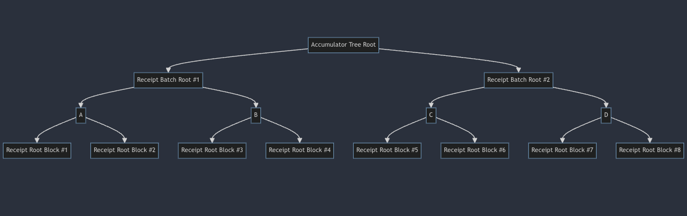

# Granite - Receipts Accumulator

<!-- START doctoc generated TOC please keep comment here to allow auto update -->
<!-- DON'T EDIT THIS SECTION, INSTEAD RE-RUN doctoc TO UPDATE -->
**Table of Contents**

- [Timestamp Activation](#timestamp-activation)
- [Rationale](#rationale)
- [Constants & Definitions](#constants--definitions)
- [Accumulator Tree Construction](#accumulator-tree-construction)
  - [Interior Commitment Truncation Rules](#interior-commitment-truncation-rules)
- [Block Execution Changes](#block-execution-changes)
  - [Header Changes](#header-changes)
    - [`extraData` size enforcement](#extradata-size-enforcement)
    - [`extraData` format](#extradata-format)
    - [Header RLP Size Considerations](#header-rlp-size-considerations)
  - [Accumulator Tree Functions](#accumulator-tree-functions)
    - [Insertion](#insertion)
    - [Verification](#verification)
- [Eventual Migration to EIP-7685](#eventual-migration-to-eip-7685)
- [Forwards Compatibility Considerations](#forwards-compatibility-considerations)
- [Client Implementation Considerations](#client-implementation-considerations)
- [Infrastructure Considerations](#infrastructure-considerations)

<!-- END doctoc generated TOC please keep comment here to allow auto update -->

---

The Granite hardfork introduces a new phase of block execution, receipt root accumulation. After fork activation,
every `2 ** RECEIPT_BATCH_TREE_DEPTH` blocks, the execution layer must append a binary merkle tree of depth
`RECEIPT_BATCH_TREE_DEPTH` of the previous `2 ** RECEIPT_BATCH_TREE_DEPTH` blocks (inclusive of the current block) to
the receipts root accumulation merkle tree of depth `ACCUMULATOR_TREE_DEPTH` in the previous receipt accumulation block.

## Timestamp Activation

Granite, like other OP Stack network upgrades, is activated at a timestamp. Changes to the L2 Block execution rules
outlined in this specification are applied when the `L2 Timestamp >= activation time`.

## Rationale

After the activation of the [interop hardfork](../interop/overview.md), the computational complexity of proving the
OP Stack's state transition will increase. The current plan for proving the inclusion of remote logs within chains
that exist in the active dependency set is to include a final "consolidation step" to resolve the dependencies of
each chain, which currently could require deriving and executing many L2 blocks in the context of the verifiable
environment that the proving system is executing within.

This feature seeks to reduce the complexity of the consolidation step significantly, through allowing the consolidation
program to produce only a single L2 block at a height that includes _all receipts_ on a single chain that must be
validated to resolve its dependents. With this, the computational complexity of resolving a dependency is drastically
reduced, only requiring two merkle proofs as well as `n` merkle patricia trie proofs to verify inclusion within the
receipt roots commited to in the accumulator tree.

## Constants & Definitions

| Term                       | Description                                                                                                                                     |
| -------------------------- | ----------------------------------------------------------------------------------------------------------------------------------------------- |
| `ACCUMULATOR_TREE_DEPTH`   | `27`                                                                                                                                            |
| `RECEIPT_BATCH_TREE_DEPTH` | `5`                                                                                                                                             |
| `TOTAL_TREE_DEPTH`         | `ACCUMULATOR_TREE_DEPTH + RECEIPT_BATCH_TREE_DEPTH`                                                                                             |
| `TRUNCATED_COMMITMENT`     | `20` bytes. Must be sufficiently long to protect against hash collision.                                                                        |
| `MERKLE_STACK_SIZE`        | `TRUNCATED_COMMITMENT * ACCUMULATOR_TREE_DEPTH`                                                                                                 |
| Accumulator Tree           | A partial merkle tree of depth `ACCUMULATOR_TREE_DEPTH`, storing the root nodes of receipt batch trees as leaves.                               |
| Receipt Batch Tree         | A binary merkle tree of depth `RECEIPT_BATCH_TREE_DEPTH`, storing the receipt roots of `2 ** RECEIPT_BATCH_TREE_DEPTH` block headers as leaves. |
| Receipt Root               | Standard ordered Merkle Patricia Trie root, currently persisted in the `receiptsRoot` field in the standard Ethereum block header               |
| Merkle Stack               | The path to the latest node added to the Accumulator Tree. This is an array of `MERKLE_STACK_SIZE` bytes in length.                             |
| Partial Merkle Tree        | As specified in [_End-to-End Formal Verification of Ethereum 2.0 Deposit Smart Contract_][imt] by Daejun Park, Yi Zhang, and Grigore Rosu.      |
| Zero Hashes                | As specified in [_End-to-End Formal Verification of Ethereum 2.0 Deposit Smart Contract_][imt] by Daejun Park, Yi Zhang, and Grigore Rosu.      |

## Accumulator Tree Construction

The receipt accumulator tree is constructed as a partial merkle tree of depth `ACCUMULATOR_TREE_DEPTH`, with leaves
representing the merkle roots of binary receipt batch trees, containing `2 ** RECEIPT_BATCH_TREE_DEPTH` blocks.

As an example, below is an accumulator tree with `ACCUMULATOR_TREE_DEPTH = 1` and `RECEIPT_BATCH_TREE_DEPTH = 2`,
holding a total of `8` blocks' receipts roots across two batches:



Both the global accumulator tree as well as the receipt batch tree use `keccak256` as their hashing function. For all
nodes within the receipt accumulator tree, barring `depth = 0` and `depth = ACCUMULATOR_TREE_DEPTH`, all commitments
are shortened to `TRUNCATED_COMMITMENT` bytes in length to save space in the Header's `extraData` field by virtue of
shortening the merkle stack's encoded length.

### Interior Commitment Truncation Rules

All tree commitments that are to be truncated must save their high-order 20 bytes, when interpreting `keccak256`'s
produced digest as a big-endian 32-byte unsigned integer.

| Byte Range | Description      |
| ---------- | ---------------- |
| `[0, 20)`  | Truncated Digest |
| `[20, 32)` | Discarded        |

## Block Execution Changes

After Granite activation, every time `block.number % 2 ** RECEIPT_BATCH_TREE_DEPTH == 0`, the execution layer will:

1. Craft a binary merkle tree of depth `RECEIPT_BATCH_TREE_DEPTH` with the receipts roots of
   `[block.number - RECEIPT_BATCH_TREE_DEPTH - 1, block]` and compute its root, using the `keccak256` hash function.
1. Fetch the previous merkle stack from `block.number - RECEIPT_BATCH_TREE_DEPTH`'s Header.
   - If the current block is the first receipts accumulation block, the execution client will begin with an empty
     merkle stack consisting of zero hashes from the leaf node to the root node, set the `receipts_batch_num` to `0`,
     and continue to the next step.
   - If the current block is not the first receipts accumulation block, and the block header at
     `block.number - RECEIPT_BATCH_TREE_DEPTH` does not contain a valid receipt accumulator `extraData` field,
     block execution should _always_ fail immediately.
   - If the current block is not the first receipts accumulation block, and the block header at
     `block.number - RECEIPT_BATCH_TREE_DEPTH` does contain a valid receipt accumulator `extraData` field, continue to
     the next step.
1. Insert the root of the receipts batch tree computed in step #1 into the merkle stack retrieved from the previous
   receipt accumulation block, using the insertion function defined below.
1. Compute the new accumulator tree root with the modified stack.
1. Encode the merkle root and modified merkle stack as defined below, and insert into the executed block's header
   prior to sealing it.

### Header Changes

#### `extraData` size enforcement

1. If `block.number % 2 ** RECEIPT_BATCH_TREE_DEPTH == 0`, the `extraData` size must be
   `8 + 32 * 2 + TRUNCATED_COMMITMENT * (ACCUMULATOR_TREE_DEPTH - 1)`.
1. If `block.number % 2 ** RECEIPT_BATCH_TREE_DEPTH > 0`, the `extraData` size must be `0`.

#### `extraData` format

For receipt accumulation blocks (`block.number % 2 ** RECEIPT_BATCH_TREE_DEPTH == 0`), the accumulator tree root
as well as the merkle stack should be encoded as follows:

```txt
merkle_stack = sibling_leaf_32b ++ intermediate_20b_0 ++ ... ++ intermediate_20b_n
extra_data = u64(receipts_batch_num) ++ accumulator_tree_root ++ merkle_stack
```

where `++` denotes concatenation.

#### Header RLP Size Considerations

By extending the `extraData` field to occasionally include the merkle root of the accumulator tree as well as the
merkle stack of the previously added leaf, we do introduce a risk for bloating historical state. Mitigations for
this state expansion in this proposal include:

1. Batching additions to the global accumulator root every `2 ** RECEIPT_BATCH_TREE_DEPTH` blocks to remove the
   requirement to store the accumulator tree root & merkle stack in every block header.
1. Truncating the intermediate commitments within the global accumulator tree to reduce the `extraData` field's
   size by `(32 - TRUNCATED_COMMITMENT) * (ACCUMULATOR_TREE_DEPTH - 1)` bytes per accumulator block.

The total size of the `extraData` field in receipt accumulation blocks' headers will be
`8 + 32 * 2 + TRUNCATED_COMMITMENT * (ACCUMULATOR_TREE_DEPTH - 1)` bytes in length.

With the parameters of `TRUNCATED_COMMITMENT = 20` & `ACCUMULATOR_TREE_DEPTH = 27`, this would imply an extra `592`
bytes per `2 ** RECEIPT_BATCH_TREE_DEPTH` blocks. At a block time of `2` seconds, this implies an extra `0.7992 MB` of
data added to historical state per day.

### Accumulator Tree Functions

#### Insertion

_Modified from the
[Beacon Chain Specification](https://github.com/ethereum/consensus-specs/blob/dev/specs/phase0/beacon-chain.md#is_valid_merkle_branch),
to account for the truncated digests._

```python
def insert_leaf(node: Bytes, branch: Sequence[Bytes], receipts_batch_num: uint64, depth: uint64) -> bool:
    """
    Inserts the ``node`` into the merkle branch ``branch`` at ``receipts_batch_num + 1``. Returns false
    if the loop was exhausted without returning, which should be considered a critical failure.
    """
    receipts_batch_num += 1
    size = receipts_batch_num
    for height in range(depth):
      if ((size & 1) == 1):
        branch[height] = node
        return True
      node = keccak256(branch[height] + node)[0:20]
      size /= 2
    return False
```

#### Verification

_Modified from the
[Beacon Chain Specification](https://github.com/ethereum/consensus-specs/blob/dev/specs/phase0/beacon-chain.md#is_valid_merkle_branch),
to account for the truncated digests._

```python
def is_valid_merkle_branch(leaf: Bytes, branch: Sequence[Bytes], depth: uint64, index: uint64, root: Root) -> bool:
    """
    Check if ``leaf`` at ``index`` verifies against the Merkle ``root`` and ``branch``.
    """
    value = leaf
    for i in range(depth):
        if index // (2**i) % 2:
            value = hash(branch[i] + value)[0:20]
        else:
            value = hash(value + branch[i])[0:20]
    return value == root
```

## Eventual Migration to [EIP-7685](https://eips.ethereum.org/EIPS/eip-7685)

With EIP-7685, which is being considered for inclusion in Pectra, we will have the option to move the data that this
specification assigns to `extraData` into the `requestsRoot` within the Header. This will eventually be a much more
forwards compatible method of committing to this information within historical state.

## Forwards Compatibility Considerations

It is possible that L1 chooses to implement a feature which extends the `extraData` field, which could potentially
cause us issues. However, this proposal seeks to temporarily include the information within `extraData`, until
[EIP-7685](https://eips.ethereum.org/EIPS/eip-7685) is included on L1.

## Client Implementation Considerations

For most execution clients, this should have a very minimal impact on block execution performance. Because the state
of the previous `256` blocks is commonly kept in-memory for EVM opcodes such as `BLOCKHASH`, fetching the `extraData`
field from the previous receipts accumulation block and recomputing the rerceipts batch + accumulator trie should be
very fast, assuming `RECEIPT_BATCH_TREE_DEPTH` is not too large.

## Infrastructure Considerations

Most infrastructure components support `extraData > 32 bytes`, since Clique consensus formerly used this field. However,
we do run the risk that some services such as block explorers have removed this capability.

[imt]: https://daejunpark.github.io/papers/deposit.pdf
