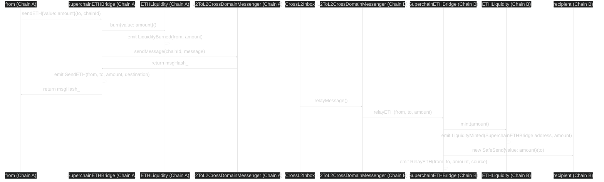

# ETH Bridging

<!-- START doctoc generated TOC please keep comment here to allow auto update -->
<!-- DON'T EDIT THIS SECTION, INSTEAD RE-RUN doctoc TO UPDATE -->
**Table of Contents**

- [Overview](#overview)
- [Constants](#constants)
- [Design](#design)
  - [Diagram](#diagram)

<!-- END doctoc generated TOC please keep comment here to allow auto update -->

## Overview

ETH is bridged between chains within the Superchain interop set by using the `SuperchainETHBridge`
predeploy for message passing and the `ETHLiquidity` contract for supplying native ETH liquidity.

## Constants

| Name                          | Value                                        |
| ----------------------------- | -------------------------------------------- |
| `SuperchainETHBridge` Address | `0x4200000000000000000000000000000000000024` |
| `ETHLiquidity` Address        | '0x06EE840642a33367ee59fCA237F270d5119d1356' |

## Design

See the [SuperchainETHBridge](./superchain-eth-bridge.md) spec for the design of the
`SuperchainETHBridge` predeploy and the [ETHLiquidity](./eth-liquidity.md) spec for
the design of the `ETHLiquidity` contract.

### Diagram

The following diagram depicts a cross-chain ETH transfer.

