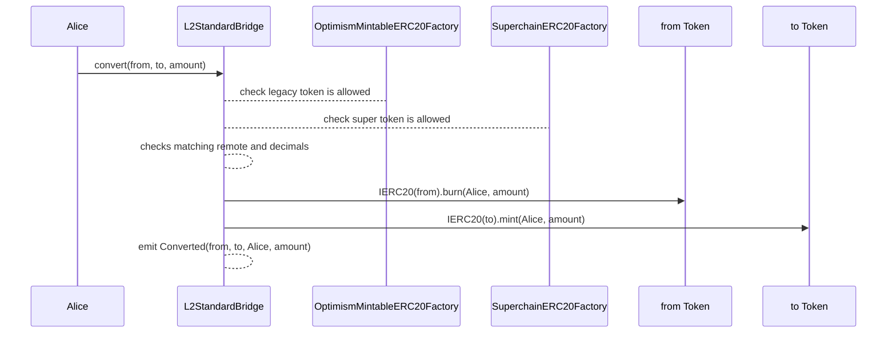

# Liquidity Migration

<!-- START doctoc generated TOC please keep comment here to allow auto update -->
<!-- DON'T EDIT THIS SECTION, INSTEAD RE-RUN doctoc TO UPDATE -->
**Table of Contents**

- [Overview](#overview)
- [Implementation changes](#implementation-changes)
  - [L2StandardBridge](#l2standardbridge)
    - [`convert`](#convert)
    - [`Converted`](#converted)
    - [`_validatePair`](#_validatepair)
  - [OptimismMintableERC20Factory](#optimismmintableerc20factory)
    - [Version](#version)
    - [`deployments`](#deployments)
    - [`createOptimismMintableERC20`](#createoptimismmintableerc20)
- [Diagram](#diagram)
- [Invariants](#invariants)
- [Considerations](#considerations)
- [Appendix](#appendix)
  - [Access Control](#access-control)
  - [Backwards compatibility](#backwards-compatibility)

<!-- END doctoc generated TOC please keep comment here to allow auto update -->

## Overview

The `OptimismMintableERC20` tokens and `L2StandardToken`s (_legacy tokens_),
which correspond to locked liquidity in L1, are incompatible with interop.
Legacy token owners must convert into a `SuperchainERC20` representation, as defined in the [standard](token-bridging.md),
to move across the Superchain.

The conversion method will use the `L2StandardBridge` mint/burn rights
over the legacy tokens to allow easy migration to and from the
corresponding `SuperchainERC20`.

## Implementation changes

Both the `L2StandardBridge` and the `OptimismMintableERC20TokenFactory` will be extended
to allow for liquidity migration:

### L2StandardBridge

#### `convert`

The `L2StandardBridge` SHOULD add a `convert` public function that
converts `_amount` of `_from` token to `_amount` of `_to` token,
if and only if the token addresses are valid (as defined below).

```solidity
convert(address _from, address _to, uint256 _amount)
```

The function will

1. Check that `_from` and `_to` addresses are valid, paired and have the same amount of decimals.
2. Burn `_amount` of `_from` from `msg.sender`.
3. Mint `_amount` of `_to` to `msg.sender`.

An example implementation that depends on the `_validatePair()`
access control function looks like this:

```solidity
function convert(address _from, address _to, uint256 _amount) public {
  _validatePair(_from, _to);
  IERC20(_from).burn(msg.sender, _amount);
  IERC20(_to).mint(msg.sender, _amount);
  emit Converted(_from, _to, msg.sender, _amount);
}
```

#### `Converted`

The `L2StandardBridge` SHOULD add a `Converted` event
that MUST trigger when anyone converts tokens
with `convert`.

```solidity
event Converted(address indexed from, address indexed to, address indexed caller, uint256 amount);
```

where `from` is the address of the input token, `to` is the address of the output token,
`caller` is the `msg.sender` of the function call and `amount` is the converted amount.

#### `_validatePair`

The `L2StandardBridge` SHOULD add a `_validatePair` internal function that
checks the validity of the `_from` and `_to` pair.
To do so, it will verify that:

1. Both tokens have the same amount of decimals.
2. There is one valid legacy address:
   Verify the `OptimismMintableERC20Factories` deployment lists.
3. There is one valid `SuperchainERC20` address:
   Verify the `SuperchainERC20Factory` deployment list.
4. Both tokens correspond to the same remote token address:
   it will compare the remote token addresses stored in the deployment
   mappings and revert with `InvalidPair` if they do not match.

You can read more details about access control in the [Appendix](#access-control).

A reference implementation would look like follows

```solidity
IOptimismMintableERC20Factory public factory = IOptimismMintableERC20Factory(Predeploys.OptimismMintableERC20Factory);
ISuperchainERC20Factory public superFactory = ISuperchainERC20Factory(Predeploys.SuperchainERC20Factory);

function _validatePair(address _from, address _to) internal {
  // 1. Decimals check
  require(IERC20Metadata(_from).decimals() == IERC20Metadata(_to).decimals(), "Decimals do not match")

  if (_isOptimismMintableERC20(_from)) {
    _validateFactories(_from, _to)
  } else {
    _validateFactories(_to, _from)
  }
}

function _validateFactories(address _legacyAddr, address _superAddr) internal {
  // 2. Valid legacy check
  address _legacyRemoteToken = factory.deployments(_legacyAddr);
  require(_legacyRemoteToken != address(0), "Invalid Legacy address");

  // 3. Valid SuperchainERC20 check
  address _superRemoteToken = superFactory.deployments(_superAddr);
  require(_superRemoteToken != address(0), "Invalid SuperchainERC20 address");

  // 4. Same remote address check
  require(_legacyRemoteToken == _superRemoteToken, "Invalid token pair");
}
```

Note: Code can be simplified by using || in
the requires or conditionals.
The tradeoff would be losing error precision.

### OptimismMintableERC20Factory 
#### Version
The `OptimismMintableERC20Factory` should not use CREATE as the creation method and should make the salt depend on 
the token metadata. 

The CREATE2 version depends on the compiler and is therefore not suggested for the long term. For these reasons, it is recommended that the Factory version
 uses CREATE3 for deployments. 


#### `deployments`

The `OptimismMintableERC20Factory` SHOULD include a new mapping that stores the remote
token address for each deployed `OptimismMintableERC20`.

```solidity
mapping(address => address) public deployments;
```

The mapping will be populated as a one-time update
via storage manipulation to include the list of allowed tokens
(see the [Appendix](#backwards-compatibility)), and on new deployments afterwards.

#### `createOptimismMintableERC20`

The [function](createOptimismMintable) should be modified to update the `deployments` mapping.

```solidity
deployments[localToken] = _remoteToken;
```

## Diagram

`convert`



## Invariants

The conversion flow will need to conserve the following invariants:

- Conservation of amount:
  The burnt amount should match the minted amount.
- Revert for non valid or non paired:
  - Tokens with different decimals.
    `convert` SHOULD revert when called with:
  - Legacy tokens that are not in the allowed list or were not
    deployed by the `OptimismMintableERC20Factory`.
  - `SuperchainERC20`s not deployed
    by the `SuperchainERC20Factory`.
  - Legacy tokens and `SuperchainERC20`s
    corresponding to different
    remote token addresses.
- Freedom of conversion for valid and paired tokens:
  anyone can convert between allowed legacy representations and
  valid `SuperchainERC20s` corresponding to the same remote token.

## Considerations

- The `OptimismMintableERC20Factory` SHOULD be upgraded to
  the latest version and include the allowed token list.
- Tokens in the allowed list and newly deployed tokens in both
  factories SHOULD implement `decimals()`.
- The token list SHOULD only allow legacy tokens that:
  - Are immutable: connecting upgradable tokens
    would pose a risk for locked liquidity of the other representations.
  - Implement a valid interface, such as `IOptimismMintableERC20`
    or `IL2StandardToken`.
  - Deployed with 0 supply: tokens are native to L1,
    so legacy supply can only grow with deposits from L1.
  - Can only be minted by the `L2StandardBridge`.
  - Doesn’t implement fancy functions:
    e.g. additional mint rights, ability to change l1token, l2bridge, etc.
    This is hard to measure and will require social consensus.
- Any `SuperchainERC20` used for conversion MUST allow
  the `L2StandardBridge` to mint and burn tokens.
  This can be achieved with an extension to the standard or by overriding
  the mint and burn functions.
- The `SuperchainERC20Factory` MUST include a `deployments` mapping
  that stores the remote token address for each deployed `SuperchainERC20` address.

## Appendix

### Access Control

Each `SuperchainERC20` will correspond to a a remote token and can be connected
to multiple existing legacy representations.
Furthermore, each legacy representation can be connected to various
`SuperchainERC20` (one per metadata).
This also implies that users can freely move between allowed legacy
representations and `SuperchainERC20s` using the convert function
(call `convert(legacy1Addr,superAddr,...)` and then
`convert(superAddr,legacy2Addr,...)` for example).
As legacy tokens can be used to unlock liquidity in the native chain
(L1 for tokens in the Standard Bridge), it is fundamental only
to allow safe representations to connect.

### Backwards compatibility

As previously mentioned, the check on legacy address validity will query the `OptimismMintableERC20Factory`,
which stores a [`deployments`](#deployments) mapping from
the legacy address to the _remote token_ address, so
it can work as an allow-list and remove the need to check for interface
differences between `ILegacyMintableERC20`
and `IOptimismMintableERC20`.
The `deployments` mapping will be updated [whenever a new deployment occurs](#createoptimismmintableerc20).

But convert should also be able to allow tokens that were
deployed before the factory upgrade.
To address this situation, a token list will be written to the same mapping
via storage manipulation as a one-time update.
How the allowed list is created is still to be defined.

[OptimismMintableERC20Factory-repo]: https://github.com/ethereum-optimism/optimism/blob/v1.8.0/packages/contracts-bedrock/src/universal/OptimismMintableERC20Factory.sol
[createOptimismMintable]: https://github.com/ethereum-optimism/optimism/blob/ddc37daa49558c2fb5c1a92e694eeb7de5942e00/packages/contracts-bedrock/src/universal/OptimismMintableERC20Factory.sol#L108
