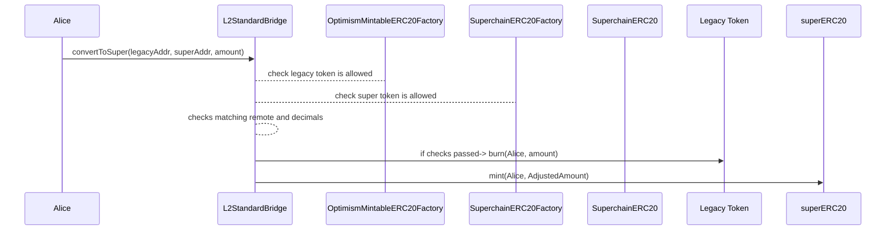
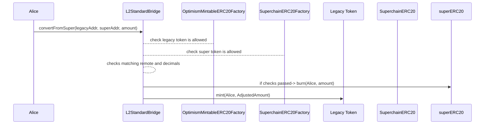

# Liquidity Migration

<!-- START doctoc generated TOC please keep comment here to allow auto update -->
<!-- DON'T EDIT THIS SECTION, INSTEAD RE-RUN doctoc TO UPDATE -->

- [Overview](#overview)
- [Implementation changes](#implementation-changes)
  - [L2StandardBridge](#l2standardbridge)
    - [`convertToSuper`](#converttosuper)
    - [`convertFromSuper`](#convertfromsuper)
    - [`ConvertedToSuper`](#convertedtosuper)
    - [`ConvertedFromSuper`](#convertedfromsuper)
    - [`checkPair`](#checkpair)
  - [OptimismMintableERC20Factory](#optimismmintableerc20factory)
    - [`deployments`](#deployments)
    - [`createOptimismMintableERC20`](#createoptimismmintableerc20)
- [Diagram](#diagram)
- [Invariants](#invariants)
- [Considerations](#considerations)
- [Appendix](#appendix)
  - [Access Control](#access-control)
  - [Backwards compatibility](#backwards-compatibility)
  - [Decimal management](#decimal-management)

<!-- END doctoc generated TOC please keep comment here to allow auto update -->

## Overview

The `OptimismMintableERC20` tokens and `L2StandardToken`s (_legacy tokens_),
which correspond to locked liquidity in L1, are incompatible with interop.
Legacy token owners must convert into a `SuperchainERC20` representation, as defined in the [standard](token-bridging.md),
to move across the Superchain.

The conversion method will use the `L2StandardBridge` mint/burn rights
over the legacy tokens to allow easy migration to and from the
corresponding `SuperchainERC20`.

## Implementation changes

Bothe the `L2StandardBridge` and the `OptimismMintableERC20TokenFactory` will be extended
to allow for liquidity migration:

### L2StandardBridge

#### `convertToSuper`

The `L2StandardBridge` SHOULD add a `convertToSuper` external function that
converts `_amount` of legacy tokens with address `_legacyAddr`
to the same `_amount` of `SuperchainERC20` tokens in address `_superAddr`.

```solidity
convertToSuper(address _legacyAddr, address _superAddr, uint256 _amount)
```

The function will

1. Check that `_legacyAddr` and `_superAddr` are valid, paired and have the same amount of decimals.
2. Burn `_amount` of `_legacyAddr` from `msg.sender`.
3. Mint `_amount` of `_superAddr` to `msg.sender`.

An example implementation that depends on the `checkPair()`
access control function looks like this:

```solidity
function convertToSuper(address _legacyAddr, address _superAddr, uint256 _amount) public {
  require(checkPair(_legacyAddr, _superAddr), "Invalid address pair");
  require(IERC20(_legacyAddr).decimals() == IERC20(_superAddr).decimals(), "Decimals do not match")

  IERC20(_legacyAddr).burn(msg.sender, _amount);
  IERC20(_superAddr).mint(msg.sender, _amount);

  emit ConvertedToSuper(_legacyAddr, _superAddr, msg.sender, _amount);
}
```

#### `convertFromSuper`

The `L2StandardBridge` SHOULD add a `convertFromSuper` external function that
converts `_amount` of `SuperchainERC20` tokens in address `_superAddr`
to the same `_amount` of legacy tokens with address `_legacyAddr`.

```solidity
convertToSuper(address _legacyAddr, address _superAddr, uint256 _amount)
```

The function will

1. Check that `_legacyAddr` and `_superAddr` are valid, paired and have the same amount of decimals.
2. Burn `_amount` of `_superAddr` from `msg.sender`.
3. Mint `_amount` of `_legacyAddr` to `msg.sender`.

An example implementation that depends on the `checkPair()`
access control function looks like this:

```solidity
function convertFromSuper(address _legacyAddr, address _superAddr, uint256 _amount) public {
  require(checkPair(_legacyAddr, _superAddr), "Invalid address pair");

  IERC20(_superAddr).burn(msg.sender, _amount);
  IERC20(_legacyAddr).mint(msg.sender, _amount);

  emit ConvertedFromSuper(_legacyAddr, _superAddr, msg.sender, _amount);
}
```

#### `ConvertedToSuper`

The `L2StandardBridge` SHOULD add a `ConvertedToSuper` event
that MUST trigger when anyone converts legacy tokens
to `SuperchainERC20` with `convertToSuper`.

```solidity
event ConvertedToSuper(address indexed legacyAddr, address indexed superAddr, address indexed caller, uint256 amount);
```

#### `ConvertedFromSuper`

`ConvertedFromSuper` event
that MUST trigger when anyone converts `SuperchainERC20`
into legacy tokens with `convertFromSuper`.

```solidity
event ConvertedFromSuper(address indexed legacyAddr, address indexed superAddr, address indexed caller, uint256 amount);
```

#### `checkPair`

The `L2StandardBridge` SHOULD add a `checkPair` internal function that
checks the validity of the `_legacyAddr` and `_superAddr` pair.
To do so, it will verify:

1. Valid legacy address:
   Verify the `OptimismMintableERC20Factories` deployment lists. This approach requires updating
   the `OptimismMintableERC20Factory` to store
   deployments as a mapping from `OptimismMintableERC20`
   to its `REMOTE_TOKEN`.  
    The mapping will be backwards compatible, as detailed in the [Appendix](#backwards-compatibility).
2. Valid `SuperchainERC20` address:
   checks the `SuperchainERC20Factory` mapping
   that stores the corresponding remote token address
   for each `SuperchainERC20` address.
3. Both tokens correspond to the same remote token address:
   it will compare the remote token addresses stored in the deployment
   mappings and revert with `InvalidPair` if they do not match.
4. Both tokens have the same amount of decimals.

You can read more details about access control in the [Appendix](#decimal-management).

A reference implementation would look like follows

```solidity
IOptimismMintableERC20Factory public factory = IOptimismMintableERC20Factory(Predeploys.OptimismMintableERC20Factory);
ISuperchainERC20Factory public superFactory = ISuperchainERC20Factory(Predeploys.SuperchainERC20Factory);

function checkPair(address _legacyAddr, address _superAddr) internal view returns (bool) {
  // Check validity of the legacy token
  address _legacyRemoteToken = factory.deployments(_legacyAddr);
  require(_legacyRemoteToken != address(0), "Invalid Legacy address");

  // Check validity of the superchainERC20 token
  address _superRemoteToken = superFactory.deployments(_superAddr);
  require(_superRemoteToken != address(0), "Invalid SuperchainERC20 address");

  // Check both tokens correspond to the same remote token
  require(_legacyRemoteToken == _superRemoteToken, "Invalid token pair");

  // Check both tokens share decimals
  require(IERC20Metadata(_legacyAddr).decimals() == IERC20Metadata(_superAddr).decimals(), "Decimals do not match")

  return true;
}
```

Note: Code can be simplified by using || in
the requires or conditionals.
The tradeoff would be losing error precision.

### OptimismMintableERC20Factory

#### `deployments`

The `OptimismMintableERC20Factory` SHOULD include a new mapping that stores the remote
token address for each deployed `OptimismMintableERC20`.

```solidity
mapping(address => address) public deployments;
```

The mapping will be updated on new updates and only once
manually via storage manipulation to include the list of allowed tokens
(see the [Appendix](#backwards-compatibility)).

#### `createOptimismMintableERC20`

The function should be modified to update the `deployments` mapping.

```solidity
function createOptimismMintableERC20(address _remoteToken, string memory _name, string memory _symbol) public returns (address) {
  require(_remoteToken != address(0), "OptimismMintableERC20Factory: must provide remote token address");
  bytes32 salt = keccak256(abi.encode(_remoteToken, _name, _symbol));
  address localToken = address(new OptimismMintableERC20{salt: salt}(BRIDGE, _remoteToken, _name, _symbol));
  ...
  // Add the following line
  deployments[localToken] = _remoteToken;
  //
  return localToken;
}
```

## Diagram

`convertToSuper`



`convertFromSuper`



## Invariants

The conversion flow will need to conserve the following invariants:

- Conservation of amount:
  The burnt amount should match the minted amount.
  - It is possible to relax this invariant and adjust the amount
    based on decimal difference.
    An example implementation can be found in the [Appendix](#decimal-management).
- Revert for non valid or non paired:
  Both `convertFromSuper` and `convertToSuper`
  SHOULD revert when called with: - Legacy tokens that are not in the allowed list or were not
  deployed by the `OptimismMintableERC20Factory` . - `SuperchainERC20`s not deployed
  by the `SuperchainERC20Factory`. - Legacy tokens and `SuperchainERC20`s
  corresponding to different
  remote token addresses.
- Freedom of conversion for valid and paired tokens:
  anyone can convert between allowed legacy representations and
  valid `SuperchainERC20s` corresponding to the same remote token.

## Considerations

- The `OptimismMintableERC20Factory` should be upgraded to
  the latest version and include the allowed token list.
- Tokens in the allowed list and newly deployed tokens in both
  factories should implement `decimals()`.
- The token list should only allow legacy tokens that:
  - Are immutable: connecting upgradable tokens
    would pose a risk for locked liquidity of the other representations.
  - Implement a valid interface, such as `IOptimismMintableERC20`
    or `IL2StandardToken`.
  - Deployed with 0 supply: tokens are native to L1,
    so legacy supply can only grow with deposits from L1.
  - Can only be minted by the `L2StandardBridge`.
  - Doesn’t implement fancy functions:
    e.g. additional mint rights, ability to change l1token, l2bridge, etc.
    This is hard to measure and will require social consensus.
- Any `SuperchainERC20` used for conversion will need to allow
  the `L2StandardBridge` to mint and burn tokens.
  This can be achieved with an extension to the standard or by overriding
  the mint and burn functions.
- For custom implementations: Can we have clusters of allowed L2 representations for the same L1 token?
  This means that each representation can convert within the same cluster but not with the others,
  even if the L1 token matches. - Example: CRV in L1 has CRVa and CRVb as two representations in an L2.
  Can I have a SuperCRVa and a SuperCRVb so that CRVa can only convert to SuperCRVa
  and CRVb converts to SuperCRVb? - If we do, then we need to know for each Legacy Factory
  which is the allowed Superchain Factory - If not, it’s enough to compare
  the L1 token (REMOTE_TOKEN)

## Appendix

### Access Control

Each `SuperchainERC20` will correspond to a a remote token and can be connected
to multiple existing legacy representations.
Furthermore, each legacy representation can be connected to various
`SuperchainERC20` (one per metadata).
This also implies that users can freely move between allowed legacy
representations and `SuperchainERC20s` using the convert functions
(call `convertToSuper(legacy1Addr,...)` and then
`convertFromSuper(legacy2Addr,...)` for example).
As legacy tokens can be used to unlock liquidity in the native chain
(L1 for tokens in the Standard Bridge), it is fundamental only
to allow safe representations to connect.

Both `convertFromSuper` and `convertToSuper` will first
check the validity of the input addresses by calling the `checkPair`
internal function.
The function will check that the `SuperchainERC20` address can
be converted with the `OptimismMintableERC20` address.

The `checkPair` function will call a Token List which will act as an allow-list
of tokens that unify representations that used outdated but legit factories.
This Token List will consist of mapping legacy addresses to remote addresses so
it can work as an allow-list and remove the need to check for interface
differences between `ILegacyMintableERC20`
and `IOptimismMintableERC20`.
The Token List will be a one-time update conducted by Optimism and will
live in the `OptimismMintableERC20Factory` contract.
If the legacy token is not included in the token list
(for new tokens, for instance),
the `checkPair` will verify validity against the factory.

### Backwards compatibility

The check on legacy address validity will query the upgraded `OptimismMintableERC20Factory`,
which stores new deployments in a mapping from
the legacy address to the _remote token_ address.
This method should also allow tokens that were
deployed before the factory upgrade.
To address this situation, a token list will be written to the same mapping
via storage manipulation.
How the allowed list is created is still to be defined.

### Decimal management

It is possible to remove the revert on decimal difference
and adjust the amounts and events accordingly:

```solidity
function convertFromSuper(address _legacyAddr, address _superAddr, uint256 _amount) public {
  require(checkPair(_legacyAddr, _superAddr), "Invalid address pair");
  uint256 _adjustedAmount = computeAmountOut(_legacyAddr, _superAddr, _amount);

  IERC20(_superAddr).burn(msg.sender, _amount);
  IERC20(_legacyAddr).mint(msg.sender, _adjustedAmount);

  emit ConvertedFromSuper(_legacyAddr, _superAddr, msg.sender, _amount, _adjustedAmount);
}
```

Where the `computeAmountOut` function queries the decimals
for the ERC20 in `_legacyAddr` and `_superAddr` and
adjusts input `_amount` to mint the corresponding `_adjustedAmount`.

A reference implementation of
`computeAmountOut` would look like follows:

```solidity
function computeAmountOut(address _fromToken, address _toToken, uint256 _amountIn) internal view returns (uint256) {
  uint8 _fromDecimals = IERC20(_fromToken).decimals();
  uint8 _toDecimals = IERC20(_toToken).decimals();

  uint256 factor;
  if (fromDecimals > toDecimals) {
    factor = 10 ** (fromDecimals - toDecimals);
    return _amountIn / factor;
  } else {
    factor = 10 ** (toDecimals - fromDecimals);
    return _amountIn * factor;
  }
}
```

Notice the amount adjustment will lead to precision loss.
A way to go around this issue is to adjust the burn amount accordingly
so that precision is conserved,
but this approach would lead to dust balances.
