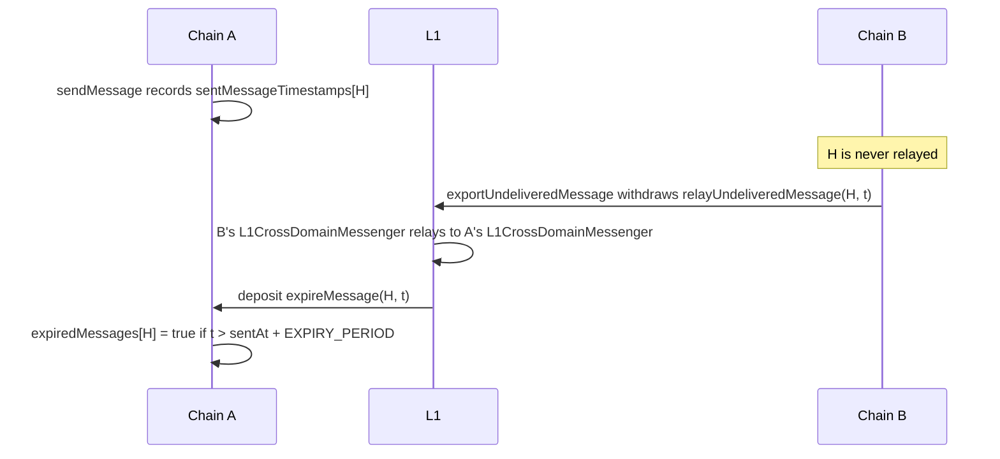

# Message Expiry

<!-- START doctoc generated TOC please keep comment here to allow auto update -->
<!-- DON'T EDIT THIS SECTION, INSTEAD RE-RUN doctoc TO UPDATE -->
**Table of Contents**

- [Overview](#overview)
- [Flow](#flow)
- [L1CrossDomainMessenger](#l1crossdomainmessenger)
- [Safety](#safety)
- [Activation](#activation)

<!-- END doctoc generated TOC please keep comment here to allow auto update -->

## Overview

Executing messages cannot be included through deposit transactions (see
[Depositing an Executing Message](./derivation.md#depositing-an-executing-message)). A destination chain's sequencer
that refuses to relay a message can therefore keep it from ever being delivered. Once the
[expiry window](./derivation.md#expiry-window) has passed, no valid block can relay the message at all.

Message expiry lets the source chain learn that a message can never be delivered, using only withdrawals and
deposits, which a sequencer cannot censor. The source chain's `L2ToL2CrossDomainMessenger` records this per message
in `expiredMessages`, and applications can undo the send, as
[`SuperchainETHBridge.refundETH`](./superchain-eth-bridge.md#refundeth) does.

## Flow

For a message `H` sent from chain A to chain B and never relayed on B:

1. On A, `L2ToL2CrossDomainMessenger.sendMessage` records `sentMessageTimestamps[H]`.
2. On B, anyone calls [`UndeliveredMessageExporter.exportUndeliveredMessage`](./predeploys.md#undeliveredmessageexporter)
   with the message's preimage and A's `L1CrossDomainMessenger`. The exporter computes `H` with B as the
   destination, checks that B has not relayed it, and sends `relayUndeliveredMessage(H, t)` through B's
   `L2CrossDomainMessenger`, where `t` is B's block timestamp. This is not an executing message, so it can be
   included through a deposit if B censors it.
3. On L1, once the withdrawal is proven and finalized, B's `L1CrossDomainMessenger` relays it to A's
   [`L1CrossDomainMessenger.relayUndeliveredMessage`](#l1crossdomainmessenger), which sends
   `expireMessage(H, t)` to A as a deposit.
4. On A, [`expireMessage`](./predeploys.md#expiremessage-invariants) marks `H` expired if
   `t > sentMessageTimestamps[H] + EXPIRY_PERIOD`.
5. On A, applications read `expiredMessages(H)` to undo the send.



## L1CrossDomainMessenger

```solidity
function relayUndeliveredMessage(bytes32 _messageHash, uint256 _undeliveredAt) external;
```

- It MUST revert unless this chain's `SystemConfig` has the `INTEROP` feature enabled.
- It MUST revert unless the caller is a real `L1CrossDomainMessenger`: the `SystemConfig` of the caller's portal
  MUST name the caller as its `l1CrossDomainMessenger`.
- It MUST revert unless the caller's portal is authorized by this chain's `ETHLockbox`.
- It MUST revert unless the caller's `xDomainMessageSender()` is the
  [`UndeliveredMessageExporter`](./predeploys.md#undeliveredmessageexporter).
- It MUST send `L2ToL2CrossDomainMessenger.expireMessage(_messageHash, _undeliveredAt)` to this chain as a
  deposit, as itself, with a fixed minimum gas limit.

The `L1CrossDomainMessenger` refuses to relay messages that target itself, so `relayUndeliveredMessage` is the only
way it can be the sender of a message on L2. If the call runs out of gas, it is recorded in the calling
messenger's failed messages and can be replayed.

## Safety

A refund MUST NOT be possible for a message that was or can still be relayed. This holds because:

- An executing message is invalid if its block timestamp is more than the expiry window after the timestamp of
  its initiating message (see [Message Expiry Invariant](./messaging.md#message-expiry-invariant)).
  `sentMessageTimestamps[H]` is that initiating timestamp, and it is written once.
- The exporter on B attests that `H` was not relayed by B's timestamp `t`. Any later block on B has a timestamp of
  at least `t`. If `t > sentMessageTimestamps[H] + EXPIRY_PERIOD` and `EXPIRY_PERIOD` is at least the expiry
  window, no later block can relay `H`.
- Only B can attest for `H`, because the exporter hashes the message with its own chain id as the destination.
- Only chains whose portals A's `ETHLockbox` authorizes can attest. Each of them can already withdraw A's ETH.
- The trusted L2 sender is the `UndeliveredMessageExporter`, whose proxy had no implementation before the upgrade
  that introduced it, so no withdrawal from it can predate that upgrade.

The `L2ToL2CrossDomainMessenger` MUST NOT re-emit a `SentMessage` event for a message, and every way of relaying a
message MUST set `successfulMessages`. An upgrade that breaks either rule breaks this argument.

## Activation

- Every node and the proof program MUST enforce an [expiry window](./derivation.md#expiry-window) of at most
  `EXPIRY_WINDOW` (7 days) before expiry is relied on. On production networks `EXPIRY_PERIOD` is 8 days, the
  window plus a day of margin; on any network it MUST exceed the network's expiry window.
- The network upgrade that activates interop MUST install an `L2ToL2CrossDomainMessenger` with expiry and the
  `UndeliveredMessageExporter`. A frozen upgrade bundle for that fork that was snapshotted before these contracts
  existed MUST be snapshotted again first, so that no `L2ToL2CrossDomainMessenger` without expiry, which could
  resend a message after it expired, is ever live on a chain with expiry.
- Every chain in a cluster's dependency set MUST be authorized by the cluster's `ETHLockbox` and run the
  `UndeliveredMessageExporter`. Otherwise messages sent to it cannot expire.
- Messages sent before the upgrade have no send timestamp and can never expire.
