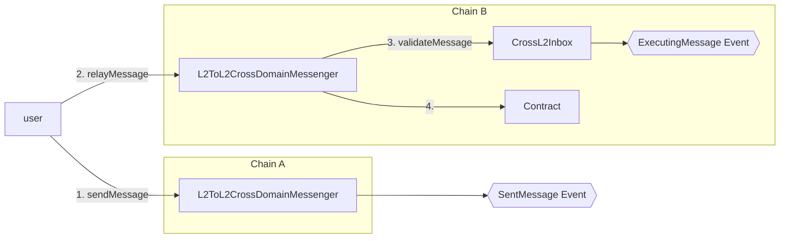
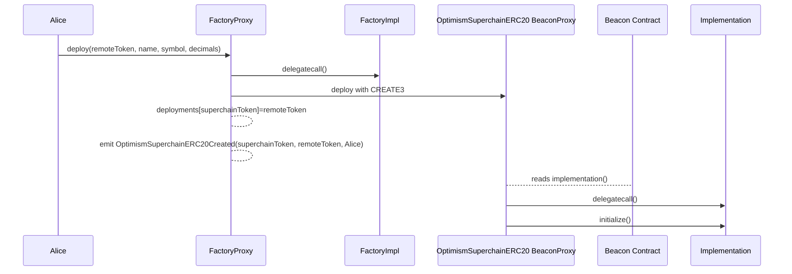
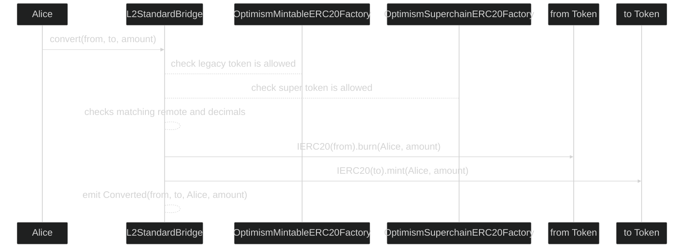
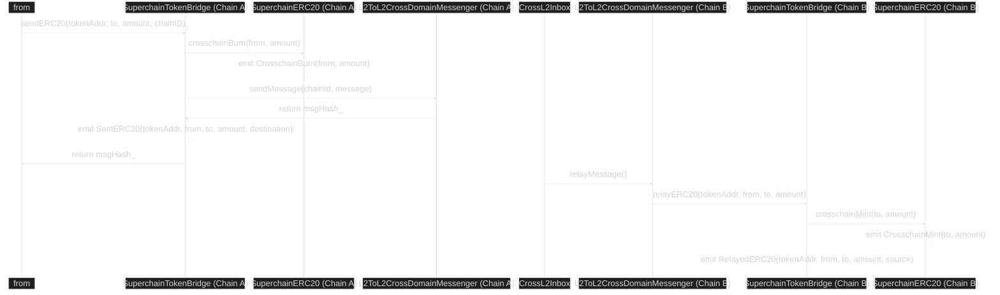

# Predeploys

<!-- START doctoc generated TOC please keep comment here to allow auto update -->
<!-- DON'T EDIT THIS SECTION, INSTEAD RE-RUN doctoc TO UPDATE -->

**Table of Contents**

- [Predeploys](#predeploys)
  - [Overview](#overview)
  - [CrossL2Inbox](#crossl2inbox)
    - [Access-list](#access-list)
      - [type 1: Lookup identity](#type-1-lookup-identity)
      - [type 2: Chain-ID extension](#type-2-chain-id-extension)
      - [type 3: Checksum](#type-3-checksum)
    - [Functions](#functions)
      - [validateMessage](#validatemessage)
    - [`ExecutingMessage` Event](#executingmessage-event)
    - [Reference implementation](#reference-implementation)
    - [Deposit Handling](#deposit-handling)
    - [`Identifier` Getters](#identifier-getters)
  - [L2ToL2CrossDomainMessenger](#l2tol2crossdomainmessenger)
    - [`relayMessage` Invariants](#relaymessage-invariants)
    - [`sendMessage` Invariants](#sendmessage-invariants)
    - [`reEmitMessage` Invariants](#reemitmessage-invariants)
    - [Message Versioning](#message-versioning)
    - [No Native Support for Cross Chain Ether Sends](#no-native-support-for-cross-chain-ether-sends)
    - [Interfaces](#interfaces)
      - [Sending Messages](#sending-messages)
    - [Re-emitting Messages](#re-emitting-messages)
      - [Relaying Messages](#relaying-messages)
  - [OptimismSuperchainERC20Factory](#optimismsuperchainerc20factory)
    - [OptimismSuperchainERC20](#optimismsuperchainerc20)
    - [Overview](#overview-1)
      - [Proxy](#proxy)
      - [Beacon Pattern](#beacon-pattern)
      - [Deployment history](#deployment-history)
    - [Functions](#functions-1)
      - [`deploy`](#deploy)
    - [Events](#events)
      - [`OptimismSuperchainERC20Created`](#optimismsuperchainerc20created)
    - [Deployment Flow](#deployment-flow)
  - [OptimismSuperchainERC20Beacon](#optimismsuperchainerc20beacon)
    - [Overview](#overview-2)
  - [OptimismMintableERC20Factory](#optimismmintableerc20factory)
    - [OptimismMintableERC20](#optimismmintableerc20)
    - [Updates](#updates)
    - [Functions](#functions-2)
      - [`createOptimismMintableERC20WithDecimals`](#createoptimismmintableerc20withdecimals)
      - [`createOptimismMintableERC20`](#createoptimismmintableerc20)
      - [`createStandardL2Token`](#createstandardl2token)
    - [Events](#events-1)
      - [`OptimismMintableERC20Created`](#optimismmintableerc20created)
      - [`StandardL2TokenCreated`](#standardl2tokencreated)
  - [L2StandardBridge](#l2standardbridge)
    - [Updates](#updates-1)
      - [convert](#convert)
      - [`Converted`](#converted)
    - [Invariants](#invariants)
    - [Conversion Flow](#conversion-flow)
  - [SuperchainTokenBridge](#superchaintokenbridge)
    - [Overview](#overview-3)
    - [Functions](#functions-3)
      - [`sendERC20`](#senderc20)
      - [`relayERC20`](#relayerc20)
    - [Events](#events-2)
      - [`SentERC20`](#senterc20)
      - [`RelayedERC20`](#relayederc20)
    - [Diagram](#diagram)
    - [Invariants](#invariants-1)
  - [Security Considerations](#security-considerations)

<!-- END doctoc generated TOC please keep comment here to allow auto update -->

## Overview

Four new system level predeploys are introduced for managing cross chain messaging and tokens, along with
an update to the `OptimismMintableERC20Factory` and `L2StandardBridge` contracts with additional functionalities.

## CrossL2Inbox

| Constant | Value                                        |
| -------- | -------------------------------------------- |
| Address  | `0x4200000000000000000000000000000000000022` |

The `CrossL2Inbox` is the system predeploy for cross chain messaging. Anyone can trigger the execution or validation
of cross chain messages, on behalf of any user.

To ensure safety of the protocol, the [Message Invariants](./messaging.md#messaging-invariants) must be enforced.

[`Identifier`]: ./messaging.md#message-identifier

### Access-list

Execution of messages is statically pre-declared in transactions,
to ensure the cross-chain validity can be verified outside the single-chain EVM environment constraints.

After pre-verification of the access-list, the `CrossL2Inbox` can allow messages
to execute when there is a matching pre-verified access-list entry.

Each executing message is declared with 3 typed access-list entries:

- 1: Lookup identity
- 2: Chain-ID extension
- 3: Checksum

The type of entry is encoded in the first byte.
Type 0 is reserved, so valid access-list entries are always non-zero.

Note that the access-list entries may be de-duplicated:
the same message may be executed multiple times.

The access-list content might not always be a multiple of 3.

The access-list content is ordered:

- after type 1, a type 2 or 3 entry is expected.
- after type 2, a type 3 entry is expected.

Note that type 1 and 2 are only enforced out-of-protocol:
these provide a hint, for viable block-building,
to lookup data to determine the validity of the checksum without prior transaction execution.

Not every access-list entry may be executed:
access-list content must not be used by applications to interpret results of transactions,
the `ExecutingMessage` event describes in detail what is executed.

To prevent cross-contamination of access-list contents,
the checksum entry commits to the contents of the other entries.
The checksum will be invalid if the wrong entries are interpreted with it.

The `CrossL2Inbox` only checks the checksum is present in the access-list:
the presence of other needed entries is enforced during pre-validation.

#### type 1: Lookup identity

Packed attributes for message lookup.
This type of entry serves as hint of the message identity,
for verification of the `checksum` and is not verified in the protocol state-transition or fork-choice.

```text
0..1: type byte, always 0x01
1..4: reserved, zeroed by default
4..12: big-endian uint64 chain ID
12..16: big-endian uint64, block number
16..24: big-endian uint64, timestamp
24..32: big-endian uint32, log index
```

Chain IDs larger than `uint64` are supported, with an additional chain-ID-extension entry.
The lower 64 bits of the chain-ID are always encoded in the lookup entry.

#### type 2: Chain-ID extension

Large `uint256` Chain IDs are represented with an extension entry,
included right after the lookup identity entry.
Like the lookup identity entry, this entry-type is not verified in the protocol state-transition or fork-choice.

This extension entry does not have to be included for chain-IDs that fit in `uint64`.

```text
0..1: type byte, always 0x02
1..8: zero bytes
8..32: upper 24 bytes of big-endian uint256 chain-ID
```

#### type 3: Checksum

The checksum is a versioned hash, committing to implied attributes.
These implied attributes are compared against the full version
of the executing message by recomputing the checksum from the full version.
The full version is retrieved based on the preceding lookup entry and optional chain-ID extension.

The checksum is iteratively constructed:
this allows services to work with intermediate implied data.
E.g. the supervisor does not persist the `origin` or `msgHash`,
but does store a `logHash`.

```text
# Syntax:
#   H(bytes): keccak256 hash function
#   ++: bytes concatenation
logHash = H(bytes20(idOrigin) ++ msgHash)
# This matches the trailing part of the lookupID
idPacked = bytes12(0) ++ idBlockNumber ++ idTimestamp ++ idLogIndex
idLogHash = H(logHash ++ idPacked)
bareChecksum = H(idLogHash ++ idChainID)
typeByte = 0x03
checksum = typeByte ++ bareChecksum[1:]
```

### Functions

#### validateMessage

A helper to enable contracts to provide their own public entrypoints for cross chain interactions.
Emits the `ExecutingMessage` event to signal the transaction has a cross chain message to validate.

The following fields are required for validating a cross chain message:

| Name       | Type         | Description                                                                |
| ---------- | ------------ | -------------------------------------------------------------------------- |
| `_id`      | `Identifier` | A [`Identifier`] pointing to the initiating message.                       |
| `_msgHash` | `bytes32`    | The keccak256 hash of the message payload matching the initiating message. |

```solidity
function validateMessage(Identifier calldata _id, bytes32 _msgHash)
```

### `ExecutingMessage` Event

The `ExecutingMessage` event represents an executing message. It MUST be emitted on every call
to `validateMessage`.

```solidity
event ExecutingMessage(bytes32 indexed msgHash, Identifier identifier);
```

The data encoded in the event contains the keccak hash of the `msg` and the `Identifier`.
The following pseudocode shows the deserialization:

```solidity
bytes32 msgHash = log.topics[1];
Identifier identifier = abi.decode(log.data, (Identifier));
```

Emitting the hash of the message is more efficient than emitting the
message in its entirety. Equality with the initiating message can be handled off-chain through
hash comparison.

### Reference implementation

A simple implementation of the `validateMessage` function is included below.

```solidity
function validateMessage(Identifier calldata _id, bytes32 _msgHash) external {
  bytes32 checksum = calculateChecksum(_id, _msgHash);

  (bool _isSlotWarm,) = _isWarm(checksum);

  if (!_isSlotWarm) revert NonDeclaredExecutingMessage();

  emit ExecutingMessage(_msgHash, _id);
}
```

`calculateChecksum` implements the checksum computation (including type-byte) as defined
in the [access-list checksum computation](#type-3-checksum) spec.

`_isWarm` checks that the access-list prepared the `checksum` storage key to be warm.
**No other contract function may warm up this storage without message validation.**

An example of a custom entrypoint utilizing `validateMessage` to consume a known
event. Note that in this example, the contract is consuming its own event
from another chain, however **any** event emitted from **any** contract is consumable!

```solidity
contract MyCrossChainApp {
    event MyCrossChainEvent();

    function sendMessage() external {
        emit MyCrossChainEvent();
    }

    function relayMessage(Identifier calldata _id, bytes calldata _msg) external {
        // Example app-level validation
        //  - Expected event via the selector (first topic)
        //  - Assertion on the expected emitter of the event
        require(MyCrossChainEvent.selector == _msg[:32]);
        require(_id.origin == address(this));

        // Authenticate this cross chain message
        CrossL2Inbox.validateMessage(_id, keccak256(_msg));

        // ABI decode the event message & perform actions.
        // ...
    }
}
```

### Deposit Handling

Any call to the `CrossL2Inbox` that would emit an `ExecutingMessage` event will revert if the
transaction did not declare an access list including the message checksum, as
[described above](#type-3-checksum). Because deposit transactions do not have access lists,
all calls to the `CrossL2Inbox` originating within a deposit transaction will revert.

### `Identifier` Getters

The `Identifier` MUST be exposed via `public` getters so that contracts can call back to authenticate
properties about the `_msg`.

## L2ToL2CrossDomainMessenger

| Constant          | Value                                        |
| ----------------- | -------------------------------------------- |
| Address           | `0x4200000000000000000000000000000000000023` |
| `MESSAGE_VERSION` | `uint256(0)`                                 |

The `L2ToL2CrossDomainMessenger` is a higher level abstraction on top of the `CrossL2Inbox` that
provides general message passing, utilized for secure transfers ERC20 tokens between L2 chains.
Messages sent through the `L2ToL2CrossDomainMessenger` on the source chain receive both replay protection
as well as domain binding, i.e. the executing transaction can only be valid on a single chain.

### `relayMessage` Invariants

- The `Identifier.origin` MUST be `address(L2ToL2CrossDomainMessenger)`
- The `_destination` chain id MUST be equal to the local chain id
- Messages MUST NOT be relayed more than once

### `sendMessage` Invariants

- Sent Messages MUST be uniquely identifiable
- It MUST store the message hash in the `sentMessages` mapping
- It MUST emit the `SentMessage` event

### `reEmitMessage` Invariants

- It MUST NOT be possible to re-emit a message that has not been sent
- It MUST emit the `SentMessage` event

### Message Versioning

Versioning is handled in the most significant bits of the nonce, similarly to how it is handled by
the `CrossDomainMessenger`.

```solidity
function messageNonce() public view returns (uint256) {
    return Encoding.encodeVersionedNonce(nonce, MESSAGE_VERSION);
}
```

### No Native Support for Cross Chain Ether Sends

To enable interoperability between chains that use a custom gas token, there is no native support for
sending `ether` between chains. `ether` must first be wrapped into WETH before sending between chains.
See [SuperchainWETH](./superchain-weth.md) for more information.

### Interfaces

The `L2ToL2CrossDomainMessenger` uses a similar interface to the `L2CrossDomainMessenger`, but
the `_minGasLimit` is removed to prevent complexity around EVM gas introspection and the `_destination`
chain is included instead.

#### Sending Messages

The following function is used for sending messages between domains:

```solidity
function sendMessage(uint256 _destination, address _target, bytes calldata _message) external returns (bytes32);
```

It returns the hash of the message being sent,
which is used to track whether the message has successfully been relayed.
It also emits a `SentMessage` event with the necessary metadata to execute when relayed on the destination chain.

```solidity
event SentMessage(uint256 indexed destination, address indexed target, uint256 indexed messageNonce, address sender, bytes message);
```

An explicit `_destination` chain and `nonce` are used to ensure that the message can only be played on a single remote
chain a single time. The `_destination` is enforced to not be the local chain to avoid edge cases.

There is no need for address aliasing as the aliased address would need to commit to the source chain's chain id
to create a unique alias that commits to a particular sender on a particular domain and it is far more simple
to assert on both the address and the source chain's chain id rather than assert on an unaliased address.
In both cases, the source chain's chain id is required for security. Executing messages will never be able to
assume the identity of an account because `msg.sender` will never be the identity that initiated the message,
it will be the `L2ToL2CrossDomainMessenger` and users will need to callback to get the initiator of the message.

The `_destination` MUST NOT be the chain-ID of the local chain and a locally defined `nonce` MUST increment on
every call to `sendMessage`.

Note that `sendMessage` is not `payable`.

### Re-emitting Messages

The `reEmitMessage` function is used to re-emit a the `SentMessage` event for a message that has already been sent.
It will calculate the message hash using the inputs, and check that the message hash is stored in the `sentMessages`
mapping prior to emitting the `SentMessage` event.

```solidity
    function reEmitMessageSent(
        uint256 _destination,
        uint256 _nonce,
        address _sender,
        address _target,
        bytes calldata _message
    )
        external;
```

#### Relaying Messages

The following diagram shows the flow for sending a cross chain message using the `L2ToL2CrossDomainMessenger`.
Each subsequent call is labeled with a number.



When relaying a message through the `L2ToL2CrossDomainMessenger`, it is important to require that
the `_destination` be equal to `block.chainid` to ensure that the message is only valid on a single
chain. The hash of the message is used for replay protection.

It is important to ensure that the source chain is in the dependency set of the destination chain, otherwise
it is possible to send a message that is not playable.

A message is relayed by providing the [identifier](./messaging.md#message-identifier) of a `SentMessage`
event along with its corresponding [message payload](./messaging.md#message-payload).

```solidity
function relayMessage(ICrossL2Inbox.Identifier calldata _id, bytes calldata _sentMessage) external payable returns (bytes memory returnData_) {
    require(_id.origin == Predeploys.L2_TO_L2_CROSS_DOMAIN_MESSENGER);
    CrossL2Inbox(Predeploys.CROSS_L2_INBOX).validateMessage(_id, keccak256(_sentMessage));

    // log topics
    (bytes32 selector, uint256 _destination, address _target, uint256 _nonce) =
        abi.decode(_sentMessage[:128], (bytes32,uint256,address,uint256));

    require(selector == SentMessage.selector);
    require(_destination == block.chainid);

    // log data
    (address _sender, bytes memory _message) = abi.decode(_sentMessage[128:], (address,bytes));

    bool success;
    (success, returnData_) = _target.call(_target, msg.value, _message);
    require(success);
    successfulMessages[messageHash] = true;
    emit RelayedMessage(_source, _nonce, messageHash);
}
```

Note that the `relayMessage` function is `payable` to enable relayers to earn in the gas paying asset.

To enable cross chain authorization patterns, both the `_sender` and the `_source` MUST be exposed via `public`
getters.

## OptimismSuperchainERC20Factory

| Constant | Value                                        |
| -------- | -------------------------------------------- |
| Address  | `0x4200000000000000000000000000000000000026` |

### OptimismSuperchainERC20

The `OptimismSuperchainERC20Factory` creates ERC20 contracts that implements the `SuperchainERC20` [standard](token-bridging.md),
grants mint-burn rights to the `L2StandardBridge` (`OptimismSuperchainERC20`)
and includes a `remoteToken` variable.
These ERC20s are called `OptimismSuperchainERC20` and can be converted back and forth with `OptimismMintableERC20` tokens.
The goal of the `OptimismSuperchainERC20` is to extend functionalities
of the `OptimismMintableERC20` so that they are interop compatible.

### Overview

Anyone can deploy `OptimismSuperchainERC20` contracts by using the `OptimismSuperchainERC20Factory`.

#### Proxy

The `OptimismSuperchainERC20Factory` MUST be a proxied predeploy.
It follows the
[`Proxy.sol` implementation](https://github.com/ethereum-optimism/optimism/blob/v1.1.4/packages/contracts-bedrock/src/universal/Proxy.sol)
and `delegatecall()` to the factory implementation address.

#### Beacon Pattern

It MUST deploy `OptimismSuperchainERC20` as
[BeaconProxies](https://github.com/OpenZeppelin/openzeppelin-contracts/blob/master/contracts/proxy/beacon/BeaconProxy.sol),
as this is the easiest way to upgrade multiple contracts simultaneously.
Each BeaconProxy delegatecalls to the implementation address provided by the Beacon Contract.

The implementation MUST include an `initialize` function that
receives `(address _remoteToken, string _name, string _symbol, uint8 _decimals)` and stores these in the BeaconProxy storage.

#### Deployment history

The `L2StandardBridge` includes a `convert()` function that allows anyone to convert
between any `OptimismMintableERC20` and its corresponding `OptimismSuperchainERC20`.
For this method to work, the `OptimismSuperchainERC20Factory` MUST include a deployment history.

### Functions

#### `deploy`

Creates an instance of the `OptimismSuperchainERC20` contract with a set of metadata defined by:

- `_remoteToken`: address of the underlying token in its native chain.
- `_name`: `OptimismSuperchainERC20` name
- `_symbol`: `OptimismSuperchainERC20` symbol
- `_decimals`: `OptimismSuperchainERC20` decimals

```solidity
function deploy(address _remoteToken, string memory _name, string memory _symbol, uint8 _decimals) returns (address)
```

It returns the address of the deployed `OptimismSuperchainERC20`.

The function MUST use `CREATE3` to deploy its children.
This ensures the same address deployment across different chains,
which is necessary for the [standard](token-bridging.md) implementation.

The salt used for deployment MUST be computed by applying `keccak256` to the `abi.encode`
of the input parameters (`_remoteToken`, `_name`, `_symbol`, and `_decimals`).
This implies that the same L1 token can have multiple `OptimismSuperchainERC20` representations as long as the metadata changes.

The function MUST store the `_remoteToken` address for each deployed `OptimismSuperchainERC20` in a `deployments` mapping.

### Events

#### `OptimismSuperchainERC20Created`

It MUST trigger when `deploy` is called.

```solidity
event OptimismSuperchainERC20Created(address indexed superchainToken, address indexed remoteToken, address deployer);
```

where `superchainToken` is the address of the newly deployed `OptimismSuperchainERC20`,
`remoteToken` is the address of the corresponding token in L1,
and deployer`is the`msg.sender`.

### Deployment Flow



## OptimismSuperchainERC20Beacon

| Constant | Value                                        |
| -------- | -------------------------------------------- |
| Address  | `0x4200000000000000000000000000000000000027` |

### Overview

The `OptimismSuperchainERC20Beacon` predeploy gets called by the `OptimismSuperchainERC20`
BeaconProxies deployed by the
[`SuperchainERC20Factory`](#optimismsuperchainerc20factory)

The Beacon Contract implements the interface defined
in [EIP-1967](https://eips.ethereum.org/EIPS/eip-1967).

The implementation address gets deduced similarly to the `GasPriceOracle` address in Ecotone and Fjord updates.

## OptimismMintableERC20Factory

| Constant | Value                                        |
| -------- | -------------------------------------------- |
| Address  | `0x4200000000000000000000000000000000000012` |

### OptimismMintableERC20

The `OptimismMintableERC20Factory` creates ERC20 contracts on L2 that can be used to deposit
native L1 tokens into (`OptimismMintableERC20`). Anyone can deploy `OptimismMintableERC20` contracts.

Each `OptimismMintableERC20` contract created by the `OptimismMintableERC20Factory`
allows for the `L2StandardBridge` to mint
and burn tokens, depending on whether the user is
depositing from L1 to L2 or withdrawing from L2 to L1.

### Updates

The `OptimismMintableERC20Factory` is updated to include a `deployments` mapping
that stores the `remoteToken` address for each deployed `OptimismMintableERC20`.
This is essential for the liquidity migration process defined in the liquidity migration spec.

### Functions

#### `createOptimismMintableERC20WithDecimals`

Creates an instance of the `OptimismMintableERC20` contract with a set of metadata defined by:

- `_remoteToken`: address of the underlying token in its native chain.
- `_name`: `OptimismMintableERC20` name
- `_symbol`: `OptimismMintableERC20` symbol
- `_decimals`: `OptimismMintableERC20` decimals

```solidity
createOptimismMintableERC20WithDecimals(address _remoteToken, string memory _name, string memory _symbol, uint8 _decimals) returns (address)
```

**Invariants**

- The function MUST use `CREATE2` to deploy new contracts.
- The salt MUST be computed by applying `keccak256` to the `abi.encode`
  of the four input parameters (`_remoteToken`, `_name`, `_symbol`, and `_decimals`).
  This ensures a unique `OptimismMintableERC20` for each set of ERC20 metadata.
- The function MUST store the `_remoteToken` address for each deployed `OptimismMintableERC20` in a `deployments` mapping.

#### `createOptimismMintableERC20`

Creates an instance of the `OptimismMintableERC20` contract with a set of metadata defined
by `_remoteToken`, `_name` and `_symbol` and fixed `decimals` to the standard value 18.

```solidity
createOptimismMintableERC20(address _remoteToken, string memory _name, string memory _symbol) returns (address)
```

#### `createStandardL2Token`

Creates an instance of the `OptimismMintableERC20` contract with a set of metadata defined
by `_remoteToken`, `_name` and `_symbol` and fixed `decimals` to the standard value 18.

```solidity
createStandardL2Token(address _remoteToken, string memory _name, string memory _symbol) returns (address)
```

This function exists for backwards compatibility with the legacy version.

### Events

#### `OptimismMintableERC20Created`

It MUST trigger when `createOptimismMintableERC20WithDecimals`,
`createOptimismMintableERC20` or `createStandardL2Token` is called.

```solidity
event OptimismMintableERC20Created(address indexed localToken, address indexed remoteToken, address deployer);
```

#### `StandardL2TokenCreated`

It MUST trigger when `createOptimismMintableERC20WithDecimals`,
`createOptimismMintableERC20` or `createStandardL2Token` is called.
This event exists for backward compatibility with legacy version.

```solidity
event StandardL2TokenCreated(address indexed remoteToken, address indexed localToken);
```

## L2StandardBridge

| Constant | Value                                        |
| -------- | -------------------------------------------- |
| Address  | `0x4200000000000000000000000000000000000010` |

### Updates

The `OptimismMintableERC20` and `L2StandardToken` tokens (_legacy tokens_),
which correspond to locked liquidity in L1, are incompatible with interop.
Legacy token owners must convert into a `OptimismSuperchainERC20` representation that implements the [standard](token-bridging.md),
to move across the Superchain.

The conversion method uses the `L2StandardBridge` mint/burn rights
over the legacy tokens to allow easy migration to and from the
corresponding `OptimismSuperchainERC20`.

#### convert

The `L2StandardBridge` SHOULD add a `convert` public function that
converts `_amount` of `_from` token to `_amount` of `_to` token,
if and only if the token addresses are valid (as defined below).

```solidity
function convert(address _from, address _to, uint256 _amount)
```

The function

1. Checks that `_from` and `_to` addresses are valid, paired and have the same amount of decimals.
2. Burns `_amount` of `_from` from `msg.sender`.
3. Mints `_amount` of `_to` to `msg.sender`.

#### `Converted`

The `L2StandardBridge` SHOULD include a `Converted` event
that MUST trigger when anyone converts tokens
with `convert`.

```solidity
event Converted(address indexed from, address indexed to, address indexed caller, uint256 amount);
```

where `from` is the address of the input token, `to` is the address of the output token,
`caller` is the `msg.sender` of the function call and `amount` is the converted amount.

### Invariants

The `convert` function conserves the following invariants:

- Conservation of amount:
  The burnt amount should match the minted amount.
- Revert for non valid or non paired: `convert` SHOULD revert when called with:
  - Tokens with different decimals.
  - Legacy tokens that are not in the `deployments` mapping from the `OptimismMintableERC20Factory`.
  - `OptimismSuperchainERC20` that are not in the `deployments` mapping from the `OptimismSuperchainERC20Factory`.
  - Legacy tokens and `OptimismSuperchainERC20s`s
    corresponding to different
    remote token addresses.
- Freedom of conversion for valid and paired tokens:
  anyone can convert between allowed legacy representations and
  valid `OptimismSuperchainERC20` corresponding to the same remote token.

### Conversion Flow



## SuperchainTokenBridge

| Constant | Value                                        |
| -------- | -------------------------------------------- |
| Address  | `0x4200000000000000000000000000000000000028` |

### Overview

The `SuperchainTokenBridge` is an abstraction on top of the `L2toL2CrossDomainMessenger`
that facilitates token bridging using interop.
It has mint and burn rights over `SuperchainERC20` tokens
as described in the [token bridging spec](./token-bridging.md).

### Functions

#### `sendERC20`

Initializes a transfer of `_amount` amount of tokens with address `_tokenAddress` to target address `_to` in chain `_chainId`.

It SHOULD burn `_amount` tokens with address `_tokenAddress` and initialize a message to the
`L2ToL2CrossChainMessenger` to mint the `_amount` of the same token
in the target address `_to` at `_chainId` and emit the `SentERC20` event including the `msg.sender` as parameter.

To burn the token, the `sendERC20` function
calls `crosschainBurn` in the token contract,
which is included as part of the the
[`IERC7802` interface](https://github.com/ethereum/ERCs/pull/692)
implemented by the `SuperchainERC20` standard.

Returns the `msgHash_` crafted by the `L2ToL2CrossChainMessenger`.

```solidity
function sendERC20(address _tokenAddress, address _to, uint256 _amount, uint256 _chainId) returns (bytes32 msgHash_)
```

#### `relayERC20`

Process incoming messages IF AND ONLY IF initiated
by the same contract (bridge) address on a different chain
and relayed from the `L2ToL2CrossChainMessenger` in the local chain.
It SHOULD mint `_amount` of tokens with address `_tokenAddress` to address `_to`, as defined in `sendERC20`
and emit an event including the `_tokenAddress`, the `_from` and chain id from the
`source` chain, where `_from` is the `msg.sender` of `sendERC20`.

To mint the token, the `relayERC20` function
calls `crosschainMint` in the token contract,
which is included as part of the the
[`IERC7802` interface](https://github.com/ethereum/ERCs/pull/692)
implemented by the `SuperchainERC20` standard.

```solidity
function relayERC20(address _tokenAddress, address _from, address _to, uint256 _amount)
```

### Events

#### `SentERC20`

MUST trigger when a cross-chain transfer is initiated using `sendERC20`.

```solidity
event SentERC20(address indexed tokenAddress, address indexed from, address indexed to, uint256 amount, uint256 destination)
```

#### `RelayedERC20`

MUST trigger when a cross-chain transfer is finalized using `relayERC20`.

```solidity
event RelayedERC20(address indexed tokenAddress, address indexed from, address indexed to, uint256 amount, uint256 source);
```

### Diagram

The following diagram depicts a cross-chain transfer.



### Invariants

The bridging of `SuperchainERC20` using the `SuperchainTokenBridge` will require the following invariants:

- Conservation of bridged `amount`: The minted `amount` in `relayERC20()` should match the `amount`
  that was burnt in `sendERC20()`, as long as target chain has the initiating chain in the dependency set.
  - Corollary 1: Finalized cross-chain transactions will conserve the sum of `totalSupply`
    and each user's balance for each chain in the Superchain.
  - Corollary 2: Each initiated but not finalized message (included in initiating chain but not yet in target chain)
    will decrease the `totalSupply` and the initiating user balance precisely by the burnt `amount`.
  - Corollary 3: `SuperchainERC20s` should not charge a token fee or increase the balance when moving cross-chain.
  - Note: if the target chain is not in the initiating chain dependency set,
    funds will be locked, similar to sending funds to the wrong address.
    If the target chain includes it later, these could be unlocked.
- Freedom of movement: Users should be able to send and receive tokens in any target
  chain with the initiating chain in its dependency set
  using `sendERC20()` and `relayERC20()`, respectively.
- Unique Messenger: The `sendERC20()` function must exclusively use the `L2toL2CrossDomainMessenger` for messaging.
  Similarly, the `relayERC20()` function should only process messages originating from the `L2toL2CrossDomainMessenger`.
- Unique Address: The `sendERC20()` function must exclusively send a message
  to the same address on the target chain.
  Similarly, the `relayERC20()` function should only process messages originating from the same address.
  - Note: The [`Create2Deployer` preinstall](../protocol/preinstalls.md#create2deployer)
    and the custom Factory will ensure same address deployment.
- Locally initiated: The bridging action should be initialized
  from the chain where funds are located only.
  - This is because the same address might correspond to different users cross-chain.
    For example, two SAFEs with the same address in two chains might have different owners.
    With the prospects of a smart wallet future, it is impossible to assume
    there will be a way to distinguish EOAs from smart wallets.
  - A way to allow for remotely initiated bridging is to include remote approval,
    i.e. approve a certain address in a certain chainId to spend local funds.
- Bridge Events:
  - `sendERC20()` should emit a `SentERC20` event.
  - `relayERC20()` should emit a `RelayedERC20` event.

## Security Considerations

TODO
