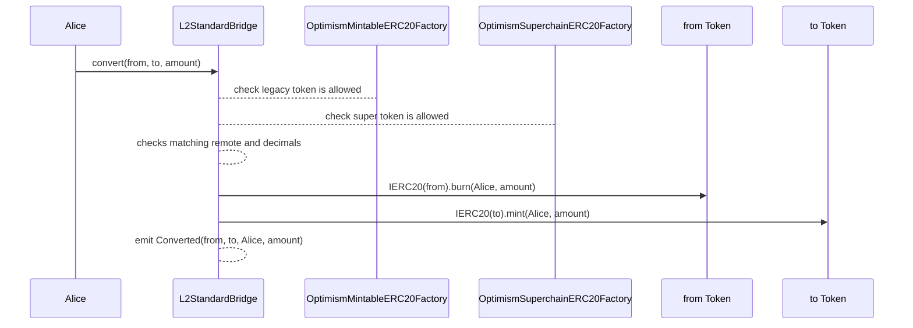
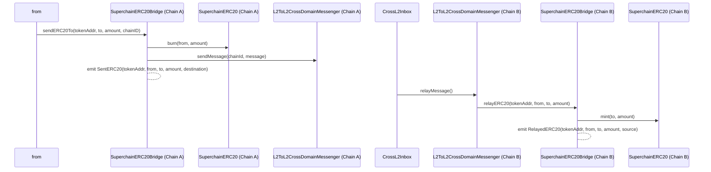

# Predeploys

<!-- START doctoc generated TOC please keep comment here to allow auto update -->
<!-- DON'T EDIT THIS SECTION, INSTEAD RE-RUN doctoc TO UPDATE -->
**Table of Contents**

- [CrossL2Inbox](#crossl2inbox)
  - [Functions](#functions)
    - [executeMessage](#executemessage)
    - [validateMessage](#validatemessage)
  - [Interop Start Timestamp](#interop-start-timestamp)
  - [`ExecutingMessage` Event](#executingmessage-event)
  - [Reference implementation](#reference-implementation)
  - [Deposit Handling](#deposit-handling)
  - [`Identifier` Getters](#identifier-getters)
- [L2ToL2CrossDomainMessenger](#l2tol2crossdomainmessenger)
  - [`relayMessage` Invariants](#relaymessage-invariants)
  - [`sendExpire` Invariants](#sendexpire-invariants)
  - [`relayExpire` Invariants](#relayexpire-invariants)
  - [Message Versioning](#message-versioning)
  - [No Native Support for Cross Chain Ether Sends](#no-native-support-for-cross-chain-ether-sends)
  - [Interfaces](#interfaces)
    - [Sending Messages](#sending-messages)
    - [Relaying Messages](#relaying-messages)
    - [Sending Expired Message Hashes](#sending-expired-message-hashes)
    - [Relaying Expired Message Hashes](#relaying-expired-message-hashes)
- [OptimismSuperchainERC20Factory](#optimismsuperchainerc20factory)
  - [OptimismSuperchainERC20](#optimismsuperchainerc20)
  - [Overview](#overview)
    - [Proxy](#proxy)
    - [Beacon Pattern](#beacon-pattern)
    - [Deployment history](#deployment-history)
  - [Functions](#functions-1)
    - [`deploy`](#deploy)
  - [Events](#events)
    - [`OptimismSuperchainERC20Created`](#optimismsuperchainerc20created)
  - [Deployment Flow](#deployment-flow)
- [BeaconContract](#beaconcontract)
  - [Overview](#overview-1)
- [L1Block](#l1block)
  - [Static Configuration](#static-configuration)
  - [Dependency Set](#dependency-set)
  - [Deposit Context](#deposit-context)
  - [`isDeposit()`](#isdeposit)
    - [`depositsComplete()`](#depositscomplete)
- [OptimismMintableERC20Factory](#optimismmintableerc20factory)
  - [OptimismMintableERC20](#optimismmintableerc20)
  - [Updates](#updates)
  - [Functions](#functions-2)
    - [`createOptimismMintableERC20WithDecimals`](#createoptimismmintableerc20withdecimals)
    - [`createOptimismMintableERC20`](#createoptimismmintableerc20)
    - [`createStandardL2Token`](#createstandardl2token)
  - [Events](#events-1)
    - [`OptimismMintableERC20Created`](#optimismmintableerc20created)
    - [`StandardL2TokenCreated`](#standardl2tokencreated)
- [L2StandardBridge](#l2standardbridge)
  - [Updates](#updates-1)
    - [convert](#convert)
    - [`Converted`](#converted)
  - [Invariants](#invariants)
  - [Conversion Flow](#conversion-flow)
- [SuperchainERC20Bridge](#superchainerc20bridge)
  - [Overview](#overview-2)
  - [Functions](#functions-3)
    - [`sendERC20`](#senderc20)
    - [`relayERC20`](#relayerc20)
  - [Events](#events-2)
    - [`SentERC20`](#senterc20)
    - [`RelayedERC20`](#relayederc20)
  - [Diagram](#diagram)
  - [Invariants](#invariants-1)
- [Security Considerations](#security-considerations)

<!-- END doctoc generated TOC please keep comment here to allow auto update -->

Four new system level predeploys are introduced for managing cross chain messaging and tokens, along with
an update to the `L1Block`, `OptimismMintableERC20Factory` and `L2StandardBridge` contracts with additional functionalities.

## CrossL2Inbox

| Constant | Value                                        |
| -------- | -------------------------------------------- |
| Address  | `0x4200000000000000000000000000000000000022` |

The `CrossL2Inbox` is the system predeploy for cross chain messaging. Anyone can trigger the execution or validation
of cross chain messages, on behalf of any user.

To ensure safety of the protocol, the [Message Invariants](./messaging.md#messaging-invariants) must be enforced.

[message payload]: ./messaging.md#message-payload
[`Identifier`]: ./messaging.md#message-identifier

### Functions

#### executeMessage

Executes a cross chain message and performs a `CALL` with the payload to the provided target address, allowing
introspection of the data.
Signals the transaction has a cross chain message to validate by emitting the `ExecuteMessage` event.

The following fields are required for executing a cross chain message:

| Name      | Type         | Description                                             |
| --------- | ------------ | ------------------------------------------------------- |
| `_msg`    | `bytes`      | The [message payload], matching the initiating message. |
| `_id`     | `Identifier` | A [`Identifier`] pointing to the initiating message.    |
| `_target` | `address`    | Account that is called with `_msg`.                     |

Messages are broadcast, not directed. Upon execution the caller can specify which `address` to target:
there is no protocol enforcement on what this value is.

The `_target` is called with the `_msg` as input.
In practice, the `_target` will be a contract that needs to know the schema of the `_msg` so that it can be decoded.
It MAY call back to the `CrossL2Inbox` to authenticate
properties about the `_msg` using the information in the `Identifier`.

```solidity
executeMessage(Identifier calldata _id, address _target, bytes memory _message)
```

#### validateMessage

A helper to enable contracts to provide their own public entrypoints for cross chain interactions.
Emits the `ExecutingMessage` event to signal the transaction has a cross chain message to validate.

The following fields are required for validating a cross chain message:

| Name     | Type       | Description                                                                |
| -------- | ---------- | -------------------------------------------------------------------------- |
| `_id`      | Identifier | A [`Identifier`] pointing to the initiating message.                         |
| `_msgHash` | `bytes32`    | The keccak256 hash of the message payload matching the initiating message. |

```solidity
validateMessage(Identifier calldata _id, bytes32 _msgHash)
```

### Interop Start Timestamp

The Interop Start Timestamp represents the earliest timestamp which an initiating message (identifier) can have to be
considered valid. This is important because OP Mainnet migrated from a legacy system that is not provable. We cannot
allow for interop messages to come from unproven parts of the chain history, since interop is secured by fault proofs.

Interop Start Timestamp is stored in the storage of the CrossL2Inbox predeploy. During the Interop Network Upgrade,
each chain sets variable via a call to `setInteropStart()` by the `DEPOSITOR_ACCOUNT` which sets Interop Start Timestamp
to be the block.timestamp of the network upgrade block. Chains deployed after the network upgrade will have to enshrine
that timestamp into the pre-determined storage slot.

### `ExecutingMessage` Event

The `ExecutingMessage` event represents an executing message. It MUST be emitted on every call
to `executeMessage` and `validateMessage`.

```solidity
event ExecutingMessage(bytes32 indexed msgHash, Identifier identifier);
```

The data encoded in the event contains the keccak hash of the `msg` and the `Identifier`.
The following pseudocode shows the deserialization:

```solidity
bytes32 msgHash = log.topics[1];
Identifier identifier = abi.decode(log.data, (Identifier));
```

Emitting the hash of the message is more efficient than emitting the
message in its entirety. Equality with the initiating message can be handled off-chain through
hash comparison.

### Reference implementation

A simple implementation of the `executeMessage` function is included below.

```solidity
function executeMessage(Identifier calldata _id, address _target, bytes calldata _msg) public payable {
    require(_id.timestamp <= block.timestamp);
    require(L1Block.isInDependencySet(_id.chainid));
    require(_id.timestamp > interopStart());

    assembly {
      tstore(ORIGIN_SLOT, _id.origin)
      tstore(BLOCKNUMBER_SLOT, _id.blocknumber)
      tstore(LOG_INDEX_SLOT, _id.logIndex)
      tstore(TIMESTAMP_SLOT, _id.timestamp)
      tstore(CHAINID_SLOT, _id.chainid)
    }

    bool success = SafeCall.call({
      _target: _target,
      _value: msg.value,
      _calldata: _msg
    });

    require(success);

    emit ExecutingMessage(keccak256(_msg), _id);
}
```

Note that the `executeMessage` function is `payable` to enable relayers to earn in the gas paying asset.

An example of encoding a cross chain call directly in an event. However realize the
[L2ToL2CrossDomainMessenger](#l2tol2crossdomainmessenger) predeploy provides a cleaner and user
friendly abstraction for cross chain calls.

```solidity
contract MyCrossChainApp {
    function sendMessage() external {
        bytes memory data = abi.encodeCall(MyCrossChainApp.relayMessage, (1, address(0x20)));

        // Encoded payload matches the required calldata by omission of an event topic
        assembly {
          log0(add(data, 0x20), mload(data))
        }
    }

    function relayMessage(uint256 value, address recipient) external {
        // Assert that this is only executed directly from the inbox
        require(msg.sender == Predeploys.CrossL2Inbox);
    }
}
```

An example of a custom entrypoint utilizing `validateMessage` to consume a known
event. Note that in this example, the contract is consuming its own event
from another chain, however **any** event emitted from **any** contract is consumable!

```solidity
contract MyCrossChainApp {
    event MyCrossChainEvent();

    function sendMessage() external {
        emit MyCrossChainEvent();
    }

    function relayMessage(Identifier calldata _id, bytes calldata _msg) external {
        // Example app-level validation
        //  - Expected event via the selector (first topic)
        //  - Assertion on the expected emitter of the event
        require(MyCrossChainEvent.selector == _msg[:32]);
        require(_id.origin == address(this));

        // Authenticate this cross chain message
        CrossL2Inbox.validateMessage(_id, keccak256(_msg));

        // ABI decode the event message & perform actions.
        // ...
    }
}
```

### Deposit Handling

Any call to the `CrossL2Inbox` that would emit an `ExecutingMessage` event will reverts
if the call is made in a [deposit context](./derivation.md#deposit-context).
The deposit context status can be determined by calling `isDeposit` on the `L1Block` contract.

In the future, deposit handling will be modified to be more permissive.
It will revert only in specific cases where interop dependency resolution is not feasible.

### `Identifier` Getters

The `Identifier` MUST be exposed via `public` getters so that contracts can call back to authenticate
properties about the `_msg`.

## L2ToL2CrossDomainMessenger

| Constant          | Value                                        |
| ----------------- | -------------------------------------------- |
| Address           | `0x4200000000000000000000000000000000000023` |
| `MESSAGE_VERSION` | `uint256(0)`                                 |
| `EXPIRY_WINDOW`   | `uint256(7200)`                              |

The `L2ToL2CrossDomainMessenger` is a higher level abstraction on top of the `CrossL2Inbox` that
provides general message passing, utilized for secure transfers ERC20 tokens between L2 chains.
Messages sent through the `L2ToL2CrossDomainMessenger` on the source chain receive both replay protection
as well as domain binding, ie the executing transaction can only be valid on a single chain.

### `relayMessage` Invariants

- The `Identifier.origin` MUST be `address(L2ToL2CrossDomainMessenger)`
- The `_destination` chain id MUST be equal to the local chain id

### `sendExpire` Invariants

- The message MUST have not been successfully relayed
- The `EXPIRY_WINDOW` MUST have elapsed since the message first failed to be relayed
- The expired message MUST not have been previously sent back to source
- The expired message MUST not be relayable after being sent back

### `relayExpire` Invariants

- Only callable by the `CrossL2Inbox`
- The message source MUST be `block.chainid`
- The `Identifier.origin` MUST be `address(L2ToL2CrossDomainMessenger)`
- The `expiredMessages` mapping MUST only contain messages that originated in this chain and failed to be relayed on destination.
- Already expired messages MUST NOT be relayed.

### Message Versioning

Versioning is handled in the most significant bits of the nonce, similarly to how it is handled by
the `CrossDomainMessenger`.

```solidity
function messageNonce() public view returns (uint256) {
    return Encoding.encodeVersionedNonce(nonce, MESSAGE_VERSION);
}
```

### No Native Support for Cross Chain Ether Sends

To enable interoperability between chains that use a custom gas token, there is no native support for
sending `ether` between chains. `ether` must first be wrapped into WETH before sending between chains.
See [SuperchainWETH](./superchain-weth.md) for more information.

### Interfaces

The `L2ToL2CrossDomainMessenger` uses a similar interface to the `L2CrossDomainMessenger` but
the `_minGasLimit` is removed to prevent complexity around EVM gas introspection and the `_destination`
chain is included instead.

#### Sending Messages

The following function is used for sending messages between domains:

```solidity
function sendMessage(uint256 _destination, address _target, bytes calldata _message) external;
```

It emits a `SentMessage` event with the necessary metadata to execute when relayed on the destination chain.

```solidity
event SentMessage(uint256 indexed destination, address indexed target, uint256 indexed messageNonce, address sender, bytes message);``
```

An explicit `_destination` chain and `nonce` are used to ensure that the message can only be played on a single remote
chain a single time. The `_destination` is enforced to not be the local chain to avoid edge cases.

There is no need for address aliasing as the aliased address would need to commit to the source chain's chain id
to create a unique alias that commits to a particular sender on a particular domain and it is far more simple
to assert on both the address and the source chain's chain id rather than assert on an unaliased address.
In both cases, the source chain's chain id is required for security. Executing messages will never be able to
assume the identity of an account because `msg.sender` will never be the identity that initiated the message,
it will be the `L2ToL2CrossDomainMessenger` and users will need to callback to get the initiator of the message.

The `_destination` MUST NOT be the chainid of the local chain and a locally defined `nonce` MUST increment on
every call to `sendMessage`.

Note that `sendMessage` is not `payable`.

#### Relaying Messages

When relaying a message through the `L2ToL2CrossDomainMessenger`, it is important to require that
the `_destination` equal to `block.chainid` to ensure that the message is only valid on a single
chain. The hash of the message is used for replay protection.

It is important to ensure that the source chain is in the dependency set of the destination chain, otherwise
it is possible to send a message that is not playable.

When a message fails to be relayed, only the timestamp at which it
first failed along with its source chain id are stored. This is
needed for calculation of the failed message's expiry. The source chain id
is also required to simplify the function signature of `sendExpire`.

A message is relayed by providing the [identifier](./messaging.md#message-identifier) to a `SentMessage`
event and its corresponding [message payload](./messaging.md#message-payload).

```solidity
function relayMessage(ICrossL2Inbox.Identifier calldata _id, bytes calldata _sentMessage) external payable {
    require(_id.origin == Predeploys.L2_TO_L2_CROSS_DOMAIN_MESSENGER);
    CrossL2Inbox(Predeploys.CROSS_L2_INBOX).validateMessage(_id, keccak256(_sentMessage));

    // log topics
    (bytes32 selector, uint256 _destination, address _target, uint256 _nonce) =
        abi.decode(_sentMessage[:128], (bytes32,uint256,address,uint256));

    require(selector == SentMessage.selector);
    require(_destination == block.chainid);

    // log data
    (address _sender, bytes memory _message) = abi.decode(_sentMessage[128:], (address,bytes));

    bool success = SafeCall.call(_target, msg.value, _message);

    if (success) {
        successfulMessages[messageHash] = true;
        emit RelayedMessage(_source, _nonce, messageHash);
    } else {
        emit FailedRelayedMessage(_source, _nonce, messageHash);
    }
}
```

Note that the `relayMessage` function is `payable` to enable relayers to earn in the gas paying asset.

To enable cross chain authorization patterns, both the `_sender` and the `_source` MUST be exposed via `public`
getters.

#### Sending Expired Message Hashes

When expiring a message that failed to be relayed on the destination chain
to the source chain, it's crucial to ensure the message can only be sent back
to the `L2ToL2CrossDomainMessenger` contract in its source chain.

This function has no auth, which allows anyone to expire a given message hash.
The `EXPIRY_WINDOW` variable is added to give the users enough time to replay their
failed messages and to prevent malicious actors from performing a griefing attack
by expiring messages upon arrival.

Once the expired message is sent to the source chain, the message on the local chain is set
as successful in the `successfulMessages` mapping to ensure non-replayability and deleted
from `failedMessages`. An initiating message is then emitted to `relayExpire`

```solidity
function sendExpire(bytes32 _expiredHash) external nonReentrant {
    if (successfulMessages[_expiredHash]) revert MessageAlreadyRelayed();

    (uint256 messageTimestamp, uint256 messageSource) = failedMessages[_expiredHash];

    if (block.timestamp <  messageTimestamp + EXPIRY_WINDOW) revert ExpiryWindowHasNotEnsued();

    delete failedMessages[_expiredHash];
    successfulMessages[_expiredHash] = true;

    bytes memory data = abi.encodeCall(
        L2ToL2CrossDomainMessenger.expired,
        (_expiredHash, messageSource)
    );
    emit SentMessage(data);
}
```

#### Relaying Expired Message Hashes

When relaying an expired message, only message hashes
of actual failed messages should be stored, for this we must ensure the origin
of the log, and caller are all expected contracts.

It's also important to ensure only the hashes of messages that were initiated
in this chain are accepted.

If all checks have been successful, the message has is stored in the
`expiredMessages` mapping. This enables smart contracts to read from it and
check whether a message expired or not, and handle this case accordingly.

```solidity
function relayExpire(bytes32 _expiredHash, uint256 _messageSource) external {
    if (_messageSource != block.chainid) revert IncorrectMessageSource();
    if (expiredMessages[_expiredHash] != 0) revert ExpiredMessageAlreadyRelayed();
    if (msg.sender != Predeploys.CROSS_L2_INBOX) revert ExpiredMessageCallerNotCrossL2Inbox();

    if (CrossL2Inbox(Predeploys.CROSS_L2_INBOX).origin() != Predeploys.L2_TO_L2_CROSS_DOMAIN_MESSENGER) {
        revert CrossL2InboxOriginNotL2ToL2CrossDomainMessenger();
    }

    expiredMessages[_expiredHash] = block.timestamp;

    emit MessageHashExpired(_expiredHash);
}
```

## OptimismSuperchainERC20Factory

| Constant | Value                                        |
| -------- | -------------------------------------------- |
| Address  | `0x4200000000000000000000000000000000000026` |

### OptimismSuperchainERC20

The `OptimismSuperchainERC20Factory` creates ERC20 contracts that implements the `SuperchainERC20` [standard](token-bridging.md),
grants mint-burn rights to the `L2StandardBridge` (`OptimismSuperchainERC20`)
and include a `remoteToken` variable.
These ERC20s are called `OptimismSuperchainERC20` and can be converted back and forth with `OptimismMintableERC20` tokens.
The goal of the `OptimismSuperchainERC20` is to extend functionalities
of the `OptimismMintableERC20` so that they are interop compatible.

### Overview

Anyone can deploy `OptimismSuperchainERC20` contracts by using the `OptimismSuperchainERC20Factory`.

#### Proxy

The `OptimismSuperchainERC20Factory` MUST be a proxied predeploy.
It follows the
[`Proxy.sol` implementation](https://github.com/ethereum-optimism/optimism/blob/v1.1.4/packages/contracts-bedrock/src/universal/Proxy.sol)
and `delegatecall()` to the factory implementation address.

#### Beacon Pattern

It MUST deploy `OptimismSuperchainERC20` as
[BeaconProxies](https://github.com/OpenZeppelin/openzeppelin-contracts/blob/master/contracts/proxy/beacon/BeaconProxy.sol),
as this is the easiest way to upgrade multiple contracts simultaneously.
Each BeaconProxy delegatecalls to the implementation address provided by the Beacon Contract.

The implementation MUST include an `initialize` function that
receives `(address _remoteToken, string _name, string _symbol, uint8 _decimals)` and stores these in the BeaconProxy storage.

#### Deployment history

The `L2StandardBridge` includes a `convert()` function that allows anyone to convert
between any `OptimismMintableERC20` and its corresponding `OptimismSuperchainERC20`.
For this method to work, the `OptimismSuperchainERC20Factory` MUST include a deployment history.

### Functions

#### `deploy`

Creates an instance of the `OptimismSuperchainERC20` contract with a set of metadata defined by:

- `_remoteToken`: address of the underlying token in its native chain.
- `_name`: `OptimismSuperchainERC20` name
- `_symbol`: `OptimismSuperchainERC20` symbol
- `_decimals`: `OptimismSuperchainERC20` decimals

```solidity
deploy(address _remoteToken, string memory _name, string memory _symbol, uint8 _decimals) returns (address)
```

It returns the address of the deployed `OptimismSuperchainERC20`.

The function MUST use `CREATE3` to deploy its children.
This ensures the same address deployment across different chains,
which is necessary for the [standard](token-bridging.md) implementation.

The salt used for deployment MUST be computed by applying `keccak256` to the `abi.encode`
of the input parameters (`_remoteToken`, `_name`, `_symbol`, and `_decimals`).
This implies that the same L1 token can have multiple `OptimismSuperchainERC20` representations as long as the metadata changes.

The function MUST store the `_remoteToken` address for each deployed `OptimismSuperchainERC20` in a `deployments` mapping.

### Events

#### `OptimismSuperchainERC20Created`

It MUST trigger when `deploy` is called.

```solidity
event OptimismSuperchainERC20Created(address indexed superchainToken, address indexed remoteToken, address deployer);
```

where `superchainToken` is the address of the newly deployed `OptimismSuperchainERC20`,
`remoteToken` is the address of the corresponding token in L1,
and deployer`is the`msg.sender`.

### Deployment Flow


## BeaconContract

| Constant | Value                                        |
| -------- | -------------------------------------------- |
| Address  | `0x4200000000000000000000000000000000000027` |

### Overview

The `BeaconContract` predeploy gets called by the `OptimismSuperchainERC20`
BeaconProxies deployed by the
[`SuperchainERC20Factory`](#optimismsuperchainerc20factory)

The Beacon Contract implements the interface defined
in [EIP-1967](https://eips.ethereum.org/EIPS/eip-1967).

The implementation address gets deduced similarly to the `GasPriceOracle` address in Ecotone and Fjord updates.

## L1Block

| Constant            | Value                                        |
| ------------------- | -------------------------------------------- |
| Address             | `0x4200000000000000000000000000000000000015` |
| `DEPOSITOR_ACCOUNT` | `0xDeaDDEaDDeAdDeAdDEAdDEaddeAddEAdDEAd0001` |

### Static Configuration

The `L1Block` contract MUST include method `setConfig(ConfigType, bytes)` for setting the system's static values, which
are defined as values that only change based on the chain operator's input. This function serves to reduce the size of
the L1 Attributes transaction, as well as to reduce the need to add specific one off functions. It can only be called by
`DEPOSITOR_ACCOUNT`.

The `ConfigType` enum is defined as follows:

```solidity
enum ConfigType {
    SET_GAS_PAYING_TOKEN,
    ADD_DEPENDENCY,
    REMOVE_DEPENDENCY
}
```

The second argument to `setConfig` is a `bytes` value that is ABI encoded with the necessary values for the `ConfigType`.

| ConfigType             | Value                                       |
| ---------------------- | ------------------------------------------- |
| `SET_GAS_PAYING_TOKEN` | `abi.encode(token, decimals, name, symbol)` |
| `ADD_DEPENDENCY`       | `abi.encode(chainId)`                       |
| `REMOVE_DEPENDENCY`    | `abi.encode(chainId)`                       |

where

- `token` is the gas paying token's address (type `address`)

- `decimals` is the gas paying token's decimals (type `uint8`)

- `name` is the gas paying token's name (type `bytes32`)

- `symbol` is the gas paying token's symbol (type `bytes32`)

- `chainId` is the chain id intended to be added or removed from the dependency set (type `uint256`)

Calls to `setConfig` MUST originate from `SystemConfig` and are forwarded to `L1Block` by `OptimismPortal`.

### Dependency Set

`L1Block` is updated to include the set of allowed chains. These chains are added and removed through `setConfig` calls
with `ADD_DEPENDENCY` or `REMOVE_DEPENDENCY`, respectively. The maximum size of the dependency set is `type(uint8).max`,
and adding a chain id when the dependency set size is at its maximum MUST revert. If a chain id already in the
dependency set, such as the chain's chain id, is attempted to be added, the call MUST revert. If a chain id that is not
in the dependency set is attempted to be removed, the call MUST revert. If the chain's chain id is attempted to be
removed, the call also MUST revert.

`L1Block` MUST provide a public getter to check if a particular chain is in the dependency set called
`isInDependencySet(uint256)`. This function MUST return true when a chain id in the dependency set, or the chain's chain
id, is passed in as an argument, and false otherwise. Additionally, `L1Block` MUST provide a public getter to return the
dependency set called `dependencySet()`. This function MUST return the array of chain ids that are in the dependency set.
`L1Block` MUST also provide a public getter to get the dependency set size called `dependencySetSize()`. This function
MUST return the length of the dependency set array.

### Deposit Context

New methods will be added on the `L1Block` contract to interact with [deposit contexts](./derivation.md#deposit-context).

```solidity
function isDeposit() public view returns (bool);
function depositsComplete() public;
```

### `isDeposit()`

Returns true if the current execution occurs in a [deposit context](./derivation.md#deposit-context).

Only the `CrossL2Inbox` is authorized to call `isDeposit`.
This is done to prevent apps from easily detecting and censoring deposits.

#### `depositsComplete()`

Called after processing the first L1 Attributes transaction and user deposits to destroy the deposit context.

Only the `DEPOSITOR_ACCOUNT` is authorized to call `depositsComplete()`.

## OptimismMintableERC20Factory

| Constant | Value                                        |
| -------- | -------------------------------------------- |
| Address  | `0x4200000000000000000000000000000000000012` |

### OptimismMintableERC20

The `OptimismMintableERC20Factory` creates ERC20 contracts on L2 that can be used to deposit
native L1 tokens into (`OptimismMintableERC20`). Anyone can deploy `OptimismMintableERC20` contracts.

Each `OptimismMintableERC20` contract created by the `OptimismMintableERC20Factory`
allows for the `L2StandardBridge` to mint
and burn tokens, depending on whether the user is
depositing from L1 to L2 or withdrawing from L2 to L1.

### Updates

The `OptimismMintableERC20Factory` is updated to include a `deployments` mapping
that stores the `remoteToken` address for each deployed `OptimismMintableERC20`.
This is essential for the liquidity migration process defined in the liquidity migration spec.

### Functions

#### `createOptimismMintableERC20WithDecimals`

Creates an instance of the `OptimismMintableERC20` contract with a set of metadata defined by:

- `_remoteToken`: address of the underlying token in its native chain.
- `_name`: `OptimismMintableERC20` name
- `_symbol`: `OptimismMintableERC20` symbol
- `_decimals`: `OptimismMintableERC20` decimals

```solidity
createOptimismMintableERC20WithDecimals(address _remoteToken, string memory _name, string memory _symbol, uint8 _decimals) returns (address)
```

**Invariants**

- The function MUST use `CREATE2` to deploy new contracts.
- The salt MUST be computed by applying `keccak256` to the `abi.encode`
  of the four input parameters (`_remoteToken`, `_name`, `_symbol`, and `_decimals`).
  This ensures a unique `OptimismMintableERC20` for each set of ERC20 metadata.
- The function MUST store the `_remoteToken` address for each deployed `OptimismMintableERC20` in a `deployments` mapping.

#### `createOptimismMintableERC20`

Creates an instance of the `OptimismMintableERC20` contract with a set of metadata defined
by `_remoteToken`, `_name` and `_symbol` and fixed `decimals` to the standard value 18.

```solidity
createOptimismMintableERC20(address _remoteToken, string memory _name, string memory _symbol) returns (address)
```

#### `createStandardL2Token`

Creates an instance of the `OptimismMintableERC20` contract with a set of metadata defined
by `_remoteToken`, `_name` and `_symbol` and fixed `decimals` to the standard value 18.

```solidity
createStandardL2Token(address _remoteToken, string memory _name, string memory _symbol) returns (address)
```

This function exists for backwards compatibility with the legacy version.

### Events

#### `OptimismMintableERC20Created`

It MUST trigger when `createOptimismMintableERC20WithDecimals`,
`createOptimismMintableERC20` or `createStandardL2Token` are called.

```solidity
event OptimismMintableERC20Created(address indexed localToken, address indexed remoteToken, address deployer);
```

#### `StandardL2TokenCreated`

It MUST trigger when `createOptimismMintableERC20WithDecimals`,
`createOptimismMintableERC20` or `createStandardL2Token` are called.
This event exists for backward compatibility with legacy version.

```solidity
event StandardL2TokenCreated(address indexed remoteToken, address indexed localToken);
```

## L2StandardBridge

| Constant | Value                                        |
| -------- | -------------------------------------------- |
| Address  | `0x4200000000000000000000000000000000000010` |

### Updates

The `OptimismMintableERC20` and `L2StandardToken` tokens (_legacy tokens_),
which correspond to locked liquidity in L1, are incompatible with interop.
Legacy token owners must convert into a `OptimismSuperchainERC20` representation that implements the [standard](token-bridging.md),
to move across the Superchain.

The conversion method uses the `L2StandardBridge` mint/burn rights
over the legacy tokens to allow easy migration to and from the
corresponding `OptimismSuperchainERC20`.

#### convert

The `L2StandardBridge` SHOULD add a `convert` public function that
converts `_amount` of `_from` token to `_amount` of `_to` token,
if and only if the token addresses are valid (as defined below).

```solidity
convert(address _from, address _to, uint256 _amount)
```

The function

1. Checks that `_from` and `_to` addresses are valid, paired and have the same amount of decimals.
2. Burns `_amount` of `_from` from `msg.sender`.
3. Mints `_amount` of `_to` to `msg.sender`.

#### `Converted`

The `L2StandardBridge` SHOULD include a `Converted` event
that MUST trigger when anyone converts tokens
with `convert`.

```solidity
event Converted(address indexed from, address indexed to, address indexed caller, uint256 amount);
```

where `from` is the address of the input token, `to` is the address of the output token,
`caller` is the `msg.sender` of the function call and `amount` is the converted amount.

### Invariants

The `convert` function conserves the following invariants:

- Conservation of amount:
  The burnt amount should match the minted amount.
- Revert for non valid or non paired: `convert` SHOULD revert when called with:
  - Tokens with different decimals.
  - Legacy tokens that are not in the `deployments` mapping from the `OptimismMintableERC20Factory`.
  - `OptimismSuperchainERC20` that are not in the `deployments` mapping from the `OptimismSuperchainERC20Factory`.
  - Legacy tokens and `OptimismSuperchainERC20s`s
    corresponding to different
    remote token addresses.
- Freedom of conversion for valid and paired tokens:
  anyone can convert between allowed legacy representations and
  valid `OptimismSuperchainERC20` corresponding to the same remote token.

### Conversion Flow



## SuperchainERC20Bridge

| Constant | Value                                        |
| -------- | -------------------------------------------- |
| Address  | `0x4200000000000000000000000000000000000028` |

### Overview

The `SuperchainERC20Bridge` is an abstraction on top of the `L2toL2CrossDomainMessenger`
that facilitates token bridging using interop.
It has mint and burn rights over `SuperchainERC20` tokens
as described in the [token bridging spec](./token-bridging.md).

### Functions

#### `sendERC20`

Initializes a transfer of `_amount` amount of tokens with address `_tokenAddress` to target address `_to` in chain `_chainId`.

It SHOULD burn `_amount` tokens with address `_tokenAddress` and initialize a message to the
`L2ToL2CrossChainMessenger` to mint the `_amount` of the same token
in the target address `_to` at `_chainId` and emit the `SentERC20` event including the `msg.sender` as parameter.

```solidity
sendERC20(address _tokenAddress, address _to, uint256 _amount, uint256 _chainId)
```

#### `relayERC20`

Process incoming messages IF AND ONLY IF initiated
by the same contract (bridge) address on a different chain
and relayed from the `L2ToL2CrossChainMessenger` in the local chain.
It SHOULD mint `_amount` of tokens with address `_tokenAddress` to address `_to`, as defined in `sendERC20`
and emit an event including the `_tokenAddress`, the `_from` and chain id from the
`source` chain, where `_from` is the `msg.sender` of `sendERC20`.

```solidity
relayERC20(address _tokenAddress, address _from, address _to, uint256 _amount)
```

### Events

#### `SentERC20`

MUST trigger when a cross-chain transfer is initiated using `sendERC20`.

```solidity
event SentERC20(address indexed tokenAddress, address indexed from, address indexed to, uint256 amount, uint256 destination)
```

#### `RelayedERC20`

MUST trigger when a cross-chain transfer is finalized using `relayERC20`.

```solidity
event RelayedERC20(address indexed tokenAddress, address indexed from, address indexed to, uint256 amount, uint256 source);
```

### Diagram

The following diagram depicts a cross-chain transfer.



### Invariants

The bridging of `SuperchainERC20` using the `SuperchainERC20Bridge` will require the following invariants:

- Conservation of bridged `amount`: The minted `amount` in `relayERC20()` should match the `amount`
  that was burnt in `sendERC20()`, as long as target chain has the initiating chain in the dependency set.
  - Corollary 1: Finalized cross-chain transactions will conserve the sum of `totalSupply`
    and each user's balance for each chain in the Superchain.
  - Corollary 2: Each initiated but not finalized message (included in initiating chain but not yet in target chain)
    will decrease the `totalSupply` and the initiating user balance precisely by the burnt `amount`.
  - Corollary 3: `SuperchainERC20s` should not charge a token fee or increase the balance when moving cross-chain.
  - Note: if the target chain is not in the initiating chain dependency set,
    funds will be locked, similar to sending funds to the wrong address.
    If the target chain includes it later, these could be unlocked.
- Freedom of movement: Users should be able to send and receive tokens in any target
  chain with the initiating chain in its dependency set
  using `sendERC20()` and `relayERC20()`, respectively.
- Unique Messenger: The `sendERC20()` function must exclusively use the `L2toL2CrossDomainMessenger` for messaging.
  Similarly, the `relayERC20()` function should only process messages originating from the `L2toL2CrossDomainMessenger`.
- Unique Address: The `sendERC20()` function must exclusively send a message
  to the same address on the target chain.
  Similarly, the `relayERC20()` function should only process messages originating from the same address.
  - Note: The [`Create2Deployer` preinstall](../protocol/preinstalls.md#create2deployer)
  and the custom Factory will ensure same address deployment.
- Locally initiated: The bridging action should be initialized
  from the chain where funds are located only.
  - This is because the same address might correspond to different users cross-chain.
    For example, two SAFEs with the same address in two chains might have different owners.
    With the prospects of a smart wallet future, it is impossible to assume
    there will be a way to distinguish EOAs from smart wallets.
  - A way to allow for remotely initiated bridging is to include remote approval,
    i.e. approve a certain address in a certain chainId to spend local funds.
- Bridge Events:
  - `sendERC20()` should emit a `SentERC20` event. `
  - `relayERC20()` should emit a `RelayedERC20` event.

## Security Considerations

TODO
