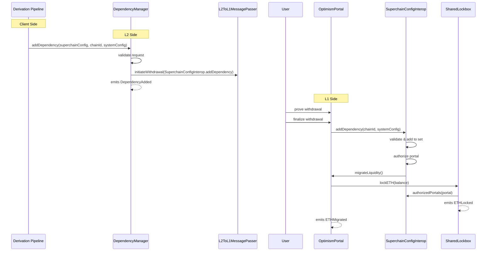

# Shared Lockbox - Upgrade and migration process

<!-- START doctoc generated TOC please keep comment here to allow auto update -->
<!-- DON'T EDIT THIS SECTION, INSTEAD RE-RUN doctoc TO UPDATE -->
**Table of Contents**

- [Overview](#overview)
- [Upgrade Process](#upgrade-process)
  - [L2 Side: Initiate Dependency Addition](#l2-side-initiate-dependency-addition)
  - [L1 Side: Process Addition](#l1-side-process-addition)
  - [ETH Migration](#eth-migration)
- [Diagram](#diagram)
- [Future Considerations / Additional Notes](#future-considerations--additional-notes)

<!-- END doctoc generated TOC please keep comment here to allow auto update -->

## Overview

When a new chain joins the op-governed dependency set, it must integrate with the `SharedLockbox`
to participate in unified ETH liquidity management.
This is an irreversible process that requires coordination between L1 and L2 components.

## Upgrade Process

### L2 Side: Initiate Dependency Addition

1. The derivation pipeline (impersonating the `DEPOSITOR_ACCOUNT`) calls
   `addDependency(address,uint256,address)` on the L2 `DependencyManager` predeploy with:

   - `_superchainConfig`: The L1 `SuperchainConfig` contract address
   - `_chainId`: The chain ID to add to the dependency set
   - `_systemConfig`: The L1 `SystemConfig` contract address for the chain being added

2. The `DependencyManager` validates the request by:

   - Checking that the caller is the `DEPOSITOR_ACCOUNT`
   - Ensuring the chain ID isn't already in the set or the current chain's ID
   - Adding the chain ID to the internal dependency set if validation passes

3. Upon successful validation, the `DependencyManager`:

   - Calls `initiateWithdrawal` on the `L2ToL1MessagePasser` predeploy
   - Encodes a call to `SuperchainConfigInterop.addDependency(_chainId, _systemConfig)`
   - Emits a `DependencyAdded` event with the chain ID, system config, and superchain config addresses

4. The withdrawal transaction is queued in the `L2ToL1MessagePasser`, ready to be proven and finalized on L1

### L1 Side: Process Addition

1. The withdrawal transaction is proven and finalized through the `OptimismPortal`

2. The `SuperchainConfigInterop` processes the addition by:

   - Validating the request came from an authorized portal or cluster manager
   - If from a portal, verifying the L2 sender is the `DependencyManager` predeploy
   - Verifying the chain ID isn't already in the dependency set
   - Adding the chain ID to the dependency set
   - Getting the chain's portal address from its `SystemConfig`

3. The portal is authorized in the `SharedLockbox`:

   - Verifying the portal uses the correct `SuperchainConfig`
   - Checking the portal isn't already authorized
   - Adding the portal to the authorized portals mapping
   - Triggering ETH migration via `migrateLiquidity()`

4. The `OptimismPortalInterop` migrates its ETH:
   - Sets migrated flag to true
   - Transfers entire ETH balance to `SharedLockbox` via `lockETH()`
   - `SharedLockbox` emits `ETHLocked` event
   - Portal emits `ETHMigrated` event

### ETH Migration

After authorization, the `OptimismPortal`'s ETH liquidity is migrated to the `SharedLockbox`:

1. The `OptimismPortal`'s ETH balance is transferred to the `SharedLockbox`
2. The `OptimismPortal` is configured to use the `SharedLockbox` for all future ETH operations
3. The migration is marked as complete

After migration:

- All deposits lock ETH in the `SharedLockbox`
- All withdrawals unlock ETH from the `SharedLockbox`
- The `OptimismPortal` no longer holds ETH directly

## Diagram

## Future Considerations / Additional Notes

- Before calling `addDependency`, it MUST be ensured that the `chainId` and `systemConfig` match

- The `OptimismPortalInterop` MUST be updated before finalizing the withdrawal transaction
