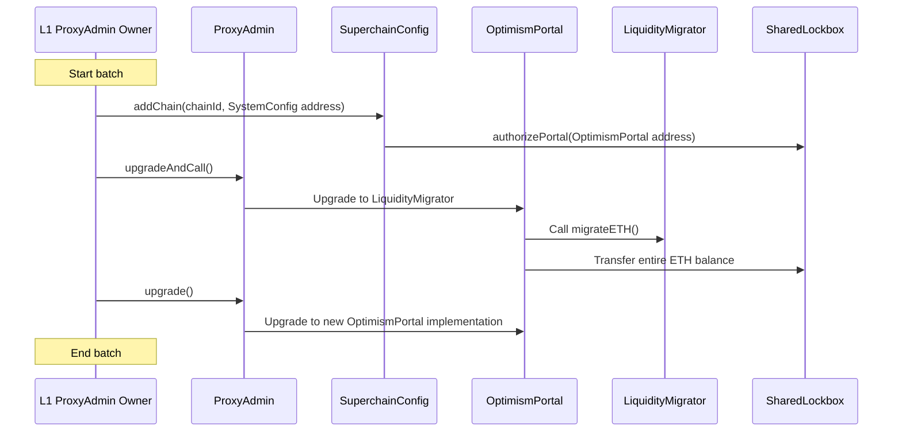

# Shared Lockbox - Upgrade and migration process

<!-- START doctoc generated TOC please keep comment here to allow auto update -->
<!-- DON'T EDIT THIS SECTION, INSTEAD RE-RUN doctoc TO UPDATE -->
**Table of Contents**

- [Overview](#overview)
  - [Add the chain to the op-governed dependency set in `SuperchainConfig`](#add-the-chain-to-the-op-governed-dependency-set-in-superchainconfig)
  - [Migrate ETH liquidity from `OptimismPortal` to `SharedLockbox`](#migrate-eth-liquidity-from-optimismportal-to-sharedlockbox)
    - [`LiquidityMigrator`](#liquiditymigrator)
  - [`OptimismPortal` code upgrade](#optimismportal-code-upgrade)
- [Batch transaction process](#batch-transaction-process)
  - [Diagram](#diagram)
- [Future Considerations / Additional Notes](#future-considerations--additional-notes)

<!-- END doctoc generated TOC please keep comment here to allow auto update -->

## Overview

Based on the assumption that a chain joining the op-governed dependency set is an irreversible process,
it is assumed that joining the Shared Lockbox is equivalent to it.

The upgrade process consists of three main points:

- Add the chain to the op-governed dependency set in `SuperchainConfig`
- Move ETH liquidity from `OptimismPortal` to `SharedLockbox`
- Upgrade the code of `OptimismPortal` to include the `SharedLockbox` integration

This process also requires that:

- `SharedLockbox` is deployed
- `SuperchainConfig` is upgraded to manage the dependency set
- `SystemConfig` is upgraded to the interop contract version

### Add the chain to the op-governed dependency set in `SuperchainConfig`

The `SuperchainConfig` contract will be responsible for storing and managing the dependency set.
Its `addChain` function will be used to add the chain to the dependency set and call the `SystemConfig` of each chain
to keep them in sync.
It will also allowlist the corresponding `OptimismPortal`, enabling it to lock and unlock ETH from the `SharedLockbox`.
Once `addChain` is called, the system will be ready to process deposits and withdrawals.

### Migrate ETH liquidity from `OptimismPortal` to `SharedLockbox`

The ETH will be transferred from the `OptimismPortal` to the `SharedLockbox` using the `LiquidityMigrator` contract.
This contract functions similarly to upgrades using the `StorageSetter`, being updated immediately before to the real implementation.
Its sole purpose is to transfer the ETH balance.
This approach eliminates the need for adding code to move the liquidity to the lockbox that won't be used again.

#### `LiquidityMigrator`

This contract is meant to be used as an intermediate step for the liquidity migration.
Its unique purpose is to transfer the whole ETH balance from `OptimismPortal` to `SharedLockbox`.
This approach avoids adding extra code to the `initialize` function, which could be prone to errors in future updates.

**Interface and properties**

**`migrateETH`**

Transfers the entire ETH balance from the `OptimismPortal` to the `SharedLockbox`.

```solidity
function migrateETH() external;
```

**Invariants**

- It MUST migrate the whole `OptimismPortal` ETH balance to the `SharedLockbox`

- It MUST emit `ETHMigrated` when migrating the balance

### `OptimismPortal` code upgrade

The `OptimismPortal` will start locking and unlocking ETH through the `SharedLockbox`.
It will continue to handle deposits and withdrawals but won't directly hold the ETH liquidity.
To set this up, the upgrade function will be called via `ProxyAdmin` to implement the new code,
which includes the necessary `SharedLockbox` integration.

## Batch transaction process

The approach consists of handling the entire migration process in a single batched transaction.
This transaction will include:

1. Call `addChain` in the `SuperchainConfig`
   - Sending chain ID + system config address
2. Call `upgradeAndCall` in the `ProxyAdmin` for the `OptimismPortal`
   - Update provisionally to the `LiquidityMigrator` to transfer the whole ETH balance to the `SharedLockbox` in this call.
3. Call `upgrade` in the `ProxyAdmin` for the `OptimismPortal`
   - The `SharedLockbox` address is set as immutable in the new implementation

The L1 ProxyAdmin owner (L1PAO) will execute this transaction. As the entity responsible for updating contracts,
it has the authority to perform the second and third steps.
For the first step, the L1PAO has to be set as authorized for adding a chain to the op-governed dependency set
on the `SuperchainConfig` when initializing.
This process can be set as a [superchain-ops](https://github.com/ethereum-optimism/superchain-ops) task.

### Diagram



## Future Considerations / Additional Notes

- Before calling `addChain`, it MUST be ensured that the `chainId` and `systemConfig` match
