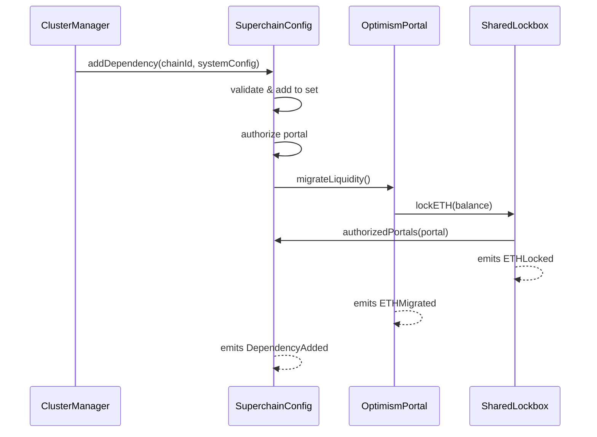

# Shared Lockbox - Upgrade and migration process

<!-- START doctoc generated TOC please keep comment here to allow auto update -->
<!-- DON'T EDIT THIS SECTION, INSTEAD RE-RUN doctoc TO UPDATE -->
**Table of Contents**

- [Overview](#overview)
- [Upgrade Process](#upgrade-process)
  - [ETH Migration](#eth-migration)
- [Diagram](#diagram)
- [Future Considerations / Additional Notes](#future-considerations--additional-notes)

<!-- END doctoc generated TOC please keep comment here to allow auto update -->

## Overview

When a new chain joins the op-governed dependency set, it must integrate with the `SharedLockbox`
to participate in unified ETH liquidity management. This process is initiated by the `CLUSTER_MANAGER` role.

## Upgrade Process

1. The `CLUSTER_MANAGER` role calls `addDependency` on the `SuperchainConfig`
   contract with the new chain ID and it's system config address

2. The `SuperchainConfig` processes the addition by:

   - Validating the request came from the cluster manager
   - Verifying the chain ID isn't already in the dependency set
   - Adding the chain ID to the dependency set
   - Getting the chain's portal address from its `SystemConfig`

3. The portal is authorized in the `SharedLockbox`:

   - Verifying the portal uses the correct `SuperchainConfig`
   - Checking the portal isn't already authorized
   - Adding the portal to the authorized portals mapping
   - Triggering ETH migration via `migrateLiquidity()`
     - In this step the `OptimismPortal`'s ETH balance is transferred to the `SharedLockbox`

4. The `OptimismPortal` migrates its ETH:
   - Sets migrated flag to true
     - This is necessary to start using the `SharedLockbox` for ETH operations,
       if not set the `OptimismPortal` will continue using it's own ETH balance.
   - Transfers entire ETH balance to `SharedLockbox` via `lockETH()`
   - `SharedLockbox` emits `ETHLocked` event
   - Portal emits `ETHMigrated` event

### ETH Migration

After authorization, the `OptimismPortal`'s ETH liquidity is migrated to the `SharedLockbox`:

1. The `OptimismPortal`'s ETH balance is transferred to the `SharedLockbox`
2. The `OptimismPortal` is configured to use the `SharedLockbox` for all future ETH operations

After migration:

- All deposits lock ETH in the `SharedLockbox`
- All withdrawals unlock ETH from the `SharedLockbox`
- The `OptimismPortal` no longer holds ETH directly

## Diagram

## Future Considerations / Additional Notes

- Before calling `addDependency`, it MUST be ensured that the `chainId` and `systemConfig` match.
  This means that the `systemConfig` address is the correct one for the chain ID. There is no on-chain source of truth
  for this information, so it is the responsibility of the `CLUSTER_MANAGER` to ensure the correct parameters are used.

- The `OptimismPortal` MUST be updated before initiating the migration
