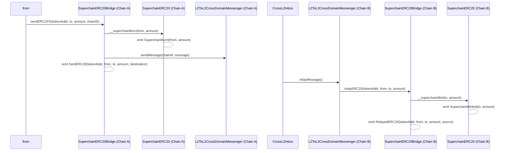
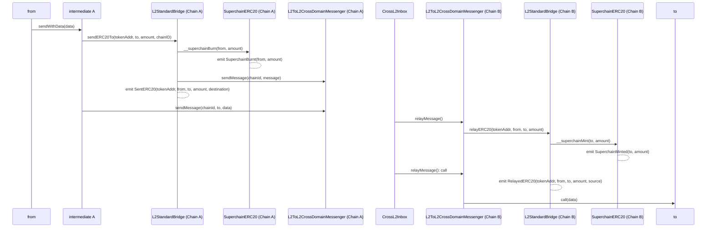

# Token Bridging

<!-- START doctoc generated TOC please keep comment here to allow auto update -->
<!-- DON'T EDIT THIS SECTION, INSTEAD RE-RUN doctoc TO UPDATE -->
**Table of Contents**

- [Overview](#overview)
- [`SuperchainERC20` standard](#superchainerc20-standard)
  - [Properties](#properties)
  - [Interface](#interface)
    - [`__superchainMint`](#__superchainmint)
    - [`__superchainBurn`](#__superchainburn)
    - [`SuperchainMinted`](#superchainminted)
    - [`SuperchainBurnt`](#superchainburnt)
- [`SuperchainERC20Bridge`](#superchainerc20bridge)
- [Diagram](#diagram)
- [Implementation](#implementation)
- [Future Considerations](#future-considerations)
  - [Cross Chain `transferFrom`](#cross-chain-transferfrom)
  - [Concatenated Action](#concatenated-action)

<!-- END doctoc generated TOC please keep comment here to allow auto update -->

## Overview

Without a standardized security model, bridged assets may not be fungible with each other.
The `SuperchainERC20` standard is a set of properties and an interface allowing ERC20 to be fungible across the
Superchain using the official `SuperchainERC20Bridge`.
The `SuperchainERC20Bridge` is a predeploy that builds on the messaging protocol as the most trust-minimized bridging solution.

## `SuperchainERC20` standard

### Properties

The standard will build on top of ERC20 and include the following properties:

1. Give `mint` and `burn` rights to the `SuperchainERC20Bridge`.
2. Be deployed at the same address on every chain in the Superchain.

The first property will allow the `SuperchainERC20Bridge` to have a liquidity guarantee,
which would not be possible in a model based on lock/unlock.
Liquidity availability is fundamental to achieving fungibility.

The second property removes the need for cross-chain access control lists.
Otherwise, the `SuperchainERC20Bridge` would need a way to verify if the tokens they mint on
destination correspond to the tokens that were burned on source.
Same address abstracts away cross-chain validation.

One way to guarantee the same address across the Superchain, and also bind it to the same `init_code`
and constructor arguments is to use the
[`Create2Deployer` preinstall](../protocol/preinstalls.md#create2deployer).
There is also the [`OptimismSuperchainERC20Factory`](predeploys.md#optimismmintableerc20factory)
predeploy that facilitates this process for L1 native tokens.

Notice that ERC20s that do not implement the standard can still be fungible
using interop message passing
using a custom bridge or implementing `sendERC20` and `relayERC20` on their own contracts.

### Interface

Implementations of the `SuperchainERC20` standard will need to implement two external functions and two events:

#### `__superchainMint`

Mints `_amount` of token to address `_account`. It should only be callable by the `SuperchainERC20Bridge`

```solidity
__superchainMint(address _account, uint256 _amount)
```

#### `__superchainBurn`

Burns `_amount` of token from address `_account`. It should only be callable by the `SuperchainERC20Bridge`

```solidity
__superchainBurn(address _account, uint256 _amount)
```

#### `SuperchainMinted`

MUST trigger when `__superchainMint` is called

```solidity
event SuperchainMinted(address indexed _to, uint256 _amount)
```

#### `SuperchainBurnt`

MUST trigger when `__superchainBurn` is called

```solidity
event SuperchainBurnt(address indexed _from, uint256 _amount)
```

## `SuperchainERC20Bridge`

The `SuperchainERC20Bridge` is a predeploy that works as an abstraction
on top of the [L2ToL2CrossDomainMessenger][l2-to-l2]
for token bridging.
The `L2ToL2CrossDomainMessenger` is used for replay protection,
domain binding and access to additional message information.
The `SuperchainERC20Bridge` includes two functions for bridging:

- `sendERC20`: initializes a cross-chain transfer of a `SuperchainERC20`
by burning the tokens locally and sending a message to the `SuperchainERC20Bridge`
on the target chain using the `L2toL2CrossDomainMessenger`.
- `relayERC20`: process incoming messages from the `L2toL2CrossDomainMessenger`
and mints the corresponding amount of the `SuperchainERC20`

The full specifications and invariants are detailed
in the [predeploys spec](./predeploys.md#superchainerc20bridge).

[l2-to-l2]: ./predeploys.md#l2tol2crossdomainmessenger

## Diagram

The following diagram depicts a cross-chain transfer.



## Implementation

An example implementation for the `sendERC20` and `relayERC20` functions is provided.

```solidity
function sendERC20(SuperchainERC20 _token, address _to, uint256 _amount, uint256 _chainId) external {
  _token.__superchainBurn(msg.sender, _amount);

  bytes memory _message = abi.encodeCall(this.relayERC20, (_token, msg.sender, _to, _amount));
  L2ToL2CrossDomainMessenger.sendMessage(_chainId, address(this), _message);
  
  emit SendERC20(address(_token), msg.sender, _to, _amount, _chainId);
}

function relayERC20(SuperchainERC20 _token, address _from, address _to, uint256 _amount) external {
  require(msg.sender == address(L2ToL2CrossChainMessenger));
  require(L2ToL2CrossChainMessenger.crossDomainMessageSender() == address(this));
  
  uint256 _source = L2ToL2CrossChainMessenger.crossDomainMessageSource();

  _token.__superchainMint(_to, _amount);

  emit RelayERC20(address(_token), _from, _to, _amount, _source);
}
```

## Future Considerations

### Cross Chain `transferFrom`

In addition to standard locally initialized bridging,
it is possible to allow contracts to be cross-chain interoperable.
For example, a contract in chain A could send pre-approved funds
from a user in chain B to a contract in chain C.

For the moment, the standard will not include any specific functionality
to facilitate such an action and rely on the usage of `Permit2` like this:


If, at some point in the future, these actions were to be included in the standard,
a possible design could introduce a `remoteTransferFrom()` function.

### Concatenated Action

It is possible to have an additional input `bytes _data` in both `sendERC20()` and `relayERC20()` that would make an
additional call to the `_to` address.
This feature could be used for cross-chain concatenated actions,
i.e. bridge funds and then do X.

This vertical has much potential but can also be achieved outside the standard in the following way:



Adding the call to the standard would remove the dependence on the sequencer regarding the proper tx ordering
at the sequencer level, but would also introduce more risk for cross-chain fund transferring,
as an incorrectly formatted call would burn funds in the initiating chain but would revert
in destination and could never be successfully replayed.
