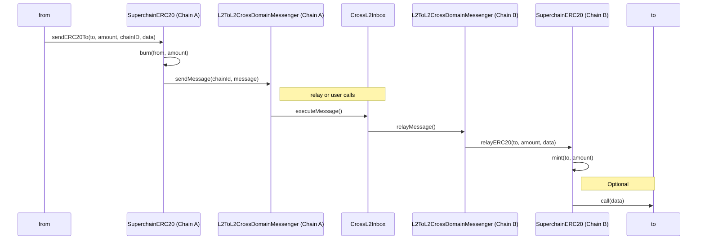

# Token Bridging

<!-- START doctoc generated TOC please keep comment here to allow auto update -->
<!-- DON'T EDIT THIS SECTION, INSTEAD RE-RUN doctoc TO UPDATE -->

- [Overview](#overview)
- [Implementation](#implementation)
  - [Functions](#functions)
    - [`sendERC20`](#senderc20)
    - [`relayERC20`](#relayerc20)
  - [Events](#events)
    - [`SendERC20`](#senderc20)
  - [`RelayERC20`](#relayerc20)
- [Diagram](#diagram)
- [Implementation](#implementation-1)
- [Invariants](#invariants)
- [Deployment and migrations](#deployment-and-migrations)
  - [Factory](#factory)
  - [Migration to the Standard](#migration-to-the-standard)
- [Future Considerations](#future-considerations)
  - [Cross Chain `transferFrom`](#cross-chain-transferfrom)

<!-- END doctoc generated TOC please keep comment here to allow auto update -->

## Overview

Without a standardized security model, bridged assets may not be fungible with each other. The `SuperchainERC20` unifies ERC20 token bridging to make it fungible across the Superchain. It builds on top of the messaging protocol, as the most trust minimized bridging solution.

Unlike other standards, such as [xERC20](https://www.xerc20.com/), where users interact with a bridge possessing mint and burn privileges on cross-chain enabled tokens, this approach allows users to call methods directly on the token contract.

## Implementation

### Functions

The standard will build on top of ERC20 and include the following functions:

#### `sendERC20`

Transfer `_amount` amount of tokens to address `_to` in chain `_chainId`, alongside with optional data `_data`.

It SHOULD burn `_amount` tokens and initialize a message to the `L2ToL2CrossChainMessenger` to mint the `_amount` in the target address `_to` at `_chainId`. The optional `_data` will be included in as part of the `L2ToL2CrossChainMessenger` message.

```solidity
sendERC20(address _to, uint256 _amount, uint256 _chainId, bytes _data)
```

#### `relayERC20`

Process incoming messages IF AND ONLY IF if they where initiated by the same contract (token) address on a different chain and come from the `L2ToL2CrossChainMessenger` in the local chain.
It will mint `_amount` to address `_to`, as defined in `sendERC20`. If the message contained `_data`, it will also include an external call to address `_to` with `_data`.

```solidity
relayERC20(address _to, uint256 _amount, bytes _data)
```

### Events

#### `SendERC20`

MUST trigger when a cross-chain transfer is initiated using `sendERC20`.

```solidity
event SendERC20(address indexed _from, address indexed _to, uint256 _amount, uint256 _chainId, bytes memory _data)
```

### `RelayERC20`

MUST trigger when a cross-chain transfer is finalized using `relayERC20`.

```solidity
event RelayERC20(address indexed to, uint256 amount, bytes data);
```

## Diagram

The following diagram depicts a cross-chain transfer.



## Implementation

An example implementation that depends on deterministic deployments across chains
for security is provided. This construction builds on top of the [L2ToL2CrossDomainMessenger][l2-to-l2]
for both replay protection and domain binding.

[l2-to-l2]: ./predeploys.md#l2tol2crossdomainmessenger

```solidity
function sendERC20(address _to, uint256 _amount, uint256 _chainId, bytes memory _data) public {
  _burn(msg.sender, _amount);
  bytes memory _message = abi.encodeCall(this.relayERC20, (_to, _amount, _data));
  L2ToL2CrossDomainMessenger.sendMessage(_chainId, address(this), _message);
  emit SendERC20(msg.sender, _to, _amount, _chainId, _data);
}

function relayERC20(address _to, uint256 _amount, bytes memory _data) external {
  require(msg.sender == address(L2ToL2CrossChainMessenger));
  require(L2ToL2CrossChainMessenger.crossDomainMessageSender() == address(this));
  _mint(_to, _amount);

  if (data.length > 0) {
    (bool success, ) = _to.call(_data);
    require(success, "External call failed");
  }

  emit RelayERC20(_to, _amount, _data)
}
```

Note: Some other naming options that were considered were `bridgeERC20`, `send()`, `xTransfer()`, `Transfer` (with a chainId parameter).

## Invariants

Besides the ERC20 invariants, the SuperchainERC20 will require the following interop specific properties:

- Conservation of bridged `amount`: The minted `amount` in `relayERC20()` should match the `amount` that was burnt in `sendERC20()`, as long as target chain has the initiating chain in the dependency set.
  - Corollary 1: Finalized cross-chain transactions will conserve the sum of `totalSupply` and each user's balance for each chain in the Superchain.
  - Corollary 2: Each initiated but not finalized message (included in initiating chain but not yet in target chain) will decrease the `totalSupply` and the initiating user balance exactly by the burnt `amount`.
  - Corollary 3: `SuperchainERC20s` should not charge a token fee or increase the balance when moving cross-chain.
  - Note: if the target chain is not in the initiating chain dependency set, funds will be locked similarly to sending funds to a wrong address. If the target chain decides to later include it, these could be unlocked eventually.
- Freedom of movement: Users should be able to send tokens into any target chain that has initiating chain in its dependency set.
- Unique Messenger: The `sendERC20()` function must exclusively use the `L2toL2CrossDomainMessenger` for messaging. Similarly, the `relayERC20()` function should only process messages originating from the L2toL2CrossDomainMessenger.
  - Corollary: xERC20 and other standards from third party bridges should use different functions.
- Locally initiated: The bridging action should be initialized from the chain where funds are located only.
  - This is because same address might correspond to different users cross-chain. For example, two SAFEs with the same address in two chains might have different owners. It it possible to distiguish an EOA from a contract by checking the size of the code in the caller's address, but this will probably change with [EIP-7702](https://github.com/ethereum/EIPs/blob/master/EIPS/eip-7702.md).
  - A way to allow for remotely initiated bridging is to include remote approval, i.e. approve a certain address in a certain chainId to spend local funds.
- Bridge Events:
  - `sendERC20()` should emit a `SendERC20` event. `
  - `relayERC20()` should emit a `RelayERC20` event.
- Same address: The SuperchainERC20 token should have the same address across chains in the Superchain.

## Deployment and migrations

### Factory

A token factory predeploy can ensure that `SuperchainERC20` tokens can be permissionlessly and deterministically deployed. Without a deterministic deployment scheme, maintaining a mapping of the token addresses between all of the chains will not be scalable.

[TODO] We will create a design doc that covers `SuperchainERC20` factories and link it in this specs.

### Migration to the Standard

- New tokens that want to be interoperable should implement the `SuperchainERC20` standard from inception.
- Tokens that are already deployed and upgradable, can update the implementation to be `SuperchainERC20` compatible.
- Tokens that are already deployed but are not upgradable should use a different method.
  - Some options are wrapping, converting (if burn-mint rights can be modified) or Mirroring.
- Tokens that are `OptimismMintableERC20Token` (corresponding to locked liquidity in L1) fall into the above category of already deployed and non updatable. They do have a special property though, which is burn/mint permissions granted to the `L2StandardBridge`. This makes the convert method particularly appealing. See [Liquidity Migration](https://github.com/ethereum-optimism/design-docs/blob/098435155471ed3bcd60a50f049897495c901733/protocol/superc20/liquidity-migration.md) for more context.

## Future Considerations

### Cross Chain `transferFrom`

In addition to standard locally initialized bridging, it is possible to allow contracts to be cross-chain interoperable. For example, a contract in chain A could send pre-approved funds from a user in chain B to a contract in chain C.

For the moment, the standard will not include any specific functionality to facilitate such an action and relay on the usage of `permit2`. If, at some point in the future, these actions were to be included in the standard, a possible design could introduce a `remoteTransferFrom()` function.

Notice that this action is no longer atomic, so the contract would need a special implementation resume execution once the funds arrive in the target chain.
