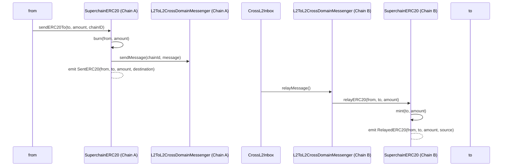
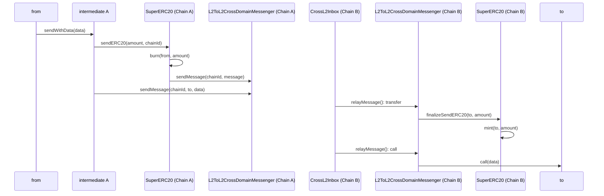

# Token Bridging

<!-- START doctoc generated TOC please keep comment here to allow auto update -->
<!-- DON'T EDIT THIS SECTION, INSTEAD RE-RUN doctoc TO UPDATE -->
**Table of Contents**

- [Overview](#overview)
- [Interface](#interface)
  - [Functions](#functions)
    - [`sendERC20`](#senderc20)
    - [`relayERC20`](#relayerc20)
  - [Events](#events)
    - [`SentERC20`](#senterc20)
    - [`RelayedERC20`](#relayederc20)
- [Diagram](#diagram)
- [Implementation](#implementation)
- [Invariants](#invariants)
- [Future Considerations](#future-considerations)
  - [Cross Chain `transferFrom`](#cross-chain-transferfrom)
  - [Concatenated Action](#concatenated-action)

<!-- END doctoc generated TOC please keep comment here to allow auto update -->

## Overview

Without a standardized security model, bridged assets may not be fungible with each other.
The `SuperchainERC20` unifies ERC20 token bridging to make it fungible across the Superchain.
It builds on top of the messaging protocol, as the most trust minimized bridging solution.

Unlike other standards, such as [xERC20](https://www.xerc20.com/),
where users interact with a bridge possessing mint and burn
privileges on cross-chain enabled tokens, this approach allows users to call methods directly on the token contract.

## Interface

### Functions

The standard will build on top of ERC20 and include the following functions:

#### `sendERC20`

Transfer `_amount` amount of tokens to address `_to` in chain `_chainId`.

It SHOULD burn `_amount` tokens and initialize a message to the `L2ToL2CrossChainMessenger` to mint the `_amount`
in the target address `_to` at `_chainId` and emit the `SentERC20` event including the `msg.sender` as parameter.

```solidity
sendERC20(address _to, uint256 _amount, uint256 _chainId)
```

#### `relayERC20`

Process incoming messages IF AND ONLY IF initiated
by the same contract (token) address on a different chain
and come from the `L2ToL2CrossChainMessenger` in the local chain.
It SHOULD mint `_amount` to address `_to`, as defined in `sendERC20`
and emit an event including the `_from` and chain id from the
`source` chain, where `_from` is the `msg.sender` of `sendERC20`.

```solidity
relayERC20(address _from, address _to, uint256 _amount)
```

### Events

#### `SentERC20`

MUST trigger when a cross-chain transfer is initiated using `sendERC20`.

```solidity
event SentERC20(address indexed from, address indexed to, uint256 amount, uint256 destination)
```

#### `RelayedERC20`

MUST trigger when a cross-chain transfer is finalized using `relayERC20`.

```solidity
event RelayedERC20(address indexed from, address indexed to, uint256 amount, uint256 source);
```

## Diagram

The following diagram depicts a cross-chain transfer.



## Implementation

An example implementation that depends on deterministic deployments across chains
for security is provided.
This construction builds on top of the [L2ToL2CrossDomainMessenger][l2-to-l2]
for both replay protection and domain binding.

[l2-to-l2]: ./predeploys.md#l2tol2crossdomainmessenger

```solidity
function sendERC20(address _to, uint256 _amount, uint256 _chainId) public {
  _burn(msg.sender, _amount);
  bytes memory _message = abi.encodeCall(this.relayERC20, (msg.sender, _to, _amount));
  L2ToL2CrossDomainMessenger.sendMessage(_chainId, address(this), _message);
  emit SentERC20(msg.sender, _to, _amount, _chainId);
}

function relayERC20(address _from, address _to, uint256 _amount) external {
  require(msg.sender == address(L2ToL2CrossChainMessenger));
  require(L2ToL2CrossChainMessenger.crossDomainMessageSender() == address(this));
  uint256 _source = L2ToL2CrossChainMessenger.crossDomainMessageSource();

  _mint(_to, _amount);

  emit RelayedERC20(_from, _to, _amount, _source);
}
```

## Invariants

Besides the ERC20 invariants, the SuperchainERC20 will require the following interop specific properties:

- Conservation of bridged `amount`: The minted `amount` in `relayERC20()` should match the `amount`
  that was burnt in `sendERC20()`, as long as target chain has the initiating chain in the dependency set.
  - Corollary 1: Finalized cross-chain transactions will conserve the sum of `totalSupply`
    and each user's balance for each chain in the Superchain.
  - Corollary 2: Each initiated but not finalized message (included in initiating chain but not yet in target chain)
    will decrease the `totalSupply` and the initiating user balance precisely by the burnt `amount`.
  - Corollary 3: `SuperchainERC20s` should not charge a token fee or increase the balance when moving cross-chain.
  - Note: if the target chain is not in the initiating chain dependency set,
    funds will be locked, similar to sending funds to the wrong address.
    If the target chain includes it later, these could be unlocked.
- Freedom of movement: Users should be able to send and receive tokens in any target
  chain with the initiating chain in its dependency set
  using `sendERC20()` and `relayERC20()`, respectively.
- Unique Messenger: The `sendERC20()` function must exclusively use the `L2toL2CrossDomainMessenger` for messaging.
  Similarly, the `relayERC20()` function should only process messages originating from the `L2toL2CrossDomainMessenger`.
  - Corollary: xERC20 and other standards from third-party bridges should use different functions.
- Unique Address: The `sendERC20()` function must exclusively send a message
  to the same address on the target chain.
  Similarly, the `relayERC20()` function should only process messages originating from the same address.
  - Note: The Factory will ensure same address deployment.
- Locally initiated: The bridging action should be initialized
  from the chain where funds are located only.
  - This is because the same address might correspond to different users cross-chain.
    For example, two SAFEs with the same address in two chains might have different owners.
    With the prospects of a smart wallet future, it is impossible to assume
    there will be a way to distinguish EOAs from smart wallets.
  - A way to allow for remotely initiated bridging is to include remote approval,
    i.e. approve a certain address in a certain chainId to spend local funds.
- Bridge Events:
  - `sendERC20()` should emit a `SentERC20` event. `
  - `relayERC20()` should emit a `RelayedERC20` event.

## Future Considerations

### Cross Chain `transferFrom`

In addition to standard locally initialized bridging,
it is possible to allow contracts to be cross-chain interoperable.
For example, a contract in chain A could send pre-approved funds
from a user in chain B to a contract in chain C.

For the moment, the standard will not include any specific functionality
to facilitate such an action and rely on the usage of `Permit2` like this:


If, at some point in the future, these actions were to be included in the standard,
a possible design could introduce a `remoteTransferFrom()` function.

### Concatenated Action

It is possible to have an additional input `bytes _data` in both `sendERC20()` and `relayERC20()` that would make an
additional call to the `_to` address.
This feature could be used for cross-chain concatenated actions,
i.e. bridge funds and then do X.

This vertical has much potential but can also be achieved outside the standard in the following way:



Adding the call to the standard would remove the dependence on the sequencer regarding the proper tx ordering
at the sequencer level, but would also introduce more risk for cross-chain fund transferring,
as an incorrectly formatted call would burn funds in the initiating chain but would revert
in destination and could never be successfully replayed.
