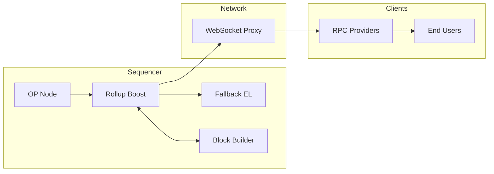
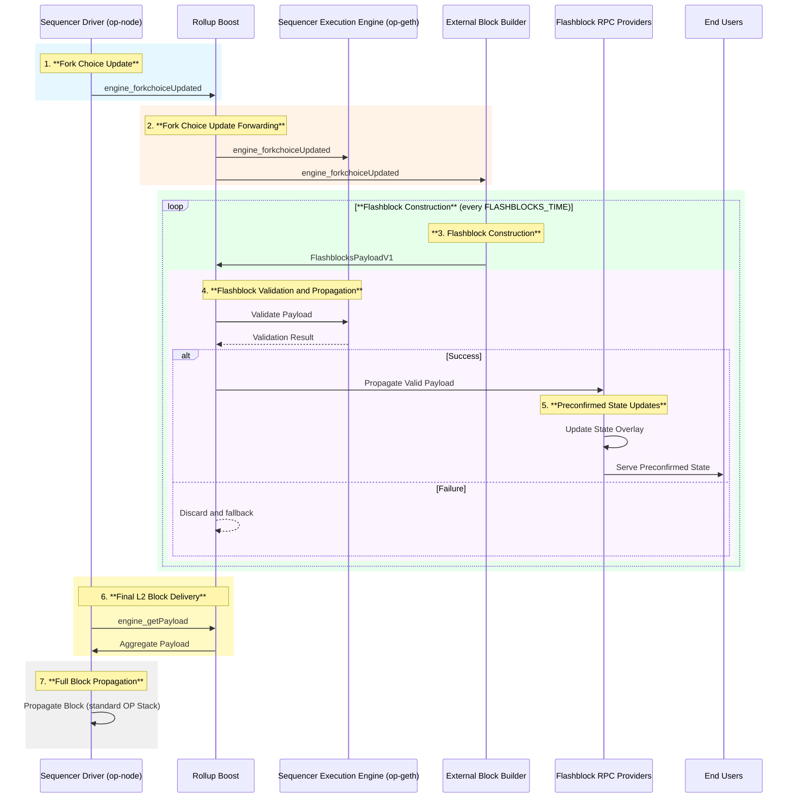
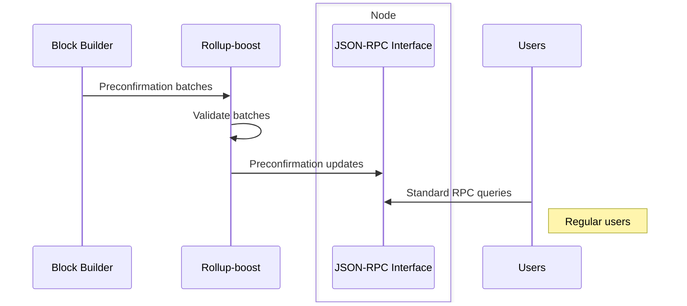
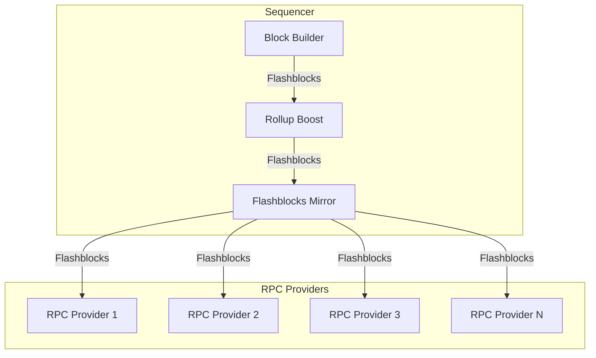
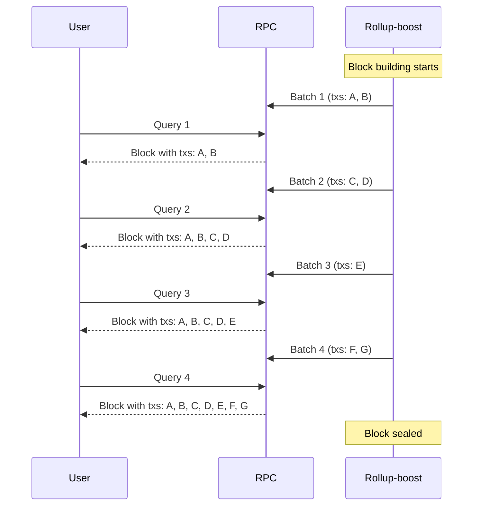

<!-- START doctoc generated TOC please keep comment here to allow auto update -->
<!-- DON'T EDIT THIS SECTION, INSTEAD RE-RUN doctoc TO UPDATE -->
**Table of Contents**

- [Abstract](#abstract)
- [Prerequisites](#prerequisites)
- [Motivation](#motivation)
- [Specification](#specification)
  - [Terminology](#terminology)
  - [Parameters](#parameters)
  - [Data structures](#data-structures)
    - [**`FlashblocksPayloadV1`**](#flashblockspayloadv1)
    - [**`ExecutionPayloadFlashblockDeltaV1`**](#executionpayloadflashblockdeltav1)
    - [**`ExecutionPayloadStaticV1`**](#executionpayloadstaticv1)
    - [**`Metadata`**](#metadata)
    - [**`AccountMetadata`**](#accountmetadata)
    - [**`StorageSlot`**](#storageslot)
    - [**`TransactionMetadata`**](#transactionmetadata)
  - [System architecture](#system-architecture)
  - [Out-of-Protocol Design](#out-of-protocol-design)
    - [In-Protocol vs. Out-of-Protocol](#in-protocol-vs-out-of-protocol)
    - [Design Rationale and Benefits](#design-rationale-and-benefits)
    - [Implications for This Specification](#implications-for-this-specification)
  - [Assumptions About Op Stack](#assumptions-about-op-stack)
  - [Flashblock Lifecycle](#flashblock-lifecycle)
  - [Flashblock Construction Process](#flashblock-construction-process)
    - [Handling of Sequencer Transactions](#handling-of-sequencer-transactions)
    - [Transaction Inclusion Heuristics](#transaction-inclusion-heuristics)
    - [Post-block Execution Rules](#post-block-execution-rules)
    - [Construction Steps](#construction-steps)
  - [Flashblocks Metadata](#flashblocks-metadata)
    - [Alternative Design Consideration](#alternative-design-consideration)
  - [Rationale for Including State Roots in Flashblocks](#rationale-for-including-state-roots-in-flashblocks)
    - [Non-Blocking Block Production](#non-blocking-block-production)
    - [Builder Availability and System Reliability](#builder-availability-and-system-reliability)
    - [Future Design Considerations](#future-design-considerations)
  - [Builder-to-Rollup-boost Communication Flow](#builder-to-rollup-boost-communication-flow)
  - [Flashblock Validity Rules](#flashblock-validity-rules)
  - [Flashblock System Invariants](#flashblock-system-invariants)
  - [Flashblock Propagation](#flashblock-propagation)
    - [Secure propagation](#secure-propagation)
  - [Flashblock JSON-RPC APIs](#flashblock-json-rpc-apis)
    - [Ethereum JSON RPC Modifications](#ethereum-json-rpc-modifications)
    - [op_supportedCapabilities](#op_supportedcapabilities)
- [Reliability and Operational Considerations](#reliability-and-operational-considerations)
  - [Transaction Propagation](#transaction-propagation)
  - [Failover scenarios](#failover-scenarios)
    - [Block Builder](#block-builder)
    - [The Sequencer or Rollup-boost](#the-sequencer-or-rollup-boost)
  - [Integration with High Availability Sequencer Setups](#integration-with-high-availability-sequencer-setups)
  - [Faults](#faults)
    - [**Safety Faults**](#safety-faults)
    - [**Liveness Faults**](#liveness-faults)
- [Rationale](#rationale)
  - [Why out-of-protocol](#why-out-of-protocol)
    - [Why not shorter block times](#why-not-shorter-block-times)
- [Backwards Compatibility](#backwards-compatibility)
  - [End Users](#end-users)
  - [Infrastructure Operators](#infrastructure-operators)
- [Implementation](#implementation)

<!-- END doctoc generated TOC please keep comment here to allow auto update -->
# Abstract

Introduces a standard for partial blocks called “Flashblocks,” inspired but not entirely identical to [Solana
Shreds](https://github.com/solana-foundation/specs/blob/main/p2p/shred.md), enabling rapid preconfirmations on Ethereum
Layer 2 networks such as OP Stack. Flashblocks propagate transaction batches incrementally and expose their state via a
modified Ethereum JSON-RPC interface, giving users immediate feedback equivalent to drastically reduced block times
without modifying the underlying OP Stack protocol. Flashblocks can be combined with Trusted Execution Environment
technology to enable quick verifiability over various networks of machines in addition to protection from equivocation.

# Prerequisites

This document assumes knowledge of the terminology, definitions, and other material in

- [🔗 Ethereum Optimism Protocol Specs][ethereum-optimism](https://github.com/ethereum-optimism/)
- [🔗 OP Stack Engine API](https://specs.optimism.io/protocol/exec-engine.html#engine-api)
- [🔗 External Block Production in OP Stack Design
Doc][ethereum-optimism](https://github.com/ethereum-optimism/)
- [🔗 Ethereum Execution APIs](https://github.com/ethereum/execution-apis/tree/main)
- [🔗 Introducing Rollup-Boost - Launching on Unichain](https://writings.flashbots.net/introducing-rollup-boost)
- [🔗 Rollup-boost design doc](https://www.notion.so/RFD-1-Rollup-boost-1996b4a0d876802f95d1c98387e38162?pvs=21)

# Motivation

As of April 2025, Layer 2 (L2) protocols built with the OP Stack have a minimum block time of one second, imposing
significant constraints on user experience. The limitation on minimum block times is primarily historical and
architectural, reflecting earlier assumptions of Ethereum network as well as deeply-integrated type definitions, from
the L2 blockchain client all the way down to smart contracts on the L1, making modification a very large task.

Due to similar constraints on Ethereum Layer 1, preconfirmations have gained attention as a promising method to
decouple blockchain user experiences from rigid block-time limitations and sidestep the longstanding debate between
block time and block size. Existing preconfirmation solutions predominantly depend on economic security in the form of
cryptoeconomic mechanisms such as staking. As well as focus on per-transaction preconfirmations, inadvertently pushing
protocols into the “Latency Auction” region of the [MEV
Trilemma](https://writings.flashbots.net/introducing-rollup-boost). Furthermore, previous approaches have often
introduced entirely new Ethereum JSON-RPC methods, presenting substantial integration barriers and hindering practical
adoption.

Inspired by modern blockchain networks like Solana and Celestia, Flashblocks introduce an “out-of-protocol” standard
for incremental delivery of partial blocks containing batches of transactions. This approach significantly reduces
perceived latency for end-users  and improves network bandwidth without modifying underlying protocol rules, offering a
streamlined path for incremental adoption by node operators and existing infrastructure.

# Specification

## Terminology

All terms, actors, and components are used in this document identically to how they are defined in the [OP Stack
protocol definition][ethereum-optimism](https://github.com/ethereum-optimism/)

Additional terms introduced:

- **External Block Builder** - External Block Builders are first introduced to the OP Stack in the [External Block
Production Design
Document][ethereum-optimism](https://github.com/ethereum-optimism/) ****where
they are described as an external party that the Sequencer can request blocks from.
- **Rollup Boost** - A sidecar piece of software first introduced without name in the [External Block Production Design
Document][ethereum-optimism](https://github.com/ethereum-optimism/) with two
roles:
    1. obfuscate the presence of External Block Builder software from the `op-node` and `op-geth` software
    2. manage communication from the sequencer with External Block Builders and handle block delivery to `op-node` .
- **Fallback EL** - The standard Execution Layer of the Sequencer, used by Rollup Boost as a fallback mechanism when it
cannot successfully build a block through the External Block Builder. This is an unmodified EL node that maintains the
ability to construct valid blocks according to standard OP Stack protocol rules.
- **RPC Provider** - Ethereum RPC software operator with the purpose of serving Ethereum state.

## Parameters

| **Constant** | **Value** | **Description** |
| --- | --- | --- |
| `FLASHBLOCKS_TIME` | 200ms | Default wall clock time per flashblock. |
| `FLASHBLOCKS_PER_L2_BLOCK` | `L2_BLOCK_TIME`/`FLASHBLOCKS_TIME` | Supported number of flashblocks per L2 block. (Ex: 2s/200ms = 10 Flashblocks) |
| `MAX_EXTRA_DATA_BYTES` | 32 | Extra data size in an Optimism block |
| `BYTES_PER_LOGS_BLOOM` | 256 | Size of a logs bloom field in an Optimism block |

## Data structures

### **`FlashblocksPayloadV1`**

The core data structure sent from the Block Builder to Rollup Boost and then external parties.  A container
representing a Flashblock payload, encapsulating block deltas, base configuration, and additional metadata.

```python
class FlashblocksPayloadV1():
    version: Bytes4
    payload_id: Bytes8
    parent_flash_hash: Optional[Bytes32]
    index: uint64
    static: Optional[ExecutionPayloadStaticV1]
    diff: ExecutionPayloadFlashblockDeltaV1
    metadata: FlashblocksMetadata
**Field descriptions:**

- `payload_id`: PayloadID is an identifier of the payload build process. The same for all flashblocks.
- `index`: Index of the Flashblock within the parent block.
- `parent_flash_hash`: SSZ hash of the parent flashblock in the sequence. For the first flashblock (index 0), the field
is empty.
- `base` *(Optional)*: Reference execution payload serving as the unchanging base configuration.
- `diff`: Container with fields representing changes from the base payload.
- `metadata`: Supplementary information about the execution of the flashblock. For example: account state changes,
storage modifications, transaction receipts.

### **`ExecutionPayloadFlashblockDeltaV1`**

Container encoding only the mutable portions of the execution payload updated during Flashblock construction.

```python
class ExecutionPayloadFlashblockDeltaV1():
    state_root: Bytes32
    receipts_root: Bytes32
    logs_bloom: ByteVector[BYTES_PER_LOGS_BLOOM]
    gas_used: uint64
    block_hash: Bytes32
    transactions: List[Transaction]
    withdrawals: List[Withdrawal]
    withdrawals_root: Bytes32
```

**Field descriptions:**

- `state_root`: Root hash of the post-execution state trie.
- `receipts_root`: Root hash of the transaction receipts trie.
- `logs_bloom`: Bloom filter of all logs emitted by the block.
- `gas_used`: Gas consumed by included transactions.
- `block_hash`: Final hash of the completed execution block.
- `transactions`: List of transactions included in the Flashblock.
- `withdrawals`: Withdrawals included (as per Optimism specification). Must be non-nil but empty when
`withdrawals_root` is used directly.
- `withdrawals_root`: OP-Stack Isthmus specific field: instead of computing the root from a withdrawals list, set it
directly. The "withdrawals" list attribute must be non-nil but empty.

**Supporting Type Definitions**

- `Transaction`: Transaction bytes as per execution payload specification.
- `Withdrawal`: Standard Ethereum Capella withdrawal container.

All fields in this structure represent the cumulative state of the entire block up to and including the current
flashblock, not just the changes from this specific flashblock.

### **`ExecutionPayloadStaticV1`**

Container representing immutable fundamental block properties established at initial block creation, unchanged
throughout construction.

```python
class ExecutionPayloadStaticV1():
    parent_beacon_block_root: Bytes32
    parent_hash: Bytes32
    fee_recipient: ExecutionAddress
    prev_randao: Bytes32
    block_number: uint64
    gas_limit: uint64
    timestamp: uint64
    extra_data: ByteList[MAX_EXTRA_DATA_BYTES]
    base_fee_per_gas: uint256
```

**Field descriptions:**

- `parent_beacon_block_root`: Ecotone parent beacon block root.
- `parent_hash`: Hash of the parent execution block.
- `fee_recipient`: Address receiving transaction fees.
- `prev_randao`: Previous block’s RANDAO reveal for randomness.
- `block_number`: Sequential execution block number.
- `gas_limit`: Maximum allowable gas consumption for the block.
- `timestamp`: Unix timestamp at block creation.
- `extra_data`: Arbitrary extra data bytes included in the block header.
- `base_fee_per_gas`: Base fee per gas unit at the block.

### **`Metadata`**

Container encapsulating all metadata for a flashblock, including account state changes and transaction results.

```python
class FlashblockMetadata():
         accounts: List[AccountMetadata]
  transactions: List[TransactionMetadata]

**Field descriptions:**

- `accounts`: List of accounts with modified state in this flashblock.
- `transactions`: List of transaction execution results in this flashblock.

### **`AccountMetadata`**

Container representing account state changes included in the Flashblock metadata. It is used by providers to fulfill
the RPC requests.

```python
class AccountMetadata():
    address: ExecutionAddress
    balance: Optional[uint256]
    nonce: uint64
    code: Optional[Bytes]
    storage_slots: List[StorageSlot]
```

**Field descriptions:**

- `address`: Ethereum address of the affected account.
- `balance`: Updated account balance after the Flashblock's execution (None if unchanged).
- `nonce`: Updated account nonce (transaction count) after the Flashblock's execution.
- `code_created`:  Contract bytecode if created in this Flashblock.
- `storage_slots`: List of modified storage slots and their new values.

Storage slot keys must be de-duplicated (only the final value for each key should be included) and sorted in ascending
byte order for deterministic processing.

### **`StorageSlot`**

Container representing a single modified storage slot within an account.

```python
class StorageSlot():
    key: Bytes32
    value: Bytes32
```

**Field descriptions:**

- `key`: Storage slot location (32-byte key).
- `value`: New value stored at this slot after the Flashblock's execution.

### **`TransactionMetadata`**

Container representing succinct transaction execution results.

```python
class TransactionMetadata():
    status: uint8
    gas_used: uint64
    contract_address: Optional[ExecutionAddress]
```

**Field descriptions:**

- `status`: Execution status (1 for success, 0 for failure).
- `gas_used`: Amount of gas used by this specific transaction.
- `contract_address`: Address of created contract (None for non-creation transactions).

## System architecture

The following diagram illustrates the Flashblocks system architecture, showing the relationships between key components:



This architecture shows the flow of data through the Flashblocks system:

1. The **OP Node** initiates block production and sends requests to **Rollup Boost**
2. **Rollup Boost** coordinates between multiple components:
[-*+] It communicates with the **Block Builder** to create Flashblocks
[-*+] It maintains a connection to the **Fallback EL** for reliability if the Block Builder fails
[-*+] It propagates validated Flashblocks to the network via the **WebSocket Proxy**
3. The **WebSocket Proxy** distributes Flashblocks to multiple **RPC Providers**
4. **RPC Providers** serve preconfirmation data to **End Users**

The rest of this document provides detailed specifications for each component and their interactions, explaining the
protocols, data structures, and operational considerations.

## Out-of-Protocol Design

The Flashblocks specification follows a deliberate "out-of-protocol" design philosophy. This section clarifies what we
mean by this term and explains its implications for the OP Stack ecosystem.

### In-Protocol vs. Out-of-Protocol

In the context of OP Stack, "in-protocol" components form the core protocol itself. These components implement
fundamental consensus rules, are required for basic rollup functionality, and need standardization across all
participants. Modifying in-protocol components requires protocol-level changes and network-wide upgrades.

By contrast, "out-of-protocol" components like Flashblocks operate as optional extensions to the core protocol. They
can be added or removed without breaking the consensus rules of the network, though they may still impact network
performance or operations if implemented poorly.

The only in-protocol guarantee that Flashblocks must uphold is producing valid blocks at the established block time
interval (typically 1-2 seconds in current OP Stack implementations).

### Design Rationale and Benefits

The out-of-protocol design for Flashblocks emerged from practical constraints during initial development. Without
strong coordination with the OP Stack team at the outset, and given the complexity of the challenge, working within the
existing protocol boundaries was the most pragmatic approach.

This constraint ultimately proved beneficial, as it forced the design to be minimally invasive. Flashblocks can be
implemented immediately on any OP Stack chain without waiting for protocol upgrades or network-wide consensus.

Any issues with the Flashblocks implementation remain isolated from the core protocol, protecting overall network
stability. In case of serious problems, Flashblocks can be disabled entirely, allowing the system to revert to normal
operation without disrupting the underlying rollup. This clean fallback mechanism benefits from the centralized trust
model of L2s, where the sequencer has the authority to quickly enact such operational changes without requiring
network-wide consensus.

Now that the usefulness of the system has been proven, as more collaboration venues with the OP Stack team emerge,
integrating parts of Flashblocks directly into the protocol could provide even stronger guarantees and open the design
space for future innovations. We are considering that approach too in the future.

### Implications for This Specification

Most elements defined in this document are out-of-protocol components that operate as extensions to the core OP Stack.
The only hard guarantee the system must provide is that valid blocks are delivered at the expected intervals.

Everything else—from how Flashblocks are constructed and propagated to how RPC providers implement preconfirmation
caches—represents iterative improvements designed to achieve the goal of faster user feedback as efficiently and
impactfully as possible.

This means the specification describes a recommended implementation path rather than rigid protocol requirements.
Components can evolve independently without requiring protocol-level coordination, and implementations may vary in how
they achieve the same functional goals.

## Assumptions About Op Stack

The Flashblocks design makes several assumptions about OP Stack behavior:

- **Quick Response for engine_getPayload**: We assume that `engine_getPayload` requests should return as quickly as
possible for a normal and healthy chain.
- **Deterministic Payload IDs**: While not specific to Flashblocks but to Rollup Boost in general, we assume that
payload IDs from different execution layer nodes are deterministically computed for the same ForkChoiceUpdate request.
This is not explicitly enforced in specifications, but execution layers tend to maintain this consistency as a
practical implementation detail.

## Flashblock Lifecycle

Note that familiarity with Rollup-boost is expected throughout this entire document, as Flashblocks is designed as an
extension built on top of the existing Rollup-boost architecture.

The lifecycle of a Flashblock begins with the Sequencer initiating block creation and ends with a normal L2 block
consisting of all delivered flashblocks propagating according to the OP Stack protocol. The process proceeds as follows:

1. **Fork Choice Update**:

    The Sequencer initiates the block-building cycle by sending an `engine_forkchoiceUpdated` with attributes call to
Rollup Boost as it normally would to its local Execution Engine.

2. **Fork Choice Update Forwarding**:

    Rollup Boost forwards the `engine_forkchoiceUpdated` call concurrently to:

[-*+] The Sequencer’s local Execution Engine
[-*+] The External Block Builder
3. **Flashblock Construction**:

    Upon receiving the fork choice update, the External Block Builder constructs and continuously delivers
`FlashblocksPayloadV1` at intervals defined by `FLASHBLOCKS_TIME` following the **Flashblocks Construction Process**
defined in this document.

    It's important to emphasize that during this process, the External Block Builder sends only the incremental changes
in each Flashblock, not the full block state each time. Each `FlashblocksPayloadV1` contains just the delta from the
previous state (new transactions, updated state roots, etc.), allowing for efficient bandwidth usage and faster
propagation.

    Only the first Flashblock (with `index` 0) includes the `static` field containing immutable block data, while
subsequent Flashblocks omit this field since this information remains constant throughout the block's construction.
Each Flashblock includes a `parent_flash_hash` that references the SSZ hash of the previous Flashblock in the sequence,
creating a hash-linked chain within the block.

    The combined information received across all flashblocks is sufficient to fully reconstruct the complete block
without any additional data.

4. **Flashblock Validation and Propagation**:

    For each received `FlashblocksPayloadV1`, Rollup Boost validates it against the Sequencer’s local Execution Engine
and according to the **Flashblocks Validity Rules** defined in this document. Upon successful validation, Rollup Boost
propagates the payload to all subscribed Flashblock-compatible RPC providers.

5. **Preconfirmed State Updates**:

    Flashblock-compatible RPC providers insert validated payloads into their local Preconfirmed State Overlay,
providing immediate preconfirmation states to end-users via Flashblock-enhanced Ethereum JSON-RPC endpoints.

6. **Final L2 Block Delivery**:

    When the Sequencer calls `engine_getPayload`, Rollup Boost returns a single coherent block payload based on the
validated Flashblocks received since the last fork choice update. Note that this does not require additional external
requests or any last-minute processing.

7. **Full Block Propagation**:

    The Sequencer propagates the aggregated block following standard OP Stack protocol rules.



## Flashblock Construction Process

The External Block Builder initiates the construction of Flashblocks upon receiving a fork choice update
(`engine_forkchoiceUpdated`) call forwarded by Rollup Boost. The construction of Flashblocks follows a defined sequence
of steps repeated every `FLASHBLOCKS_TIME` interval, ensuring consistent, incremental, and ordered propagation of
preconfirmed state to end-users. It's important to note that `FLASHBLOCKS_TIME` serves as a target interval rather than
a strictly enforced rule in Rollup Boost.

### Handling of Sequencer Transactions

An important protocol rule that the Flashblock construction process must adhere to involves handling "system
transactions" within the OP Stack. These include deposits and system transactions that arrive with the Fork Choice
Update (FCU) and must always be executed as the first transactions in any valid block.

From an "in-protocol" perspective, a block is not considered valid if these sequencer transactions are missing.
Consequently, the minimum valid block that can be constructed must include the execution of these transactions.

The External Block Builder follows this mandate by executing these sequencer transactions first and including them in
the initial Flashblock (index 0). This serves as the foundation upon which all subsequent Flashblocks in the sequence
will build.

When processing these mandatory sequencer transactions, the builder does not apply the same gas allocation heuristics
used for regular transactions in later Flashblocks. While these transactions do consume gas like any other transaction,
they receive special handling as they must be included regardless of gas considerations to maintain protocol validity.

### Transaction Inclusion Heuristics

As part of the flashblock construction process, the External Block Builder makes sophisticated decisions about
transaction inclusion. Unlike rigid gas limit enforcement, the decision of when to stop including transactions in a
flashblock involves nuanced heuristics that may evolve over time.

The builder must balance multiple factors when deciding which transactions to include in each flashblock:

- Optimizing for user experience by providing quick feedback
- Ensuring transactions with higher gas usage aren't permanently excluded
- Maintaining efficient gas utilization across the entire block
- Accounting for execution time constraints within the `FLASHBLOCKS_TIME` window

In some cases, the builder might include a transaction that exceeds what would be a strict per-flashblock gas limit
because executing that transaction is important for user experience or economic reasons. This flexibility is a key
advantage of the out-of-protocol approach.

The specific heuristics for transaction allocation across flashblocks are intentionally not prescribed in this
specification. Rather than codifying particular strategies, we leave this as an area where builders can innovate and
optimize. Different chains can develop custom heuristics based on their specific transaction patterns, user
expectations, and economic models. As implementations mature, we expect some general principles will emerge for
handling common scenarios, but this specification intentionally avoids prematurely constraining this design space.

### Post-block Execution Rules

In the OP Stack protocol, certain operations such as withdrawals and system requests are applied at the end of block
execution. Since each flashblock must function as a valid standalone block for preconfirmation purposes, these
post-block execution rules must be applied at the end of each flashblock's construction.

When constructing a flashblock, the builder applies all required post-block operations after executing the selected
transactions. These operations modify the state according to protocol rules, ensuring the flashblock represents a
complete and valid block state.

However, an important implementation detail is that these post-block changes must be reverted before beginning
execution for the next flashblock. This reversion is necessary because the post-block operations should only be applied
once per actual L2 block, not cumulatively for each flashblock. Failing to revert these changes would lead to their
repeated application across multiple flashblocks, potentially creating invalid cumulative state and ultimately an
invalid final block.

### Construction Steps

After handling the mandatory sequencer transactions in the initial Flashblock, the External Block Builder proceeds with
constructing subsequent Flashblocks by following these steps for each interval:

1. **Transaction Selection**

- Retrieve transactions from local or external mempool:
- Prioritize and sort transactions based on predefined sequencing policies, such as priority ordering or by MEV paid.

2. **Transaction Execution**

- Sequentially execute selected transactions against a state snapshot derived from the current execution payload base
(ExecutionPayloadBaseV1) or the last validated flashblock
- Apply the transaction inclusion heuristics described earlier to determine when to stop including transactions
- After transaction execution completes, apply all post-block execution rules as described in the Post-Block Execution
Rules section

3. **Flashblock Payload Assembly**

- After transaction execution, compute and record the following execution state updates:
[-*+] `state_root`: The new post-execution state root resulting from the executed transactions.
[-*+] `receipts_root`: The receipts trie root derived from execution outcomes.
[-*+] `logs_bloom`: Aggregated logs bloom from all emitted transaction logs within this flashblock.
[-*+] `gas_used`: Total gas consumed by executed transactions.
[-*+] `transactions`: Serialized transaction payloads included within the flashblock.
[-*+] `withdrawals` (if applicable): Withdrawals executed during the current flashblock interval (as per OP Stack
withdrawal specification).
[-*+] `block_hash`: Computed block hash uniquely identifying this flashblock execution state.

    Note that each flashblock builds upon the state of all previous flashblocks, with these fields reflecting the
cumulative state after applying the new transactions in this particular flashblock.

- Encapsulate these computed updates into `ExecutionPayloadFlashblockDeltaV1`.

5. **Flashblock Indexing and Metadata**

- Assign a monotonically incremented `index` to the newly constructed Flashblock payload.
- Compute the SSZ hash of the previous Flashblock and assign it as the `parent_flash_hash` (for the first Flashblock
with index 0, this field is empty)

6. **Flashblock Delivery**

- Package the `index`, `payload_id`,  `ExecutionPayloadFlashblockDeltaV1`, and metadata into a `FlashblocksPayloadV1`
payload.
- Deliver the assembled `FlashblocksPayloadV1` payload promptly to Rollup Boost via the designated Flashblocks
submission API.

7. **Subsequent Flashblock Construction**

- Immediately after successful delivery, increment the Flashblock `index`.
- Revert any post-block execution changes as described in the Post-Block Execution Rules section
- Reset the transaction execution context based on the newly delivered state.
- Begin constructing the next `FlashblocksPayloadV1` payload, repeating from step 1 until a termination condition is
reached (e.g., end of block building period via `engine_getPayload` request).

8. **Flashblock Construction Termination**

- Flashblock construction continues iteratively until:
[-*+] Rollup Boost signals final block aggregation and propagation via `engine_getPayload`.
[-*+] A failure or timeout condition arises requiring failover procedures, detailed separately.

```mermaid
sequenceDiagram
    participant BB as External Block Builder
    participant RB as Rollup Boost
    participant EE as Execution Engine (local)
    participant M as Mempool

    loop Every FLASHBLOCKS_TIME
        BB->>M: Retrieve and Prioritize Transactions
        M-->>BB: Transactions batch
        Note over BB: Execute transactions sequentially
        BB->>EE: Execute transactions and compute state root
        EE-->>BB: Execution results (state root, receipts, gas used)

        Note over BB: Construct Flashblock Delta
        BB->>BB: Assemble FlashblocksPayloadV1 (state_root, receipts_root, logs_bloom, gas_used, block_hash, txs,
withdrawals, metadata)

        BB->>RB: Submit FlashblocksPayloadV1
        RB-->>BB: Acknowledge reception (async)
        Note over BB: Increment index, prepare next Flashblock
    end
```

## Flashblocks Metadata

The `FlashblocksPayloadV1` structure defined above contains the minimum required data for Rollup Boost to return a
valid block. The `metadata` field provides additional information to enable preconfirmations.

This metadata contains supplementary information about the execution state that is not strictly necessary for block
construction but is valuable for RPC providers to offer comprehensive preconfirmation services. Examples of such
metadata include:

- Account state changes (which accounts have been modified)
- Updated account balances
- Storage slot modifications
- Contract deployment information
- Detailed transaction execution results

### Alternative Design Consideration

While this specification includes detailed metadata in Flashblocks, a viable alternative would be for RPC providers to
execute transactions themselves as they receive them through the stream. In this approach, providers would receive only
transaction data, execute them in order, maintain their own state cache, and use it to fulfill RPC requests. This would
significantly reduce bandwidth requirements by eliminating metadata transmission.

## Rationale for Including State Roots in Flashblocks

One of the most discussed aspects of the Flashblocks design is the decision to include state roots with every
flashblock. This section explains the rationale behind this design choice.

### Non-Blocking Block Production

We operate under the assumption that `engine_getPayload` requests should return quickly with a valid, complete block.
This assumption, which we believe to be correct based on our understanding of the OP Stack, guides our design decisions.

Currently in OP Stack implementations, execution layer nodes compute payloads in the background and can return them
immediately when requested via `engine_getPayload`. This allows for near-instant responses, maintaining the flow of
block production without delays. For Flashblocks to provide similar performance, it must have all block components -
including state roots - readily available when `engine_getPayload` is called.

Without pre-computed state roots for each flashblock, Rollup Boost would face a critical decision when handling
`engine_getPayload`:

1. **Request the state root from the Execution Layer**: This approach would be problematic because the Execution Layer
does not maintain a "hot" state that matches the current flashblock sequence. It would need to apply all pending
transactions and compute a new state root, which is exactly the operation we're trying to optimize with flashblocks.
2. **Request the state root from the External Block Builder**: This would require an additional synchronous request to
the builder with a protocol which is not engine-specific. Not only does this introduce an extra communication hop and
latency, but it also creates a single point of failure - if the builder is unavailable at that moment, Rollup Boost
cannot fulfill the request and we fall into the failure path rather than the happy path.

### Builder Availability and System Reliability

The key advantage of including state roots with each flashblock is system reliability. By having state roots
immediately available, Rollup Boost can respond to `engine_getPayload` requests without additional external
dependencies at that critical moment.

Without pre-included state roots, a builder failure at the moment of block production would force the system to either:

1. Recompute the entire state from scratch (time-consuming and potentially disruptive)
2. Fail to produce a block on time (violating protocol assumptions)
3. Be unable to fulfill the preconfirmations that have already been exposed to users

### Future Design Considerations

This approach represents our current understanding of the optimal design given existing constraints. However, as
mentioned in the Out-of-Protocol Design section, alternative approaches may be worth exploring as we gain production
experience. Future iterations might consider different state root handling approaches, particularly in the context of
high-availability sequencer setups and deeper integration with OP Stack components.

## Builder-to-Rollup-boost Communication Flow

Rollup Boost maintains an open WebSocket connection with the External Block Builder. Through this persistent
connection, the builder pushes the `FlashblocksPayloadV1` payloads as soon as they're constructed, without waiting for
requests from Rollup Boost.

If the WebSocket connection goes down, the builder buffers (queues) the messages internally and attempts to resend them
once the connection is restored. This buffering only applies for the current block being built; when a new block cycle
begins, any queued messages from the previous block are discarded as they are no longer relevant to the current state.

**SSZ Encoding for Flashblocks Messages**

Flashblocks messages transmitted between the Block Builder and Rollup Boost use Simple Serialize (SSZ) for binary
encoding. Unlike JSON or other self-describing formats, SSZ is schema-less and does not embed field names or type
information in the serialized data. This makes explicit versioning necessary, especially in a streaming context where
message types cannot be inferred from surrounding context.

For the `FlashblocksPayloadV1` structure, a version field is placed as the first field in the container.

This design leverages SSZ's deterministic encoding characteristics, where fixed-size fields like `Bytes4` appear at
predictable offsets in the serialized data. When a recipient receives a serialized Flashblocks message over the
WebSocket stream:

1. It first reads the initial 4 bytes to determine the message version
2. Based on the version identifier, it selects the appropriate container structure for deserializing the remainder of
the data

## Flashblock Validity Rules

For a flashblock to be considered valid the following must hold:

- **Monotonically Increasing Payload Index:** Each successive Flashblock payload delivered within the same L2 block
cycle must have an index exactly one greater than the previous payload. Any skipped indices or duplicated indices
constitute a violation. When a violation occurs, Rollup Boost will ignore the invalid flashblock and maintain its
internal state, only updating when it receives a new flashblock with the correct next index value.
- **Immutable Payload Base:** Immutable block header fields (`parent_hash`, `block_number`, `prev_randao`, etc.) set by
the initial `ExecutionPayloadBaseV1` cannot be altered by subsequent Flashblocks during the same L2 block period.
- **Execution Validity:** Every Flashblock must be validated successfully against the Sequencer’s local execution
engine state to ensure OP protocol-level correctness.
- **Valid Full Block:** Every flashblock, when combined with prior flashblocks, should be a valid L2 Block without
requiring Rollup Boost to perform any additional operations other than repackaging the data structure. This means that
state roots are calculated on each Flashblock contrary to publication due to the out-of-protocol nature of the
implementation.

    A flashblock is considered a valid block if:

[-*+] It includes the first flashblock (with index 0 containing the base data)
[-*+] It comprises a continuous sequence of flashblocks with incrementing indices.

## Flashblock System Invariants

The following invariants must hold true for the Flashblocks protocol to function reliably:

- **No Equivocation:** At no point should multiple distinct Flashblocks for the same payload index be delivered or
propagated to RPC subscribers.
- **Preconfirmation Preservation:** The system always gives strong preference to maintaining the integrity of issued
preconfirmations. Once a transaction has been included in a flashblock and made visible to users as preconfirmed, the
system will prioritize preserving this state over other considerations such as block value optimization or alternative
builder selection.

## Flashblock Propagation

Once Rollup Boost has validated a flashblock, it is then propagated to the rest of the network to be included in each
RPC Provider’s Preconfirmation Cache.



Flashblocks Compatible RPC Providers subscribe to the Flashblocks websocket stream from Rollup Boost and maintain an
in-memory representation of the preconfirmation state. RPC providers validate that the flashblock sequence is correct
before updating their preconfirmation state. This preconfirmation state is ephemeral, maintained only until the
corresponding block is propagated and the information becomes available through standard chain state.

Throughout the entire propagation path, flashblocks are transmitted in binary SSZ-encoded format.

### Secure propagation

Since the preconfirmation data originates directly from the Sequencer's Rollup Boost instance, exposing this WebSocket
endpoint directly to external parties presents security and scalability concerns. Instead, a reverse proxy should be
implemented between Rollup Boost and external RPC providers to relay this information securely.

This mirror simply relays WebSocket data without requiring any Flashblocks-specific knowledge, acting purely as a
transport layer that forwards WebSocket messages from Rollup Boost to subscribed RPC providers. You can find an example
implementation [here](https://github.com/base/flashblocks-websocket-proxy).



## Flashblock JSON-RPC APIs

### Ethereum JSON RPC Modifications

All modifications done to the existing Ethereum JSON RPC methods are confined to overloading the existing `pending`
tag. Originally, this tag was designed to return block data being processed by the node's internal miner. It's fitting
that we now use it for a similar purpose: exposing blocks in their preconfirmation stage. When queried with the
`pending` tag, the endpoint uses the preconfirmation cache state to construct the response. The response might include
not only transactions but also block metadata like state root and receipt root.

The tag is currently in a soft-deprecated state due to inconsistent implementations across clients, particularly after
The Merge. However, it's worth noting that it's still actively used for certain endpoints, particularly
`eth_getTransactionCount` where it serves the important function of returning the next available nonce for an account
(including transactions in the mempool). This presents an opportunity: the tag is well-defined enough to be supported
by client libraries, yet loosely defined enough to allow for our preconfirmation use case. While there's a possibility
of the tag being removed in the future (see [EIP discussions](https://github.com/ethereum/execution-apis/issues/495)),
the design could adapt by introducing a flashblocks-specific tag if needed.

We repurpose the `pending` tag in the following RPC calls to enable consuming preconfirmed state:

- eth_getTransactionReceipt
- eth_getBlockByHash
- eth_getBalance
- eth_call
- eth_getCode
- eth_getTransactionCount
- eth_getStorageAt

### op_supportedCapabilities

This endpoint allows clients to discover whether the RPC provider supports certain features, including Flashblocks.

**Request**

```json
{
  "method": "op_supportedCapabilities",
  "params": [],
  "id": 1,
  "jsonrpc": "2.0"
}
```

**Response**

```json
{
  "id": 1,
  "jsonrpc": "2.0",
  "result": ["flashblocksv1"]
}
```

When this method is called on a Flashblocks-compatible RPC provider, the response includes "flashblocksv1" in the
returned array of supported capabilities. This allows clients to programmatically determine whether they can utilize
Flashblocks functionality before making related requests.

This endpoint follows a similar pattern to the Engine API's `engine_exchangeCapabilities` method, which allows
consensus and execution clients to exchange information about supported features.

This is the only new RPC endpoint introduced by the Flashblocks specification. We consider this addition acceptable
because it provides necessary feature discovery while keeping the name abstract enough to accommodate future extensions
to the protocol or for other protocols.

**`eth_getTransactionReceipt`**

**Request**

```json
{
  "method": "eth_getTransactionReceipt",
  "params": ["0x..."],// Transaction hash
  "id": 1,
  "jsonrpc": "2.0"
}
```

**Response**

```json
{
  "transactionHash": "0x...",
  "blockHash": "0x0",  // Empty hash as placeholder
  "blockNumber": "0x...",       // Current pending block number
  "transactionIndex": "0x0",
  "from": "0x...",
  "to": "0x...",
  "gasUsed": "0x...",
  "status": "0x1",
  "cumulativeGasUsed": "0x...",
  "effectiveGasPrice": "0x...",
  "contractAddress": "0x...",   // For contract creations
  "logs": [],
  "logsBloom": "0x..."
}
```

When queried, this endpoint first checks the preconfirmation cache for the requested transaction hash before falling
back to the standard chain state lookup.

Some fields in the response cannot be final at the preconfirmation stage and require placeholder values:

- `blockHash`: Uses empty hash as placeholder
- `blockNumber`: Can be set to the current block number being processed

**`eth_getBlockByHash`**

**Request**

```json
{
  "method": "eth_getBlockByHash",
  "params": ["pending", false],  // Second parameter indicates full transaction objects (true) or only hashes (false)
  "id": 1,
  "jsonrpc": "2.0"
}
```

**Response**

```json
{
  "hash": "0x0",  // Empty hash as placeholder
  "parentHash": "0x...",
  "stateRoot": "0x...",
  "transactionsRoot": "0x...",
  "receiptsRoot": "0x...",
  "number": "0x...",  // Current pending block number
  "gasUsed": "0x...",
  "gasLimit": "0x...",
  "timestamp": "0x...",
  "extraData": "0x...",
  "mixHash": "0x...",
  "nonce": "0x...", // // Used to signal flashblock index
  "transactions": []  // Array of transaction hashes or full transaction objects
}
```

The endpoint implements an append-only pattern - multiple queries during the same block's preconfirmation phase will
show an expanding list of transactions as new flashblocks are processed. Each query reflects the current state of all
preconfirmed transactions at that moment.



**`eth_getBalance`**

**Request**

```json
{
  "method": "eth_getBalance",
  "params": ["0x...", "pending"],  // Account address and block parameter
  "id": 1,
  "jsonrpc": "2.0"
}
```

**Response**

```json
"0x..." // Balance in wei
```

When queried with the "pending" tag, the endpoint uses the preconfirmation cache state to return the account balance.
If the requested account appears in the `AccountMetadata` of a received Flashblock with a non-null `balance` field, the
RPC provider can directly return this value without needing to access the full state. The response reflects all changes
from preconfirmed transactions that affect the requested account's balance.

**`eth_call`**

**Request**

```json
{
  "method": "eth_call",
  "params": [{"to": "0x...", "data": "0x..."}, "pending"],  // Transaction call object and block parameter
  "id": 1,
  "jsonrpc": "2.0"
}
```

**Response**

```json
"0x..." // Return data from the call
```

When queried with the "pending" tag, the endpoint uses the preconfirmation cache state to return the call result. For
this endpoint to work, the preconfirmation stream needs to include state differences for both accounts and storage
after each flashblock.

Similar to the current override functionality in `eth_call` where EVM transitions are executed on top of modified
state, this implementation executes the call on top of the preconfirmation state changes.

**`eth_getCode`**

**Request**

```json
{
  "method": "eth_getCode",
  "params": ["0x...", "pending"],// Contract address and block parameter
  "id": 1,
  "jsonrpc": "2.0"
}
```

**Response**

```json
"0x..."// Contract bytecode
```

When queried with the "pending" tag, the endpoint returns the contract bytecode from the preconfirmation cache state.
If the requested account appears in the `AccountMetadata` of a received Flashblock with a non-null `code` field, the
RPC provider can directly return this value without accessing the full state.

**`eth_getTransactionCount`**

**Request**

```json
{
  "method": "eth_getTransactionCount",
  "params": ["0x...", "pending"],// Account address and block parameter
  "id": 1,
  "jsonrpc": "2.0"
}
```

**Response**

```json
"0x..."// Nonce value as a hex string
```

When queried with the "pending" tag, the endpoint returns the transaction count (nonce) of the account from the
preconfirmation cache. If the requested account appears in the `AccountMetadata` of a received Flashblock, the RPC
provider can directly use the `nonce` field without additional state access.

**`eth_getStorageAt`**

**Request**

```json
{
  "method": "eth_getStorageAt",
  "params": ["0x...", "0x...", "pending"],// Contract address, storage position, and block parameter
  "id": 1,
  "jsonrpc": "2.0"
}
```

**Response**

```json
"0x..." // Storage value as a hex string
```

When queried with the "pending" tag, the endpoint returns the value from the specified storage slot using the
preconfirmation cache state. If the requested account appears in the `AccountMetadata` of a received Flashblock, the
RPC provider scans the `storage_slots` list for the requested key and returns the corresponding value directly.

# Reliability and Operational Considerations

## Transaction Propagation

Similar to the design laid out in the [External Block
Production][ethereum-optimism](https://github.com/ethereum-optimism/) design
document, Flashblocks makes no assumptions about how transactions are delivered to the block builder. A non-exhaustive
list of valid approaches:

- transaction forwarding via mutliplex’ing software at the Rollup Operator’s RPC
- Private p2p connections between Sequencer transaction ingress nodes and block building nodes

## Failover scenarios

### Block Builder

As per the normal Rollup-boost behavior, if the builder is down, the Rollup-boost picks up the block from the fallback
builder. However, since we are dealing with preconfirmations, we must consider the relative value of preserving
preconfirmations versus building a potentially more valuable block.

In this design document, we follow the invariant that preserving preconfirmations takes precedence. If the block
builder goes down after the first flashblocks have been delivered, we still return those flashblocks to maintain the
integrity of any preconfirmations already issued to users. The next block would work as expected through the normal
fallback mechanism, as the builder is down and the fallback builder would be used.

We could technically discard the partial flashblocks and use the fallback block entirely, but this would violate the
preconfirmations commitment. Our design assumes normal execution conditions. If losing the builder mid-flashblock
becomes a common occurrence, this would indicate fundamental architectural issues that require separate improvements
beyond the scope of this failover mechanism.

### The Sequencer or Rollup-boost

These failure scenarios are addressed as part of the High Availability (HA) sequencer setups. The HA architecture
ensures continuity of operations by automatically failing over to standby instances when failures occur.

## Integration with High Availability Sequencer Setups

The integration of Flashblocks with High Availability (HA) Sequencer setups is outside the scope of this initial
specification document. For details on managing Flashblock state across multiple sequencer instances and maintaining
preconfirmation integrity during failovers, please refer to the resources linked below.

- what do with a rotating set of sequencers like with OP conductor
[op-conductor](https://github.com/ethereum-optimism/optimism/tree/develop/op-conductor)
- World HA design discussion[flashbots](https://github.com/flashbots/)
- Base Technical Design Document [TDD: Rollup Boost Integration with HA
Sequencer](https://www.notion.so/TDD-Rollup-Boost-Integration-with-HA-Sequencer-1d0c9d820ca380348f21e44a5442feaf?pvs=21)

## Faults

### **Safety Faults**

In the rollup security vocabulary *safety* implies that “**no one can create or withdraw assets they are not entitled
to.**” A **safety fault** therefore occurs the moment an **invalid L2 state root** is accepted on Ethereum **and** at
least one L2→L1 action (withdrawal, message relay, etc.) that depends on that root is executed **and** the dispute game
period has ended. After that point the canonical record on Ethereum says the invalid state is *final* and the rollup’s
honesty assumption is broken.

The safety of a flashblock is directly equivalent to the safety of an L2 block. Additionally, on each submission of a
flashblock to Rollup Boost, it is simulated against the Sequencer’s local execution engine, ensuring the Block
Builder’s view is equivalent to the Sequencer’s.

The real thing we are interested in regards to safety faults for the Flashblock stream is whether they can be reorged.
The answer to this question is that the preconfirmed state can be reorged out if the Sequencer reorgs. Given that the
sequencer is the one validating the block builder blocks, then there is no additional risk of reorg from the
introduction of the External Block Builder and Flashblocks stream, as in both cases, the reorg is due to Sequencer
Operator error.

### **Liveness Faults**

In the rollup vocabulary *Liveness implies that “*every honest user can (a) get a transaction included within a bounded
time and (b) complete a withdrawal within the 7‑day challenge window.” A **liveness fault** is any condition that makes
either promise untrue *without violating safety* (no invalid state is accepted).

The liveness of a flashblock is therefore directly equivalent to the liveness of L2 blocks as user’s are able to force
include via the L1 as normal.

# Rationale

## Why out-of-protocol

The design is implemented as an out-of-protocol solution rather than a core protocol modification to allow for faster
iteration and development. This approach respects the stability guarantees of the OP Stack while allowing participants
to adopt the features at their own pace.

We do not, however, discard the possibility of enshrining these features inside the OP Stack protocol as both teams
become more comfortable working together and more familiar with the specification. This out-of-protocol approach serves
as a proving ground that can inform a potential future core integration.

### Why not shorter block times

While reducing block times is a potential solution, it would require non-trivial changes to the OP Stack codebase,
where the current minimum timestamp used is 1 second. Additionally, extremely short block times (sub-200ms) might
introduce significant performance issues in other blockchain infrastructure like block explorers and indexers.

Flashblocks provide a more balanced approach: they maintain reasonable block times for network decentralization and
stability, while offering a fast-lane feedback mechanism for users who need immediate transaction status.

This approach also opens the door to an interesting possibility: chains could potentially implement longer block times
(tens of seconds) while still maintaining quick preconfirmations via Flashblocks. This combination might enable new and
interesting use cases that benefit from both paradigms.

# Backwards Compatibility

## End Users

At present, consuming Flashblocks data is completely opt-in through the use of the `pending` tag, therefore once turned
on, no applications will require changes to how they consume data from their RPC. Instead an additional opt-in flow is
enabled.

## Infrastructure Operators

For Sequencer Operators, Flashblocks and Rollup Boost can be enabled and disabled with no additional harm to the system.

For RPC Operators, Flashblocks will require a modified RPC node that subscribes to the Flashblock stream in addition to
maintaining a Preconfirmation cache and responding with the relevant data on request with the `pending` tag.

# Implementation

A feature complete implementation of all components described in this document can be found in the
[rollup-boost][flashbots](https://github.com/flashbots/)
[op-rbuilder][flashbots](https://github.com/flashbots/)
[flashblocks-websocket-proxy](https://github.com/base/flashblocks-websocket-proxy), and
[reth-flashblocks](https://github.com/danyalprout/reth-flashblocks).
