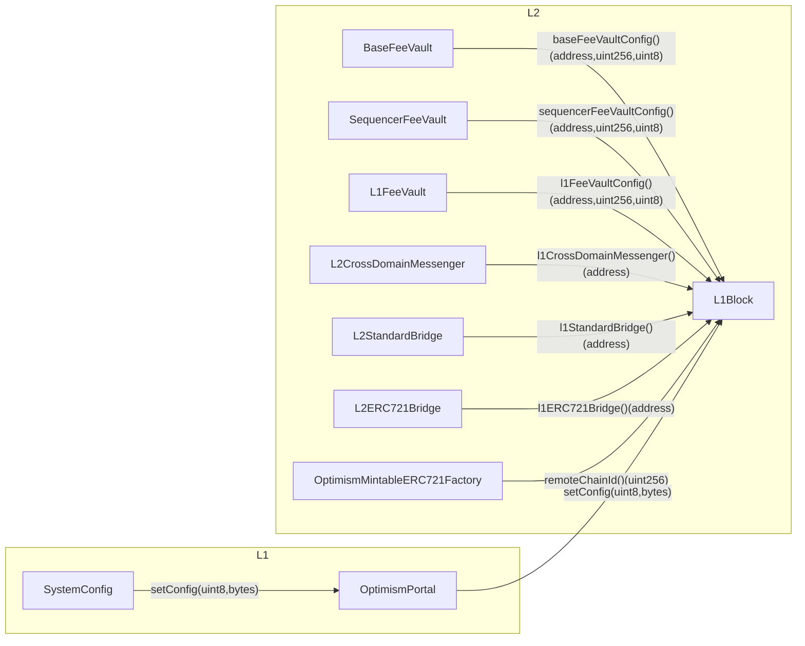

# Overview

<!-- START doctoc generated TOC please keep comment here to allow auto update -->
<!-- DON'T EDIT THIS SECTION, INSTEAD RE-RUN doctoc TO UPDATE -->
**Table of Contents**

- [Constants](#constants)
- [Predeploys](#predeploys)
  - [L1Block](#l1block)
    - [Storage](#storage)
    - [Interface](#interface)
      - [`setL1BlockValuesHolocene`](#setl1blockvaluesholocene)
      - [`setHolocene`](#setholocene)
      - [`eip1559Elasticity`](#eip1559elasticity)
      - [`eip1559Denominator`](#eip1559denominator)
      - [`setConfig`](#setconfig)
      - [`baseFeeVaultConfig`](#basefeevaultconfig)
      - [`sequencerFeeVaultConfig`](#sequencerfeevaultconfig)
      - [`l1FeeVaultConfig`](#l1feevaultconfig)
      - [`l1CrossDomainMessenger`](#l1crossdomainmessenger)
      - [`l1StandardBridge`](#l1standardbridge)
      - [`l1ERC721Bridge`](#l1erc721bridge)
      - [`remoteChainId`](#remotechainid)
  - [FeeVault](#feevault)
    - [Interface](#interface-1)
      - [`config`](#config)
  - [L2CrossDomainMessenger](#l2crossdomainmessenger)
    - [Interface](#interface-2)
  - [L2ERC721Bridge](#l2erc721bridge)
    - [Interface](#interface-3)
  - [L2StandardBridge](#l2standardbridge)
    - [Interface](#interface-4)
  - [OptimismMintableERC721Factory](#optimismmintableerc721factory)
- [Security Considerations](#security-considerations)
  - [GovernanceToken](#governancetoken)

<!-- END doctoc generated TOC please keep comment here to allow auto update -->

This upgrade enables a deterministic L2 genesis state by moving all network
specific configuration out of the initial L2 genesis state. All network specific
configuration is sourced from deposit transactions during the initialization
of the `SystemConfig`.

## Constants

| Name | Value | Definition |
| --------- | ------------------------- | -- |
| `ConfigType` | `uint8` | An enum representing the type of config being set |
| `WithdrawalNetwork` | `uint8(0)` or `uint8(1)` | `0` means withdraw to L1, `1` means withdraw to L2  |
| `RECIPIENT` | `address` | The account that will receive funds sent out of the `FeeVault` |
| `MIN_WITHDRAWAL_AMOUNT` | `uint256` | The minimum amount of native asset held in the `FeeVault` before withdrawal is authorized |
| Fee Vault Config | `bytes32` | `bytes32((WithdrawalNetwork << 248) \|\| uint256(uint88(MIN_WITHDRAWAL_AMOUNT)) \|\| uint256(uint160(RECIPIENT)))` |
| `BASE_FEE_VAULT_CONFIG` | `bytes32(uint256(keccak256("opstack.basefeevaultconfig")) - 1)` | The Fee Vault Config for the `BaseFeeVault` |
| `L1_FEE_VAULT_CONFIG` | `bytes32(uint256(keccak256("opstack.l1feevaultconfig")) - 1)` | The Fee Vault Config for the `L1FeeVault` |
| `SEQUENCER_FEE_VAULT_CONFIG` | `bytes32(uint256(keccak256("opstack.sequencerfeevaultconfig")) - 1)` | The Fee Vault Config for the `SequencerFeeVault` |
| `L1_CROSS_DOMAIN_MESSENGER_ADDRESS` | `bytes32(uint256(keccak256("opstack.l1crossdomainmessengeraddress")) - 1)` | `abi.encode(address(L1CrossDomainMessengerProxy))` |
| `L1_ERC_721_BRIDGE_ADDRESS` | `bytes32(uint256(keccak256("opstack.l1erc721bridgeaddress")) - 1)` | `abi.encode(address(L1ERC721BridgeProxy))` |
| `L1_STANDARD_BRIDGE_ADDRESS` | `bytes32(uint256(keccak256("opstack.l1standardbridgeaddress")) - 1)` | `abi.encode(address(L1StandardBridgeProxy))` |
| `REMOTE_CHAIN_ID` | `bytes32(uint256(keccak256("opstack.remotechainid")) - 1)` | Chain ID of the remote chain |

## Predeploys

All network specific configuration is moved to a single contract, the `L1Block` predeploy.
All predeploys make calls to the `L1Block` contract to fetch network specific configuration
rather than reading it from local state.



### L1Block

#### Storage

The following storage slots are defined:

- `BASE_FEE_VAULT_CONFIG`
- `L1_FEE_VAULT_CONFIG`
- `SEQUENCER_FEE_VAULT_CONFIG`
- `L1_CROSS_DOMAIN_MESSENGER_ADDRESS`
- `L1_ERC_721_BRIDGE_ADDRESS`
- `L1_STANDARD_BRIDGE_ADDRESS`
- `REMOTE_CHAIN_ID`

Each slot MUST have a defined `ConfigType` that authorizes the setting of the storage slot
via a deposit transaction from the `DEPOSITOR_ACCOUNT`.

#### Interface

##### `setL1BlockValuesHolocene`

This function MUST only be callable by the `DEPOSITOR_ACCOUNT`. It is a replacement
for `setL1BlockValuesEcotone` and its calldata is defined in [L1 Attributes](./l1-attributes.md).

```function
function setL1BlockValuesHolocene()
```

##### `setHolocene`

This function is meant to be called once on the activation block of the holocene network upgrade.
It MUST only be callable by the `DEPOSITOR_ACCOUNT` once. When it is called, it MUST call
call each getter for the network specific config and set the returndata into storage.

##### `eip1559Elasticity`

This function returns the currently configured EIP-1559 elasticity.

```solidity
function eip1559Elasticity()(uint64)
```

##### `eip1559Denominator`

This function returns the currently configured EIP-1559 denominator.

```solidity
function eip1559Denominator()(uint64)
```

##### `setConfig`

This function MUST only be callable by the `DEPOSITOR_ACCOUNT`. It modifies the storage directly
of the `L1Block` contract. It MUST handle all defined `ConfigType`s. To ensure a simple ABI, the
`bytes` value MUST be abi decoded based on the `ConfigType`.

```solidity
function setConfig(ConfigType,bytes)
```

Note that `ConfigType` is an enum which is an alias for a `uint8`.

##### `baseFeeVaultConfig`

This function MUST be called by the `BaseFeeVault` to fetch network specific configuration.

```solidity
function baseFeeVaultConfig()(address,uint256,WithdrawalNetwork)
```

##### `sequencerFeeVaultConfig`

This function MUST be called by the `SequencerFeeVault` to fetch network specific configuration.

```solidity
function sequencerFeeVaultConfig()(address,uint256,WithdrawalNetwork)
```

##### `l1FeeVaultConfig`

This function MUST be called by the `L1FeeVault` to fetch network specific configuration.

```solidity
function l1FeeVaultConfig()(address,uint256,WithdrawalNetwork)
```

##### `l1CrossDomainMessenger`

This function MUST be called by the `L2CrossDomainMessenger` to fetch the address of the `L1CrossDomainMessenger`.

```solidity
function l1CrossDomainMessenger()(address)
```

##### `l1StandardBridge`

This function MUST be called by the `L2StandardBridge` to fetch the address of the `L2CrossDomainMessenger`.

```solidity
function l1StandardBridge()(address)
```

##### `l1ERC721Bridge`

This function MUST be called by the `L2ERC721Bridge` to fetch the address of the `L1ERC721Bridge`.

```solidity
function l1ERC721Bridge()(address)
```

##### `remoteChainId`

This function MUST be called by the `OptimismMintableERC721Factory` to fetch the chain id of the remote chain.
For an L2, this is the L1 chain id.

```solidity
function remoteChainId()(uint256)
```

### FeeVault

The following changes apply to each of the `BaseFeeVault`, the `L1FeeVault` and the `SequencerFeeVault`.

#### Interface

The following functions are updated to read from the `L1Block` contract:

- `recipient()(address)`
- `withdrawalNetwork()(WithdrawalNetwork)`
- `minWithdrawalAmount()(uint256)`
- `withdraw()`

| Name | Call |
| ---- | -------- |
| `BaseFeeVault` | `L1Block.baseFeeVaultConfig()` |
| `SequencerFeeVault` | `L1Block.sequencerFeeVaultConfig()` |
| `L1FeeVault` | `L1Block.l1FeeVaultConfig()` |

##### `config`

A new function is added to fetch the full Fee Vault Config.

```solidity
function config()(address,uint256,WithdrawalNetwork)
```

### L2CrossDomainMessenger

#### Interface

The following functions are updated to read from the `L1Block` contract by calling `L1Block.l1CrossDomainMessenger()`:

- `otherMessenger()(address)`
- `OTHER_MESSENGER()(address)`

### L2ERC721Bridge

#### Interface

The following functions are updated to read from the `L1Block` contract by calling `L1Block.l1ERC721Bridge()`

- `otherBridge()(address)`
- `OTHER_BRIDGE()(address)`

### L2StandardBridge

#### Interface

The following functions are updated to read from the `L1Block` contract by calling `L1Block.l1StandardBridge()`

- `otherBridge()(address)`
- `OTHER_BRIDGE()(address)`

### OptimismMintableERC721Factory

The chain id is no longer read from storage but instead is read from the `L1Block` contract by calling
`L1Block.remoteChainId()`

## Security Considerations

### GovernanceToken

The predeploy defined by `GovernanceToken` should be an empty account until it is defined by
a future hardfork.
