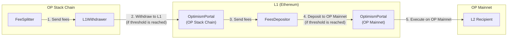

# FeesDepositor

<!-- START doctoc generated TOC please keep comment here to allow auto update -->
<!-- DON'T EDIT THIS SECTION, INSTEAD RE-RUN doctoc TO UPDATE -->

- [Summary](#summary)
- [Functions](#functions)
  - [`receive`](#receive)
  - [`setMinDepositAmount`](#setmindepositamount)
  - [`setL2Recipient`](#setl2recipient)
  - [`setGasLimit`](#setgaslimit)
- [Events](#events)
  - [`FeesDeposited`](#feesdeposited)
  - [`MinDepositAmountUpdated`](#mindepositamountupdated)
  - [`L2RecipientUpdated`](#l2recipientupdated)
  - [`FundsReceived`](#fundsreceived)
  - [`GasLimitUpdated`](#gaslimitupdated)

<!-- END doctoc generated TOC please keep comment here to allow auto update -->

## Summary

A periphery contract on L1 that acts as a recipient of fees sent by the `L1Withdrawer` contract on L2. Its purpose is to perform a deposit transaction to OP Mainnet with those fees via the `OptimismPortal` once it has received sufficient funds.

It's a proxied contract with the owner of the `ProxyAdmin` as the address allowed to call the setter functions.

The following shows how fees flow through the `L1Withdrawer` and `FeesDepositor` during the disbursement process once
they have been pulled from the vaults on L2:



## Functions

### `receive`

Initiates the deposit transaction process to OP Mainnet if and only if the contract holds funds equal to or above the `minDepositAmount` threshold.

```solidity
receive() external payable
```

- MUST initiate a deposit transaction to the recipient on OP Mainnet if the `minDepositAmount` threshold is reached.
- MUST emit the `FundsReceived` event with the sender, amount received, and the current balance of the contract.
- MUST emit the `FeesDeposited` event only if the threshold is reached.

### `setMinDepositAmount`

Updates the minimum deposit amount the contract must hold before the deposit process can be initiated.

```solidity
function setMinDepositAmount(uint256 _newMinDepositAmount) external
```

- MUST only be callable by `ProxyAdmin.owner()`.
- MUST emit the `MinDepositAmountUpdated` event.
- MUST update the `minDepositAmount` storage variable.

### `setL2Recipient`

Updates the address that will receive the funds on OP Mainnet during the deposit process.

```solidity
function setL2Recipient(address _newRecipient) external
```

- MUST only be callable by `ProxyAdmin.owner()`.
- MUST emit the `RecipientUpdated` event.
- MUST update the `l2Recipient` storage variable.

### `setGasLimit`

Updates the gas limit used for the deposit transaction during the fees deposit process.

```solidity
function setGasLimit(uint64 _gasLimit) external
```

- MUST only be callable by `ProxyAdmin.owner()`.
- MUST emit the `GasLimitUpdated` event.
- MUST update the `gasLimit` storage variable.

## Events

### `FeesDeposited`

Emitted when a deposit to OP Mainnet is initiated.

```solidity
event FeesDeposited(address indexed recipient, uint256 amount)
```

### `MinDepositAmountUpdated`

Emitted when the minimum deposit amount before the deposit process can be initiated is updated.

```solidity
event MinDepositAmountUpdated(uint256 oldMinDepositAmount, uint256 newMinDepositAmount)
```

### `L2RecipientUpdated`

Emitted when the recipient of the funds on OP Mainnet is updated.

```solidity
event L2RecipientUpdated(address oldL2Recipient, address newL2Recipient)
```

### `FundsReceived`

Emitted whenever funds are received.

```solidity
event FundsReceived(address indexed sender, uint256 amount, uint256 newBalance)
```

### `GasLimitUpdated`

Emitted when the gas limit for the deposit transaction is updated.

```solidity
event GasLimitUpdated(uint64 oldGasLimit, uint64 newGasLimit)
```
