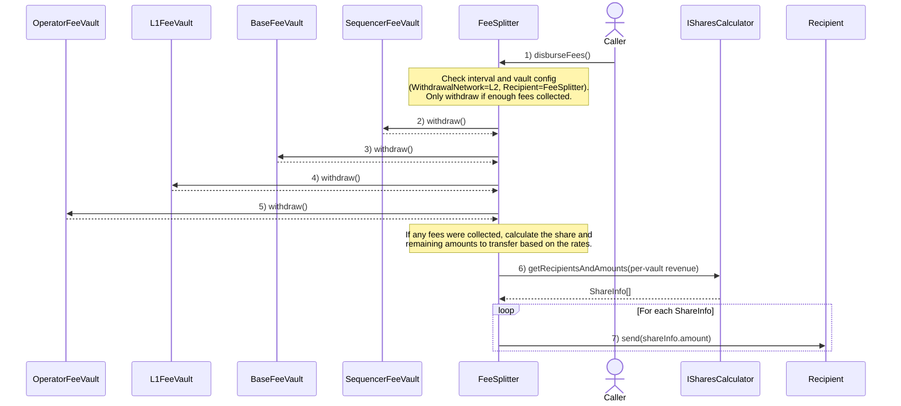

# Predeploys

<!-- cSpell:words TSTORE -->

<!-- START doctoc generated TOC please keep comment here to allow auto update -->
<!-- DON'T EDIT THIS SECTION, INSTEAD RE-RUN doctoc TO UPDATE -->
**Table of Contents**

- [Overview](#overview)
  - [Disburse Fees Flow](#disburse-fees-flow)
- [FeeVault](#feevault)
  - [Functions](#functions)
    - [`setMinWithdrawalAmount`](#setminwithdrawalamount)
    - [`setRecipient`](#setrecipient)
    - [`setWithdrawalNetwork`](#setwithdrawalnetwork)
    - [`recipient`](#recipient)
    - [`minWithdrawalAmount`](#minwithdrawalamount)
    - [`withdrawalNetwork`](#withdrawalnetwork)
    - [`withdraw`](#withdraw)
  - [Events](#events)
    - [`MinWithdrawalAmountUpdated`](#minwithdrawalamountupdated)
    - [`RecipientUpdated`](#recipientupdated)
    - [`WithdrawalNetworkUpdated`](#withdrawalnetworkupdated)
  - [Invariants](#invariants)
- [Fee Vaults (SequencerFeeVault, L1FeeVault, BaseFeeVault, OperatorFeeVault)](#fee-vaults-sequencerfeevault-l1feevault-basefeevault-operatorfeevault)
- [FeeSplitter](#feesplitter)
  - [Functions](#functions-1)
    - [`initialize`](#initialize)
    - [`disburseFees`](#disbursefees)
    - [`receive`](#receive)
    - [`setSharesCalculator`](#setsharescalculator)
    - [`setFeeDisbursementInterval`](#setfeedisbursementinterval)
  - [Events](#events-1)
    - [`FeesDisbursed`](#feesdisbursed)
    - [`FeesReceived`](#feesreceived)
    - [`FeeDisbursementIntervalUpdated`](#feedisbursementintervalupdated)
    - [`SharesCalculatorUpdated`](#sharescalculatorupdated)
- [Security Considerations](#security-considerations)

<!-- END doctoc generated TOC please keep comment here to allow auto update -->

## Overview

| Name        | Address                                    | Introduced | Deprecated | Proxied |
| ----------- | ------------------------------------------ | ---------- | ---------- | ------- |
| FeeSplitter | 0x420000000000000000000000000000000000002B | Jovian     | No         | Yes     |

The `FeeSplitter` predeploy manages the distribution of all L2 fees. Fee vault contracts (`OperatorFeeVault`,
`BaseFeeVault`, `L1FeeVault`, and `SequencerFeeVault`) update their configuration via setter functions for
minimum withdrawal amounts, withdrawal networks, and recipients without requiring new deployments.

Using the `FeeSplitter` requires vaults to use `WithdrawalNetwork.L2` and set the `FeeSplitter` as their
fee recipient. Chain operators may opt-in at any time or they can continue using other solutions.

### Disburse Fees Flow



## FeeVault

Legacy getters are preserved as part of the interface, but default to the newly added storage variables, this means that
now both the legacy and the new storage variables values will match.

The `withdraw` function returns the value that was withdrawn from the vault at the time of the function call.

### Functions

#### `setMinWithdrawalAmount`

Updates the minimum amount of funds the vault contract must hold before they can be withdrawn.

```solidity
function setMinWithdrawalAmount(uint256 _newMinWithdrawalAmount) external
```

- MUST only be callable by `ProxyAdmin.owner()`
- MUST emit the `MinWithdrawalAmountUpdated` event
- MUST update the `_minWithdrawalAmount` storage variable

#### `setRecipient`

Updates the recipient of sequencer fees when they are withdrawn from the vault.

```solidity
function setRecipient(address _newRecipient) external
```

- MUST only be callable by `ProxyAdmin.owner()`
- MUST emit the `RecipientUpdated` event
- MUST update the `_recipient` storage variable

#### `setWithdrawalNetwork`

Updates the network to which the vault collected fees will be withdrawn.
This can be either `WithdrawalNetwork.L1` to withdraw them to an address on L1 by using the `L2ToL1MessagePasser`
predeploy, or `WithdrawalNetwork.L2` to withdraw them to an address on the same chain.

```solidity
function setWithdrawalNetwork(WithdrawalNetwork _newWithdrawalNetwork) external
```

- MUST only be callable by `ProxyAdmin.owner()`
- MUST emit the `WithdrawalNetworkUpdated` event
- MUST update the `_withdrawalNetwork` storage variable

#### `recipient`

Returns the current recipient address, preferring the storage override if set; otherwise falls back to the
legacy immutable value.

```solidity
function recipient() external view returns (address)
```

- MUST check the flag to see if the storage var was set or not.
- MUST return the storage-configured recipient if a storage override has been set via `setRecipient`.
- MUST otherwise return the legacy immutable recipient value.

#### `minWithdrawalAmount`

Returns the current minimum withdrawal amount, preferring the storage override if set; otherwise falls back to
the legacy immutable value.

```solidity
function minWithdrawalAmount() external view returns (uint256)
```

- MUST check the flag to see if the storage var was set or not.
- MUST return the storage-configured minimum if a storage override has been set via `setMinWithdrawalAmount`.
- MUST otherwise return the legacy immutable minimum withdrawal amount.

#### `withdrawalNetwork`

Returns the current withdrawal network, preferring the storage override if set; otherwise falls back to the
legacy immutable value.

```solidity
function withdrawalNetwork() external view returns (WithdrawalNetwork)
```

- MUST check the flag to see if the storage var was set or not.
- MUST return the storage-configured network if a storage override has been set via `setWithdrawalNetwork`.
- MUST otherwise return the legacy immutable withdrawal network.

#### `withdraw`

Withdraws the funds stored in the vault to the recipient. If the recipient is an address on L2, a `SafeCall.send`
is performed; if it's an address on L1, `IL2ToL1MessagePasser.initiateWithdrawal` is used.
Returns the value of the withdrawal.

```solidity
function withdraw() external returns(uint256)
```

- MUST revert if the vault's balance is below `minWithdrawalAmount()`.
- MUST increment `totalProcessed` by the balance the vault had at the time of the function call.
- MUST emit the `Withdrawal(uint256 value, address to, address from)` event.
- MUST emit the `Withdrawal(uint256 value, address to, address from, WithdrawalNetwork withdrawalNetwork)` event.
- MUST send the vault's total balance to the appropriate recipient.

### Events

#### `MinWithdrawalAmountUpdated`

Emitted when the minimum withdrawal amount for the vault is updated.

```solidity
event MinWithdrawalAmountUpdated(uint256 oldWithdrawalAmount, uint256 newWithdrawalAmount)
```

#### `RecipientUpdated`

Emitted when the fee recipient for this vault is updated.

```solidity
event RecipientUpdated(address oldRecipient, address newRecipient)
```

#### `WithdrawalNetworkUpdated`

Emitted when the withdrawal network for this vault is updated.

```solidity
event WithdrawalNetworkUpdated(WithdrawalNetwork oldWithdrawalNetwork, WithdrawalNetwork newWithdrawalNetwork)
```

### Invariants

- Only `ProxyAdmin.owner()` is allowed to call the setter functions.
- If using the `FeeSplitter`, the withdrawal network MUST be set to `WithdrawalNetwork.L2` and the recipient
  MUST be set to the `FeeSplitter` predeploy address.
- The balance of the vault MUST be preserved between implementation upgrades.
- On successful `withdraw()` execution, it MUST withdraw the entire balance.

## Fee Vaults (SequencerFeeVault, L1FeeVault, BaseFeeVault, OperatorFeeVault)

These contracts inherit the changes made to the `FeeVault` contract, meaning that they have storage
variables and setters instead of constants for the configuration values, and they are initializable.

Their configuration includes the withdrawal network and the recipient to which the fees are sent:

- **WithdrawalNetwork.L1**: Funds are withdrawn to an L1 address (default behavior)
- **WithdrawalNetwork.L2**: Funds are withdrawn to an L2 address

For those chains that choose to use the `FeeSplitter` predeploy, `WithdrawalNetwork.L2` as the withdrawal
network, and the `FeeSplitter` as the recipient MUST be set using the setter functions.

## FeeSplitter

This contract splits the funds it receives from the vaults using a configured `ISharesCalculator` compatible
revenue shares calculator to determine which addresses should receive funds and in what amounts
by querying `ISharesCalculator.getRecipientsAndAmounts`:

```solidity
struct ShareInfo {
  address payable recipient;
  uint256 amount;
}

function getRecipientsAndAmounts(
        uint256 _sequencerFeeVaultBalance,
        uint256 _baseFeeVaultBalance,
        uint256 _operatorFeeVaultBalance,
        uint256 _l1FeeVaultBalance)
        external
        view
        returns (ShareInfo[] memory shareInfo);
```

The `ShareInfo[]` array returned represents pairs: a `recipient` address to receive the funds and an `amount` of funds
it should receive; a default [`SuperchainRevSharesCalculator`](./superchain-revshares-calc.md)
implementation of this interface is provided.

The `FeeSplitter` integrates with the fee vault system by configuring each Fee Vault to use `WithdrawalNetwork.L2`
and setting this predeploy as the recipient in every fee vault.

The `FeeSplitter` MUST be proxied and initializable only by the `ProxyAdmin.owner()`.

### Functions

#### `initialize`

Initializes the contract with the initial recipients and sets disbursement interval to `1 days` as default.

```solidity
function initialize(
        ISharesCalculator _sharesCalculator
    ) external
```

- MUST only be callable once.
- MUST set `feeDisbursementInterval` to `_feeDisbursementInterval`.
- MUST emit an `Initialized` event with the provided parameters.

#### `disburseFees`

Initiates the routing flow by withdrawing the fees that each of the fee vaults has collected and sends the shares
to the appropriate addresses according to the amounts returned by the set shares calculator.

When attempting to withdraw from the vaults, it checks that the withdrawal network is set to `WithdrawalNetwork.L2`,
and that the recipient of the vault is the `FeeSplitter`. It MUST revert if any of these conditions is not met.
It MUST only withdraw if the vault balance is greater than or equal to its minimum withdrawal amount.
In addition, it follows a `nonReentrant` pattern using `TSTORE`d flags, to avoid receiving balance back
once the fees are being disbursed.

```solidity
function disburseFees() external
```

- MUST revert if not enough time has passed since the last successful execution.
- MUST revert if any vault has a recipient different from this contract.
- MUST revert if any vault has a withdrawal network different from `WithdrawalNetwork.L2`.
- MUST revert if total fees collected are 0.
- It MUST set the `lastDisbursementTime` to the current block timestamp.
- MUST emit `FeesDisbursed` event if the funds were disbursed.

#### `receive`

Receives funds from any of the `FeeVault`s if and only if the disbursing process is in progress, and reverts
otherwise. This is enforced using transient storage flags.

```solidity
function receive() external payable
```

- MUST revert if the disbursing process is not in progress.
- MUST accept funds from the `BaseFeeVault`, `L1FeeVault`, `SequencerFeeVault` and `OperatorFeeVault` only.
- MUST emit a `FeesReceived` event upon successful execution.

#### `setSharesCalculator`

Sets the address of the calculator used to partition the fees.

```solidity
function setSharesCalculator(ISharesCalculator _newSharesCalculator) external
```

- MUST only be callable by `ProxyAdmin.owner()`
- MUST emit a `SharesCalculatorUpdated` event upon successful execution.
- MUST update the `sharesCalculator` storage variable.

<!-- Fee share basis points are hardcoded constants; no setters are exposed. -->

#### `setFeeDisbursementInterval`

Sets the minimum time, in seconds, that must pass between consecutive calls to `disburseFees`.

```solidity
function setFeeDisbursementInterval(uint128 _newInterval) external
```

- MUST only be callable by `ProxyAdmin.owner()`
- MUST emit a `FeeDisbursementIntervalUpdated` event upon successful execution.
- MUST update the `feeDisbursementInterval` storage variable.

### Events

#### `FeesDisbursed`

Emitted when fees are successfully withdrawn from fee vaults and distributed to recipients.

```solidity
event FeesDisbursed(ShareInfo[] shareInfo, uint256 grossRevenue)
```

#### `FeesReceived`

Emitted when the contract receives funds.

```solidity
event FeesReceived(address indexed sender, uint256 amount)
```

#### `FeeDisbursementIntervalUpdated`

Emitted when the minimum time interval between consecutive fee disbursements is successfully updated.

```solidity
event FeeDisbursementIntervalUpdated(uint128 oldFeeDisbursementInterval, uint128 newFeeDisbursementInterval)
```

#### `SharesCalculatorUpdated`

Emitted when the shares calculator is updated.

```solidity
event SharesCalculatorUpdated(address oldSharesCalculator, address newSharesCalculator)
```

## Security Considerations

- Given that vault recipients can now be updated, it's important to ensure that this can only be done by the
  appropriate address, namely `ProxyAdmin.owner()`.
