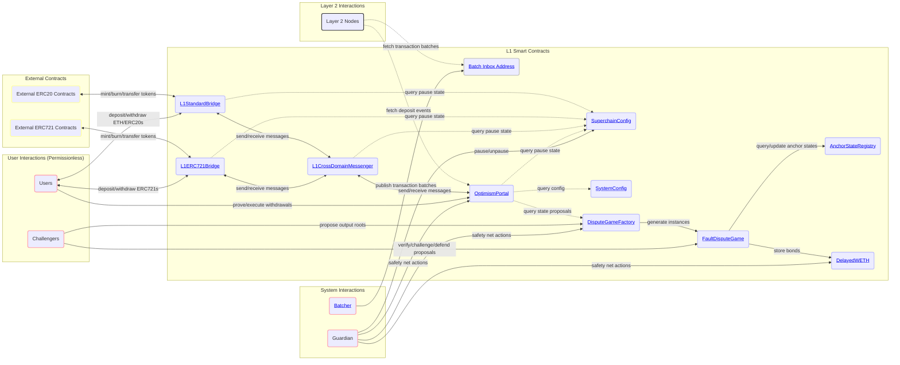
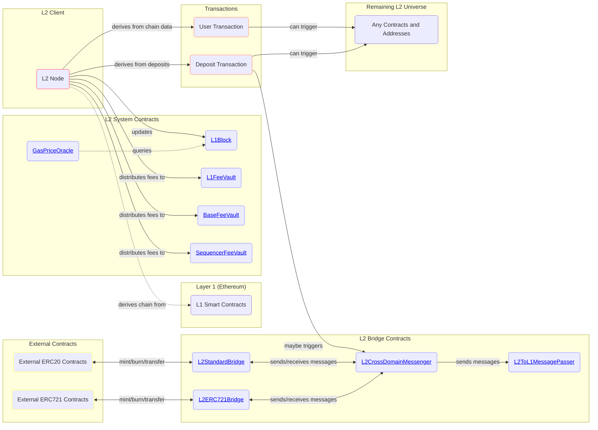
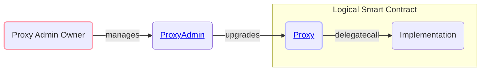
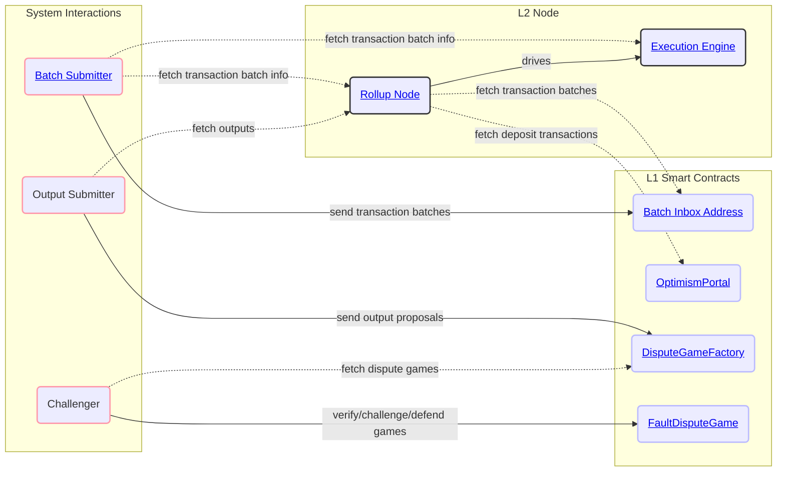
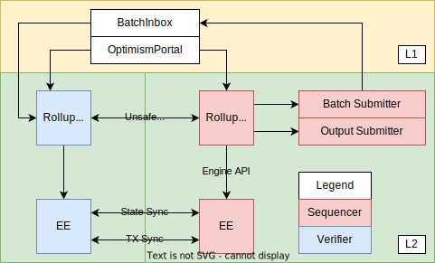

# Optimism Overview

<!-- START doctoc generated TOC please keep comment here to allow auto update -->
<!-- DON'T EDIT THIS SECTION, INSTEAD RE-RUN doctoc TO UPDATE -->
**Table of Contents**

- [Architecture Design Goals](#architecture-design-goals)
- [Architecture Overview](#architecture-overview)
  - [Core L1 Smart Contracts](#core-l1-smart-contracts)
    - [Notes for Core L1 Smart Contracts](#notes-for-core-l1-smart-contracts)
  - [Core L2 Smart Contracts](#core-l2-smart-contracts)
    - [Notes for Core L2 Smart Contracts](#notes-for-core-l2-smart-contracts)
  - [Smart Contract Proxies](#smart-contract-proxies)
  - [L2 Node Components](#l2-node-components)
  - [Transaction/Block Propagation](#transactionblock-propagation)
- [Key Interactions In Depth](#key-interactions-in-depth)
  - [Deposits](#deposits)
  - [Block Derivation](#block-derivation)
    - [Overview](#overview)
    - [Epochs and the Sequencing Window](#epochs-and-the-sequencing-window)
    - [Block Derivation Loop](#block-derivation-loop)
  - [Engine API](#engine-api)

<!-- END doctoc generated TOC please keep comment here to allow auto update -->

This document is a high-level technical overview of the Optimism protocol. It aims to explain how the protocol works in
an informal manner, and direct readers to other parts of the specification so that they may learn more.

This document assumes you've read the [background](../background.md).

## Architecture Design Goals

- **Execution-Level EVM Equivalence:** The developer experience should be identical to L1 except where L2 introduces a
  fundamental difference.
  - No special compiler.
  - No unexpected gas costs.
  - Transaction traces work out-of-the-box.
  - All existing Ethereum tooling works - all you have to do is change the chain ID.
- **Maximal compatibility with ETH1 nodes:** The implementation should minimize any differences with a vanilla Geth
  node, and leverage as many existing L1 standards as possible.
  - The execution engine/rollup node uses the ETH2 Engine API to build the canonical L2 chain.
  - The execution engine leverages Geth's existing mempool and sync implementations, including snap sync.
- **Minimize state and complexity:**
  - Whenever possible, services contributing to the rollup infrastructure are stateless.
  - Stateful services can recover to full operation from a fresh DB using the peer-to-peer network and on-chain sync
    mechanisms.
  - Running a replica is as simple as running a Geth node.

## Architecture Overview

### Core L1 Smart Contracts

Below you'll find an architecture diagram describing the core L1 smart contracts for the OP Stack.
Smart contracts that are considered "peripheral" and not core to the operation of the OP Stack system are described separately.



#### Notes for Core L1 Smart Contracts

- The `Batch Inbox Address` described above (**highlighted in GREY**) is *not* a smart contract and is instead an arbitrarily
  selected account that is assumed to have no known private key. The convention for deriving this account's address is
  provided on the [Configurability](./configurability.md#consensus-parameters) page.
  - Historically, it was often derived as
  `0xFF0000....<L2 chain ID>` where `<L2 chain ID>` is chain ID of the Layer 2 network for which the data is being posted.
  This is why many chains, such as OP Mainnet, have a batch inbox address of this form.
- Smart contracts that sit behind `Proxy` contracts are **highlighted in BLUE**. Refer to the
  [Smart Contract Proxies](#smart-contract-proxies) section below to understand how these proxies are designed.
  - The `L1CrossDomainMessenger` contract sits behind the [`ResolvedDelegateProxy`](https://github.com/ethereum-optimism/optimism/tree/develop/packages/contracts-bedrock/src/legacy/ResolvedDelegateProxy.sol)
    contract, a legacy proxy contract type used within older versions of the OP Stack. This proxy type is used exclusively
    for the `L1CrossDomainMessenger` to maintain backwards compatibility.
  - The `L1StandardBridge` contract sits behind the [`L1ChugSplashProxy`](https://github.com/ethereum-optimism/optimism/tree/develop/packages/contracts-bedrock/src/legacy/L1ChugSplashProxy.sol)
    contract, a legacy proxy contract type used within older versions of the OP Stack. This proxy type is used exclusively
    for the `L1StandardBridge` contract to maintain backwards compatibility.

### Core L2 Smart Contracts

Here you'll find an architecture diagram describing the core OP Stack smart contracts that exist natively on the L2 chain
itself.



#### Notes for Core L2 Smart Contracts

- Contracts highlighted as "L2 System Contracts" are updated or mutated automatically as part of the chain derivation
  process. Users typically do not mutate these contracts directly, except in the case of the `FeeVault` contracts where
  any user may trigger a withdrawal of collected fees to the pre-determined withdrawal address.
- Smart contracts that sit behind `Proxy` contracts are **highlighted in BLUE**. Refer to the
  [Smart Contract Proxies](#smart-contract-proxies) section below to understand how these proxies are designed.
- User interactions for the "L2 Bridge Contracts" have been omitted from this diagram but largely follow the same user
  interactions described in the architecture diagram for the [Core L1 Smart Contracts](#core-l1-smart-contracts).

### Smart Contract Proxies

Most OP Stack smart contracts sit behind `Proxy` contracts that are managed by a `ProxyAdmin` contract.
The `ProxyAdmin` contract is controlled by some `owner` address that can be any EOA or smart contract.
Below you'll find a diagram that explains the behavior of the typical proxy contract.



### L2 Node Components

Below you'll find a diagram illustrating the basic interactions between the components that make up an L2 node as well
as demonstrations of how different actors use these components to fulfill their roles.



### Transaction/Block Propagation

**Spec links:**

- [Execution Engine](exec-engine.md)

Since the EE uses Geth under the hood, Optimism uses Geth's built-in peer-to-peer network and transaction pool to
propagate transactions. The same network can also be used to propagate submitted blocks and support snap-sync.

Unsubmitted blocks, however, are propagated using a separate peer-to-peer network of Rollup Nodes. This is optional,
however, and is provided as a convenience to lower latency for verifiers and their JSON-RPC clients.

The below diagram illustrates how the sequencer and verifiers fit together:



## Key Interactions In Depth

### Deposits

**Spec links:**

- [Deposits](deposits.md)

Optimism supports two types of deposits: user deposits, and L1 attributes deposits. To perform a user deposit, users
call the `depositTransaction` method on the `OptimismPortal` contract. This in turn emits `TransactionDeposited` events,
which the rollup node reads during block derivation.

L1 attributes deposits are used to register L1 block attributes (number, timestamp, etc.) on L2 via a call to the L1
Attributes Predeploy. They cannot be initiated by users, and are instead added to L2 blocks automatically by the rollup
node.

Both deposit types are represented by a single custom EIP-2718 transaction type on L2.

### Block Derivation

#### Overview

The rollup chain can be deterministically derived given an L1 Ethereum chain. The fact that the entire rollup chain can
be derived based on L1 blocks is *what makes Optimism a rollup*. This process can be represented as:

```text
derive_rollup_chain(l1_blockchain) -> rollup_blockchain
```

Optimism's block derivation function is designed such that it:

- Requires no state other than what is easily accessible using L1 and L2 execution engine APIs.
- Supports sequencers and sequencer consensus.
- Is resilient to sequencer censorship.

#### Epochs and the Sequencing Window

The rollup chain is subdivided into epochs. There is a 1:1 correspondence between L1 block numbers and epoch numbers.

For L1 block number `n`, there is a corresponding rollup epoch `n` which can only be derived after a *sequencing window*
worth of blocks has passed, i.e. after L1 block number `n + SEQUENCING_WINDOW_SIZE` is added to the L1 chain.

Each epoch contains at least one block. Every block in the epoch contains an L1 info transaction which contains
contextual information about L1 such as the block hash and timestamp. The first block in the epoch also contains all
deposits initiated via the `OptimismPortal` contract on L1. All L2 blocks can also contain *sequenced transactions*,
i.e. transactions submitted directly to the sequencer.

Whenever the sequencer creates a new L2 block for a given epoch, it must submit it to L1 as part of a *batch*, within
the epoch's sequencing window (i.e. the batch must land before L1 block `n + SEQUENCING_WINDOW_SIZE`). These batches are
(along with the `TransactionDeposited` L1 events) what allows the derivation of the L2 chain from the L1 chain.

The sequencer does not need for a L2 block to be batch-submitted to L1 in order to build on top of it. In fact, batches
typically contain multiple L2 blocks worth of sequenced transactions. This is what enables
*fast transaction confirmations* on the sequencer.

Since transaction batches for a given epoch can be submitted anywhere within the sequencing window, verifiers must
search all blocks within the window for transaction batches. This protects against the uncertainty of transaction
inclusion of L1. This uncertainty is also why we need the sequencing window in the first place: otherwise the sequencer
could retroactively add blocks to an old epoch, and validators wouldn't know when they can finalize an epoch.

The sequencing window also prevents censorship by the sequencer: deposits made on a given L1 block will be included in
the L2 chain at worst after `SEQUENCING_WINDOW_SIZE` L1 blocks have passed.

The following diagram describes this relationship, and how L2 blocks are derived from L1 blocks (L1 info transactions
have been elided):


#### Block Derivation Loop

A sub-component of the rollup node called the *rollup driver* is actually responsible for performing block derivation.
The rollup driver is essentially an infinite loop that runs the block derivation function. For each epoch, the block
derivation function performs the following steps:

1. Downloads deposit and transaction batch data for each block in the sequencing window.
2. Converts the deposit and transaction batch data into payload attributes for the Engine API.
3. Submits the payload attributes to the Engine API, where they are converted into blocks and added to the canonical
   chain.

This process is then repeated with incrementing epochs until the tip of L1 is reached.

### Engine API

The rollup driver doesn't actually create blocks. Instead, it directs the execution engine to do so via the Engine API.
For each iteration of the block derivation loop described above, the rollup driver will craft a *payload attributes*
object and send it to the execution engine. The execution engine will then convert the payload attributes object into a
block, and add it to the chain. The basic sequence of the rollup driver is as follows:

1. Call [fork choice updated][EngineAPIVersion] with the payload attributes object. We'll skip over the details of the
   fork choice state parameter for now - just know that one of its fields is the L2 chain's `headBlockHash`, and that it
   is set to the block hash of the tip of the L2 chain. The Engine API returns a payload ID.
2. Call [get payload][EngineAPIVersion] with the payload ID returned in step 1. The engine API returns a payload object
   that includes a block hash as one of its fields.
3. Call [new payload][EngineAPIVersion] with the payload returned in step 2. (Ecotone blocks, must use V3, pre-Ecotone
   blocks MUST use the V2 version)
4. Call [fork choice updated][EngineAPIVersion] with the fork choice parameter's `headBlockHash` set to the block hash
   returned in step 2. The tip of the L2 chain is now the block created in step 1.

[EngineAPIVersion]: derivation.md#engine-api-usage

The swimlane diagram below visualizes the process:


