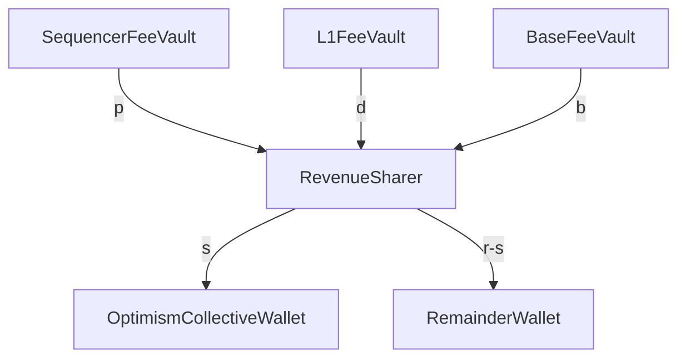

<!-- START doctoc generated TOC please keep comment here to allow auto update -->
<!-- DON'T EDIT THIS SECTION, INSTEAD RE-RUN doctoc TO UPDATE -->
**Table of Contents**

- [Revenue Sharing](#revenue-sharing)
  - [Definitions](#definitions)
  - [`RevenueSharer` predeploy](#revenuesharer-predeploy)
    - [Deploying `RevenueSharer`](#deploying-revenuesharer)
      - [Existing Chains](#existing-chains)
      - [Chains after version X.Y.Z of OP Stack](#chains-after-version-xyz-of-op-stack)
    - [Execution](#execution)
  - [Simplified L1 Data Fee Expenditure](#simplified-l1-data-fee-expenditure)

<!-- END doctoc generated TOC please keep comment here to allow auto update -->

# Revenue Sharing

Revenue sharing is the process by which chains in the superchain contribute a portion of their revenue or profit to the Optimism collective. They do this in return for support with the OP Stack and other benefits. 


## Definitions
| Term   | Name         | Definition  |
| -------|--------------| ----------- |
| $d$ | L1 Data Fee Revenue    | ETH transferred to the sequencer with L2 transactions to cover estimated L1 Data Fees(see below). Accumulates to `L1FeeVault`.
| $e$ | L1 Data Fee Expenditure| ETH spent by the batcher on L1 to make transaction data available
| $b$ | L2 Base Gas Revenue         | Base fee portion of L2 Gas Fee (ETH transferred to the sequencer to cover execution of L2 transactions). Accumulates to `BaseFeeVault`.
| $p$ | L2 Priority Gas Revenue         | Priority fee portion of L2 Gas Fee (ETh transferred to the sequencer to cover execution of L2 transactions). Accumulates to `SequencerFeeVault`.
| $g$ | L2 Gas Revenue         | $b+p$
| $r$ | Sequencer Revenue      | $e + g$
| $p$ | Sequencer Profit       | $e + g - d$
| $s$ | Revenue share due to Optimism Collective | $\max(0.15r,0.025p)$

## `RevenueSharer` predeploy
Revenue sharing is achieved through an L2 [predeploy](./predeploys.md) contract `RevenueSharer` with address

```
0x4200000000000000000000000000000000000024
```

### Deploying `RevenueSharer`

#### Existing Chains
Deployed manually using create2 so there is a consistent address across chains. It won't be in the `0x42...` namespace. That is not possible without a hardfork. 

#### Chains after version X.Y.Z of OP Stack 
Part of the genesis creation for new chains. 

### Execution
Revenue sharing is executed periodically. 
The `RevenueSharer` is respomsible for computing $s$ and sending it to a predetermined address controlled by the Optimism Collective. At the end of execution, `SequencerFeeVault`, `L1FeeVault` and `BaseFeeVault` and `RevenueSharer` should be completely depleted of ETH. This allows the contract to be stateless.


## Simplified L1 Data Fee Expenditure
As a part of a gradual rollout of protocol enshrined revenue sharing, the `RevenueSharer` uses a fixed value of $e=0$. The sequencer makes a profit on data availability of $d-e$. Note that a negative profit, i.e. a loss, is possible.  By assuming $e=0$, the simplification implies that data availability revenue is all profit. This will be addressed in a future protocol upgrade. 

