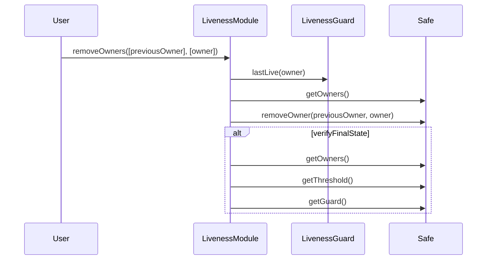

# Safe Contract Extensions

<!-- START doctoc generated TOC please keep comment here to allow auto update -->
<!-- DON'T EDIT THIS SECTION, INSTEAD RE-RUN doctoc TO UPDATE -->
**Table of Contents**

- [Guardian Safe](#guardian-safe)
  - [Deputy Guardian Module](#deputy-guardian-module)
  - [Deputy Guardian Module Security Properties](#deputy-guardian-module-security-properties)
- [Security Council Liveness Checking Extensions](#security-council-liveness-checking-extensions)
  - [The Liveness Guard](#the-liveness-guard)
  - [The Liveness Module](#the-liveness-module)
  - [Owner Removal Call Flow](#owner-removal-call-flow)
  - [Shutdown](#shutdown)
  - [Liveness Security Properties](#liveness-security-properties)
    - [Liveness Guard Security Properties](#liveness-guard-security-properties)
    - [Liveness Module Security Properties](#liveness-module-security-properties)
  - [Interdependency between the Liveness Guard and Liveness Module](#interdependency-between-the-liveness-guard-and-liveness-module)
- [Operational Considerations](#operational-considerations)
  - [Manual validation of new owner liveness](#manual-validation-of-new-owner-liveness)
  - [Deploying the Liveness Checking System](#deploying-the-liveness-checking-system)
  - [Modifying the Liveness Checking System](#modifying-the-liveness-checking-system)
    - [Replacing the Liveness Module](#replacing-the-liveness-module)
    - [Replacing the Liveness Guard](#replacing-the-liveness-guard)

<!-- END doctoc generated TOC please keep comment here to allow auto update -->

This document describes extensions to the Security Council and Guardian Safe contracts, which
provide additional functionality and security guarantees on top of those provided by the Safe
contract.

These extensions are developed using two types of contracts
([modules](https://docs.safe.global/advanced/smart-account-modules) and
[guards](https://docs.safe.global/advanced/smart-account-guards)) which the Safe contract has
built-in support for:

1. **Guard contracts:** can execute pre- and post- transaction checks.
1. **Module contracts:** a contract which is
   authorized to execute transactions via the Safe. This means the module must properly implement
   auth conditions internally.

For more information about the Security Council and Guardian roles, refer to the
[Stage One Roles and Requirements](./stage-1.md) document.

## Guardian Safe

The Guardian Safe is extended by the Deputy Guardian Module.

### Deputy Guardian Module

As the sole owner of the Guardian Safe, the Security Council acts as the Guardian, which is
authorized to activate the [Superchain Pause](../protocol/superchain-configuration.md#pausability)
functionality.

However the Security Council cannot be expected to react quickly in an emergency situation.
Therefore the Deputy Guardian module enables the Security Council to share this authorization with
another account.

The module has the following minimal interface:

```solidity
interface DeputyGuardianModule {
   /// @dev The address of the Security Council Safe
   function safe() external view returns(address);

   /// @dev The address of the account which can pause superchain withdrawals by calling this module
   function deputyGuardian() external view returns(address);

   /// @dev Calls the Security Council Safe's `execTransactionFromModule()`, with the arguments
   ///      necessary to call `pause()` on the `SuperchainConfig` contract.
   ///      Only the deputy guardian can call this function.
   function pause() external;

   /// @dev Calls the Security Council Safe's `execTransactionFromModule()`, with the arguments
   ///      necessary to call `unpause()` on the `SuperchainConfig` contract.
   ///      Only the deputy guardian can call this function.
   function unpause() external;

   /// @dev Calls the Security Council Safe's `execTransactionFromModule()`, with the arguments
   ///      necessary to call `blacklistDisputeGame()` on the `OptimismPortal2` contract.
   ///      Only the deputy guardian can call this function.
   /// @param _portal The `OptimismPortal2` contract instance.
   /// @param _game The `IDisputeGame` contract instance.
   function blacklistDisputeGame(address _portal, address _game) external;

   /// @dev Calls the Security Council Safe's `execTransactionFromModule()`, with the arguments
   ///      necessary to call `setRespectedGameType()` on the `OptimismPortal2` contract.
   ///      Only the deputy guardian can call this function.
   /// @param _portal The `OptimismPortal2` contract instance.
   /// @param _gameType The `GameType` to set as the respected game type
   function setRespectedGameType(address _portal, uint32 _gameType) external;
}
```

For simplicity, the `DeputyGuardianModule` module does not have functions for updating the `safe`
and `deputyGuardian` addresses. If necessary these can be modified by swapping out with a new
module.

### Deputy Guardian Module Security Properties

The following security properties must be upheld by the `DeputyGuardianModule`:

1. The module must correctly enforce access controls so that only the Deputy Guardian can call state
   modifying functions on the `DeputyGuardianModule`.
1. The module must be able to cause the Safe to make calls to all of the functions which the
   Guardian role is authorized to make.
1. The module must not be able to cause the Safe to make calls to functions which the Guardian role
   is not authorized to make.
1. The module must be safely removable.
1. The module must not introduce any possibility of disabling the the Safe so that it can no longer
   forward transactions.
1. The module must format calldata correctly such that the target it calls performs the expected
   action.

## Security Council Liveness Checking Extensions

The Security Council Safe is extended by the Liveness Checking Module and Guard. These extensions
are intended to ensure that any loss of access to a signer's keys is identified and addressed
within a predictable period of time.

This mechanism is intended only to be used to remove signers who have lost access to their keys, or
are otherwise inactive. It is not intended to be used to remove signers who are acting in bad faith,
or any other subjective criteria, such cases should be addressed by governance, and the removal
handled via the standard Safe ownership management functionality.

### The Liveness Guard

For implementing liveness checks a `LivenessGuard` is created which receives the signatures from
each executed transaction, and tracks the latest time at which a transaction was signed by each
signer. This time is made publicly available by calling a `lastLive(address)(Timestamp)` method.

Owners are recorded in this mapping in one of 4 ways:

1. Upon deployment, the guard reads the current set of owners from the Safe contract.
1. When a new owner is added to the safe. Similarly, when an owner is removed from the Safe, its
   entry is deleted from the mapping.
1. When a transaction is executed, the signatures on that transaction are passed to the guard and
   used to identify the signers. If more than the required number of signatures is provided, they
   are ignored.
1. An owner may call the contract's `showLiveness()()` method directly in order to prove liveness.

Note that the first two methods do not require the owner to actually sign anything. However these
mechanisms are necessary to prevent new owners from being removed before they have had a chance to
show liveness.

### The Liveness Module

A `LivenessModule` is also created which does the following:

1. Has a function `removeOwners()` that anyone may call to specify one or more owners to be removed
   from the Safe.
1. The Module would then check the `LivenessGuard.lastLive()` to determine if the signer is eligible
   for removal.
1. If so, it will call the Safe's `removeSigner()` to remove the non-live signer, and if necessary
   reduce the threshold.
1. When a member is removed, the signing parameters are modified such that `M/N` is the lowest ratio
   which remains greater than or equal to 75%. Using integer math, this can be expressed as
   `M = (N * 75 + 99) / 100`.

### Owner Removal Call Flow

The following diagram illustrates the flow for removing a single owner. The `verifyFinalState` box
indicates calls to the Safe which ensure the final state is valid.



### Shutdown

In the unlikely event that the signer set (`N`) is reduced below the allowed minimum number of
owners, then (and only then) is a shutdown mechanism activated which removes the existing signers,
and hands control of the multisig over to a predetermined entity.

### Liveness Security Properties

The following security properties must be upheld:

#### Liveness Guard Security Properties

1. Signatures are assigned to the correct signer.
1. Non-signers are unable to create a record of having signed.
1. An owner cannot be censored or griefed such that their signing is not recorded.
1. Owners may demonstrate liveness either by signing a transaction or by calling directly to the
   guard.
1. It must be impossible for the guard's `checkTransaction` or `checkAfterExecution` method to
   permanently revert given any calldata and the current state.
1. The guard correctly handles updates to the owners list, such that new owners are recorded, and
   removed owners are deleted.
   1. An `ownersBefore` enumerable set variable is used to accomplish this, it must be emptied at
      the end of the `checkAfterExecution` call.

#### Liveness Module Security Properties

1. During a shutdown the module correctly removes all signers, and converts the safe to a 1 of 1.
1. The module only removes an owner if they have not demonstrated liveness during the interval, or
   if enough other owners have been removed to activate the shutdown mechanism.
1. The module correctly sets the Safe's threshold upon removing a signer.

Note: neither the module nor guard attempt to prevent a quorum of owners from removing either the
liveness module or guard. There are legitimate reasons they might wish to do so. Moreover, if such a
quorum of owners exists, there is no benefit to removing them, as they are defacto 'sufficiently
live'.

### Interdependency between the Liveness Guard and Liveness Module

The guard has no dependency on the module, and can be used independently to track liveness of Safe
owners.

This means that the module can be removed or replaced without any affect on the guard.

The module however does have a dependency on the guard; if the guard is removed from the Safe, then
the module will no longer be functional and calls to its `removeOwners` function will revert.

## Operational Considerations

### Manual validation of new owner liveness

As [noted above](#the-liveness-guard) newly added owners are recorded in the guard without
necessarily having signed a transaction. Off-chain validation of the liveness of an address must
therefore be done prior to adding a new owner.

### Deploying the Liveness Checking System

[deploying]: #deploying-the-liveness-checking-system

The module and guard are intended to be deployed and installed on the safe in the following
sequence:

1. Deploy the guard contract. The guard's constructor will read the Safe's owners and set a
   timestamp.
1. Deploy the module.
1. Set the guard on the safe.
1. Enable the module on the safe.

This order of operations is necessary to satisfy the constructor checks in the module, and is
intended to prevent owners from being immediately removable.

Note that changes to the owners set should not be made between the time the module is deployed, and
when it is enabled on the Safe, otherwise the checks made in the module's constructor may be
invalidated. If such changes are made, a new module should be deployed.

### Modifying the Liveness Checking System

Changes to the liveness checking system should be done in the following manner:

#### Replacing the Liveness Module

The module can safely be removed without affecting the operation of the guard. A new module can then
be added.

Note: none of the module's parameters are modifiable. In order to update the security properties
enforced by the module, it must be replaced.

#### Replacing the Liveness Guard

The safe can only have one guard contract at a time, and if the guard is removed the module will
cease to function. This does not affect the ability of the Safe to operate normally, however the
module should be removed as a best practice.

If a new guard is added, eg. as a means of upgrading it, then a new module will also need to be
deployed and enabled. Once both the guard and module have been removed, they can be replaced
according to the steps in the [Deployment][deploying] section above.
