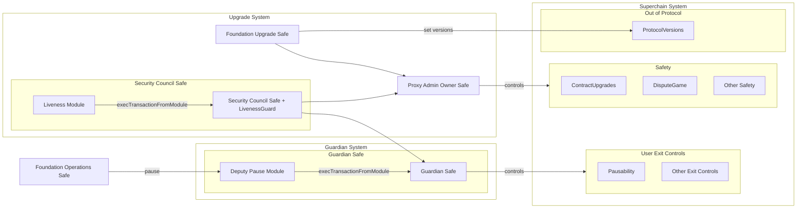

# Stage 1 Roles and Requirements

<!-- START doctoc generated TOC please keep comment here to allow auto update -->
<!-- DON'T EDIT THIS SECTION, INSTEAD RE-RUN doctoc TO UPDATE -->
**Table of Contents**

- [Overview](#overview)
- [Definitions](#definitions)
  - [Withdrawal Liveness](#withdrawal-liveness)
  - [Withdrawal Safety](#withdrawal-safety)
  - [Proxy Admin Owner](#proxy-admin-owner)
  - [Guardian](#guardian)
  - [Pause Deputy](#pause-deputy)
  - [Pause Mechanism](#pause-mechanism)
  - [Pause Identifier](#pause-identifier)
  - [Stage 1 Rollup](#stage-1-rollup)
- [OP Stack Stage 1 Design](#op-stack-stage-1-design)
  - [Permissionless Fault Proofs](#permissionless-fault-proofs)
  - [Security Council](#security-council)
  - [Proxy Admin Owner](#proxy-admin-owner-1)
  - [Guardian](#guardian-1)
  - [Pause Deputy](#pause-deputy-1)
  - [Architecture Diagram](#architecture-diagram)
- [Invariants](#invariants)
  - [iS1-001](#is1-001)
  - [Impact](#impact)
  - [iS1-002: The Pause Deputy can only cause a temporary Withdrawal Liveness failure](#is1-002-the-pause-deputy-can-only-cause-a-temporary-withdrawal-liveness-failure)
    - [Impact](#impact-1)
  - [iS1-003: The Guardian can revoke the Pause Deputy role at any time](#is1-003-the-guardian-can-revoke-the-pause-deputy-role-at-any-time)
    - [Impact](#impact-2)

<!-- END doctoc generated TOC please keep comment here to allow auto update -->

## Overview

This document describes the requirements necessary for an OP Stack implementation to satisfy the
Stage 1 decentralization requirements [as defined by L2BEAT][stage-1]. It also defines the specific
roles and capabilities for an OP Stack chain in the standard configuration that will satisfy these
requirements.

## Definitions

### Withdrawal Liveness

**Withdrawal Liveness** is the ability for users to execute valid withdrawals out of any contract
that stores ETH or tokens within an OP Chain's set of smart contracts. We tend to refer to
Withdrawal Liveness in the context of the `OptimismPortal` and the rest of the Standard Bridge
system (i.e., the `StandardBridge` and `CrossDomainMessenger` contracts) because this is where a
majority of the ETH/tokens in the system live. However, this also applies to bonds deposited into
dispute game contracts (and ultimately into the `DelayedWETH` contract).

### Withdrawal Safety

**Withdrawal Safety** is the condition that users are _not_ able to execute _invalid_ withdrawals
out of any contract that stores ETH or tokens within an OP Chain's set of smart contracts.
Generally speaking "liveness" means nothing gets bricked and "safety" means nothing gets stolen.

### Proxy Admin Owner

The **Proxy Admin Owner** is a dedicated role in the OP Stack that is permitted to upgrade the
contracts that make up an OP Stack chain's onchain footprint. In the Superchain, the Upgrade
Controller role is held jointly in a 2/2 of the Optimism Security Council and the Optimism
Foundation.

### Guardian

The **Guardian** is a dedicated role in the OP Stack that is permitted to trigger certain actions
to maintain the security of an OP Chain or set of OP Chains in case of a bug in the protocol. In
the Superchain, the Guardian role is held by the Optimism Security Council.

### Pause Deputy

The **Pause Deputy** is a dedicated role managed by the [Guardian](#guardian) that can execute the
[Pause Mechanism](#pause-mechanism). An OP Chain does not necessarily need to assign a Pause
Deputy. The Pause Deputy is capable of triggering the Pause Mechanism but does not have the ability
to reset the mechanism or unpause the system.

The Pause Deputy is an optional role within an OP Chain and can be configured if the Guardian is
a [Safe][safe-docs] that installs the [Deputy Pause Module](./deputy-pause-module.md).

### Pause Mechanism

The **Pause Mechanism** is a tool that permits the [Guardian](#guardian) or the
[Pause Deputy](#pause-deputy) to pause the execution of certain actions on one or more OP Chains.
Broadly speaking, the Pause Mechanism is designed to impact the liveness of the system such that
an attack on the system is unable to actually remove ETH or ERC-20 tokens from the bridge or any
other contract that stores ETH and/or tokens.

The Pause Mechanism is temporary and is active up to a fixed maximum amount of time before
expiring. A pause cannot be triggered again unless the mechanism is explicitly reset by the
[Guardian](#guardian). That is, if the Pause Mechanism is triggered and not reset by the Guardian,
it will expire, the system will automatically become unpaused, and the system cannot be paused
again.

The Pause Mechanism can be applied globally or to individual systems. Which level the pause applies
to is determined by the [Pause Identifier](#pause-identifier) provided when executing or checking
pause status.

Chains using the Standard Configuration of the OP Stack use a pause expiry of **3 months**. Because
the Pause Mechanism can be applied to both local and global scopes, the pause could be chained to,
for instance, pause the local system first and then the global system shortly before the local
pause expires. The total potential pause time is therefore double the expiry period (6 months).

The Guardian may explicitly unpause the system rather than waiting for the pause to expire. If this
happens, the pause is automatically reset such that it can be used again. The Guardian can reset
the pause at any time so that it can be used again, even if the pause is currently active. If the
pause is reset when it is currently active, the pause can be triggered again, thereby resetting
the 6 month expiry timer (on a per address identifier basis).

### Pause Identifier

The **Pause Identifier** is an address parameter used to specify the scope of a pause action. This
identifier determines which systems or chains are affected by the pause:

- When the identifier is the zero address (`0x0000000000000000000000000000000000000000`), the pause
  applies globally to all chains sharing the `SuperchainConfig` contract.
- When the identifier is a non-zero address, the pause applies specifically to the chain or set of
  chains associated with that identifier.

(-v4.1.0) The identifier must be an `ETHLockbox` address or `address(0)`. This allows for targeted
pausing of either specific chains, the interop set (which shares an `ETHLockbox` contract), or all
chains that share the same `SuperchainConfig` when `address(0)` is used as the identifier.

(-v4.1.0) OP Chains are expected to integrate with the `SuperchainConfig` via their `SystemConfig`
contract, which will check for the status of the pause by passing along the address of the
`ETHLockbox` being used within that system as the Pause Identifier.

(+v4.1.0) The identifier must be an `ETHLockbox` address, an `OptimismPortal` address, or
`address(0)`. This allows for targeted pausing of specific chains, the interop set (which shares an
`ETHLockbox` contract), or all chains that share the same `SuperchainConfig` when `address(0)` is
used as the identifier. When the `ETHLockbox`
[Customizable Feature](./system-config.md#customizable-feature) is enabled, the `ETHLockbox`
address is to be used as the pause identifier. When the `ETHLockbox` feature is disabled or the
`ETHLockbox` address has not yet been configured, the `OptimismPortal` address is to be used.

### Stage 1 Rollup

L2BEAT defines that a system can be considered a "Stage 1 Rollup" system if it has the following
property:

- If the System has a Security Council ([as defined by L2BEAT][security-council]) the only way
  (excluding bugs) for the System to experience an indefinite
  [Withdrawal Liveness](#withdrawal-liveness) failure or any
  [Withdrawal Safety](#withdrawal-safety) failure is through a malicious majority of at least 75%
  of the Security Council.

## OP Stack Stage 1 Design

The above definitions and requirements have a number of concrete implications for the Standard
Configuration of the OP Stack. We therefore specify the following architecture for a Stage 1 OP
Stack chain.

### Permissionless Fault Proofs

A Stage 1 OP Stack chain must operate a _permissionless_ Fault Proof system.

### Security Council

A Stage 1 OP Stack chain must have a Security Council.

### Proxy Admin Owner

The [Proxy Admin Owner](#proxy-admin-owner) role in the OP Stack is a privileged role that is
allowed to upgrade the smart contracts that make up an OP Stack chain's onchain footprint. This
role must require sign-off from the Security Council. This specifically means that the role can
either be entirely held by the Security Council or by some other configuration as long as the
Security Council is a required signatory (e.g., a 2/2 multisig).

In addition to the ability to upgrade all smart contracts, the Proxy Admin Owner is the only
address authorized to perform the following actions:

- `DisputeGameFactory.setImplementation`
- `DisputeGameFactory.setInitBond`
- `DelayedWETH.hold`
- `DelayedWETH.recover`

The Proxy Admin Owner can theoretically cause an indefinite
[Withdrawal Liveness](#withdrawal-liveness) failure as well as
[Withdrawal Safety](#withdrawal-safety) failures. This is aligned with the Stage 1 definition
because the Security Council is a required signatory on this role.

### Guardian

The [Guardian](#guardian) role in the OP Stack is a privileged role that is allowed to execute
certain safety-net actions in the case that a bug exists in the OP Stack smart contracts. This role
must be held by the Security Council in the form of a 1/1 Safe owned by the Security Council.

The Guardian is the only address that is permitted to execute the following actions:

- `SuperchainConfig.pause()`
- `SuperchainConfig.unpause()`
- `SuperchainConfig.reset()`
- `AnchorStateRegistry.setRespectedGameType()`
- `AnchorStateRegistry.updateRetirementTimestamp()`
- `AnchorStateRegistry.blacklistDisputeGame()`

The Guardian can theoretically cause an indefinite [Withdrawal Liveness](#withdrawal-liveness)
failure as well as [Withdrawal Safety](#withdrawal-safety) failures. This is aligned with the Stage
1 definition because the Security Council holds this role.

### Pause Deputy

The [Pause Deputy](#pause-deputy) is a role that can be assigned by the Guardian. The Pause Deputy
is explicitly permitted to cause a _temporary_ [Withdrawal Liveness](#withdrawal-liveness) failure.
Because the Pause Deputy can only cause a temporary Withdrawal Liveness failure, the Guardian can
assign this role to any actor it deems fit to utilize the role without violating any
[invariants](#invariants).

### Architecture Diagram

The following diagram outlines the control relationships between the contracts in the system:

Note: in the diagram above, the
[`ProtocolVersions`contract](../protocol/superchain-upgrades.md#protocolversions-l1-contract) is
listed as "Out of Protocol", because the decision to follow the version signals in the contract is
optional. It is included here for completeness, but it does not impact
[Withdrawal Safety](#withdrawal-safety) or [Withdrawal Liveness](#withdrawal-liveness).

## Invariants

### iS1-001

A permanent Withdrawal Liveness or Withdrawal Safety failure requires 75% of the Security Council (w/o bugs).

This is the core invariant for Stage 1 and aligns with [the definition by L2BEAT][stage-1] from
January 2025. We can define additional properties about roles specific to the OP Stack as long as
they align with this invariant. Note that this invariant does NOT consider the impact of bugs in
smart contracts on the rest of the protocol. That is, this invariant only holds strongly under the
assumption that no such bugs exist.

### Impact

**Severity: High/Critical**

If broken, it must be assumed that _some_ other actor has the ability to cause a permanent
[Withdrawal Liveness](#withdrawal-liveness) or [Withdrawal Safety](#withdrawal-safety) failure. We
consider any violation of this invariant to be a High severity issue, but this issue potentially
becomes Critical if the actor that has this ability is not another reasonably trusted entity.

### iS1-002: The Pause Deputy can only cause a temporary Withdrawal Liveness failure

We require that any action that the [Pause Deputy](#pause-deputy) can take in the system can
only cause a _temporary_ [Withdrawal Liveness](#withdrawal-liveness) failure. This is required
because the Security Council must explicitly trigger any action that results either an indefinite
Withdrawal Liveness failure or a [Withdrawal Safety](#withdrawal-safety) failure.

#### Impact

**Severity: High**

If this invariant were broken, the Pause Deputy could be able to cause either a
[Withdrawal Safety](#withdrawal-safety) failure or a permanent Withdrawal Liveness failure. Either
failure mode would be a violation of the definition of Stage 1 as of [January 2025][stage-1].

### iS1-003: The Guardian can revoke the Pause Deputy role at any time

We require that the [Guardian](#guardian) be able to revoke the [Pause Deputy](#pause-deputy) role
at any time. This condition is necessary to prevent a misbehaving Pause Deputy from continuing to
trigger the [Pause Mechanism](#pause-mechanism) when this would not be desired by the Guardian
itself.

#### Impact

**Severity: High**

If this invariant were broken, assuming that [iS1-002][iS1-002] the Pause Deputy would potentially
be able to repeatedly trigger the Pause Mechanism even if the Guardian does not want this to
happen. We consider this to be a High severity condition because the Guardian can choose not to
renew the pause to allow the system to operate if truly necessary.

<!-- references -->

[stage-1]: https://forum.l2beat.com/t/stages-update-a-high-level-guiding-principle-for-stage-1/338
[security-council]: https://medium.com/l2beat/stages-update-security-council-requirements-4c79cea8ef52
[safe-docs]: https://docs.safe.global/home/what-is-safe
[iS1-002]: #is1-002-the-pause-deputy-can-only-cause-a-temporary-withdrawal-liveness-failure
