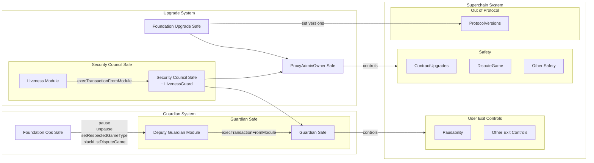

# Stage 1 Roles and Requirements

<!-- START doctoc generated TOC please keep comment here to allow auto update -->
<!-- DON'T EDIT THIS SECTION, INSTEAD RE-RUN doctoc TO UPDATE -->
**Table of Contents**

- [Overview](#overview)
- [Permissionless Fault Proofs](#permissionless-fault-proofs)
- [Roles for Stage 1](#roles-for-stage-1)
- [Configuration of Safes](#configuration-of-safes)
- [Ownership model diagram](#ownership-model-diagram)

<!-- END doctoc generated TOC please keep comment here to allow auto update -->

## Overview

This document outlines configuration requirements (including roles and other parameters)
for an implementation of the OP Stack to satisfy the Stage 1 decentralization requirements as defined
by
L2 Beat [[1](https://medium.com/l2beat/introducing-stages-a-framework-to-evaluate-rollups-maturity-d290bb22befe), [2](https://medium.com/l2beat/stages-update-security-council-requirements-4c79cea8ef52)].

## Permissionless Fault Proofs

Stage 1 requires a chain to be operating with Fault Proofs.

## Roles for Stage 1

Within the context of an OP Stack, the following roles are required for Stage 1:

1. **Upgrade Controller:** Although named for its ability to perform an upgrade, more generally this
   account MUST control any action which has an impact on the determination of a valid L2 state,
   or the custody and settlement of bridged assets.

   This includes upgrading L1 contracts, modifying the implementation of the dispute game, and
   any other safety-critical functions.

2. **Guardian:** This account MUST control any action which may delay a users ability to
   exit the system to L1. Such delays may result from anything that impacts the finalization of
   L2 states and the resulting settlement on L1.

   This includes but is not limited to pausing code paths related to withdrawals.

There may be additional [roles](./configurability.md#admin-roles) in the system, however they MUST
not be able to perform any actions which have an impact on either the validity of L2 states, or the
users ability to exit the system.

## Configuration of Safes

This list outlines the various Safes, their extensions, and other configuration details necessary to
achieve Stage 1.

1. **The L1 ProxyAdmin Owner Safe:** This Safe acts as the Upgrade Controller. Accordingly, it is
   authorized to call the following functions:
      - All `ProxyAdmin` `onlyOwner` functions.
      - All `DisputeGameFactory` `onlyOwner` functions.
      - All `DelayedWETH` `onlyOwner` functions.

   This safe has a threshold of 2, and is owned by two other Safes:
      1. The Security Council Safe.
      2. The Optimism Foundation Upgrades Safe.

   In general, the threshold and number of owners MUST be configured such that an upgrade
   or other safety-critical action can NOT be performed without the cooperation of the Security Council.

1. **The Guardian Safe:** This Safe controls any code paths which impact a users ability to
   exit the system. It is extended with the
   [Deputy Guardian Module](./safe-extensions.md#deputy-guardian-module).

   Accordingly, this Safe is authorized to call the following functions:
      - `SuperchainConfig.pause()`
      - `SuperchainConfig.unpause()`
      - `OptimismPortal2.setRespectedGameType()`
      - `OptimismPortal2.blacklistDisputeGame()`
      - `AnchorStateRegistry.setAnchorState()`

   This Safe has a threshold of 1 and is owned by the Security Council Safe.

1. **The Security Council Safe:** This Safe is one of the two owners of the `ProxyAdminOwner` Safe.
   It is extended with the [Liveness Checking system](./safe-extensions.md#liveness-checking-system),
   although Liveness Checking is not required for Stage 1, it is an additional safety feature used
   to prevent any loss of liveness on the Security Council Safe.

   The threshold and owner set on the Safe MUST meet L2Beat's Stage 1 requirements.

1. **The Foundation Upgrades Safe:** This Safe is one of the two owners of the `ProxyAdminOwner` Safe.
   It is also able to update the recommended and required versions on the `ProtocolVersions`
   contract. Given that observing the state of this contract is optional, this is not considered to
   affect safety and can therefore be managed the Foundation Upgrades Safe.

1. **The Foundation Operations Safe:** This Safe acts as the Deputy Guardian, meaning that (via the
   Guardian Safe's `DeputyGuardianModule`) it can call any functions in the system which impacts
   liveness.

## Ownership model diagram

The following diagram outlines the control relationships between the contracts in the system.

Note: in the diagram above, the [`ProtocolVersions`
   contract](../protocol/superchain-upgrades.md#protocolversions-l1-contract) is listed as "Out of
   Protocol", because the decision to follow the version signals in the contract is optional. It is
   included here for completeness, but is not considered as either Safety or Liveness affecting.
