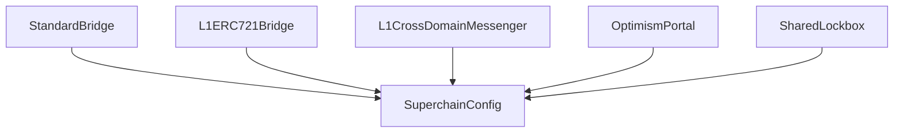

# Superchain Configuration

<!-- START doctoc generated TOC please keep comment here to allow auto update -->
<!-- DON'T EDIT THIS SECTION, INSTEAD RE-RUN doctoc TO UPDATE -->
**Table of Contents**

- [Overview](#overview)
- [Configurable values](#configurable-values)
- [Configuration data flow](#configuration-data-flow)
  - [Pausability](#pausability)
    - [Paused identifiers](#paused-identifiers)
    - [Scope of pausability](#scope-of-pausability)
- [Dependency manager](#dependency-manager)
  - [Interface and properties](#interface-and-properties)
    - [`SHARED_LOCKBOX`](#shared_lockbox)
    - [`dependencyManager`](#dependencymanager)
    - [`dependencySet`](#dependencyset)
    - [`addDependency`](#adddependency)
  - [Events](#events)
    - [`DependencyAdded`](#dependencyadded)
  - [Invariants](#invariants)

<!-- END doctoc generated TOC please keep comment here to allow auto update -->

## Overview

The SuperchainConfig contract is used to manage global configuration values for multiple OP Chains within
a single Superchain network. Also is in charge of managing and keeping track of the network's dependency set.

## Configurable values

Configurability of the Superchain is currently limited to two values:

The `SuperchainConfig` contract manages the following configuration values:

- `PAUSED_SLOT`: A boolean value indicating whether the Superchain is paused.
- `GUARDIAN_SLOT`: The address of the guardian, which can pause and unpause the system.
- `DEPENDENCY_MANAGER_SLOT`: The address of the dependency manager, which can add a chain to the depenceny set.

## Configuration data flow

All contracts which read from the `SuperchainConfig` contract hold its address as storage values
in the proxy account, and call directly to it when reading configuration data.



### Pausability

The Superchain pause feature is a safety mechanism designed to temporarily halt withdrawals from the system in
an emergency situation. The Guardian role is authorized to pause and unpause the system.

#### Paused identifiers

When the system is paused the `Paused(string identifier)` event is emitted. This allows for the
caller to provide additional information to be used during incident response.

#### Scope of pausability

The pause applies specifically to withdrawals of assets from the L1 bridge contracts. The L2 bridge contracts
are not pausable, on the basis that issues on L2 can be addressed more easily by a hard fork in the consensus
layer.

When the Pause is activated, the following methods are disabled:

1. `OptimismPortal.proveWithdrawalTransaction()`
1. `OptimismPortal.finalizeWithdrawalTransaction()`
1. `L1CrossDomainMessenger.relayMessage()`
1. `StandardBridge.finalizeBridgeERC20()`
1. `StandardBridge.finalizeBridgeETH()`
1. `L1ERC721Bridge.finalizeBridgeERC721()`
1. `SharedLockbox.unlockETH()`
1. `SharedLockbox.authorizePortal()`

## Dependency manager

The `SuperchainConfig` contract will manage and keep track of the dependency graph.
It will be queried as the source of truth to get which chains are part of the Superchain.

The `SuperchainConfig` contract is updated with a new `DEPENDENCY_MANAGER` role that has the ability
to add a dependency to the dependency set.

### Interface and properties

The contract will add the following storage layout and function:

#### `SHARED_LOCKBOX`

- An immutable address pointing to the `SharedLockbox` contract.
- This address MUST be immutable because there's only one `SharedLockbox` for each cluster.

#### `dependencyManager`

- An address with the ability to add a dependency to the dependency set.
- The `dependencyManager` can only be set during initialization.

#### `dependencySet`

- Stores the current list of chain IDs in the op-governed dependency set.
- It MUST contain all the chain IDs of the chains that integrate the corresponding Superchain network.

#### `addDependency`

The `addDependency` function adds a new chain to the op-governed cluster.

It can only be called by the `DEPENDENCY_MANAGER` role in the `SuperchainConfig` and ensures that the chain ID
is not already included in the dependency set.

Before proceeding, it verifies that the dependency set is not full (`type(uint8).max`).
This function allowlists the new chain's `OptimismPortal` in the `SharedLockbox`.

Finally, it emits the `DependencyAdded` event with the `chainId`, its corresponding `SystemConfig`, and `OptimismPortal`.

```solidity
function addDependency(uint256 _chainId, address _systemConfig) external;
```

### Events

#### `DependencyAdded`

MUST be triggered when `addDependency` is called

```solidity
event DependencyAdded(uint256 indexed chainId, address indexed systemConfig, address indexed portal);
```

### Invariants

- Only the `DEPENDENCY_MANAGER` role MUST be able to add a new dependency to the dependency set

- A new chain CAN NOT be added to the dependency set once the maximum size is reached.

- The chain ID MUST be different from the current `block.chainid`

- The same chain MUST NOT be added more than once

- It MUST authorize the new chain’s `OptimismPortal` to interact with the `SharedLockbox` of the cluster

- It MUST emit a `ChainAdded` event when the chain is added
